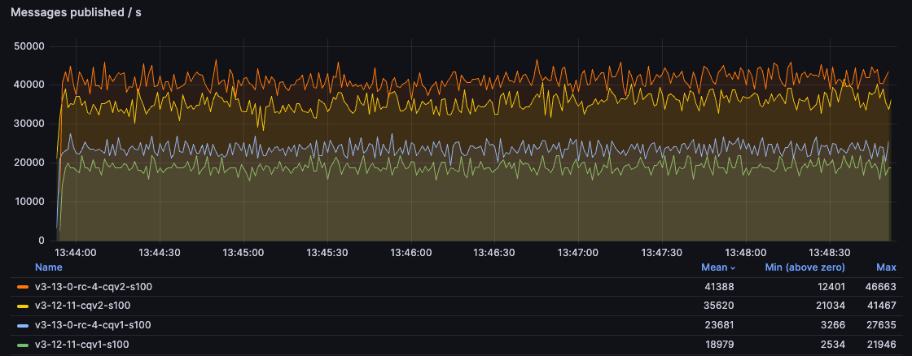
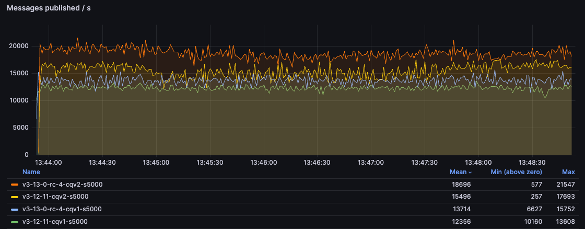
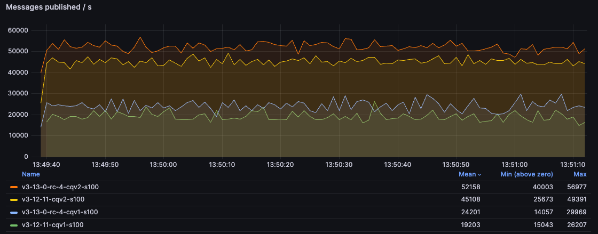
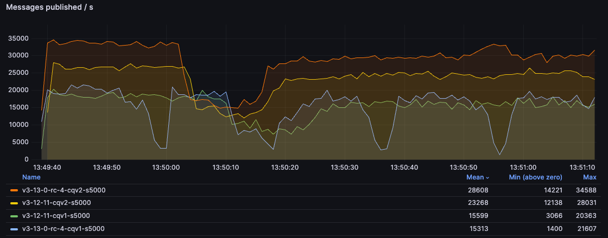
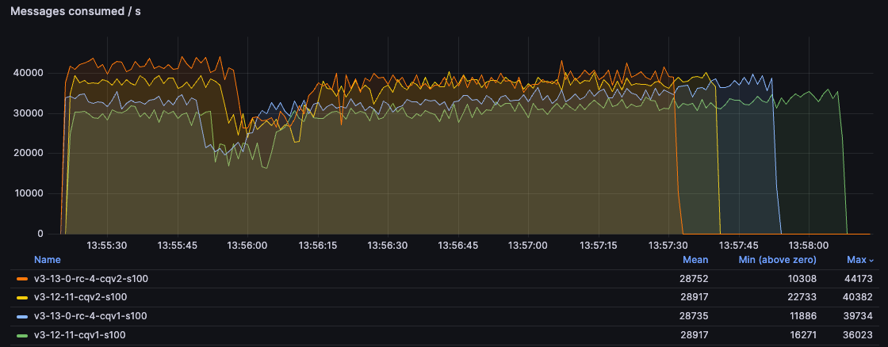
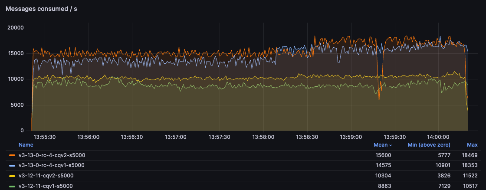
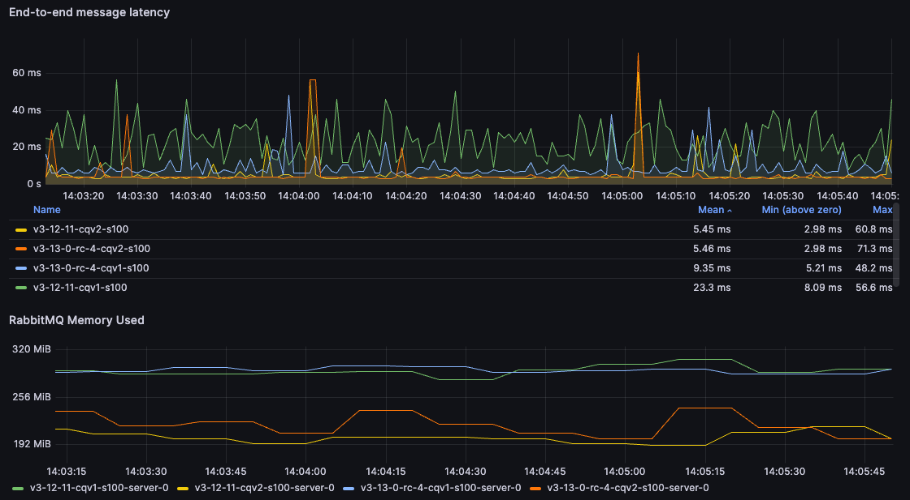
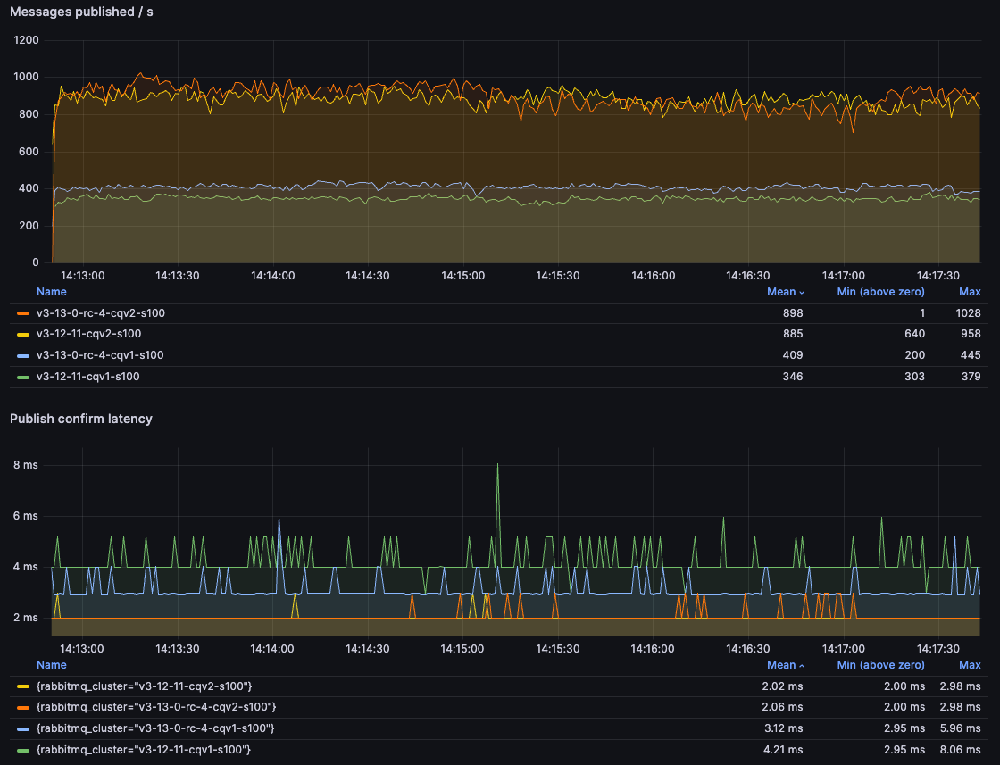
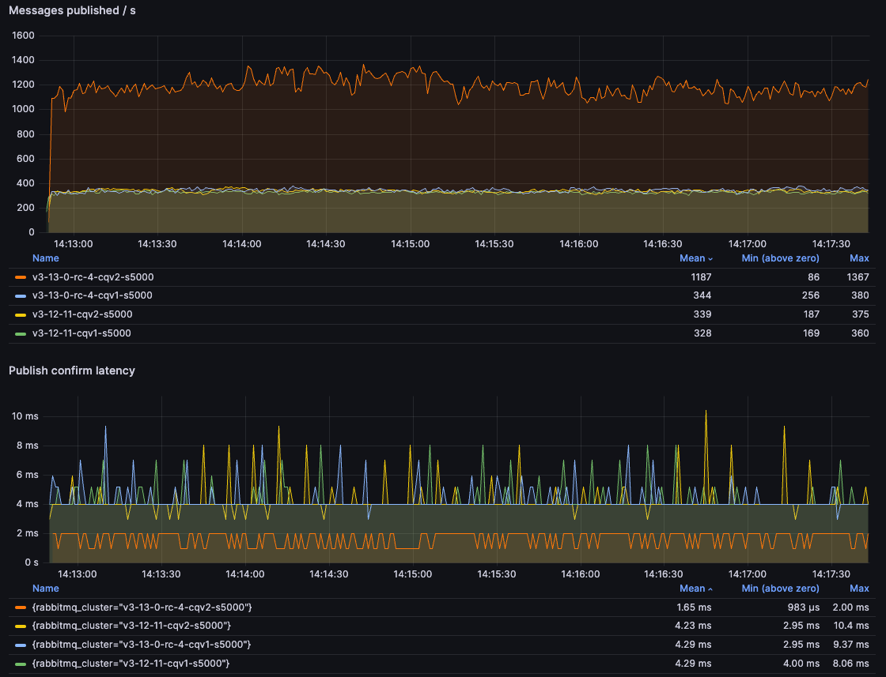

We've already announced two major new features of 3.13 in separate blog posts:

* [support for version 5 of the MQTT protocol](/blog/2023/07/21/mqtt5)
* [support for stream filtering](/blog/2023/10/16/stream-filtering)

This post focuses on the changes to the classic queues in this release:
* classic queue storage format version 1 is deprecated
* new implementation of the classic queue message store

<!-- truncate -->

## Classic Queues Storage Primer 

Before we get into the changes, it's worth explaining briefly how classic queues store messages. For each message, we
need to store the message payload and some metadata about the message (eg. whether this message was delivered to a
consumer). It makes sense to separate the message data (an opaque binary blob, potentially of a significant size) from
the metadata (small key-value map). However, for small messages, performing two separate writes, one for metadata and
another one for the contents of the message, is wasteful. Therefore, classic queues handle small messages differently than
large messages.

Historically, in what we now refer to as version 1 of the classic queues, this process is called embedding the message
in the index and the property `queue_index_embed_msgs_below` controls what constitutes a small enough message to be
embedded (the default is 4kB). Messages above this threshold are stored separately in the message store - a separate
key-value structure with a different on-disk representation. For messages stored in the store, the index contains the
metadata and the message store ID, which allows to retrieve the payload when needed. There is one message store per
virtual host, while each queue has a separate index.

Version 2 of the classic queue storage, introduced in 3.10, is logically very similar: there's still the same per-vhost
message store and a separate per-queue message store for metadata and small messages. However, the structure of what we store
per-queue is completely different and therefore we don't call it just an index anymore - small messages are not embedded
in the index, but stored in separate files within the per-queue message store.

The per-vhost message store is still there for larger messages, but version 3.13 changes its behaviour significantly.

For backwards compatibility `queue_index_embed_msgs_below` still controls whether a message is large enough to be stored
in the per-vhost message store and the default is still 4kB.

## Classic Queues Version 2 (CQv2)

A few years ago, we started a journey to re-implement classic queues for better performance. A lot of things have
changed since the original implementation, which is now almost 20 years old! Here's a rundown of the steps
on this journey:

1. Since 3.10, queues with `queue-version=2` use the new index storage format (we store per-queue data differently)
1. Since 3.12, classic queues (both v1 and v2) [never store more than a small set of messages in
memory](/blog/2023/05/17/rabbitmq-3.12-performance-improvements#classic-queues-changes-to-the-lazy-mode)
1. Since 3.12, messages below `queue_index_embed_msgs_below` (4kb by default) are handled much more efficiently

With 3.13, we are getting close to the end of this journey:
1. Starting from 3.13, messages above `queue_index_embed_msgs_below` are handled in a more efficient way
1. Starting from 3.13, classic queues v1 are deprecated

In RabbitMQ 4.0 we will remove the mirroring feature of classic queues. As we've said many times before, if you need
highly available replicated queues, you should be using quorum queues that have been available since 3.8. Removing the
mirroring feature will enable further optimisations to the implementation.

Moreover, in 4.0 we'll most likely remove the v1 implementation of the queue index (this may be delayed based on your
feedback!). When you upgrade to 4.0 in the future, all the classic queues that are still using v1 will need to be
converted to v2 during startup. This can take a long time if there are many messages and/or many queues. It's therefore
a good idea to go through the conversion process deliberately.

### What If I Don't Feel Ready for CQv2?

Until version 1 of the index implementation is removed, you can still use it.

There's no such choice for the message store implementation - 3.13 contains significant improvements, especially when
used in combination with a v2 index. However, there may also be minor regressions when combined with v1. Users are
recommended to test their applications thoroughly and report situations where a v2 index is worse than v1.

## CQv1 -> CQv2 Conversion

Since v1 and v2 use a different file format, a conversion is needed if a queue is changed from v1 to v2 (or vice versa -
downgrading is supported). If you have an existing classic queue v1 and apply a policy with `x-queue-version=2`, this
queue will become unavailable for the duration of the conversion - the queue needs to have a moment to rewrite the files
into the new format. Such conversions shouldn't take more than a few seconds - if you see it taking longer, please
report this.

Since the queue version can be changed through a policy, it's also possible to gradually migrate from v1 to v2. You can
declare a policy that only matches a subset of the queues and once they are converted, you can either extend the regular
expression to match more queues or declare another policy matching a different subset of the queues. Even if the policy
matches a lot of queues, the migration is strictly a per-queue operation - any queue that completed the conversion
becomes available to serve client applications immediately after the conversion, even if other queues are still
rewriting their files.

You can go through this conversion already on 3.12 (or even 3.10 or 3.11). If you do, the removal of v1 in 4.0 won't
really affect you, since all your queues will be v2 already.

## Performance Comparison

Let's see the results comparing RabbitMQ 3.12.11 with 3.13.0-rc.4. Please refer to [previous blog
posts](/blog/2023/05/17/rabbitmq-3.12-performance-improvements#the-environment) for details
about the benchmarking setup and the way we run these tests or check out the repository, where we keep
[the environments configuration](https://github.com/rabbitmq/testing/blob/main/main/scenario-3.12-vs-3.13.yaml)
and [the script](https://github.com/rabbitmq/testing/blob/main/main/script.sh) with the workloads.

All tests were performed with 100B and 5kB messages.

### Publishing And Consuming

In this test, we have a single publisher and a single consumer and just try to deliver messages as quickly as possible
through a single queue.

As you can see, classic queues v2 offer a significantly better performance compared with CQv1 and 3.13 improves the
performance of both versions. For the users still using CQv1, moving to CQv2 on 3.13 may almost double the throughput
for small messages!

### Publish Only

In this test, we publish to a queue at full speed, with 2 publishers, while not consuming the messages at all.
The queue grows from empty to 5 million messages.

With 100B messages, CQv2 blows CQv1 out of the water with more than 250% higher throughput compared to 3.12.

The 5kB test is more nuanced. 3.13 with CQv2 wins by a large margin and CQv2 superiority is visible even in 3.12.
However, the combination of the new message store with the old index doesn't perform consistently - it has a good
throughput most of the time, but with significant slow downs (latency spikes). This is unfortunate but something we
decided to keep this way, given the number of factors required to trigger this behaviour and the fact that users should
move to CQv2 anyway. We saw this behaviour only in this test, so the following conditions need to be met: a 3.13 node
running a CQv1 queue with messages larger than 4kb (or whatever the value of `queue_index_embed_msgs_below` is),
publishers significantly faster than consumers (or consumers not present at all) and a high throughput of messages.
If you have such a workload, moving to CQv2 should not only prevent this regression but give you a significantly better
performance than CQv1 could ever achieve.

### Consume Only

In this test we consume the long backlog of messages from the previous test. There are 5 million messages to consume
(hopefully your queues are much shorter!).

With 100B messages, you can see that CQv2 offers ~30% higher consumption rate early on. Over time, as the queue
becomes shorter, CQv1 gets faster but CQv2 environment still empties the queue long before CQv1 (when
consumption rate goes down to zero, that means the queue is empty):

With 5kB messages, handled by the per-vhost message store, you can see the main benefit of the 3.13 changes.
Since the message store implementation is shared by v1 and v2, in this test both 3.13 environments are significantly
ahead of 3.12, even a 3.12 with CQv2. We can see a ~50% higher throughput in 3.13:

### Multiple Queues

In this test, rather than pushing a single queue to its limit, we have 5 concurrent message flows: 5 publishers,
each publishing to a different queue, and 5 consumers, one for each queue. Each publisher sends 10000 messages
per second so the total expected throughput is 50000 messages. With 100B messages, all environments reached the
expected throughput, while with 5kB messages, all oscillated around 27000 messages/s. The more interesting part here
is the end-to-end latency - how long does it take from the moment a message is sent until the message is consumed.

For 100B messages, we can see that the CQv2 environments can deliver the messages much faster. For users moving
from CQv1 on 3.12 to CQv2 on 3.13, that a 75% reduction of the mean latency **and** a 50% of reduction in
memory usage.

For 5kB messages, the results are much closer and in fact, 3.12 wins this particular test (something we may
look into in the future). However, 3.13 can still achieve similar results while using 100MB less memory:

### Publisher Confirm Latency

Lastly, let's take a look at a very different test. Rather than flooding queue(s) with messages, we only publish one
message at a time, wait for [the publisher confirm](/docs/confirms) and then publish the
next one (a consumer is present but not really relevant here, since it can easily consume the incoming messages).

With 100B messages, we can once again see how much faster CQv2s are, with well over 200% speed up compared to
CQv1 on 3.12:

With 5kB messages, the benefits of the new per-vhost message store implementation in 3.13 are apparent, with
more than 350% improvement:

You may notice that the throughput is actually a bit higher with 5kB messages than it is with 100B messages.
This is counter-intuitive but actually not that strange. 5kB is still a tiny amount of data to send over the wire,
while the message store is designed to handle such messages better. As with everything else, this difference
may change in the future with further optimisations and perhaps a change to the default value of
`queue_index_embed_msgs_below` that we will consider.

## Caveat

Both version 2 of the index and the new message store implementation should provide significant benefits for most users.
However, these implementations already focus on non-mirrored use cases and the new message store implementation was
designed with the v2 of the index in mind. While it is backwards compatible and can be used with classic queues v1,
there are some cases where using v1 of the index with the new message store may provide worse performance or a different
performance profile than in the past, as seen in the publish-only test. It is therefore highly recommended to:
1. Test and benchmark your application with 3.13
2. Compare performance with v1 and v2
3. If v1 behaves better **without mirroring**, please report that, so we can take a look

Remaining on v1 can be a workaround for the cases where it provides better performance. However, that old implementation
will be removed in the future, so you can't rely on that workaround for long. Please report such cases so that you can
upgrade to v2 in the future.

## Final Word

Redesigning and replacing such a core component of a widely used piece of software is a very hard task.
Special thanks to [Loïc Hoguin](https://github.com/essen) for embarking on this project, scavenging through the code,
sometimes dating all the way back to the very first release of RabbitMQ, before the world heard about iPhones.
As always, we welcome testing and feedback and we hope the upgrade will provide you similar benefits as shown above.
