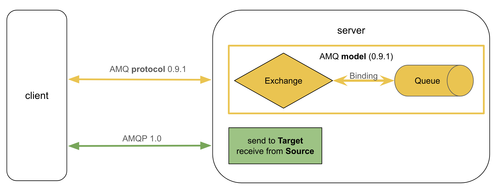
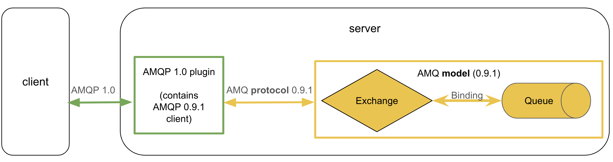
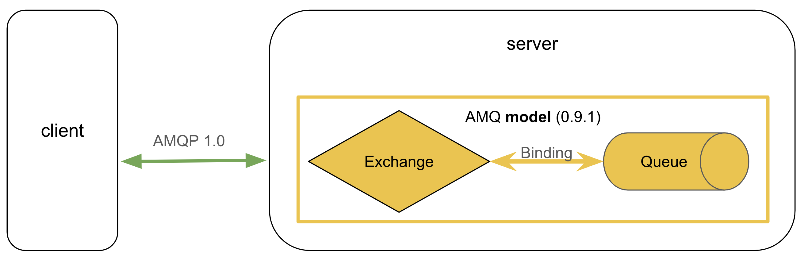

We are pleased to announce that RabbitMQ 4.0 supports [AMQP 1.0](https://docs.oasis-open.org/amqp/core/v1.0/os/amqp-core-overview-v1.0-os.html) as a core protocol, providing the following benefits:
* Modernized RabbitMQ to natively support the latest AMQP standard
* Support for more AMQP 1.0 features
* Significantly better AMQP 1.0 performance and scalability compared to RabbitMQ 3.13
* Greater interoperability with other AMQP 1.0 message brokers
* AMQP 1.0 is enabled by default in RabbitMQ 4.0

<!-- truncate -->

## AMQP History

The Advanced Message Queuing Protocol (AMQP) is an application layer protocol and a standard for business messaging.

AMQP was first developed by John O’Hara at JPMorgan in 2003.
In his article [Toward a Commodity Enterprise Middleware](https://dl.acm.org/doi/pdf/10.1145/1255421.1255424) from 2007, John O’Hara describes the original motivation behind AMQP.

The financial services industry required a high performance messaging middleware (also known as service bus).
This middleware must provide durability to avoid message loss and allow for store-and-forward and publish-subscribe techniques.
Use cases include automated trading and buffering of market data events whose arrival rates temporarily exceed the transactional processing rate performed by backend services.

Some commercial third-party middleware providers were overly expensive.
At one point, every major investment bank on Wall Street was building its own custom messaging middleware solution.
However, they encountered the same problems repeatedly.
Banks were not software companies, and messaging middleware is complex software that is hard to get right.

Banks have managed to collaborate in creating open technical standards such as:
* [Society for Worldwide Interbank Financial Telecommunication](https://en.wikipedia.org/wiki/SWIFT) (SWIFT).
* [Financial Information eXchange](https://en.wikipedia.org/wiki/Financial_Information_eXchange) (FIX) protocol
* [FAST](https://en.wikipedia.org/wiki/FAST_protocol) protocol (FIX Adapted for STreaming)
* [Financial products Markup Language](https://en.wikipedia.org/wiki/FpML) (FpML)

Therefore, the same organizations should also be capable of creating an open standard for business messaging: That's how AMQP was born.

The requirements for the AMQP specification were:
* Open standard
* Free of patents to enable anyone to implement a compatible implementation
* Appealing for commercial implementations (otherwise, the AMQP specification would not succeed)
* Should have more than one implementation (to qualify as a standard after all)
* AMQP software had to be proven in live systems. Middleware is a critical piece of any system and must be trusted. This trust has to be earned.
* Collective effort by many independent companies solving the same problem of connecting systems together

Fast forward to today, AMQP is used in critical messaging infrastructure by most of the largest corporations in the world across all industries, and RabbitMQ is the most popular open-source AMQP message broker.

## AMQP Versions

The following table shows when different AMQP specifications were published:

| AMQP version | Release date |
| --- | --- |
| [0.8](https://www.rabbitmq.com/resources/specs/amqp0-8.pdf) | June 2006 |
| [0.9](https://www.rabbitmq.com/resources/specs/amqp0-9.pdf) | December 2006 |
| [0.10](https://www.amqp.org/specification/0-10/amqp-org-download) | February 2008 |
| [0.9.1](https://www.rabbitmq.com/resources/specs/amqp0-9-1.pdf) | November 2008 |
| [1.0](https://docs.oasis-open.org/amqp/core/v1.0/os/amqp-core-overview-v1.0-os.html) | October 2011 |

In his article from 2007, John O'Hara writes:
> The AMQP Working Group is rapidly evolving the protocol and hopes to reach version 1.0 during 2008

Not only did the release of version 1.0 take three years longer than anticipated, but the protocol specification also changed completely.
The result is that AMQP 1.0 is a very different protocol compared to its pre-release versions such as AMQP 0.9.1.

When "AMQP" is mentioned in conversations or documentation, the version is often omitted, creating a lot of confusion about which protocol is meant.
Since RabbitMQ is the most popular message broker, many websites refer to AMQP 0.9.1.
Other documentation, in turn, refers to AMQP 1.0.

The rest of this blog post omits AMQP versions 0.8, 0.9, and 0.10 since they are old specifications that aren't used anymore.
Instead, we focus on the differences between AMQP versions 0.9.1 and 1.0, both of which are heavily used in today's message brokers.

On a very high level, the biggest difference between AMQP 0.9.1 and AMQP 1.0 is the following:
* AMQP 0.9.1 defines the protocol between client and server as well as server entities such as [exchanges](/tutorials/amqp-concepts#exchanges), [queues](/tutorials/amqp-concepts#queues), and [bindings](/tutorials/amqp-concepts#bindings).
* AMQP 1.0 defines only the protocol between client and server.

## AMQP 0.9.1

A client publishes a message to an exchange, which routes the message to a queue.
The queue stores the message until it gets consumed by a client.

More precisely, a publisher sends a message to an instance of an exchange type.
The exchange type defines the routing algorithm.
The AMQP 0.9.1 specification defines different types of exchanges which must be implemented by an AMQP 0.9.1 broker:
* [Direct exchange](/tutorials/amqp-concepts#exchange-direct)
* [Fanout exchange](/tutorials/amqp-concepts#exchange-fanout)
* [Topic exchange](/tutorials/amqp-concepts#exchange-topic)
* [Headers exchange](/tutorials/amqp-concepts#exchange-headers)

Exchanges also offer an extension point.
RabbitMQ provides various other exchange types, and third-party plugins can also easily be added to RabbitMQ.

Depending on the binding (including the binding key) from a queue to an exchange instance and the routing key (and possibly other headers) of the message, the exchange type algorithm decides to which queue(s) the message gets copied.

The model in AMQP 0.9.1 is therefore simple, yet flexible and powerful.
If needed, complex routing topologies can be created, including [exchange to exchange bindings](/docs/e2e).

Exchanges, queues, and bindings can be either pre-declared by an administrator or dynamically created via HTTP or, more commonly, directly by the client applications via AMQP 0.9.1.
Specifically, AMQP 0.9.1 defines protocol frames such as `exchange.declare`, `queue.declare`, and `queue.bind`.
Therefore, AMQP 0.9.1 client applications are aware of the server topology.

The RabbitMQ Summit 2023 talk [Serving millions of clients with Native MQTT and MQTT 5.0](https://youtu.be/pQEk5TIUCoc?feature=shared&t=445) explained that the AMQ 0.9.1 model is so powerful that it provides much of what an MQTT broker needs. RabbitMQ uses the AMQ 0.9.1 topic exchange type to match topics in incoming MQTT packets against topic filters of MQTT subscriptions.

## AMQP 1.0

AMQP 1.0 is more generic than AMQP 0.9.1.
AMQP 1.0 does not define a server model.
In fact, AMQP 1.0 is so generic that it does not even mandate a central broker to be present.
AMQP 1.0 defines peers exchanging messages with each other.
They do so by sending messages to a [target](https://docs.oasis-open.org/amqp/core/v1.0/os/amqp-core-messaging-v1.0-os.html#type-target) and by consuming messages from a [source](https://docs.oasis-open.org/amqp/core/v1.0/os/amqp-core-messaging-v1.0-os.html#type-source).

Both targets and sources contain an [address](https://docs.oasis-open.org/amqp/core/v1.0/os/amqp-core-messaging-v1.0-os.html#type-address-string).
What internal object an AMQP 1.0 address refers to and how an address is resolved is not defined by the AMQP 1.0 specification because different AMQP 1.0 brokers have different models to receive, store, and send messages.

For example, in an AMQP 1.0 broker that implements the AMQP 0.9.1 model (such as RabbitMQ), an AMQP 1.0 target address refers to an AMQP 0.9.1 exchange, and an AMQP 1.0 source address refers to an AMQP 0.9.1 queue.
Other AMQP 1.0 brokers might choose that an address refers to an immutable log (a stream), a topic, some in-memory data structure, or a SQL database.
Yet another AMQP 1.0 implementation could be just a client library sending messages directly to another client without any central broker being involved where an address could refer to some operating system socket.
It's up to the AMQP 1.0 implementation which decides how it resolves an address and how it stores messages.

Because the AMQP 1.0 specification is so generic, it's easier for a wide range of brokers to add support for AMQP 1.0 independent of the model they use to store and forward messages.
That's why more AMQP 1.0 brokers exist compared to AMQP 0.9.1 brokers.

## AMQP 0.9.1 vs. AMQP 1.0

The following table compares AMQP 0.9.1 with AMQP 1.0:

| | AMQP 0.9.1 | AMQP 1.0 |
| --- | --- | --- |
| **Server model defined?** | Yes: exchanges, queues, bindings | No: implementation decides server model |
| **Standards** | - | [ISO/IEC 19464](https://www.iso.org/standard/64955.html)   [OASIS](https://www.amqp.org/node/102) |
| **Brokers** | RabbitMQ   SwiftMQ   LavinMQ   Apache Qpid Broker-J | RabbitMQ   Azure Service Bus   Azure Event Hubs   Apache ActiveMQ   Apache Qpid Broker-J   Apache Qpid C++ Broker   IBM MQ   Red Hat AMQ   SwiftMQ   Solace |
| **Client libraries** | large number of well maintained [client libraries and developer tools](/client-libraries/devtools) | smaller ecosystem, but well maintained client libraries for .NET and Java |
| **Complexity** | medium | high |
| **Modular architecture?** | No | Yes, layers are:   1. [Types](https://docs.oasis-open.org/amqp/core/v1.0/os/amqp-core-types-v1.0-os.html)   2. [Transport](https://docs.oasis-open.org/amqp/core/v1.0/os/amqp-core-transport-v1.0-os.html)   3. [Messaging](https://docs.oasis-open.org/amqp/core/v1.0/os/amqp-core-messaging-v1.0-os.html)   4. [Transactions](https://docs.oasis-open.org/amqp/core/v1.0/os/amqp-core-transactions-v1.0-os.html)   5. [Security](https://docs.oasis-open.org/amqp/core/v1.0/os/amqp-core-security-v1.0-os.html) |
| **Extensibility** | Although the server model is [extensible](/tutorials/amqp-concepts#amqp-extensibility) via exchange types (and queue types in RabbitMQ) and RabbitMQ itself can be extended with plugins, extensibility of the protocol itself is very limited: RabbitMQ had to define custom AMQP 0.9.1 [protocol extensions](/docs/extensions). | Designed for extensibility:   - Layered architecture allows higher layer to be (re)placed on top of lower layer    - `properties` and `capabilities` fields in some frames allow for extensibility   - Numerous AMQP 1.0 [extension specifications](https://github.com/oasis-tcs/amqp-specs/) exist. &nbsp; &nbsp; &nbsp; &nbsp; &nbsp; &nbsp; &nbsp; &nbsp; &nbsp; &nbsp; &nbsp; &nbsp; &nbsp; &nbsp; &nbsp;&nbsp; &nbsp; &nbsp; &nbsp; &nbsp; &nbsp; &nbsp; &nbsp; &nbsp; &nbsp; &nbsp; &nbsp; &nbsp; &nbsp; &nbsp; &nbsp; &nbsp; &nbsp; &nbsp; &nbsp; &nbsp;&nbsp; &nbsp; &nbsp; &nbsp; &nbsp; &nbsp; &nbsp; &nbsp; &nbsp; &nbsp; &nbsp; &nbsp; &nbsp; &nbsp; &nbsp; &nbsp; &nbsp; &nbsp; &nbsp; &nbsp; &nbsp;&nbsp; &nbsp; &nbsp; &nbsp; &nbsp; &nbsp; &nbsp; &nbsp; &nbsp; &nbsp; &nbsp; &nbsp; &nbsp; &nbsp; &nbsp; &nbsp; &nbsp; &nbsp; &nbsp; &nbsp; &nbsp;&nbsp; &nbsp; &nbsp; &nbsp; &nbsp; &nbsp;&nbsp; &nbsp; &nbsp; &nbsp; &nbsp; &nbsp; &nbsp; &nbsp; &nbsp; &nbsp; &nbsp; &nbsp; &nbsp; &nbsp; &nbsp;&nbsp; &nbsp; &nbsp; &nbsp; &nbsp; &nbsp; &nbsp; &nbsp; &nbsp; &nbsp; &nbsp; &nbsp; &nbsp; &nbsp; &nbsp; &nbsp; &nbsp; &nbsp; &nbsp; &nbsp; &nbsp; &nbsp; &nbsp; &nbsp; &nbsp; &nbsp; &nbsp; &nbsp; &nbsp; &nbsp; &nbsp; |
| **Type system** | limited and poorly defined | well defined [types](https://docs.oasis-open.org/amqp/core/v1.0/os/amqp-core-types-v1.0-os.html) |
| **Flow control** | simple: e.g. [consumer prefetch](https://www.rabbitmq.com/docs/consumer-prefetch) | sophisticated: [link flow control](https://docs.oasis-open.org/amqp/core/v1.0/os/amqp-core-transport-v1.0-os.html#doc-flow-control) and [session flow control](https://docs.oasis-open.org/amqp/core/v1.0/os/amqp-core-transport-v1.0-os.html#doc-session-flow-control) |
| **Features** | defines most important business messaging features | more features compared to AMQP 0.9.1 including (but not limited to):   - [modified outcome](/blog/2024/10/11/modified-outcome)   - [pausing consumers](https://docs.oasis-open.org/amqp/core/v1.0/os/amqp-core-transport-v1.0-os.html#doc-idp429232)   - [transferring large messages](https://docs.oasis-open.org/amqp/core/v1.0/os/amqp-core-transport-v1.0-os.html#doc-idp484080)   - [pipelined connection establishment](https://docs.oasis-open.org/amqp/core/v1.0/os/amqp-core-transport-v1.0-os.html#doc-idp157520)   - [sender settle mode](https://docs.oasis-open.org/amqp/core/v1.0/os/amqp-core-transport-v1.0-os.html#type-sender-settle-mode) `mixed`   - [better defined message header sections](https://docs.oasis-open.org/amqp/core/v1.0/os/amqp-core-messaging-v1.0-os.html#section-message-format) with immutability of the bare message |

#### The Pervasiveness of AMQP 0.9.1

Naively thinking, one might expect that the newer AMQP 1.0 protocol version is better, more feature-rich, and more performant, and therefore would obsolete and replace older AMQP 0.9.1 implementations.
However, this is not the case.
In fact, new AMQP 0.9.1 client libraries are still being created, such as the [C++ library](https://github.com/bloomberg/rmqcpp) open-sourced by Bloomberg just last year.
Surprisingly, even entirely new AMQP 0.9.1 broker implementations, such as LavinMQ, have been developed from scratch years after AMQP 1.0 was released.

The reasons that AMQP 0.9.1 is so popular compared to AMQP 1.0 are RabbitMQ's strong ecosystem and community, and the fact that AMQP 0.9.1 is less complex.
Simplicity usually wins because simplicity leads to developers and users understanding the technology, which in turn results in more client libraries being developed and higher adoption.

As stated previously, AMQP 0.9.1 client applications are aware of exchanges, queues, and bindings.
John O’Hara even argued in his article from 2007 that interoperability cannot be achieved without the AMQP 0.9.1 protocol defining the model (exchanges, queues, and bindings):
> AMQP [0.9.1] is split into two main areas: transport model and queuing model.
AMQP [0.9.1] is unusual in that it thoroughly specifies the semantics of the services it provides within the queuing model;
since applications have a very intimate relationship with their middleware, this needs to be well defined or interoperability cannot be achieved.

Seventeen years later, we can conclude that he was right.

Given that in 2024 AMQP 0.9.1 is still more pervasive compared to AMQP 1.0, has AMQP 1.0 failed?
As shown in the table above, many brokers have become AMQP 1.0 compliant.
Although no single broker implements the entire AMQP 1.0 specification due to its complexity, any AMQP 1.0 client can exchange messages with any of these AMQP 1.0 compliant brokers.
Therefore, arguably, we can conclude that both AMQP 0.9.1 and AMQP 1.0 have succeeded.

#### Why does RabbitMQ 4.0 get an AMQP 1.0 upgrade?

There are several reasons why we have invested in first-class AMQP 1.0 support:
1. **Customer Demand**: Both commercial customers and open-source users have requested better AMQP 1.0 support. While not the primary reason for our investment, sometimes conversations occur at such a high, non-technical level that prospective customers prefer to base their central messaging infrastructure on the latest AMQP standard rather than a pre-release AMQP specification. An example can be found [here](https://rabbitmq-users.narkive.com/GLjDgdl5/rabbitmq-discuss-pressured-to-move-to-amqp-1-0).
1. **Protocol Features**: The AMQP 1.0 specification has a better-defined type system and more protocol features, as partially shown in the table above. This blog post provides only an overview of AMQP 0.9.1 vs. AMQP 1.0, with subsequent posts covering AMQP 1.0 features in greater detail.
1. **Extensibility**: AMQP 1.0 is designed for extensibility. More thought has been put into the protocol specification, and we believe we can leverage this extensibility in future RabbitMQ versions. For example, thanks to this extensibility, RabbitMQ can inform AMQP 1.0 clients about queue locality, allowing clients to publish and consume locally to the RabbitMQ node they are connected to.
1. **Improved Performance**: The old RabbitMQ 3.13 plugin was limited in features, suboptimally designed, and slow due to its internal proxying via the AMQP 0.9.1 protocol. Numerous AMQP 1.0 implementation bugs have been fixed in RabbitMQ 4.0.
1. **Interoperability**: An open source message broker such as RabbitMQ is all about interoperability. AMQP messages should be able to traverse different brokers and organizations. Since many brokers implement AMQP 1.0, users can more easily migrate to (and from) RabbitMQ. Another interoperability use case was demonstrated by Alvaro Videla in his RabbitMQ Summit 2023 [keynote](https://youtu.be/WpG__E5zafQ?feature=shared&t=2312), where messages were moved from RabbitMQ to Real-Time Intelligence in Microsoft Fabric to analyze application messages using various Azure cloud services.
1. **Multi-Protocol Message Broker**: RabbitMQ is the best multi-protocol message broker on the market. It supports AMQP 0.9.1, MQTT, Streams, and, since RabbitMQ 4.0, AMQP 1.0 natively. STOMP is supported via a plugin. RabbitMQ offers users full flexibility in how messages are published and consumed: Messages can be published to and consumed from the same queue using different protocols. RabbitMQ excels by performing [well-documented](/docs/conversions) message protocol conversions. Natively supporting AMQP 1.0 provides even greater flexibility to users.

## AMQP 1.0 in RabbitMQ 3.13

Since AMQP 1.0 was released in 2011, RabbitMQ has provided limited support for AMQP 1.0 via a plugin:

The AMQP 1.0 plugin up to RabbitMQ 3.13 proxies AMQP 1.0 internally via AMQP 0.9.1.
In other words, the plugin translates each AMQP 1.0 message received from the client to an AMQP 0.9.1 message and then sends this translated message via the AMQP 0.9.1 protocol to RabbitMQ core.
This approach has major drawbacks:
1. **Limited Feature Support:** Support for AMQP 1.0 is limited to the subset of features provided by the AMQP 0.9.1 protocol.
2. **Slow Performance:** Each message must be translated between AMQP 0.9.1 and AMQP 1.0.
3. **Resource Heavy:** This approach is resource-intensive in terms of memory and CPU usage, as each AMQP 1.0 [session](https://docs.oasis-open.org/amqp/core/v1.0/os/amqp-core-transport-v1.0-os.html#section-sessions) in the plugin includes an AMQP 0.9.1 client and maintains AMQP 0.9.1 state.

As explained in the [Serving Millions of Clients with Native MQTT](https://www.rabbitmq.com/blog/2023/03/21/native-mqtt#overview) blog post, the MQTT plugin worked conceptually the same way up to RabbitMQ 3.11:
it also proxied internally via the AMQP 0.9.1 protocol.

## AMQP 1.0 in RabbitMQ 4.0

With RabbitMQ 4.0, native AMQP 1.0 support replaces the AMQP 1.0 plugin:

AMQP 1.0 clients send messages directly to exchanges (AMQP 1.0 targets) and receive messages directly from queues (AMQP 1.0 sources).
In other words, native AMQP 1.0 no longer proxies via the AMQP 0.9.1 **protocol** but continues to utilize the simple, flexible, and powerful AMQ 0.9.1 **model**.
This transition brings several benefits:
1. **Enhanced Feature Support:** More AMQP 1.0 features are supported. This mirrors how the introduction of Native MQTT in RabbitMQ 3.12 facilitated the addition of more protocol features, such as MQTT 5.0 in RabbitMQ 3.13.
2. **Fast Performance:** Native AMQP 1.0 offers better throughput and lower latency.
3. **Resource Light:** Lower memory and CPU usage on the broker, with a single Erlang process used per AMQP 1.0 session compared to 15 Erlang processes in RabbitMQ 3.13.

Native AMQP 1.0 thus follows the success story of Native MQTT.

Obsoleting the AMQP 1.0 plugin, which seems straightforward in the diagram, actually required 12 months of engineering work.
This extensive effort was due to several factors:
* **Complexity of the AMQP 1.0 Protocol:** AMQP 1.0 is the most complex protocol supported by RabbitMQ, more intricate than both AMQP 0.9.1 and MQTT.
* **Queue modifications:** AMQP 1.0 clients can directly consume from each queue type, necessitating changes to classic queues, quorum queues, and stream implementations.
* **Rolling Upgrades:** We support rolling upgrades from RabbitMQ 3.13 to 4.0, allowing you to upgrade your AMQP 1.0 workloads without downtime.

Even though RabbitMQ 4.0 supports AMQP 1.0 natively, this does not imply that RabbitMQ supports all AMQP 1.0 features.
Like any other AMQP 1.0 broker, RabbitMQ's AMQP 1.0 implementation has [documented limitations](/docs/amqp#limitations).

## RabbitMQ AMQP 1.0 clients

We have developed two new AMQP 1.0 client libraries specifically for RabbitMQ:
* [RabbitMQ AMQP 1.0 **Java** client](https://github.com/rabbitmq/rabbitmq-amqp-java-client)
* [RabbitMQ AMQP 1.0 **.NET** client](https://github.com/rabbitmq/rabbitmq-amqp-dotnet-client)

These client libraries have the following characteristics:
* **Thin Wrappers:** They are thin wrappers containing RabbitMQ-specific logic built around existing open-source AMQP 1.0 client libraries.
* **Opinionated API:** They offer a simple and safe API designed to help application developers easily get started with sending and receiving messages via AMQP 1.0.
* **RabbitMQ Model Integration:** They enable applications to manage RabbitMQ’s AMQ 0.9.1 model (such as declaring and deleting exchanges, queues, and bindings) through AMQP 1.0. This feature leverages the [HTTP over AMQP 1.0](https://github.com/oasis-tcs/amqp-specs/blob/master/http-over-amqp-v1.0-wd06a.docx) extension specification.
* **Best of Both Worlds:** Applications can maintain an "intimate relationship with their middleware" by dynamically creating server topologies while enjoying a straightforward experience with the otherwise complex AMQP 1.0 protocol. Additionally, applications can optionally bypass the thin RabbitMQ-specific wrapper and interact directly with the underlying AMQP 1.0 client library to access more advanced AMQP 1.0 features.
* **Reduced Network Traffic:** In some scenarios, they can reduce intra-RabbitMQ cluster traffic by identifying the RabbitMQ nodes on which a given queue is located, allowing applications to publish and consume "locally" from these nodes.
* **Optional:** These client libraries are not required for interacting with RabbitMQ via AMQP 1.0. Any other AMQP 1.0 client should also be able to communicate with RabbitMQ.

## RabbitMQ Modernizations

RabbitMQ 4.0 completes its modernization journey, which began with RabbitMQ 3.8 in 2019.
These modernizations include:
* [**Quorum Queues**](/docs/quorum-queues): Using the Raft consensus algorithm to provide a safe, replicated queue type resilient to network partitions.
* [**Prometheus Metrics and Grafana Dashboards**](/docs/prometheus): Offering first-class observability integrations and [alerts](/blog/2021/05/03/alerting).
* [**RabbitMQ on Kubernetes**](https://youtu.be/GxdyQSUEj5U): Operators to run RabbitMQ anywhere.
* [**Streams**](/docs/streams): An immutable log providing message replay and high message throughput with the [stream protocol](https://github.com/rabbitmq/rabbitmq-server/blob/main/deps/rabbitmq_stream/docs/PROTOCOL.adoc).
* **[Classic Queue Storage Version 2](/docs/classic-queues#classic-queue-implementation-version-2)**: Providing higher message throughput and lower memory usage.
* **Commercial [Disaster Recovery Solution](https://docs.vmware.com/en/VMware-Tanzu-RabbitMQ-for-Kubernetes/3.13/tanzu-rabbitmq-kubernetes/standby-replication.html)**: Ensuring business continuity when the entire data center goes down.
* **[Native MQTT](/blog/2023/03/21/native-mqtt) and [MQTT 5.0](/blog/2023/07/21/mqtt5)**: Transforming RabbitMQ into an IoT broker.
* [**Khepri**](https://rabbitmq.github.io/khepri/): Using the Raft consensus algorithm to provide a safe and scalable metadata store resilient to network partitions.
* **Native AMQP 1.0:** Upgrading RabbitMQ's core protocol to the latest AMQP standard (as covered in this blog post).

We encourage you to try and test AMQP 1.0 in RabbitMQ 4.0 and provide [feedback](/contact).
You can use the latest [`rabbitmq:4.0`](https://hub.docker.com/layers/library/rabbitmq/4.0/images/sha256-a1fb6ba3eff9a226074940f27beccfd2e4de989d3d4ebb0b1272e9f78aa44dd4) docker image.
While we encourage you to build new applications with AMQP 1.0, we will continue to support and maintain AMQP 0.9.1 in RabbitMQ 4.x.

Watch our [RabbitMQ Summit 2024 talk on Native AMQP 1.0](https://youtu.be/LFu-kOOTLvs?feature=shared) and read more technical [blog posts on AMQP 1.0](/blog/tags/amqp-1-0) features and performance benchmarks.
