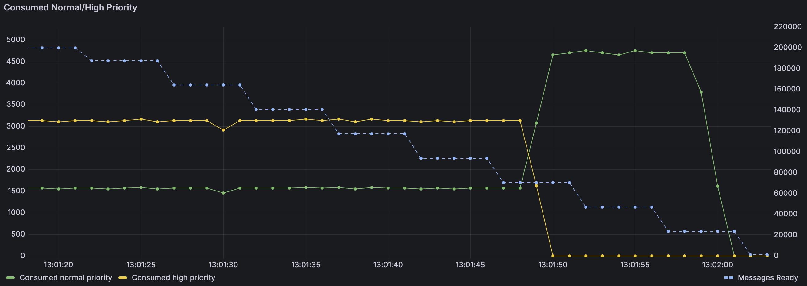
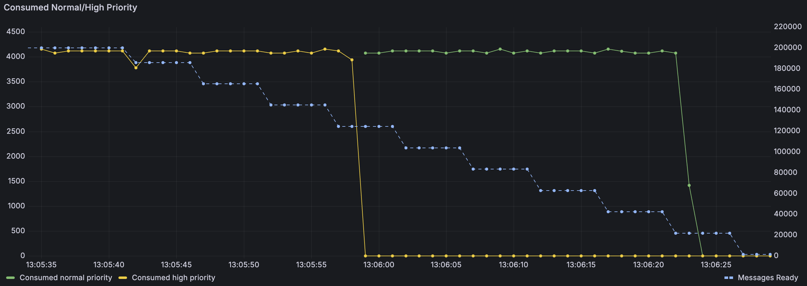

RabbitMQ 4.0 (currently in beta) includes new quorum queue features:
* message priorities
* consumer priorities combined with Single Active Consumer
* default delivery limit is now 20 (breaking change!)
* faster recovery of long queues

<!-- truncate -->

## Message Priorities

Support for message priorities has been probably the most demanded quorum queue feature,
mostly requested by existing classic mirrored queue users who wanted to migrate to quorum queues
(remember, [support for classic queue mirroring was removed for 4.0](https://www.rabbitmq.com/docs/3.13/ha)).

However, the way priorities are supported is significantly different compared to how classic queues
handle them. Classic queues require `x-max-priority` argument to define the maximum
number of priorities for a given queue (if this argument is not provided, the queue will treat
all messages equally). Values from 0 to 255 are technically allowed, although
no more than a handful of priorities per queue should really be used. Quorum queues don't require
any upfront declaration (no need to enable priorities for a given queue), but there are exactly
two priorities per queue: normal and high. The behavior matches that of AMQP 1.0 specification
(see [chapter 3.2.1 of the AMQP 1.0 specification](https://docs.oasis-open.org/amqp/core/v1.0/os/amqp-core-messaging-v1.0-os.html#type-header)):
* a priority value between 0 and 4 (inclusive) is treated as the normal priority
* any value above 4 is considered a high priority
* if the publisher doesn't specify the priority of a message, the value of `4` is assumed (normal priority)

If a quorum queue contains both normal and high priority messages, consumers will receive a mix of
both, with a ratio of 2 high priority messages for every 1 normal priority message. This approach
avoids [starvation](https://en.wikipedia.org/wiki/Starvation_(computer_science)), since regardless
of the number of high priority messages, a progress is made on processing the normal priority messages as well.
This is in contrast with the classic queue implementation, which will always deliver higher priority
messages first, if there are any, and therefore the normal priority messages may never get delivered (or, more likely,
their delivery latency will be very high).

Here's a visual representation of how this works. In preparation for this test, we first published 100k
normal priority messages and then 100k high priority messages. Since quorum queues were not priority-aware until 4.0,
if we did that in an older version and then start a consumer, it would simply receive the normal priority messages first
(as they are older) and then all the high priority messages. With 4.0, we can see that the consumer
immediately starts receiving a mix of about 1500 normal priority messages per second and twice as many high priority
messages, for a total of ~4500 messages per second (the actual delivery rates are not important here,
they depend on many factors; the 2:1 high/normal priority ratio is what matters in the context of priorities).
Once the queue delivers all the high priority messages, the consumer starts receiving ~4500 normal priority
messages per second - as many as it can handle in this test scenario. The blue dotted line (with the axis
scale on the right) is the number of ready messages in the queue (total for both priorities) - we can see it
starts at 200k and ultimately drops to zero.



Let's consider the opposite scenario - what if we publish all the high priority
messages first and only then all the normal priority messages? In this case, the consumer will receive the messages
in order of publishing. There's simply no reason for a normal priority message to overtake a higher priority message.



<details>
    <summary>How Was This Test Performed?</summary>

    For this test we used [omq](https://github.com/rabbitmq/omq), a testing client for AMQP 1.0, MQTT and STOMP.
    The quorum queue behaviour doesn't depend on the protocol used - an AMQP 1.0 was simply used because
    `omq` emits message consumption metrics by message priority.
    ```
    # declare a quorum queue (you can use the Management UI or any other method)
    rabbitmqadmin declare queue name=qq queue_type=quorum
    # publish normal priority messages (10 publishers, 10k messages each)
    omq amqp --publishers 10 --consumers 0 --publish-to /queues/qq --message-priority 1 --pmessages 10000
    # publish high priority messages
    omq amqp --publishers 10 --consumers 0 --publish-to /queues/qq --message-priority 10 --pmessages 10000
    # consume all messages from the queue
    omq amqp --publishers 0 --consumers 1 --consume-from /queues/qq --consumer-credits 100
    ```
    For the second scenario, just run the publishing commands in the reverse order.
</details>

### What If I Need More Control?

If two priorities with a 2:1 delivery ratio doesn't meet your requirements, we can recommend two things:

1. Reconsider your requirements. :smile: Reasoning about the message delivery order with many priorities
is really hard. It's probably easier to make sure that all your messages are delivered sufficiently quickly
and use the priorities just to make sure that in case of an occasional long backlog, important messages
can skip the queue.
1. If you really need more priorities and/or more control over how different priorities are handled,
using multiple queues is your best bet. You can develop a consumer that subscribes to multiple queues
and then decides which queue to consume from.

## Consumer Priorities Combined with Single Active Consumer

Starting with RabbitMQ 4.0, quorum queues will take the consumer priority into account when selecting the single active consumer.
If a higher priority becomes available (subscribes), a quorum queue will switch over to it.
This is particularly useful if you have multiple queues that should have a single consumer each, but you don't want
a single instance of your application to be the consumer for all of them, which is likely to happen when the first
application instance that starts, subscribes to all those single-active-consumer queues. Now you can pick a different priority
when subscribing to different queues, to make sure that each instance consumes only from its "favorite" queue and only serves
as a backup consumer for other queues.


To better explain this functionality, let's review all the moving parts.
A [Single Active Consumer](/docs/consumers#single-active-consumer) is a queue argument which
prevents a queue from delivering messages to more than one consumer, regardless of how many
subscribed to the queue. One consumer is active, all other consumers are not. If the active
consumer disconnects, one of the other consumers is activated. This feature is used
if a strict message processing order needs to be maintained.

[Consumer Priority](/docs/consumers#priority) allows you to specify that rather than delivering
messages to all subscribed consumers in a fair round-robin fashion (which is the default behavior
of both classic and quorum queues), a certain consumer should be preferred.

Until version 4.0, these features were effectively mutually exclusive - if Single Active Consumer was enabled,
a new consumer would never become active, regardless of its priority, as long as the previous consumer remained active.
Starting with 4.0, if the new consumer's priority is higher than the currently active consumer's, the quorum queue
will switch over to the higher priority consumer: it will stop delivering messages to the current
consumer, wait for all the messages to be acknowledged, and then will deactivate the old consumer,
and activate the higher priority consumer instead.

The graph below shows this behavior. There are three metrics on this graph:
* the green line shows the number of messages consumed by the first (default priority) consumer (which happens to be configured to consume 10 msgs/s)
* yellow, shows the same value but for the second, higher priority consumer
* blue, shows the number of unacknowledged messages (axis scale on the right)


Initially, we only have one consumer and as expected, it consumes 9-10 msgs/s (these jumps between 9 and 10
are simply a result of how the metrics are emitted and then displayed). This consumer is configured with the prefetch
of 1000 messages and since there were many messages in the queue - the prefetch buffer is used to the maximum.
Then the yellow line appears, initially at 0 msgs/s. This is the higher priority consumer, which is already connected,
but not yet active. From the moment it connected, we can see the number of unacknowledged messages going down, since the
queue no longer delivers messages to the original consumer. Once all of them are acknowledged, the new consumer
becomes the single active consumer and receives 1000 messages, since that's its prefetch value. It then happily
consumes around 10 msgs/s as configured.

<details>
    <summary>How Was This Test Performed?</summary>

    For this test we used [perf-test](https://perftest.rabbitmq.com/), a testing client for AMQP 0.9.1.
    ```
    # Publish 5000 messages to have a backlog (perf-test will declare a quorum queue `qq-sac`)
    perf-test --quorum-queue --queue qq-sac --pmessages 5000 --confirm 100 -qa x-single-active-consumer=true --consumers 0
    # Start a consumer with the default priority and prefetch of 1000; consume ~10 msgs/s
    perf-test --producers 0 --predeclared --queue qq-sac --consumer-latency 100000 --qos 1000
    # In another window, some time after starting the first consumer, start a higher priority consumer
    perf-test --producers 0 --predeclared --queue qq-sac --consumer-latency 100000 --qos 1000 --consumer-args x-priority=10
    ```
    After some time you should see that the first consumer stopped receiving messages (no more output from `perf-test`),
    while the second one receives messages.
</details>

:::note
The settings used in this example were chosen to highlight the switchover process and are not great for
real world scenarios. If a consumer can only process 10 msgs/s, there's usually no reason to configure
the prefetch value as high as 1000.
:::

## Delivery Limit is Now 20 by Default

:::warning
This can be a breaking change for some applications
:::

Quorum queues now have [the delivery limit](https://www.rabbitmq.com/docs/quorum-queues#poison-message-handling) set to 20 by default.
In the past, the limit wasn't set and therefore was quorum queues would attempt the delivery forever,
until the message is either acknowledged or discarded by the consumer. This could lead to a situation
where a message is stuck in the queue and can never be delivered.

The downside of this change is that if dead lettering is not configured, messages will be dropped after 20 attempts.
Therfore, it is highly recommended to configure dead lettering for all quorum queues.

## Faster Recovery of Long Queues

This is less of a feature and more an internal change, but certainly worth mentioning. Up until now,
if a RabbitMQ node was restarted, all quorum queues on that node had to read through all of their data
(the Raft log) since the last snapshot to re-build their in-memory state. For example, if you publish a few million
messages to a quorum queue right now and then restart a node, you will see that after the node is up, the queue
will report `0` ready messages for quite some time (at least a few seconds) and you won't be able
to start consuming these messages. The queue is simply not yet ready to serve traffic - it's still reading
the data from disk (note: this doesn't mean that all that data is then kept in memory, a vast majority
of it is not, but an index / summary of the queue data is). Starting with RabbitMQ 4.0, quorum queues create
checkpoint files which include the state of the queue at a certain point in time. Upon startup, the queue
can read the most recent checkpoint and only the part of the Raft log from that point in time. These means
that quorum queues take significantly less time to start.

For example, a RabbitMQ node with one quorum queue containing 10 million 12-byte messages, takes
about 30 seconds to start on my machine. With RabbitMQ 4.0, it just takes a fraction of a second.

You may wonder what the difference is between a snapshot and a checkpoint. In many ways, they are the same - they actually
share the code that writes them to disk. The difference is that a snapshot is only created when the Raft log is truncated.
For many common queue use cases, this all that is needed - older messages are consumed, we create a snapshot that no longer
contains them and we truncate the log. At this point the queue has no memory of those messages ever being present.
Checkpoints on the other hand, are created periodicailly when we can't truncate the log. The test case scenario is a good
example - since we didn't consume any messages, the oldest messages are still there, we can't just forget about them.
But a checkpoint still allows the queue to start more quickly. A checkpoint can be promoted to a snapshot when the log
is truncated (in this example - after some of the older messages are consumed).

<details>
    <summary>How Can I Try This?</summary>

    Once again, we'll use [perf-test](https://perftest.rabbitmq.com/) to declare the queue and publish messages
    ```
    # Publish 10 million 12-byte messages (feel free to play with other values)
    perf-test --quorum-queue --queue qq --consumers 0 --pmessages 5000000 --confirm 1000 --producers 2
    # restart the node
    rabbitmqctl stop_app && rabbitmqctl start_app
    # list the queues (repeat this command until the number of messages is 10 million instead of 0)
    rabbitmqctl list_queues
    ```
</details>

## Summary

RabbitMQ 4.0 is a significant milestone for RabbitMQ. With the removal of classic queue mirroring, quorum queues
become the only option for highly available, replicated queues (note: [streams are also highly available and replicated,
but technically not queues](https://www.rabbitmq.com/blog/2021/07/13/rabbitmq-streams-overview#what-are-rabbitmq-streams);
nevertheless, they might still be a good choice for some use cases where classic mirrored queues were used in the past).
Quorum queues have offered higher data safety guarantees and much better performance than mirrored queues for years
and with these latest improvements, they become even more robust and performant in a wider range of scenarios.

You can play with RabbitMQ 4.0 beta now:
https://github.com/rabbitmq/rabbitmq-server/releases/tag/v4.0.0-beta.5

