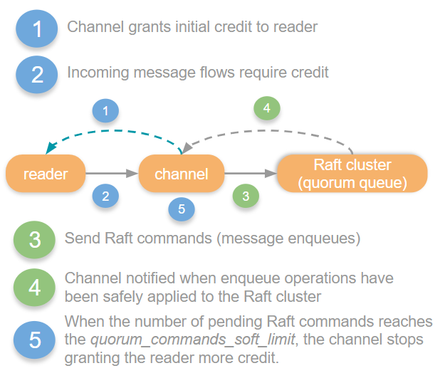
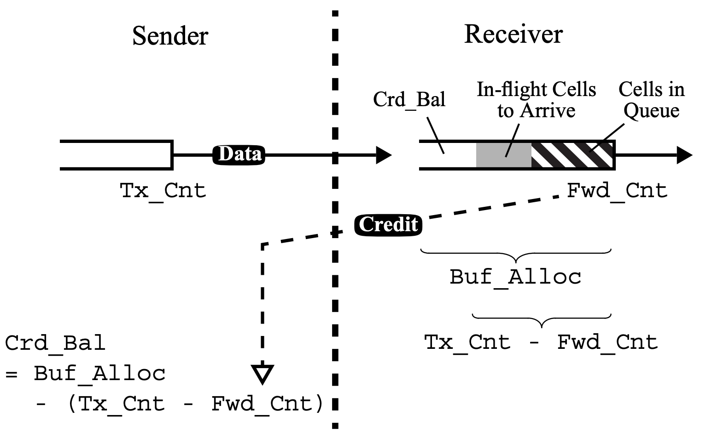

This blog post outlines ten advantages of AMQP 1.0 flow control over AMQP 0.9.1, supported by two benchmarks demonstrating significant performance gains.
Additionally, we delve into the powerful AMQP 1.0 flow control primitives and how they are used in RabbitMQ.

<!-- truncate -->

> [Flow control](https://en.wikipedia.org/wiki/Flow_control_(data)) is the process of managing the rate of data transmission between two nodes to prevent a fast sender from overwhelming a slow receiver.

The AMQP 1.0 protocol defines flow control at two different levels:
1. [Link Flow Control](https://docs.oasis-open.org/amqp/core/v1.0/os/amqp-core-transport-v1.0-os.html#doc-flow-control)
2. [Session Flow Control](https://docs.oasis-open.org/amqp/core/v1.0/os/amqp-core-transport-v1.0-os.html#doc-session-flow-control)

## Link Flow Control

In AMQP 1.0, messages are sent over a [link](https://docs.oasis-open.org/amqp/core/v1.0/os/amqp-core-transport-v1.0-os.html#section-links).
A link connects either a sending client application to an [exchange](/tutorials/amqp-concepts#exchanges) in RabbitMQ or a [queue](/tutorials/amqp-concepts#queues) in RabbitMQ to a consuming client application.

:::info

While the AMQP 1.0 specification uses the terms "senders" and "receivers", the RabbitMQ documentation refers to ["publishers"](/docs/publishers) (or "producers") and ["consumers"](/docs/consumers).
When discussing client applications, these terms can be used interchangeably. Therefore, a client application instance that:
* Sends messages to RabbitMQ is a **sender** / **publisher** / **producer** (with RabbitMQ acting as the **receiver**).
* Receives messages from RabbitMQ is a **receiver** / **consumer** (with RabbitMQ acting as the **sender**).

:::

### Link-Credit

The central idea behind AMQP 1.0 link flow control is simple:
**To receive messages, a consumer must grant credits to the sending queue.**

One credit corresponds to one message.
For example, when the consumer grants 10 credits, RabbitMQ is allowed to send 10 messages.
This straightforward principle, where the receiver provides **feedback** to the sender, ensures that the sender never overwhelms the receiver.

Both the receiver and sender maintain their own "link state".
Part of this state is the current link credit.
Link credit decreases by 1 each time a message is transferred.
Specifically, the sender reduces link credit by 1 when it sends a message, and the receiver reduces link credit by 1 when it receives a message.
When the sender's link credit reaches 0, it must stop sending messages.

Messages are sent in [transfer](https://docs.oasis-open.org/amqp/core/v1.0/os/amqp-core-transport-v1.0-os.html#type-transfer) frames.

Credits are granted in [flow](https://docs.oasis-open.org/amqp/core/v1.0/os/amqp-core-transport-v1.0-os.html#type-flow) frames:
```xml
<field name="link-credit" type="uint"/>
```
As you might have guessed, they are called "flow" frames because these frames carry flow control information.
The type [uint](https://docs.oasis-open.org/amqp/core/v1.0/os/amqp-core-types-v1.0-os.html#type-uint) stands for unsigned integer, a value between 0 and a large number (2^32 - 1).

Even after the link is successfully set up ("[attached](https://docs.oasis-open.org/amqp/core/v1.0/os/amqp-core-transport-v1.0-os.html#doc-idp315568)" in AMQP 1.0 terms), RabbitMQ is not allowed to start sending messages to the consumer until the consumer sends its first `flow` frame, granting link credit to the sending queue.

In its simplest form, when a client (receiver) grants a single credit to the queue (sender), the queue will send a single message, as illustrated in [Figure 2.43: Synchronous Get](https://docs.oasis-open.org/amqp/core/v1.0/os/amqp-core-transport-v1.0-os.html#doc-idp416352) of the AMQP 1.0 specification:

```
Receiver                                      Sender
=================================================================
                                      ...
flow(link-credit=1)               ---------->
                                        +---- transfer(...)
*block until transfer arrives*         /
                                  <---+
                                      ...
-----------------------------------------------------------------
```

Synchronously getting a single message at a time will result in low throughput. Therefore, a client typically grants multiple credits to a queue, as shown in [Figure 2.45: Asynchronous Notification](https://docs.oasis-open.org/amqp/core/v1.0/os/amqp-core-transport-v1.0-os.html#doc-idp424576) of the AMQP 1.0 specification:

```
Receiver                                          Sender
=====================================================================
                                      ...
                                  <----------     transfer(...)
                                  <----------     transfer(...)
flow(link-credit=delta)           ---+   +---     transfer(...)
                                      \ /
                                       x
                                      / \
                                  <--+   +-->
                                  <----------     transfer(...)
                                  <----------     transfer(...)
flow(link-credit=delta)           ---+   +---     transfer(...)
                                      \ /
                                       x
                                      / \
                                  <--+   +-->
                                      ...
---------------------------------------------------------------------
```

If the receiver grants N credits and waits for **all** N messages to arrive before granting the next N credits, throughput will be higher compared to figure 2.43 where `N=1`.
However, if you look closely at figure 2.45, you will observe that the receiver grants more credits before receiving all previous messages.
This approach results in the highest throughput.
For example, in figure 2.45, the receiver might have granted 6 credits initially, and then sends another `flow` frame with `link-credit = 6` to RabbitMQ whenever it has received 3 messages.

:::note

Granting link credit is not cumulative.

When the receiver sends a `flow` frame with `link-credit = N`, the receiver **sets** the current credit to N instead of adding N more credits.
For example, if a receiver sends two `flow` frames with `link-credit = 50` without any messages being transferred in between, the receiver will have 50 credits, not 100.

:::

The receiver knows its current processing capacity and therefore it is always the receiver (and never the sender) that determines the current link credit.
The sender only "consumes" link credit granted by the receiver by sending more messages.

The receiver is allowed to dynamically increase or decrease the amount of link credit depending on its current processing capacity.

:::tip[Benefit #1]

**A consuming client application can dynamically adjust how many messages it wants to receive from a specific queue.**

This is a great advantage of link flow control in AMQP 1.0 over [consumer prefetch](/docs/consumer-prefetch) in AMQP 0.9.1.
In AMQP 0.9.1, the [basic.qos](https://github.com/rabbitmq/amqp-0.9.1-spec/blob/main/pdf/amqp-xml-doc0-9-1.pdf) method applies to **all** consumers on the given [AMQP 0.9.1 channel](/docs/channels).
Furthermore, dynamically updating the consumer prefetch is not possible or convenient, as discussed in [#10174](https://github.com/rabbitmq/rabbitmq-server/discussions/10174) and [#11955](https://github.com/rabbitmq/rabbitmq-server/discussions/11955).

:::

:::tip[Benefit #2]

**A consuming client application can dynamically prioritize which queue(s), out of multiple queues on the same session, it wants to receive messages from.**

This is another advantage of link flow control in AMQP 1.0 over [consumer prefetch](/docs/consumer-prefetch) in AMQP 0.9.1.
Once an AMQP 0.9.1 client calls `basic.consume` on multiple queues, it will continuously receive messages from all these queues until it calls `basic.cancel`.

:::

You might wonder: What are good values for link-credit and how often should the client top up link credit?
As is often the case, the answer is that you will need to benchmark your specific workload with different values to find out.

Instead of implementing fancy algorithms, I would recommend starting simple:
for example, the client could initially grant 200 link credits and send a flow with `link-credit = 200` whenever the remaining link credit falls below 100.

In fact, this is what RabbitMQ does the other way around:
The RabbitMQ AMQP 1.0 [session process](https://github.com/rabbitmq/rabbitmq-server/blob/v4.0.x/deps/rabbit/src/rabbit_amqp_session.erl) grants initially [170 link credits](https://github.com/rabbitmq/rabbitmq-server/blob/v4.0.x/deps/rabbit/src/rabbit_amqp_session.erl#L52) to the publisher, and grants again 170 link credits when the remaining link credit falls below half (i.e. 85) **and** the number of unconfirmed messages is less than 170.
(Internally on the broker, publisher confirms are always enabled between AMQP 1.0 session process and target queues, even when no confirms are sent to the publishing client.
This means that if the target queue does not confirm fast enough, RabbitMQ stops granting link credit to the sending application.)
Please note that these RabbitMQ implementation details can change at any time.

The value of `170` is configurable via [advanced.config](/docs/configure#advanced-config-file) setting `rabbit.max_link_credit`.


:::tip[Benefit #3]

**When one target queue is overloaded, the publisher can continue publishing at high speed to all other target queues.**

Applications can send to multiple queues on the same AMQP 1.0 connection or session (by attaching multiple links).
Let's assume a simple scenario where a client opens two links:
* Link 1 sends to a classic queue.
* Link 2 sends to a 5-replica quorum queue.

Before confirming a message, the quorum queue must have replicated the message to a majority of replicas, with each replica [fsync](https://man7.org/linux/man-pages/man2/fsync.2.html)ing the message to its local disk.

In contrast, classic queues do not replicate messages.
Furthermore, when a message is consumed and acknowledged quickly enough, classic queues can (thereafter) confirm the message back to the publisher without ever writing it to disk.
Hence, in this scenario, throughput for the classic queue will be far higher than for the quorum queue.

The beauty of AMQP 1.0 link flow control is that RabbitMQ can slow down granting credits on Link 2 while continuing to grant credits on Link 1 at a high frequency.
Therefore, even when the 5-replica quorum queue does not process messages as quickly as the (single replica) classic queue, the client can continue to send at full speed to the classic queue.

The following picture is copied from a [previous](/blog/2020/05/04/quorum-queues-and-flow-control-the-concepts#quorum-queues) AMQP 0.9.1 blog post:



The word "credit" in this picture refers to RabbitMQ's internal flow control for AMQP 0.9.1 connections and is unrelated to link credit in AMQP 1.0.

The `reader` in the above picture is the Erlang process that reads AMQP 0.9.1 frames from the socket.
The picture shows that for AMQP 0.9.1 connections, RabbitMQ will block the `reader`, causing TCP backpressure to be applied to the client.
Therefore, when a single target queue becomes overloaded, RabbitMQ throttles the AMQP 0.9.1 connection, affecting the publishing to all other target queues.

The following benchmark shows how AMQP 1.0 can provide multiple times higher throughput compared to AMQP 0.9.1 when a connection sends to more than one target queue.

<details>
<summary>Benchmark: Two senders</summary>

To put the theory we just discussed into practice, the [two_senders](https://github.com/ansd/rabbitmq-amqp/blob/v0.1.0/two_senders/main.go) program simulates a similar scenario.

This program opens a single AMQP 0.9.1 connection and channel, as well as a single AMQP 1.0 connection and session.

On both the AMQP 0.9.1 channel and the AMQP 1.0 session, there are two goroutines that publish as quickly as possible into a classic queue and a quorum queue.
This results in four target queues in total:

```
    main.go                                                      RabbitMQ
+-------------+                                     +----------------------------------+
|             |        AMQP 0.9.1 connection        |                                  |
|             |#####################################|                                  |
|    +---+    |-------------------------------------|    +------------------------+    |
|    | P |                                               | classic-queue-amqp-091 |    |
|    +---+                                               +------------------------+    |
|                        AMQP 0.9.1 channel                                            |
|    +---+                                               +------------------------+    |
|    | P |                                               | quorum-queue-amqp-091  |    |
|    +---+    |-------------------------------------|    +------------------------+    |
|             |#####################################|                                  |
|             |                                     |                                  |
|             |                                     |                                  |
|             |                                     |                                  |
|             |#####################################|                                  |
|    +---+    |-------------------------------------|    +-----------------------+     |
|    | P |O============================================>O| classic-queue-amqp-10 |     |
|    +---+                                               +-----------------------+     |
|                        AMQP 1.0 session                                              |
|    +---+                                               +-----------------------+     |
|    | P |O======================================+=====>O| quorum-queue-amqp-10  |     |
|    +-+-+    |----------------------------------|--|    +-----------------------+     |
|      |      |##################################|##|                                  |
|      |      |        AMQP 1.0 connection       |  |                                  |
+------|------+                                  |  +----------------------------------+
       |                                         |
       |                                         |
   Publisher                               AMQP 1.0 link
   goroutine
```

Run the benchmark as follows:
1. Start RabbitMQ server [v4.0.0-beta.6](https://github.com/rabbitmq/rabbitmq-server/releases/tag/v4.0.0-beta.6) using `make run-broker` on an Ubuntu box. (On macOS, `fsync` does not write physically to the platters).
2. Execute the Go program with `go run two_senders/main.go`. After 10 seconds, the Go program will complete.
3. List the number of messages in each queue:
```
./sbin/rabbitmqctl --silent list_queues name type messages --formatter=pretty_table
┌────────────────────────┬─────────┬──────────┐
│ name                   │ type    │ messages │
├────────────────────────┼─────────┼──────────┤
│ classic-queue-amqp-091 │ classic │ 159077   │
├────────────────────────┼─────────┼──────────┤
│ quorum-queue-amqp-091  │ quorum  │ 155782   │
├────────────────────────┼─────────┼──────────┤
│ classic-queue-amqp-10  │ classic │ 1089075  │
├────────────────────────┼─────────┼──────────┤
│ quorum-queue-amqp-10   │ quorum  │ 148580   │
└────────────────────────┴─────────┴──────────┘
```

As explained in the [AMQP 1.0 Benchmarks](/blog/2024/08/21/amqp-benchmarks#quorum-queues) blog post, quorum queues [fsync](https://man7.org/linux/man-pages/man2/fsync.2.html) (`fdatasync` to be precise), whereas classic queues do not.
Therefore, even without replication, a quorum queue is significantly slower than a classic queue because I use a consumer-grade disk where each `fsync` takes at least 5 milliseconds.
For production clusters, it is recommended to use high-end, enterprise-grade disks that `fsync` faster.

The results show that the single AMQP 0.9.1 connection sends roughly the same number of messages to both the target classic queue and the target quorum queue.
This is because `quorum-queue-amqp-091` causes the entire AMQP 0.9.1 connection to be blocked (and unblocked) around 80 times per second in my benchmark.
As a result, the publishing rate to multiple target queues (`classic-queue-amqp-091` and `quorum-queue-amqp-091`) on a single AMQP 0.9.1 connection is constrained by the slowest target queue (`quorum-queue-amqp-091`).
In total, the AMQP 0.9.1 connection sends `159,077 + 155,782 = 314,859` messages.

In contrast, thanks to link flow control, RabbitMQ throttles only the link to the `quorum-queue-amqp-10` [target](https://docs.oasis-open.org/amqp/core/v1.0/os/amqp-core-messaging-v1.0-os.html#type-target), allowing the AMQP 1.0 client to continue publishing at full speed to the `classic-queue-amqp-10` target.
In total, the AMQP 1.0 connection sends `1,089,075 + 148,580 = 1,237,655` messages.

Therefore, in our simple benchmark, the total send throughput of AMQP 1.0 is four times (!) higher than that of AMQP 0.9.1.

</details>

:::

:::tip[Benefit #4]

**When one target queue is overloaded, the client can continue consuming at high speed from all source queues.
Therefore, AMQP 1.0 clients can use a single connection for both publishing and consuming at high throughput.**

Benefit #3 described how a single overloaded target queue causes RabbitMQ to block the reader process from reading any AMQP 0.9.1 frames.
This means that not only can the client no longer publish messages, but it also **cannot consume** messages.
This is because the client's message [acknowledgements](/docs/confirms#acknowledgement-modes) are no longer processed by RabbitMQ, preventing the delivery of new messages to the consumer once its [prefetch](/docs/confirms#channel-qos-prefetch) limit is reached.

Although this throttling in consumption is temporary (with the AMQP 0.9.1 `reader` process being blocked and unblocked many times per second), it can significantly reduce the consumption rate.

The RabbitMQ AMQP 0.9.1 [documentation](/docs/connections#flow-control) advises:
> It is therefore recommended that, when possible, publishers and consumers use separate connections so that consumers are isolated from potential flow control that may be applied to publishing connections, affecting manual consumer acknowledgements.

This has led to an entire ecosystem of AMQP 0.9.1 client libraries adopting this "best practice" of using separate connections for publishing and consuming.
For example the RabbitMQ AMQP 0.9.1 C++ library [states](https://github.com/bloomberg/rmqcpp/blob/1.0.0/README.md#features):
> Publishing and Consuming happens on different connections:
>
> A common application pitfall is to consume & produce on the same connection.
> This can cause slow-downs in consumption rate, as RabbitMQ applies backpressure to fast publishers - depending on the exact queues being consumed/published from this can cause a vicious cycle.

In contrast, AMQP 1.0 link flow control allows to slow down only the link sender in the client application.
All other links (whether sending or consuming) can continue to operate at full speed.

Therefore, in AMQP 1.0, clients can use a single connection for both publishing and consuming.

<details>
<summary>Benchmark: One sender, one receiver</summary>

Program [one_sender_one_receiver](https://github.com/ansd/rabbitmq-amqp/blob/v0.1.0/one_sender_one_receiver/main.go) simulates a scenario where a client opens two links:
* Link 1 receives from a classic queue.
* Link 2 sends to a quorum queue.

This program opens a single AMQP 0.9.1 connection and channel, as well as a single AMQP 1.0 connection and session.

To prepare for the benchmark, the program writes one million messages into each classic queue.

On both the AMQP 0.9.1 channel and the AMQP 1.0 session, there are two goroutines:
* One goroutine (Link 1) that receives messages with a prefetch of 200 from the classic queue and acknowledges each one.
* One goroutine (Link 2) that publishes in batches of 10,000 messages to the quorum queue.
(After all 10,000 confirmations are received, the next batch is published.)

```
    main.go                                                      RabbitMQ
+-------------+                                     +----------------------------------+
|             |        AMQP 0.9.1 connection        |                                  |
|             |#####################################|                                  |
|    +---+    |-------------------------------------|    +------------------------+    |
|    | C |                                               | classic-queue-amqp-091 |    |
|    +---+                                               +------------------------+    |
|                        AMQP 0.9.1 channel                                            |
|    +---+                                               +------------------------+    |
|    | P |                                               | quorum-queue-amqp-091  |    |
|    +---+    |-------------------------------------|    +------------------------+    |
|             |#####################################|                                  |
|             |                                     |                                  |
|             |                                     |                                  |
|             |                                     |                                  |
|             |#####################################|                                  |
|    +---+    |-------------------------------------|    +-----------------------+     |
|    | C |O<============================================O| classic-queue-amqp-10 |     |
|    +---+                                               +-----------------------+     |
|                        AMQP 1.0 session                                              |
|    +---+                                               +-----------------------+     |
|    | P |O======================================+=====>O| quorum-queue-amqp-10  |     |
|    +-+-+    |----------------------------------|--|    +-----------------------+     |
|      |      |##################################|##|                                  |
|      |      |        AMQP 1.0 connection       |  |                                  |
+------|------+                                  |  +----------------------------------+
       |                                         |
       |                                         |
Publisher or Consumer                      AMQP 1.0 link
   goroutine
```

Run the benchmark as follows:
1. Start RabbitMQ server [v4.0.0-beta.6](https://github.com/rabbitmq/rabbitmq-server/releases/tag/v4.0.0-beta.6) using `make run-broker` on an Ubuntu box.
2. Execute the Go program with `go run one_sender_one_receiver/main.go`
3. Once the program completes, list the number of messages in each queue:
```
./sbin/rabbitmqctl --silent list_queues name type messages --formatter=pretty_table
┌────────────────────────┬─────────┬──────────┐
│ name                   │ type    │ messages │
├────────────────────────┼─────────┼──────────┤
│ classic-queue-amqp-091 │ classic │ 990932   │
├────────────────────────┼─────────┼──────────┤
│ quorum-queue-amqp-091  │ quorum  │ 172800   │
├────────────────────────┼─────────┼──────────┤
│ classic-queue-amqp-10  │ classic │ 336229   │
├────────────────────────┼─────────┼──────────┤
│ quorum-queue-amqp-10   │ quorum  │ 130000   │
└────────────────────────┴─────────┴──────────┘
```

While the AMQP 0.9.1 client consumes only `1,000,000 - 990,932 = 9,068` messages, the AMQP 1.0 client consumes `1,000,000 - 336,229 = 663,771` messages.

Therefore, in this benchmark, the AMQP 1.0 client receives 73 times (!) more messages than the AMQP 0.9.1 client.

</details>

:::

:::note

In AMQP 0.9.1, [consumer prefetch](/docs/consumer-prefetch) limits the number of unacknowledged messages.
When a consumer acknowledges messages by sending `basic.ack` frames, RabbitMQ delivers additional messages.

In AMQP 1.0, message acknowledgment is independent of link flow control.
A consumer acknowledging messages by sending [disposition](https://docs.oasis-open.org/amqp/core/v1.0/os/amqp-core-transport-v1.0-os.html#type-disposition) frames will not prompt RabbitMQ to deliver more messages.
Instead, the client must replenish link credit by sending `flow` frames for RabbitMQ to continue sending messages.
For convenience, some AMQP 1.0 client libraries automatically send both `disposition` and `flow` frames when your application acknowledges messages.

:::

### Delivery-Count

So far, we understand only one field of the [flow](https://docs.oasis-open.org/amqp/core/v1.0/os/amqp-core-transport-v1.0-os.html#type-flow) frame: `link-credit`.

What happens in the following scenario?
```
Receiver                                  Sender
=======================================================================
                              ...
link state:                               link state:
 link-credit = 3                           link-credit = 3

flow(link-credit = 6)     ---+   +---     transfer(...)
                              \ /
                               x
                              / \
                          <--+   +-->

link state:                               link state:
 link-credit = 5                           link-credit = 6
```
Initially, `link-credit` is 3.
The receiver decides to send a `flow` frame, setting the new `link-credit` to 6.
In parallel, the sender sends a `transfer` frame.

Since the receiver received the `transfer` frame after it sent the `flow` frame, it will compute its new link-credit as `6 - 1 = 5`.
However, because the sender received the `flow` frame after it sent the `transfer` frame, it will set the credit to 6.
As a result, the state - and therefore the view of how many credits the link has left - becomes misaligned.
This is problematic because the sender could potentially overflow the receiver.

To prevent such misalignments, a second field is needed in both the link state and the `flow` frame:
```xml
<field name="delivery-count" type="sequence-no"/>
```

The delivery-count is increased by 1 each time a message is transferred.
Specifically, the sender increments the delivery-count whenever it sends a message, and the receiver increments the delivery-count whenever it receives a message.

When the sender receives a `flow` frame (which contains both link-credit and delivery-count), the sender sets its link-credit according to this [formula](https://docs.oasis-open.org/amqp/core/v1.0/os/amqp-core-transport-v1.0-os.html#doc-flow-control):
```
link-credit(snd) := delivery-count(rcv) + link-credit(rcv) - delivery-count(snd).
```
`(snd)` refers to the link state at the sender, while the link state at the receiver `(rcv)` is sent within the `flow` frame to the sender.

At the sender, this formula means:
"Set the new link-credit to the link-credit I just received in the flow frame minus any in-flight deliveries."

The purpose of the delivery-count is to establish an order in the sequence of events, which are:
* Sender sends message
* Receiver receives message
* Receivers grants link-credit
* Sender computes receiver's link-credit

Using the delivery-count resolves the misalignment issue we discussed earlier.

Let’s assume the delivery-count is initially set to 20:
```
Receiver                                      Sender
========================================================================================
                                  ...
link state:                                   link state:
 delivery-count = 20                           delivery-count = 20
 link-credit = 3                               link-credit = 3

flow(delivery-count = 20,
     link-credit = 6)         ---+   +---     transfer(...)
                                  \ /
                                   x
                                  / \
                              <--+   +-->

link state:                                   link state:
 delivery-count = 21                           delivery-count = 21
 link-credit = 5                               link-credit = 20+6-21 = 5 (above formula)
```

:::note

Some AMQP 1.0 fields, including the delivery-count are of type [sequence-no](https://docs.oasis-open.org/amqp/core/v1.0/os/amqp-core-transport-v1.0-os.html#type-sequence-no).
These are 32-bit [RFC-1982](https://www.ietf.org/rfc/rfc1982.txt) serial numbers that range from `[0 .. 4,294,967,295]` and wrap around: Adding 1 to 4,294,967,295 results in 0.

:::

:::note

The delivery-count is initialized by the sender, which sends its chosen value in the `initial-delivery-count` field of the [attach](https://docs.oasis-open.org/amqp/core/v1.0/os/amqp-core-transport-v1.0-os.html#type-attach) frame.

The sender can initialize the delivery-count to any value it chooses, such as 0, 10, or 4,294,967,295.
This value has no intrinsic meaning beyond the purpose we discussed earlier: comparing the delivery-count of the receiver with that of the sender to determine how many messages are in-flight.

:::

:::info

From what I can tell, the AMQP 1.0 link flow control seems to be based on the paper [Credit-Based Flow Control for ATM Networks](https://www.eecs.harvard.edu/~htk/publication/1995-ieee-network-kung-morris.pdf) from 1995.

The formula
```
link-credit(snd) := delivery-count(rcv) + link-credit(rcv) - delivery-count(snd).
```
from the AMQP 1.0 specification in section [2.6.7](https://docs.oasis-open.org/amqp/core/v1.0/os/amqp-core-transport-v1.0-os.html#doc-flow-control) matches the formula
```
Crd_Bal = Buf_Alloc - (Tx_Cnt - Fwd_Cnt)(1)
```
in the paper.

The AMQP 1.0 specification even adopts similar terminology from the paper, such as "link" and "node."
Furthermore, the specification likely refers to "delivery-count" because it is called "count" in the paper as well (even though the specification clarifies that in AMQP it's not actually a count, but rather a sequence number).

Figure 2 in the paper illustrates the concept nicely:



In this figure:
* `Tx_Cnt` corresponds to `delivery-count(snd)`
* `Fwd_Cnt` corresponds to `delivery-count(rcv)`
* `Crd_Bal` corresponds to `link-credit(snd)`
* `Buf_Alloc` corresponds to `link-credit(rcv)`

The paper explains in detail how frequently and by how much a receiver should top up link credit.
If you want to become an expert in AMQP 1.0 flow control, I recommend reading both the AMQP 1.0 specification and the paper.

:::

### Drain

Having understood the two most important link control fields of the [flow](https://docs.oasis-open.org/amqp/core/v1.0/os/amqp-core-transport-v1.0-os.html#type-flow) frame (`link-credit` and `delivery-count`), let's move on to the `drain` field:

```xml
<field name="drain" type="boolean" default="false"/>
```

By default, the `drain` field is set to `false`.
The receiver decides whether drain mode is enabled, and the sender sets `drain` to the last known value from the receiver.

Draining means that the sender should use all link credit from the receiver by sending available messages.
If there are not enough messages to send, the sender must still exhaust all link credit as follows:
1. Advance the delivery-count by the remaining link-credit.
2. Set link-credit to 0.
3. Send a `flow` frame to the receiver.

By setting the `drain` field to `true`, the consumer requests RabbitMQ to "Either send a [transfer](https://docs.oasis-open.org/amqp/core/v1.0/os/amqp-core-transport-v1.0-os.html#type-transfer) or a [flow](https://docs.oasis-open.org/amqp/core/v1.0/os/amqp-core-transport-v1.0-os.html#type-flow) frame."
If the source queue is empty, RabbitMQ will promptly reply with only a `flow` frame.

Therefore, the `drain` field allows a consumer to set a timeout when synchronously getting messages, as shown in [Figure 2.44: Synchronous Get with a Timeout](https://docs.oasis-open.org/amqp/core/v1.0/os/amqp-core-transport-v1.0-os.html#doc-idp416352) of the AMQP 1.0 specification:

```
    Receiver                                      Sender
    =================================================================
                                          ...
    flow(link-credit=1)               ---------->
  *wait for link-credit <= 0*
    flow(drain=True)                  ---+   +--- transfer(...)
                                          \ /
                                           x
                                          / \
(1)                                   <--+   +-->
(2)                                   <---------- flow(...)
                                          ...
    -----------------------------------------------------------------
      (1) If a message is available within the timeout, it will
          arrive at this point.
      (2) If a message is not available within the timeout, the
          drain flag will ensure that the sender promptly advances the
          delivery-count until link-credit is consumed.
```

Because the link-credit is consumed quickly, the consumer can unambiguously determine whether a message was received or if the operation timed out.

### Echo

Similar to the `drain` field, the `echo` field is:
* set to `false` by default
* determined by the consumer, as RabbitMQ does not set this field in its current implementation

```xml
<field name="echo" type="boolean" default="false"/>
```

The consumer can set the `echo` field to request RabbitMQ to reply with a `flow` frame.
One use case is depicted in [Figure 2.46: Stopping Incoming Messages](https://docs.oasis-open.org/amqp/core/v1.0/os/amqp-core-transport-v1.0-os.html#doc-idp429232) of the AMQP 1.0 specification:

```
    Receiver                                       Sender
    ================================================================
                                           ...
                                       <---------- transfer(...)
    flow(...,                          ---+   +--- transfer(...)
         link-credit=0,                    \ /
         echo=True)                         x
                                           / \
(1)                                    <--+   +-->
(2)                                    <---------- flow(...)
                                           ...
    ----------------------------------------------------------------
      (1) In-flight transfers can still arrive until the flow state
          is updated at the sender.
      (2) At this point no further transfers will arrive.
```

:::tip[Benefit #5]

**In AMQP 1.0, a consumer can be stopped/paused and later resumed.**

In AMQP 0.9.1, a consumer cannot be paused and resumed. Instead, the consumer must be cancelled using the `basic.cancel` method before registering a new consumer with `basic.consume`.

:::

:::tip[Benefit #6]

**AMQP 1.0 allows a graceful handoff from one [single active consumer](/docs/consumers#single-active-consumer) to the next, while maintaining message order.**

In AMQP 1.0, the consumer can either stop the link first and acknowledge messages before [detach](https://docs.oasis-open.org/amqp/core/v1.0/os/amqp-core-transport-v1.0-os.html#type-detach)ing the link (preferred), or detach the link directly.
Detaching the link directly will requeue any unacknowledged messages.
Either way, detaching the link causes the next consumer to be activated and to receive the messages in the original order.

In contrast, a single active consumer in AMQP 0.9.1 cannot gracefully and safely hand over to the next one.
When an AMQP 0.9.1 consumer cancels consumption via `basic.cancel` but still has unacknowledged messages, the queue will activate the next consumer.
If the AMQP 0.9.1 client crashes shortly after, messages checked out to the old consumer will be requeued, potentially violating message order.
To maintain message order, an AMQP 0.9.1 client must close the entire channel (without calling `basic.cancel` first) so that messages are requeued before the next consumer is activated.

:::

### Available

RabbitMQ sets the `available` field in the [flow](https://docs.oasis-open.org/amqp/core/v1.0/os/amqp-core-transport-v1.0-os.html#type-flow) frame to inform the consumer how many messages are available:
```xml
<field name="available" type="uint"/>
```

The `available` value is only an approximation because, from the time the queue emits this information until the `flow` frame arrives at the consumer, this information can already be outdated, for instance when other clients publish messages to or consume messages from this queue.

For [classic queues](/docs/classic-queues) and [quorum queues](/docs/quorum-queues), `available` indicates the number of messages ready for delivery (i.e. the queue length excluding messages that are checked out to consumers).

For [streams](/docs/streams), `available` represents the difference between the committed offset and the last consumed [offset](/docs/streams#consuming).
Roughly, the committed offset is what the different stream [replicas](/docs/streams#replication-factor) in the RabbitMQ cluster agree is the end of the stream.
The last consumed offset might be the same as the committed offset or lag behind it.
The `available` value is merely an estimate because [a stream offset does not necessarily represent a message](/docs/streams#limitations-ui-metrics).

If the [Single Active Consumer](/docs/consumers#single-active-consumer) feature is enabled, quorum queues will return `available = 0` for all inactive (waiting) consumers.
This makes sense since no messages are available for inactive consumers, regardless of how much credit they have topped up.

In the [previous](#echo) section, we learned that one use case for the consumer setting the `echo` field is to stop a link.
Another use case is when a consumer wants to learn about the number of messages available in the queue it consumes from.

:::tip[Benefit #7]

**AMQP 1.0 informs the consumer about the number of messages available in the queue.**

Including this information in every `flow` frame sent from RabbitMQ to the consumer is an advantage over AMQP 0.9.1.
In AMQP 0.9.1, methods to query available messages are more cumbersome and less efficient:
* `queue.declare` with `passive=true`: The `queue.declare_ok` reply will contain a `message_count` field.
* `basic.get`: The `basic.get_ok` reply will contain a `message_count` field.

:::

The `available` field could also be set by a publisher to tell RabbitMQ how many messages the publisher has available to send.
Currently, RabbitMQ ignores this information.

### Properties

The `properties` field of the [flow](https://docs.oasis-open.org/amqp/core/v1.0/os/amqp-core-transport-v1.0-os.html#type-flow) frame can carry application specific link state properties:

```xml
<field name="properties" type="fields"/>
```

Currently, RabbitMQ does not make use of this field.

:::tip[Benefit #8]

**AMQP 1.0 link flow control is extensible.**

Imagine that RabbitMQ wants to enable publishers to send messages directly to the quorum queue leader.
Since all [Ra](https://github.com/rabbitmq/ra) commands, including enqueuing a message, must go through the leader first, it would make sense for the client to connect directly to the RabbitMQ node that hosts the quorum queue leader.
This "queue locality" would reduce RabbitMQ intra-cluster traffic, thereby improving latency and throughput.
When the leader changes, instead of causing RabbitMQ to [detach](https://docs.oasis-open.org/amqp/core/v1.0/os/amqp-core-transport-v1.0-os.html#type-detach) the link - which could be disruptive to the publishing application - RabbitMQ could push a leader change notification, including the new RabbitMQ node hosting the quorum queue leader, to the publisher via the `properties` field.
The application could then decide when it is convenient to detach the link and attach a new link on a different connection to continue publishing "locally".

Alternatively, RabbitMQ could send a boolean value for a key `local` in every `flow` frame's `properties` field to indicate whether the link is currently publishing or consuming locally.
If the `local` field flips from `true` to `false`, the client could query the new queue topology and leader via [HTTP over AMQP 1.0](https://github.com/oasis-tcs/amqp-specs/blob/master/http-over-amqp-v1.0-wd06a.docx).

These are just hypothetical examples showing how RabbitMQ could make use of link flow control extensibility in the future, which is an advantage over AMQP 0.9.1.

:::

### Summary

We learned that AMQP 1.0 link flow control protects individual consumers or queues from being overwhelmed with messages.
The receiver periodically provides feedback to the sender on how many messages it can currently handle.

Each link endpoint (sender and receiver) maintains full link flow control state and exchanges this state via [flow](https://docs.oasis-open.org/amqp/core/v1.0/os/amqp-core-transport-v1.0-os.html#type-flow) frames with the other side.

The following link flow control fields are independently determined by the **receiver**:
* `link-credit`
* `drain`

The following link flow control fields are independently determined by the **sender**:
* `delivery-count`
* `available`

## Session Flow Control

Before diving into [session flow control](https://docs.oasis-open.org/amqp/core/v1.0/os/amqp-core-transport-v1.0-os.html#doc-session-flow-control), let's recap what a [session](https://docs.oasis-open.org/amqp/core/v1.0/os/amqp-core-transport-v1.0-os.html#section-sessions) actually is.

### Session

A client library creates a single TCP connection per [AMQP connection](https://docs.oasis-open.org/amqp/core/v1.0/os/amqp-core-transport-v1.0-os.html#section-connections).
An AMQP 1.0 connection is established using the [open](https://docs.oasis-open.org/amqp/core/v1.0/os/amqp-core-transport-v1.0-os.html#type-open) frame.

Within an AMQP 1.0 connection, the client can then start multiple AMQP 1.0 sessions.
This is [analogous](/docs/connections#protocol-differences) to how an AMQP 0.9.1 client can open multiple [AMQP 0.9.1 channels](/docs/channels) within an AMQP 0.9.1 connection.
An AMQP 1.0 session is started using the [begin](https://docs.oasis-open.org/amqp/core/v1.0/os/amqp-core-transport-v1.0-os.html#type-begin) frame.

Within a session, a client can then create [links](https://docs.oasis-open.org/amqp/core/v1.0/os/amqp-core-transport-v1.0-os.html#section-links) by sending the [attach](https://docs.oasis-open.org/amqp/core/v1.0/os/amqp-core-transport-v1.0-os.html#type-attach) frame.

```
  Client App                                       RabbitMQ
+-------------+                                +-------------+
|             |################################|             |
|   +---+     |--------------------------------|    +---+    |
|   | C |O<===============================+========O| Q |    |
|   +-+-+ \   |-------------------+-------|----|   |+-+-+    |
|     |    \  |#######+###########|#######|####|   |  |      |
+-----|-----\-+       |           |       |    +---|--|------+
      |      \        |           |       |        |  |
      |     Target    |           |       |    Source |
      |               |           |       |           |
   Consumer           |           |     Link        Queue
                      |       Session
                 Connection
```

A client application could create, for example:
* A single connection with a single session, or
* A single connection with multiple sessions, or
* Multiple connections with one or more sessions each

Usually, a single connection with a single session is sufficient.

Opening an AMQP connection comes with some overhead:
A TCP connection must be established, allocating operating system resources such as sockets and TCP buffers in both the client and server, and incurring latency for the TCP or TLS handshake.
Additionally, on the RabbitMQ node, a [supervision tree](https://www.erlang.org/doc/apps/stdlib/supervisor.html) is created for each incoming AMQP connection.

A session can be thought of as a "lightweight" connection.
Each AMQP 1.0 session is currently implemented as its own [Erlang process](https://www.erlang.org/doc/system/ref_man_processes.html).
Hence, creating a session is inexpensive if the connection is already established.

Creating a second session within an AMQP connection might be useful in the following scenarios:
* Quickly and cheaply creating another "virtual connection" without incurring the aforementioned AMQP connection setup overhead.
* Ensuring high-priority [transfer](https://docs.oasis-open.org/amqp/core/v1.0/os/amqp-core-transport-v1.0-os.html#type-transfer) frames (requiring low latency) are not blocked by other transfer frames.
* Increasing parallelism when the RabbitMQ [session process](https://github.com/rabbitmq/rabbitmq-server/blob/v4.0.0-beta.6/deps/rabbit/src/rabbit_amqp_session.erl) becomes very busy (for example, routing messages to [queues](/tutorials/amqp-concepts#queues)).

### Flow Fields

> Sessions provide a flow control scheme based on the number of transfer frames transmitted.
> Since frames have a maximum size for a given connection, this provides flow control based on the number of bytes transmitted.

Remember that a [large message](https://docs.oasis-open.org/amqp/core/v1.0/os/amqp-core-transport-v1.0-os.html#doc-idp484080) is split into multiple transfer frames.

[Session flow control](https://docs.oasis-open.org/amqp/core/v1.0/os/amqp-core-transport-v1.0-os.html#doc-session-flow-control) in AMQP 1.0 operates at a higher layer than link flow control.
While link flow control protects individual consumers and queues, session flow control is designed to protect the entire client application and RabbitMQ as a whole.

Just as each link endpoint maintains link flow control state and exchanges this state via `flow` frames, each session endpoint maintains session flow control state and exchanges this state within the same `flow` frames.
The remaining fields in the [flow](https://docs.oasis-open.org/amqp/core/v1.0/os/amqp-core-transport-v1.0-os.html#type-flow) frame are therefore used for session flow control:
```xml
<field name="next-incoming-id" type="transfer-number"/>
<field name="incoming-window" type="uint" mandatory="true"/>
<field name="next-outgoing-id" type="transfer-number" mandatory="true"/>
<field name="outgoing-window" type="uint" mandatory="true"/>
```

The `incoming-window` is similar to the [link-credit](#link-credit) field in that the receiving side informs the sending side how many "units" it can tolerate receiving.
The difference is that for `link-credit`, the unit is a potentially large application message, while for `incoming-window`, the unit is a `transfer` frame.

To provide an extreme example for better understanding: if the negotiated `max-frame-size` on the connection is very low and a single message is very large, if the receiver grants one link credit to the sender, the sender might still be blocked by session flow control sending this message in its entirety.

`next-incoming-id` and `next-outgoing-id` are sequence numbers and serve the same purpose as the [delivery-count](#delivery-count) in link flow control:
they ensure that the windows are computed correctly on the other side when `transfer` frames are sent in parallel with `flow` frames.
Two sequence numbers are needed for session flow control as opposed to one for link flow control because a session is bidirectional, while a link is unidirectional.

Initially, RabbitMQ allows the publisher to send [400](https://github.com/rabbitmq/rabbitmq-server/blob/v4.0.0-beta.6/deps/rabbit/src/rabbit_amqp_session.erl#L60) transfer frames.
Whenever the RabbitMQ session process has processed half of that number (200 transfer frames), RabbitMQ expands this window by sending a `flow` frame to the publisher containing `incoming_window = 400`.

The value of `400` is configurable via [advanced.config](/docs/configure#advanced-config-file) setting `rabbit.max_incoming_window`.

### RabbitMQ Alarms

The only exception to this rule is when a [memory or disk alarm](/docs/alarms) is triggered.
To protect RabbitMQ from running out of memory or disk space, each session will close its incoming window by sending a `flow` frame with `incoming_window = 0` to publishers, effectively preventing them from sending any further `transfer` frames.

:::tip[Benefit #9]

**In the event of a cluster wide memory or disk alarm, RabbitMQ will block AMQP 1.0 clients only from publishing `transfer` frames.
Other operations, such as AMQP 1.0 clients consuming on the same session or creating new connections that only consume in order to empty queues in RabbitMQ (thereby reducing memory and disk usage), will still be allowed.**

In AMQP 0.9.1, RabbitMQ will block reading from the connection socket entirely and prevent opening new connections until the alarm clears.
AMQP 0.9.1 clients must use separate connections for publishing and consuming to continue consuming during an alarm.

:::

:::tip[Benefit #10]

As described in Benefits #4 and #9, **because clients can safely and efficiently use a single AMQP 1.0 connection for both publishing and consuming, memory usage is reduced in RabbitMQ**.

AMQP 0.9.1 practically requires twice the number of connections compared to AMQP 1.0.
The [AMQP 1.0 Benchmarks](/blog/2024/08/21/amqp-benchmarks#many-connections) provide insights into how much memory could be saved.

:::

### Incoming-Window

The disadvantage of AMQP 1.0 flow control is its complexity.
While the ideas and motivations behind link flow control and session flow control are sound, implementing one layer (session flow control) on top of another layer (link flow control) can be challenging to get right and efficient in every scenario.
Consider that clients can:
* Modify session flow control and link flow control independently (either in the same `flow` frame or in separate `flow` frames).
* Send a `flow` frame at any time and at different frequencies.
* Dynamically increase or decrease either the session window or the link credit.
* Grant a link-credit of 0 (causing the queue to stop sending) or a huge number of link credits (up to 4 billion).
* Close its session `incoming-window` (causing the server session to stop sending) or open it widely (up to 4 billion).
* Stop reading from its socket, applying TCP backpressure to the server.
* Add other special logic, such as `drain=true`, into the mix.

In AMQP 1.0 programs, concurrency is desirable.
Depending on the programming language, different parts of the client or broker are implemented by different threads or processes.

RabbitMQ achieves concurrency by running the [connection reader process](https://github.com/rabbitmq/rabbitmq-server/blob/v4.0.0-beta.6/deps/rabbit/src/rabbit_amqp_reader.erl) (parsing frames), [connection writer process](https://github.com/rabbitmq/rabbitmq-server/blob/v4.0.0-beta.6/deps/rabbit/src/rabbit_amqp_writer.erl) (serializing frames), [session process](https://github.com/rabbitmq/rabbitmq-server/blob/v4.0.0-beta.6/deps/rabbit/src/rabbit_amqp_session.erl) (e.g. routing messages), and [queue process](https://github.com/rabbitmq/rabbitmq-server/blob/v4.0.0-beta.6/deps/rabbit/src/rabbit_amqqueue_process.erl) (storing and forwarding messages) in different [Erlang processes](https://www.erlang.org/doc/system/ref_man_processes.html).

In a scenario where the client grants a huge number of `link-credit` to the sending queue but maintains a very small session `incoming-window`, queue processes are allowed to deliver messages, while the session process is not allowed to forward them to the client.
In this case, messages are buffered in the session process until the client's `incoming-window` allows them to be forwarded.

To guard against this scenario - where a large number of messages could be buffered in the session process - RabbitMQ, in its current implementation, internally grants link credits from the session process to the queue process in batches of at most 256 link credits.
Even if the client grants a large number of link credits, the queue will only ever see up to 256 credits for a given consumer.
Once these 256 messages have been sent out by the server session process, the server session process will grant the next batch of 256 credits to the queue.

The value of `256` is configurable via [advanced.config](/docs/configure#advanced-config-file) setting `rabbit.max_queue_credit`.

## Wrapping Up

This blog post explained how AMQP 1.0 link flow control and session flow control work.

We learned how individual processes within RabbitMQ protect themselves from overload:
* Queue processes are protected by link flow control.
* Session processes and RabbitMQ as a whole are protected by session flow control.
* Connection reader processes are protected by applying TCP backpressure when they cannot read frames quickly enough (which should be rare).

This blog post also highlighted ten benefits of flow control in AMQP 1.0 over flow control in AMQP 0.9.1.
The main advantages include:
* Fine-grained control for consumers, allowing them to determine at any point in time the exact number of messages they want to consume from specific queue(s).
* Higher throughput for publishing and consuming on a single AMQP connection when a target queue reaches its limits. We ran two benchmarks:
  1. Total send throughput of AMQP 1.0 was four times higher than AMQP 0.9.1 when sending to two different target queues.
  1. In an extreme case, consumption rate of AMQP 1.0 was 73 times higher than AMQP 0.9.1 when receiving from one queue while sending too fast to another queue.
* Safe and efficient usage of a single connection for both publishing and consuming.
* The ability for consumers to stop and resume at any time.
* Extensibility for future use cases.
