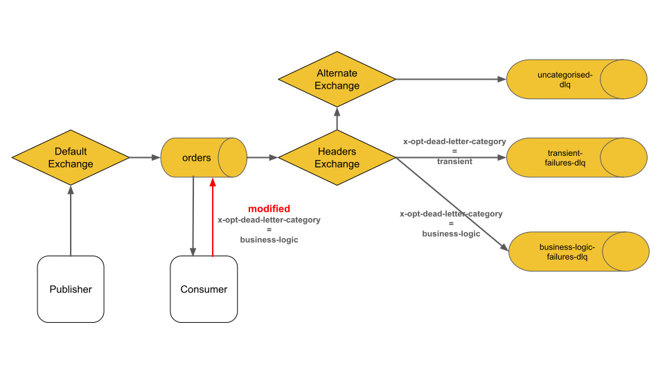

This blog post explores use cases of the AMQP 1.0 [modified outcome](https://docs.oasis-open.org/amqp/core/v1.0/os/amqp-core-messaging-v1.0-os.html#type-modified).

<!-- truncate -->

The modified outcome is a [feature](/docs/amqp#outcomes) exclusive to AMQP 1.0 and not available in AMQP 0.9.1
It is supported in [quorum queues](/docs/quorum-queues), but not in [classic queues](/docs/classic-queues).

This feature enables consumers to add or update [message annotations](https://docs.oasis-open.org/amqp/core/v1.0/os/amqp-core-messaging-v1.0-os.html#type-message-annotations) before requeueing or [dead lettering](/docs/dlx) a message.

## Requeue

Including additional metadata when requeuing a message can be valuable for improving traceability and debugging during message processing.

For example, an application using the [RabbitMQ AMQP 1.0 Java Client](https://github.com/rabbitmq/rabbitmq-amqp-java-client) can set specific message annotations before requeuing the message at the head of a quorum queue, as shown below:
```java
Consumer consumer = connection.consumerBuilder()
    .queue(ordersQueue)
    .messageHandler((context, message) -> {
        Map<String, Object> annotations = new HashMap<>();
        annotations.put("x-opt-requeue-reason", "external_service_unavailable");
        annotations.put("x-opt-requeue-time", System.currentTimeMillis());
        annotations.put("x-opt-requeued-by", "consumer_1");
        context.requeue(annotations);
    }).build();
```

These annotations could use different types including [map](https://docs.oasis-open.org/amqp/core/v1.0/os/amqp-core-types-v1.0-os.html#type-map), [list](https://docs.oasis-open.org/amqp/core/v1.0/os/amqp-core-types-v1.0-os.html#type-list), or [array](https://docs.oasis-open.org/amqp/core/v1.0/os/amqp-core-types-v1.0-os.html#type-array).
This flexibility allows not only setting details like the last requeue reason, time, and consumer, but also tracking a history of requeue events.
Maintaining such a history can reveal patterns, such as identifying consumers that requeue messages more frequently or discovering common requeue reasons across the system.
However, keep in mind that quorum queues retain modified message annotations in memory, which increases the memory overhead per requeued message.

Setting custom headers before requeueing a message at the head of the queue is not supported in AMQP 0.9.1.

Whether requeuing a message to a quorum queue via AMQP 1.0 or AMQP 0.9.1, the [x-delivery-count](https://www.rabbitmq.com/docs/quorum-queues#poison-message-handling) annotation will always be incremented.

## Dead Letter

When dead lettering a message, the consumer can include a custom reason for the dead lettering in the message annotations:
```java
Consumer consumer = connection.consumerBuilder()
    .queue(ordersQueue)
    .messageHandler((context, message) -> {
        Map<String, Object> annotations = new HashMap<>();
        annotations.put("x-opt-dead-letter-reason", "Incompatible Message Format");
        context.discard(annotations);
    }).build();
```

When dead lettering to a [headers exchange](/tutorials/amqp-concepts#exchange-headers), the consumer can even decide which target queue the message will be routed to:



In this example, two dead letter quorum queues are bound to the dead letter headers exchange:
1. `transient-failures-dlq`
2. `business-logic-failures-dlq`

Different dead letter queues can be processed by different apps or teams, with varying actions taken depending on the nature of the failure.
For instance, all messages in the `transient-failures-dlq` could be re-published to the original `orders` queue, while messages in the `business-logic-failures-dlq` might require human intervention.

More dead letter queues could be added, such as:
* `data-integrity-dlq` for messages with unknown schema
* `resource-limit-dlq` for cases where rate limits were exceeded
* `critical-errors-dlq` for situations that require administrator attention.

It’s crucial that all messages dead lettered from the `orders` queue are routable.
The [alternate exchange](/docs/ae) in the above diagram provides "or else" routing semantics, ensuring messages end up in the `uncategorised-dlq` if no `x-opt-dead-letter-category` annotation is set.
This might occur, for example, if the publisher sets a `ttl` [header](https://docs.oasis-open.org/amqp/core/v1.0/os/amqp-core-messaging-v1.0-os.html#type-header) but no consumer grants [link credit](/blog/2024/09/02/amqp-flow-control#link-credit), causing the message to expire and be dead lettered.

The scenario depicted above is demonstrated in the [modified-outcome sample application](https://github.com/ansd/modified-outcome/blob/v0.1.0/src/main/java/com/github/ansd/App.java).

<details>
<summary>modified-outcome sample application</summary>

The sample app uses the [RabbitMQ AMQP 1.0 Java Client](https://github.com/rabbitmq/rabbitmq-amqp-java-client).

You can run this sample application as follows:
1. Start RabbitMQ server via `docker run -it --rm --name rabbitmq -p 5672:5672 -p 15672:15672 rabbitmq:4.0-management`
2. In the root directory of [the sample app](https://github.com/ansd/modified-outcome/tree/v0.1.0), start the client via `mvn clean compile exec:java`.

After publishing a message to the `orders` queue, the client app consumes the message and outputs the following on the console:
```
publisher: received ACCEPTED outcome
consumer: setting annotations {x-opt-dead-letter-reason=Customer Not Eligible for Discount, x-opt-dead-letter-category=business-logic} and dead lettering...
```
The message will be dead lettered to the `business-logic-failures-dlq`.

To prevent message loss during dead lettering, the sample app uses [at-least-once dead lettering](/blog/2022/03/29/at-least-once-dead-lettering).

</details>

## Dead Letter vs. Re-publish

An AMQP 0.9.1 consumer cannot set custom headers before dead lettering a message.
However, instead of using `basic.nack` or `basic.reject` with `requeue=false` to dead letter a message, an AMQP 0.9.1 client could follow this approach:
1. Re-publish the message directly to a specific "dead letter" queue with new custom headers.
2. Wait for RabbitMQ to confirm the re-published message.
3. Acknowledge the original message via `basic.ack`.

An AMQP 1.0 client can choose between dead lettering with custom message annotations or re-publishing the message.
Both approaches have their advantages and trade-offs:

| Criteria | Dead Letter with Custom Reason | Re-publish with Custom Reason |
| --- | --- | --- |
| Simplicity | Easier for consumers. | More complex, as the consumer must handle the republishing process. |
| Overhead | Low overhead. | Higher overhead for the client: the message payload must be re-published from the client to RabbitMQ, with additional latency due to the extra publish and confirm steps. |
| Network Failure between client and RabbitMQ before settling the consumed message. | Message gets requeued. | The message might have been both re-published and requeued, resulting in one copy ending up in the "dead letter" queue and another in the original queue. |
| Flexibility |	Can modify only message annotations and route based on dead letter headers exchange. | Allows modification of any part of the message and re-publishing to any exchange. |

## Wrapping Up
AMQP 1.0's modified outcome feature allows consumers to modify message annotations before requeueing or dead lettering.

Rather than relying solely on RabbitMQ's built-in dead lettering tracking via [x-opt-deaths](/docs/dlx#effects), consumers can customise dead lettering event tracking and even choose which dead letter queue a message is sent to.
