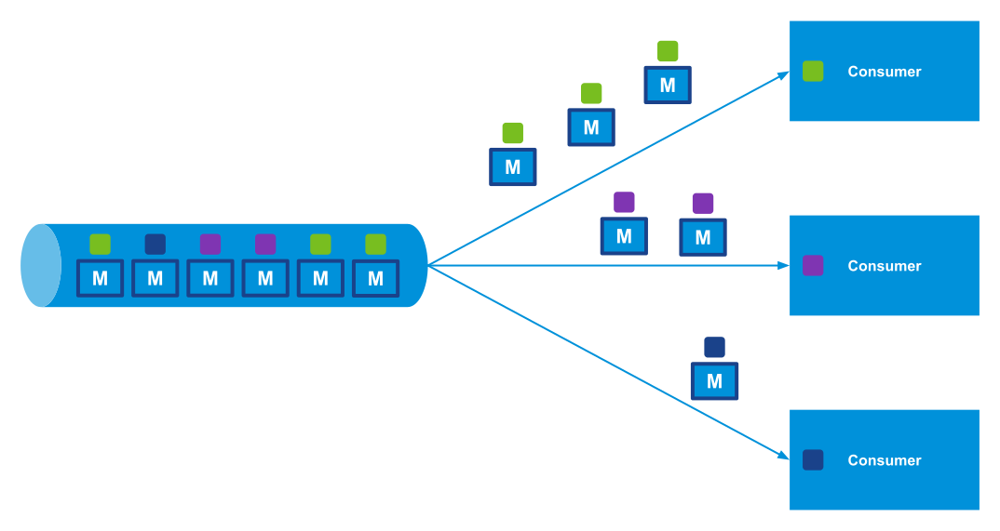

RabbitMQ 4.1 [introduces](https://github.com/rabbitmq/rabbitmq-server/pull/12415) an exciting new feature: AMQP filter expressions for [streams](/docs/streams).

This feature enables RabbitMQ to support multiple concurrent clients, each consuming only a specific subset of messages while preserving message order.
Additionally, it minimizes network traffic between RabbitMQ and its clients by dispatching only the messages that match the clients' interests.

In this blog post, we’ll explore what AMQP filter expressions are and walk through a simple Java example of how to use them.

<!-- truncate -->

## Specification

As outlined in the [Native AMQP 1.0](/blog/2024/08/05/native-amqp) blog post, one of AMQP 1.0's strengths is its extensibility, supported by numerous extension specifications.
RabbitMQ 4.1 takes advantage of the extension specification [AMQP Filter Expressions Version 1.0 Working Draft 09](https://groups.oasis-open.org/higherlogic/ws/public/document?document_id=66227).

This specification defines AMQP type definitions for message filter expressions.
Filter expressions are predicates evaluated against a message, returning either `true` or `false`.
If a predicate evaluates to `true`, the broker dispatches the message to the consumer.

RabbitMQ 4.1 implements a subset of this specification, including:
* **§ 4.2.4 properties filter**: Applies to the immutable [properties](https://docs.oasis-open.org/amqp/core/v1.0/os/amqp-core-messaging-v1.0-os.html#type-properties) section of the message.
* **§ 4.2.5 application-properties filter**: Applies to the immutable [application-properties](https://docs.oasis-open.org/amqp/core/v1.0/os/amqp-core-messaging-v1.0-os.html#type-application-properties) section of the message.

## Example

Imagine each message carries metadata specifying a particular color.
Different consumers can subscribe to the same stream, filtering messages to receive only those matching the color they are interested in.



The first consumer receives all green messages.
The second consumer receives all purple messages.
The third consumer receives all blue messages.

<details>
<summary>Try this example.</summary>

You can try this example using the [amqp-filter-expressions](https://github.com/ansd/amqp-filter-expressions/tree/v0.1.0) sample app along with the [RabbitMQ AMQP 1.0 Java Client](https://github.com/rabbitmq/rabbitmq-amqp-java-client) by following these steps:
1. Start the RabbitMQ server with the following command:
```bash
docker run -it --rm --name rabbitmq \
    -p 5672:5672 -p 15672:15672 \
    rabbitmq:4.1-rc-management
```
2. Navigate to the root directory of the sample app and start the client:
```bash
mvn clean compile exec:java
```

Upon running the sample app, you should see the following output on the console:
```
publisher sent message 0 with color green
publisher sent message 1 with color blue
publisher sent message 2 with color purple
publisher sent message 3 with color purple
publisher sent message 4 with color green
publisher sent message 5 with color green
consumer (filter green) received message 0
consumer (filter green) received message 4
consumer (filter green) received message 5
consumer (filter purple) received message 2
consumer (filter purple) received message 3
consumer (filter blue) received message 1
consumer (filter &s:e) received message 1
consumer (filter &s:e) received message 2
consumer (filter &s:e) received message 3
```

In this example, the publisher sends six messages, assigning each a specific color in the application-properties section.

* The first consumer applies an application-properties filter for `color: green`, receiving all green messages in the order they were published to the stream.
* Similarly, the second consumer filters for `color: purple`, receiving all purple messages, and the third consumer filters for `color: blue`, receiving all blue messages.

Additionally, this sample app contains a fourth consumer (not shown in the picture above) with a filter that matches messages whose color ends with the letter `e`.
(As per the specification, the filter expression `&s:suffix` matches values ending with the specified suffix.)
This fourth consumer therefore receives messages with colors blue and purple.

</details>

AMQP filter expressions enable multiple clients to concurrently consume specific subsets of messages from the same stream while preserving message order.
This feature also minimizes network traffic between RabbitMQ and its clients by dispatching only the messages that match each client’s interests.

## Stream Filtering Comparison

The **AMQP filter expressions** feature described in this blog post should not be confused with the [**Bloom filter-based stream filtering**](/blog/2023/10/16/stream-filtering) introduced in RabbitMQ 3.13.

Both features serve the same purpose: filtering messages from a stream.
However, their implementations differ, resulting in distinct characteristics:

| Feature | AMQP Filter Expressions | Bloom Filter Based-Stream Filtering |
| --- | --- | --- |
| Supported Protocols | AMQP 1.0 | Primarily for the [RabbitMQ Streams protocol](https://github.com/rabbitmq/rabbitmq-server/blob/main/deps/rabbitmq_stream/docs/PROTOCOL.adoc), but also supports AMQP 1.0, AMQP 0.9.1, and STOMP. |
| False Positives | None | Possible: Requires additional per-message filtering on the client side. |
| Support for Multiple Values to Filter on (Publisher) | Yes: Publishers can define multiple values in the properties or application-properties sections. | No: Publishers can assign only one filter value per message. |
| Support for Multiple Filter Expressions (Consumer) | Yes: Consumers can provide multiple filter expressions, and a message is delivered if *all* filters match. | Yes: Consumers can specify multiple filter values, and a message is delivered if *any* filter matches. |
| Prefix and Suffix Matching | Yes: For string values, consumers can define expressions like: "Filter messages whose [subject](https://docs.oasis-open.org/amqp/core/v1.0/os/amqp-core-messaging-v1.0-os.html#type-properties) starts with `emea.`" or "Filter messages whose [application-properties](https://docs.oasis-open.org/amqp/core/v1.0/os/amqp-core-messaging-v1.0-os.html#type-application-properties) section has a key `color` and the value ends with `e`. | No |
| Broker Overhead | Implemented using efficient Erlang pattern matching or term equality operations. However, every message is read into memory for each consumer (unless combined with Bloom filter-based filtering). | Minimal: Bloom filter membership checks use constant time.  With the RabbitMQ Streams protocol, the [`sendfile` system call](https://man7.org/linux/man-pages/man2/sendfile.2.html) optimizes chunk delivery without messages entering user space. |
| Network Overhead | Lower: Only messages matching the consumer's filters are transferred. | Higher: Entire [chunks](/blog/2023/10/24/stream-filtering-internals#structure-of-a-stream) are transferred even if only one message matches. |

Both features can be used together when consuming via AMQP 1.0.

## Summary

RabbitMQ 4.1 addresses the [challenge](https://github.com/rabbitmq/rabbitmq-server/issues/262) of enabling multiple consumers on a single queue/stream while ensuring certain messages (e.g., those with the same subject or ID) are always processed by the same consumer, preserving in-order processing.

Although this feature is not available for [classic queues](/docs/classic-queues) or [quorum queues](/docs/quorum-queues), AMQP filter expressions allow consumers to filter messages when consuming from a stream.
Since streams are immutable logs, total message order is maintained.
