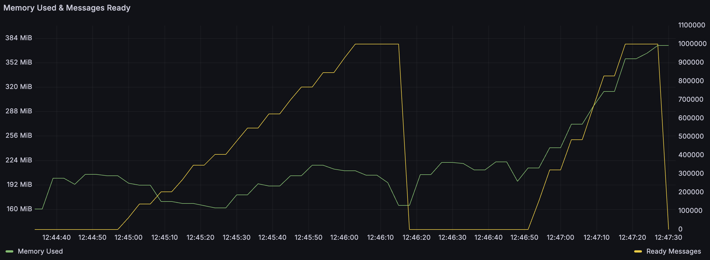

It's time to retire the myth that RabbitMQ stores messages in memory. While it was true in the early days of RabbitMQ,
and an option for the last 10 years, modern RabbitMQ versions almost always write messages
to disk right away. In this blog post we review how different queue types store messages but the short answer is: not in memory!

<!-- truncate -->

Let's start by clarifying what we mean by storing messages in memory, since it is not a precise statement.
If interpreted as "RabbitMQ uses memory to process messages", this phrase is certainly true.
When client applications send data to RabbitMQ, that data appears in memory buffers first (that's true for all
network-based software). It is also true, that RabbitMQ might cache some messages in memory,
for example to improve performance (again, true for virtually all software that needs to serve data).

However, I keep hearing this phrase used to express concerns about message durability - if you power off the server,
your messages will be lost! In this context, modern RabbitMQ versions almost never store messages in memory.

:::important
There is no configuration in which publishing 1GB of messages to RabbitMQ with no connected consumers,
would lead to 1GB of memory being used to store these messages. Some subset of messages can be cached in memory,
but messages are stored on disk.
:::

We'll go through different queue types and discuss how the messages are processed, stored and when they are confirmed
to the publishers. Publisher confirmations are critical here - RabbitMQ doesn't offer guarantees for messages that
were not confirmed. If you haven't received the confirmation, you can't even know whether the message reached
RabbitMQ (the network connection could have failed for example). With that in mind, let's go through the different queue types.

## Classic Queues

[Classic queues](https://www.rabbitmq.com/docs/classic-queues) is the oldest kind of queues in RabbitMQ and the main source of "RabbitMQ stores messages in memory" misconception.
RabbitMQ was first released in 2007. Disks were significantly slower back then and therefore classic queues were designed
to try to avoid writing messages to disk. There was a whole bunch of settings to configure when RabbitMQ should
write messages to disk (a process called "paging") so it would not keep messages in memory indefinitely but indeed,
you could say RabbitMQ stored messages in memory back then. However, that was a long time ago.

In RabbitMQ 3.6, released in 2015, the "lazy mode" was introduced. A queue configured to be lazy, always
stored messages on disk and didn't keep them in memory at all. This means that "RabbitMQ stores messages in memory"
was not true 10 years ago. It'd still do this by default, but it was completely optional.

Lazy mode was removed in RabbitMQ in 3.12, released in 2023, but the default (and the only available) behaviour
changed and is similar to the lazy mode, although not exactly the same. Therefore, for over a year now, classic queues don't store
messages in memory and can't even be configured to do so. The myth is almost entirely false at this point.

Almost entirely? So here's how classic queues work right now: they accumulate incoming messages in a small in-memory buffer
and write them to disk as a batch, as soon as the in-memory buffer is full. Since we don't know if more messages will come,
there are additional triggers that flush that buffer, including a flush after a certain number of batched messages
(even if they are too small to use the whole buffer) and after
a certain number of operations on that batch is performed. Additionally, the queue monitors how quickly messages are consumed
and makes decisions based on that (if there are fast consumers, more messages will be cached in memory). Finally, there's the
last-resort trigger which will flush the buffer every 200ms. So the absolute maximum of how long a message can be stored in
memory is 200ms but in practice, I've never seen this happen. Publishers usually receive confirms within a few milliseconds
and they are sent only after the message was written to disk.

### But I See No Disk Activity When I Use a Classic Queue!

Indeed, it's entirely possible to publish messages to classic queues and see virtually no disk writes nor disk reads.
How is that possible? It's an optimisation for a very specific, but relatively common case. As explained above, messages
can be briefly kept in memory but if there are active consumers that are waiting for messages (their prefetch buffer is not full),
messages that reach the queue are dispatched to the consumers immediately, without waiting for their batch to be written to disk.
A message that gets acknowledged by the consumer before this message's batch is written to disk, will not be written to disk at all,
because it simply doesn't need to be. Queues don't store acknowledged messages, so if the message is acknowledged before it is written,
it doesn't get written. If it's acknowledged after it was written, it's deleted from the queue (the actual removal from disk
will happen later, asynchronously, but it is considered deleted immediately).

It's worth mentioning that classic queues have [two separate storage mechanisms](https://www.rabbitmq.com/blog/2024/01/11/3.13-release#classic-queues-storage-primer).
Messages below 4kb (configurable through `queue_index_embed_msgs_below`) are stored in a per-queue message store and messages above that threshold
are stored in a per-vhost message store. The optimisation mentioned above only works for messages that would be stored in the per-queue message store.

So here it is, in modern RabbitMQ versions, classic queues store messages in memory for a very short period of time (milliseconds)
and no more than 200ms for sure. They may not write messages to disk at all, if the messages are small,
and consumed quickly enough, but this is just a performance optimisation. I'll leave it up to you to decide if that
qualifies as "RabbitMQ stores messages in memory", but I think a more accurate statement would be "when a message is delivered to
a classic queue, RabbitMQ writes messages to disk with a short delay". But yes, that means that for a brief moment, they are only in memory.

### Surely, Transient Messages Are Stored in Memory?

No. Again, things were different in the past but as of RabbitMQ 4.0, the only difference between persistent and transient messages
is when RabbitMQ sends back the publisher confirm. The messages are stored the same way as described above.

For persistent messages, the confirm is sent when either of these two events takes place:
1. The message is written to disk
1. The message is delivered and acknowledged by a consumer (if that happens before it's written to disk)

For transient messages, the confirm is sent as soon as the message reaches the queue and enters the in-memory buffer.
Since the message is transient, the guarantees are lax: the queue received the message, the publisher can move on.

### What About fsync?

`fsync` is a low-level file system operation that should ensure that messages are really written to disk.
There are multiple layers of I/O buffers between a user-space process such as RabbitMQ and actual hardware, including operating
system buffers and internal disk buffers. Performing a write without performing `fsync` doesn't guarantee that the data
will survive a sudden power loss. Unfortunately, `fsync` is a relatively slow operation, so any I/O intensive software has to
decide if, and when, to call it. While classic queues call `fsync` in some cases (for example, when RabbitMQ stops gracefully),
fsync is not performed before publisher confirms are sent. Therefore, even durable messages that a publisher received a confirmation for,
can technically be lost if the server crashes. If you need stronger guarantees, you can use [quorum queues](/docs/quorum-queues).

## Quorum Queues

From the initial release in RabbitMQ 3.8 (released in 2019), [quorum queues](https://www.rabbitmq.com/docs/quorum-queues) always stored
messages on disk. While the initial versions had an additional in-memory **cache** for messages, it was removed in RabbitMQ 3.10.

The situation is therefore simple: if the publisher received a confirmation, this means the message had already been
written to disk and `fsync`-ed on the quorum of nodes (in the most common scenario of a 3-node cluster, that means
it was written and `fsync`-ed on at least 2 nodes).

Since RabbitMQ doesn't offer any guarantees for messages that have not been confirmed to publishers, we could pretty much stop here.
However, for the sake of completeness, I'll mention that some messages are technically in memory:
1. The queue process has a mailbox (an Erlang/OTP concept) where requests to the queue process (such as enqueue/dequeue operations)
arrive for processing. The quorum queue process receives messages from the mailbox and processes them as a batch. When there's
a lot of requests, these operations may accumulate in the mailbox and therefore, assuming there are enqueue operations there, at this
point, some messages are only in-memory. However, this generally means RabbitMQ is at least briefly overloaded and
either way, these operations are usually processed within a few milliseconds. Plus, these messages are not confirmed yet.
2. Quorum queues rely on the [Raft protocol](https://raft.github.io/) and our [Raft implementations](https://github.com/rabbitmq/ra/)
stores the most recent Raft operations in memory. For enqueue operations this means that the message is in memory as well. However,
at this point the message is already written to disk and `fsync`-ed or it hasn't been confirmed yet.

## Streams

With [Streams](https://www.rabbitmq.com/docs/streams), the situation is even simpler than with quorum queues: Streams never supported keeping messages in memory, period.
The main difference between queues and stream in general, is that streams can be read multiple times and therefore consuming
a message doesn't remove that message from a stream. There's no point in storing messages only in memory, if we need to be able
to deliver them to consumers multiple times, potentially long after they were published.

Streams do not perform `fsync`, since they were optimised for high message throughput.

For completeness, just like quorum queues (and any other Erlang process), the stream process has a mailbox where requests to the stream
process arrive. There's therefore a moment where the messages are stored in memory for a short time. Once again though,
these are messages that have not been confirmed yet and they rarely stay in memory for more than a few milliseconds.

## MQTT QoS 0 Queues

RabbitMQ 3.12 introduced [Native MQTT support](/blog/2023/03/21/native-mqtt), and as part of that work, a new queue type was introduced,
specifically for MQTT QoS 0 consumers (you can't explicitly declare a queue of this type, you have to create an MQTT QoS 0 subscription).
Since QoS 0 basically means best-effort but no guarantees, QoS 0 messages are not written to disk at all and are delivered directly to the
consumers that are present. Effectively, there's no queue at all (beyond the Erlang mailbox). Messages received from the publisher are
immediately delivered to the consumers and removed from memory.

Does this qualify as storing messages in memory? I'd say it doesn't - the messages are in memory initially, simply because
that's how computers work, and are removed from memory as soon as they are delivered to the consumers. We don't really store
them in memory - we just process them and never write them to disk in this case. You can disagree and say that this is exactly
what "storing messages in memory means" but even then - this only applies to MQTT QoS 0 usage and the messages will generally stay
in memory for no more than a fraction of second.

## Message Metadata

So far I focused on message bodies, since that's what people usually mean when talking about storing messages in memory. However,
RabbitMQ also needs to keep track of the messages that are currently present in the queues. For example, when a queues has a defined
[`x-max-length` limit](https://www.rabbitmq.com/docs/maxlength), RabbitMQ needs to keep track of the total size of all the messages in the queue,
so when it delivers a message, it keeps the message size (but not the message body itself) in memory, to just subtract it quickly
from the total size of the queue, once the consumer acknowledges the messages.

This kind of metadata is stored differently by different queue type, but even when stored in memory, it will consume
significantly less memory than the message bodies would and doesn't change any guarantees about the message durability.

Here's how we store the metadata for different queue types:
* Classic queues
  - for messages stored in the per-queue message store, no data is stored in memory
  - for messages stored in the per-vhost message store, there's some metadata in memory
* Quorum queues
  - metadata is stored in memory (at least 32 bytes per message, sometimes a bit more, for example when [message TTL](https://www.rabbitmq.com/docs/ttl) is used)
* Streams
  - no message metadata is stored in memory

This basically means that for messages under 4KB stored in classic queues, as well as for streams, regardless of how many messages
there are in the queue/stream, the memory usage is constant. You will run out disk before you run out of memory (you should
configure [retention](https://www.rabbitmq.com/docs/streams#retention)/[length](https://www.rabbitmq.com/docs/maxlength) limits
to avoid running out disk, but that's a different story).

Here's an illustration highlighting the difference between the two classic queue storage mechanisms. In this test,
I first published 1 million messages of 4000 bytes each, then deleted the queue and published 1 million messages of 4100 bytes
each. As you can see, the memory usage was stable in the first phase (small fluctuations notwithstanding), but when publishing
larger messages, we can see the memory usage grows as well. This is because 4100 bytes is above the threshold, so these
messages are stored in the per-vhost message store and the per-vhost message store keeps some metadata in memory. A million 4KB
messages would have taken up 4GB of memory to store, while the actual usage is still below 400MB.

## Summary

Here's the summary of the key points.

| Type    | When are the messages written to disk?                                                       | fsync? | When is the publisher confirm sent?                                                                                                             |
|---------|----------------------------------------------------------------------------------------------|--------|-------------------------------------------------------------------------------------------------------------------------------------------------|
| Classic | After a few milliseconds or as soon as the in-memory buffer is full (whichever happens first)| No     | **Durable messages**: when the message is written to disk or consumed & acknowledged   **Transient messages**: as soon as batched in memory |
| Quorum  | Immediately (except for unconfirmed messages waiting in the mailbox, see above for details)  | Yes    | When written to disk and fsynced by the quorum of nodes (most commonly 2 out of 3 nodes)                                                        |
| Streams | Immediately (except for unconfirmed messages waiting in the mailbox, see above for details)  | No     | When written to disk by the quorum of nodes (most commonly 2 out of 3 nodes)                                                                    |

The flexibility provided by RabbitMQ, with support for multiple protocols, queue types and other configurations (eg. single node,
vs a cluster with queue replication), combined with 18 years of history and evolution, means that almost any "RabbitMQ does/doesn't do X"
statement is incorrect or at least imprecise. They should almost always be quantified with a specific version and configuration.

Going back to the title of this post, I think it's fair to say that "RabbitMQ doesn't store messages in memory" is much
closer to the truth, than the opposite claim, which still circulates in discussions involving RabbitMQ. Regardless of the queue type,
there is no configuration in which publishing, say, 1GB of messages to RabbitMQ with no connected consumers, would lead to 1GB of memory being
used to store these messages. Most importantly, if you want high data safety guarantees, quorum queues are available and store data safely
by default. If you publish a message to a quorum queue and receive the confirmation, it'd take a disastrous event for RabbitMQ to lose it
(and if you want to protect messages from disastrous events, you might be interested in the commercial
[Warm Standby Replication plugin](https://techdocs.broadcom.com/us/en/vmware-tanzu/data-solutions/tanzu-rabbitmq-on-kubernetes/4-0/tanzu-rabbitmq-kubernetes/standby-replication.html)).

If you don't need such data safety guarantees, you don't have to pay the intrinsic overhead of data safety. Just use the right tool for the job.
