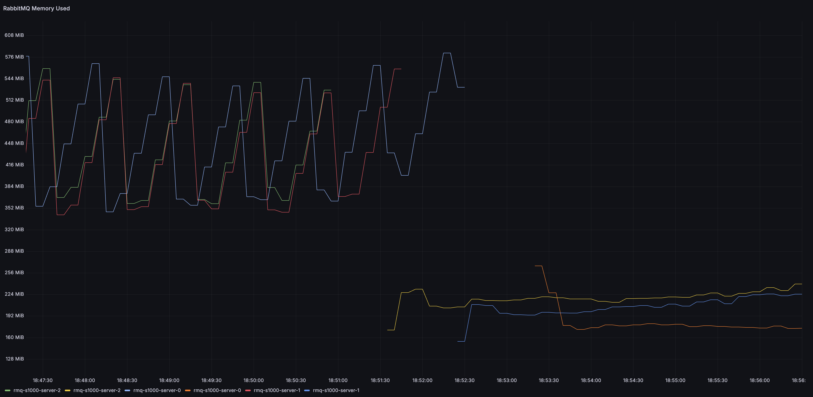
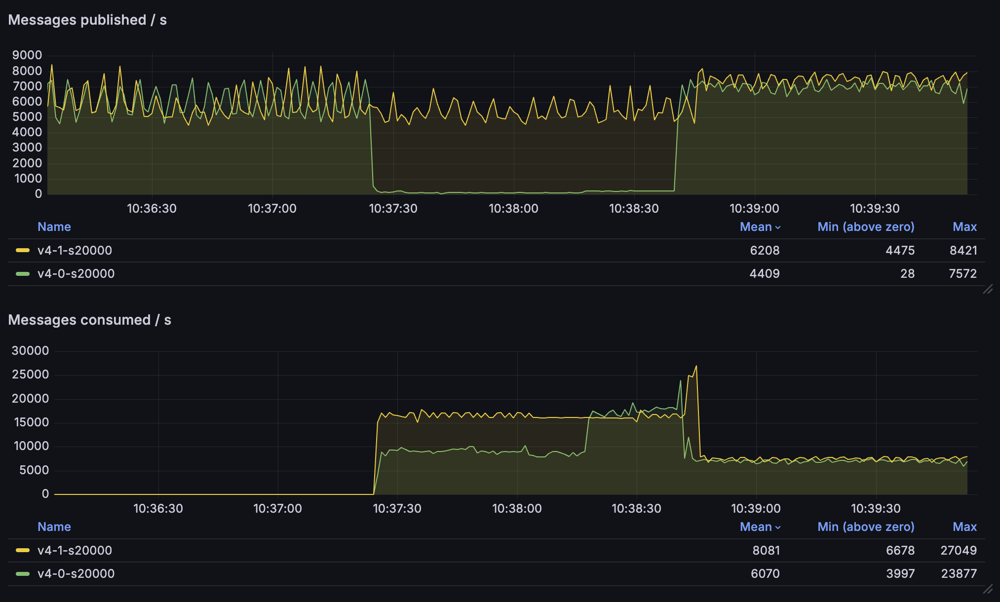

RabbitMQ 4.1 is just around the corner and, as usual, apart from new features,
we have made some internal changes that should provide better performance.

There are at least 4 notable changes:

1. Lower and more stable memory usage for quorum queues
1. Much better performance when consuming a long quorum queue
1. Better performance for Websocket connections
1. Lower memory usage and/or higher throughput for TCP connections

<!-- truncate -->

## Quorum Queues: Lower Memory Usage

Quorum queues in RabbitMQ 4.1 should use less memory in many situations. As you may be aware,
[in the past quorum queues had a sawtooth-like memory usage pattern](https://www.rabbitmq.com/docs/4.0/quorum-queues#how-memory-wal-and-segments-files-interact).
They would fill up an in-memory buffer (cache) for recent [Raft](https://raft.github.io/) operations and once full,
the buffer was emptied and then filled up again.

In RabbitMQ 4.1, these entries are deleted much more frequently, leading to a more stable memory usage
under many conditions. Here's the memory usage of a cluster initially running 4.0 and then upgraded
to 4.1:

The exact details of the workload are not super important, since this difference should be visible
for many different workloads, but for completeness, here they are:

- there were 10 quorum queues
- all messages were 1kb in size
- each queue received 500 messages per second from a single publisher (so 5000 messages per second total for all queues)
- each queue had a single consumer (a vast majority of messages was consumed within 10 milliseconds since being published)
- the queues were effectively empty, since all messages were prompts consumed

It's worth remembering that such a low and stable memory usage cannot be expected
in all conditions. For example, [quorum queues keep metadata about messages in the queue in memory](https://www.rabbitmq.com/blog/2025/01/17/how-are-the-messages-stored#message-metadata)
and therefore, if you have
many messages in the queues (messages are not immediately consumed), this metadata will
consume memory. There are also other factors and in-memory structures that will grow based on the workload.
Nevertheless, memory usage should be lower and less spiky in many common situations.

## Quorum Queues: Offloading Disk Reads

Let's consider a completely different workload - one where messages accumulate in the queues
and then consumers need to catch up to empty the queues. Historically, quorum queues could get overwhelmed
by an influx of consumers, especially if the messages were large and consumers requested a lot of them
(either they had a large prefetch buffer or there were a lot of consumers, or both).
In this scenario, the queue could get so busy reading the older messages from disk (to dispatch them to the consumers)
that publishers had to wait quite a bit to have their messages accepted by the queue.

In RabbitMQ 4.1, such disk reads are offloaded to the AMQP 0.9.1 channel or AMQP 1.0 session processes
(based on the protocol used). The queue has much less work to do and can keep serving
the publishers.

Let's take a look at the differences in publishing and consumption rates between 4.0 and 4.1:

Here's what's going on in this graph:

1. We have two clusters running, 4.0 (green lines) and 4.1 (yellow)
2. Both clusters receive ~6000 messages per second, each message is 20kb
3. Initially, there are no consumers; hence, the consumption rate is zero
4. After some time, consumers start and try to consume messages
5. In each environment, there are are now 10 consumers, each with a 300 message prefetch buffer
6. 4.0 environment is overwhelmed - the publishing rate drops to just ~100 messages per second
7. Meanwhile, 4.1 environment continues serving the publishers with no noticeable impact
8. Additionally, the consumption rate is almost double in the 4.1 environment
9. Once the backlog of messages is consumed, both environments can handle ~7000 messages per second in and out

Not only are the publishers not throttled, but the consumers are also able to consume the messages much faster!

## Better Performance of WebSocket Connections

To serve HTTP connections, RabbitMQ uses a popular Erlang HTTP server called [Cowboy](https://github.com/ninenines/cowboy)
(developed by [Loïc Hoguin](https://github.com/essen) long before he joined the RabbitMQ team).
RabbitMQ 4.1 upgrades Cowboy to version 2.13.0, which [significantly improves WebSocket
performance](https://ninenines.eu/articles/cowboy-2.13.0-performance/) for all systems that relies on Cowboy,
including RabbitMQ. Upgrading to RabbitMQ 4.1 should therefore be particularly beneficial to anyone using
AMQP, [MQTT](https://www.rabbitmq.com/docs/web-mqtt) or [STOMP](https://www.rabbitmq.com/docs/web-stomp) over WebSockets.

## TCP Buffer Auto-Tuning

A key improvement described in
[Cowboy 2.13.0 release blog post](https://ninenines.eu/articles/cowboy-2.13.0-performance/) 
is the dynamic TCP buffer auto-tuning. For WebSocket connections, these improvements
in Cowboy automatically benefit RabbitMQ users, since Cowboy handles HTTP connections to RabbitMQ.

In RabbitMQ 4.1, we incorporated the same TCP buffer auto-tuning mechanism into the AMQP listener,
which is a completely separate code path and does not
use Cowboy (since Cowboy is an HTTP server). Thanks to this work, RabbitMQ should use less memory for AMQP
0.9.1 and 1.0 connections, without a noticeable performance penalty. The amount of memory saved depends on
your current buffer size and the number of connections, but in our tests it saved a few hundred megabytes
of memory in a system with a few thousand connections.

It's worth pointing out that the buffer discussed in this paragraph is a user-space buffer and should
not be confused with `recbuf` / `sndbuf` buffers which are kernel buffers. These can be
[statically configured](https://www.rabbitmq.com/docs/networking#tuning-for-throughput-tcp-buffers)
and if they are not, they are auto-tuned by the Linux kernel (the behaviour on other operating systems
may differ).

The value of `tcp_listen_options.buffer`, which used to control the size of the now auto-tuned buffer,
is ignored.
