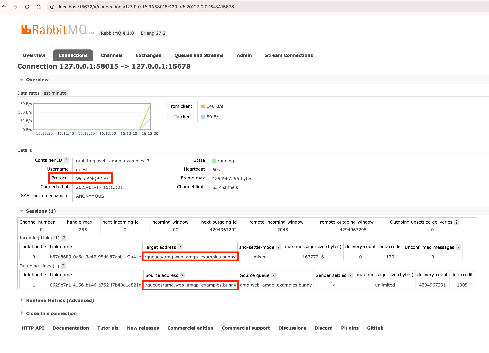
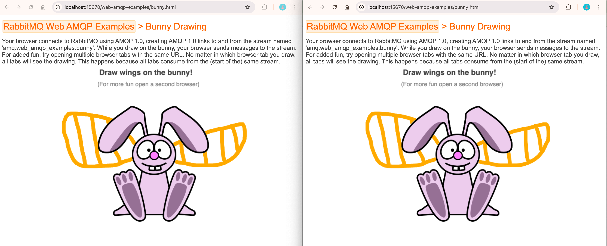

We are delighted to announce support for AMQP 1.0 over WebSocket in [VMware Tanzu RabbitMQ](https://www.vmware.com/products/app-platform/tanzu-rabbitmq) 4.1.

This feature enables any browser-based application to communicate with RabbitMQ using AMQP 1.0, paving the way for a wide range of efficient browser-based business messaging scenarios.

<!-- truncate -->

## What is WebSocket?

WebSocket, defined in [RFC 6455](https://datatracker.ietf.org/doc/html/rfc6455), is a simple protocol consisting of two parts:
```
Client                                   Server
  |                                         |
  |================ Part I =================|
  |---- WebSocket Handshake Request ------->|
  |       GET /some/path HTTP/1.1           |
  |       Upgrade: websocket                |
  |       Connection: Upgrade               |
  |       Sec-WebSocket-Protocol: amqp      |
  |                                         |
  |<-- WebSocket Handshake Response --------|
  |       HTTP/1.1 101 Switching Protocols  |
  |       Upgrade: websocket                |
  |       Connection: Upgrade               |
  |       Sec-WebSocket-Protocol: amqp      |
  |                                         |
  |================ Part II ================|
  |<========= WebSocket Connection ========>|
  |        Full-duplex communication        |
  |                                         |
  |<---------- Binary Data [AMQP] --------->|
  |<---------- Binary Data [AMQP] --------->|
  |<---------- Binary Data [AMQP] --------->|
  |                 ...                     |
  |                                         |
  |----------- Close Frame ---------------->|
  |<---------- Close Frame -----------------|
```

The first part is the handshake, consisting of an HTTP request and response.
The second part is the data transfer:
a single TCP connection remains open between client and server, allowing either side to push binary data to the other at any time.

In this example, the binary data consists of [AMQP frames](https://docs.oasis-open.org/amqp/core/v1.0/os/amqp-core-transport-v1.0-os.html#doc-idp31280) because the client proposed `Sec-WebSocket-Protocol: amqp` to the server, and the server accepted it.
The `Sec-WebSocket-Protocol` header specifies the application-level protocol layered over WebSocket.

The protocol stack for this communication looks like this:
```
+-------------------+
|      AMQP         |  Application Layer
+-------------------+
|    WebSocket      |
+-------------------+
|       TCP         |  Transport Layer
+-------------------+
|       IP          |  Network Layer
+-------------------+
|     Ethernet      |  Link Layer
+-------------------+
```

The WebSocket protocol itself does not dictate the application-layer protocol, allowing for flexibility.
It could support any protocol, including STOMP and MQTT.

## Why WebSocket?

WebSocket provides the following advantages:
1. **Browser Compatibility:**
It allows browser-based applications to use application-layer protocols other than HTTP.
For security reasons, browsers restrict JavaScript from opening raw TCP connections to communicate using protocols like AMQP or MQTT.
WebSocket protects against malicious JavaScript running in a browser, therefore enabling secure application-layer communication over the WebSocket layer.
2. **Firewall traversal:**
WebSocket facilitates communication in environments with restrictive firewall rules.
For example, while port 443 (`https`) may be allowed, port [5671](/docs/networking#ports) for `amqps` might be blocked.
In such cases, a secure WebSocket (`wss`) connection on port 443 can be used to communicate over AMQP.

Modern browsers universally support WebSocket, making it a practical choice for web-based applications.

## WebSocket in RabbitMQ

RabbitMQ has long supported [STOMP over WebSocket](/docs/web-stomp) and [MQTT over WebSocket](/docs/web-mqtt) through the `rabbitmq_web_stomp` and `rabbitmq_web_mqtt` plugins, respectively.

VMware Tanzu RabbitMQ 4.1 introduces the new `rabbitmq_web_amqp` plugin, compliant with the [AMQP WebSocket Binding Committee Specification 01](https://docs.oasis-open.org/amqp-bindmap/amqp-wsb/v1.0/cs01/amqp-wsb-v1.0-cs01.html).
This plugin operates similarly to the existing WebSocket plugins, starting a listener to manage WebSocket protocol aspects.

Previously, browser-based applications connected to RabbitMQ using MQTT or STOMP over WebSocket, often due to the lack of AMQP support.
AMQP over WebSocket brings the following benefits:
* **Feature Richness:**
Unlike MQTT and STOMP which are designed for simplicity, AMQP is a protocol designed for business messaging supporting more advanced features.
* **Efficiency**:
AMQP is binary and efficient, whereas STOMP is text-oriented.

This makes AMQP over WebSocket an excellent choice for efficient, feature-rich browser-based business messaging.

## WebSocket Relay

Before this plugin, a workaround involved using a WebSocket relay.
A relay would accept WebSocket connections from clients and open separate TCP connections to RabbitMQ.
While functional, this approach introduced downsides such as:
1. Additional latency from the extra network hop.
2. Increased resource usage to maintain two TCP connections per client.
3. Operational overhead for deploying and monitoring the relay.
4. An additional potential point of failure.

The new plugin eliminates these issues by providing direct AMQP over WebSocket support.

## Example

RabbitMQ includes plugins `rabbitmq_web_stomp_examples` and `rabbitmq_web_mqtt_examples` with basic examples called ["echo" and "bunny"](/blog/2012/05/14/introducing-rabbitmq-web-stomp#the-usage).
Similarly, VMware Tanzu RabbitMQ 4.1 introduces `rabbitmq_web_amqp_examples`.

The AMQP over WebSocket "bunny" example works as follows:
1. The `rabbitmq_web_amqp_examples` plugin creates a [stream](/docs/streams) named `amq.web_amqp_examples.bunny`.
2. When visiting `http://localhost:15670/web-amqp-examples/bunny.html`, the plugin serves files `bunny.html`, `bunny.png`, and `rhea.js`.
The `bunny.html` file displays the `bunny.png`.
Additionally, the `bunny.html` file contains JavaScript code which creates an AMQP over WebSocket connection from the browser to RabbitMQ:
```js
// default AMQP over WebSocket port and path in RabbitMQ
var url = "ws://" + location.hostname + ":15678/ws"
var ws = client.websocket_connect(WebSocket);
var connection = client.connect({
    "connection_details":ws(url, ["amqp"]),
    // Setting username without password causes rhea to use SASL mechanism ANONYMOUS.
    "username": "ignored",
});
```

This code snippet uses the `rhea.js` file.
[rhea](https://github.com/amqp/rhea) is an open source AMQP 1.0 TypeScript/JavaScript library.
This single file can be created by running the following commands in the root directory of the `rhea` repository:
```bash
npm install
make browserify
```

Not only did the browser open an AMQP over WebSocket connection, but it also created a [session](https://docs.oasis-open.org/amqp/core/v1.0/os/amqp-core-transport-v1.0-os.html#section-sessions) and [links](https://docs.oasis-open.org/amqp/core/v1.0/os/amqp-core-transport-v1.0-os.html#section-links) to/from the pre-declared stream:
```js
var address = "/queues/" + stream
client.on("connection_open", function (context) {
    sender = context.connection.open_sender(address);
    // If we open a new brower tab, we want to see the existing drawing.
    const filter = {'my-filter': amqp_types.wrap_described("first", "rabbitmq:stream-offset-spec")};
    context.connection.open_receiver({source:{address: address, filter: filter}});
});
```



3. If you open a second browser tab at the same URL, it also creates an AMQP over WebSocket connection publishing to and consuming from the same stream.
4. When you draw on either of the two browser tabs, the other tab sees the live drawing because both tabs consume from the same stream:



## Clients

As of RabbitMQ 4.1, the following [RabbitMQ AMQP 1.0 client libraries](/client-libraries/amqp-client-libraries) are available:
1. [RabbitMQ AMQP 1.0 **Java** client](https://github.com/rabbitmq/rabbitmq-amqp-java-client)
2. [RabbitMQ AMQP 1.0 **.NET** client](https://github.com/rabbitmq/rabbitmq-amqp-dotnet-client)
3. [RabbitMQ AMQP 1.0 **Go** client](https://github.com/rabbitmq/rabbitmq-amqp-go-client)
4. [RabbitMQ AMQP 1.0 **Python** client](https://github.com/rabbitmq/rabbitmq-amqp-python-client)

Some of these libraries are in the early stages of development.

The full benefit of the new AMQP over WebSocket plugin will be realised with a RabbitMQ AMQP 1.0 **JavaScript** library because as explained in the [Native AMQP 1.0](/blog/2024/08/05/native-amqp#rabbitmq-amqp-10-clients) blog post, these RabbitMQ specific wrappers allow to declare [exchanges](/tutorials/amqp-concepts#exchanges), [queues](/tutorials/amqp-concepts#queues), and [bindings](/tutorials/amqp-concepts#bindings).

Since as of RabbitMQ 4.1 no such RabbitMQ specific JavaScript library is available yet, for the time being, existing JavaScript AMQP 1.0 clients such as [rhea](https://github.com/amqp/rhea) can be used instead.

## Wrapping up

VMware Tanzu RabbitMQ 4.1 enables browsers to communicate with RabbitMQ using AMQP 1.0.

Please note: the new AMQP over WebSocket plugin is a closed-source feature available exclusively in the commercial [VMware Tanzu RabbitMQ](https://www.vmware.com/products/app-platform/tanzu-rabbitmq) offering.
It is not part of the open source RabbitMQ distribution.

While this blog post illustrated the feature with a playful example involving a bunny, AMQP 1.0 is an efficient protocol built for business messaging.
Think of enterprise tools like Salesforce, Workday, or Jira - all running in the browser and benefiting from real-time messaging.
