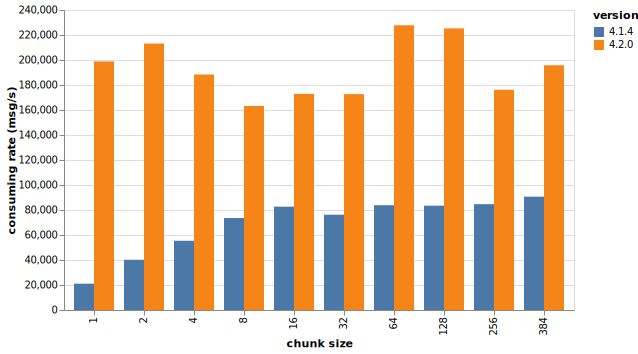
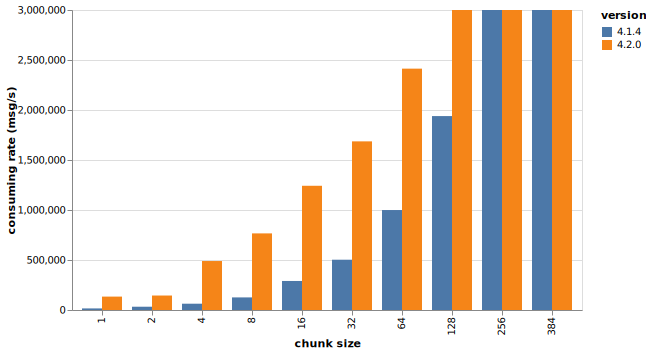
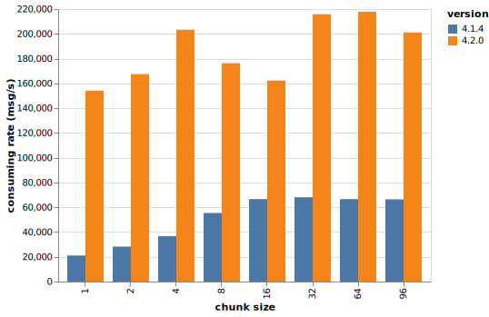
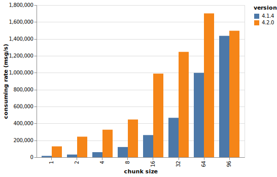
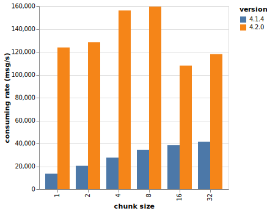
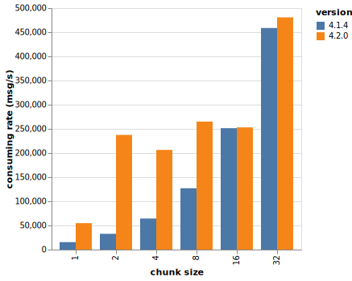
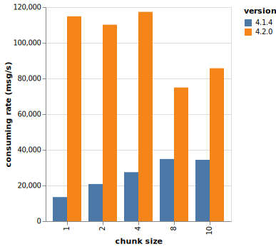
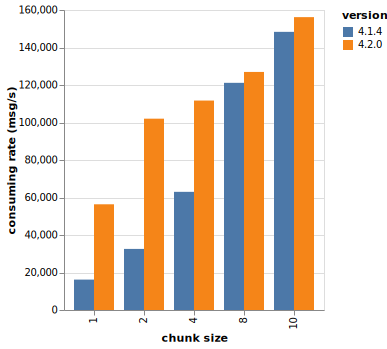
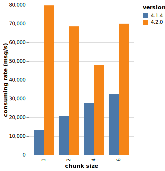
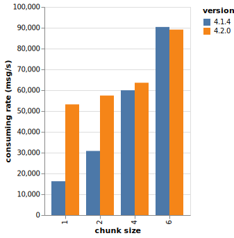

RabbitMQ Streams are designed for high-throughput scenarios, but what happens when your ingress rate is low?
Low message rates can significantly impact delivery performance, reducing message consumption rates by an order of magnitude.
RabbitMQ 4.2 introduces an optimization that dramatically improves delivery rates for low-throughput streams, benefiting all supported protocols.

<!-- truncate -->

## Publish, Store, Consume with Streams

When a publishing application sends messages to a RabbitMQ stream using the stream protocol, the client library batches them together into a publishing frame.
RabbitMQ receives these messages and aggregates them, often combining messages from multiple publishers into a single unit of storage, a "[chunk](/docs/next/stream-filtering#on-disk-stream-layout)".
This chunk of messages is then stored durably on the file system.

When a consumer subscribes to a stream using the stream protocol, RabbitMQ dispatches messages by sending them in sequential chunks over the network.
The number of messages packed into each chunk - the chunk size - is a critical factor for throughput; large chunks containing hundreds of messages each lead to high message delivery rates for consumers.

_The ingress rate is the major factor in the chunk size: the higher the ingress rate, the greater the chunk size.
Streams have been designed for high throughput since the beginning._

## The Problem With Small Chunks

What happens when the ingress rate is low?
Chunks will contain just a few messages each—or even a single message in the worst case.
This eliminates the benefits of batching: each frame delivers only a few messages to the consumer.
While chunk dispatching is optimized, it still requires several system calls (reading the file system and writing to the socket).

It is hard to give definitive numbers, but let's say a stream consumer can read several million messages per second from a stream with a chunk size of 300.
The rate can drop to about 200,000 messages per second with a chunk size of 15.
The ratio is what matters here, not the absolute numbers.

Luckily there are ways to make things better with small chunks.

## Optimization For Small Chunks: Read Ahead

Streams tend to have consistent structure: if a stream contains small chunks at one point, it's likely composed mostly of small chunks.
So why not try to read several chunks ahead if a chunk we just read is small?
Dispatching several chunks still requires multiple frames, but we only need to read from the file system once, saving some costly system calls.

The read-ahead limit is 4,096 bytes, so not all small-chunk streams will benefit from this optimization.
Still, this rather simple idea improves the delivery rates dramatically for targeted streams.
Even better, RabbitMQ uses this technique for all protocols, not only the stream protocol but also AMQP.

## Performance Results

We used a 3-node cluster and a VM to run tests with [PerfTest](https://github.com/rabbitmq/rabbitmq-perf-test/) and [Stream PerfTest](https://github.com/rabbitmq/rabbitmq-stream-perf-test/).
All VMs were `m7i.4xlarge` AWS instances.
We created streams and filled them with 3 million messages, varying the message size and chunk size for each stream.
We then consumed all messages using PerfTest (AMQP 0.9.1) and Stream PerfTest (stream protocol).
We ran tests against RabbitMQ 4.1.4 and 4.2.0-beta.3.

We filled the streams with a tool written for the occasion to have the expected chunk sizes.
Here are the performance tool commands to consume the messages:


```shell
# PerfTest
java -jar perf-test.jar --producers 0 --consumers 1 --predeclared --qos 200 \
    --stream-consumer-offset first --cmessages 3000000 --queue stream
# Stream PerfTest
java -jar stream-perf-test.jar --producers 0 --consumers 1 --offset first \
    --initial-credits 50 --no-latency --cmessages 3000000 --streams stream
```


**12-byte messages, AMQP 0.9.1**



Even if a 12-byte message is tiny, we see the read-ahead approach works well: 10 times faster for a stream with 1-message chunks.
Rate is still twice as high with a 384-message-per-chunk stream.

**12-byte messages, stream protocol**



We achieved almost a 10x increase for a 1-message-per-chunk stream with the stream protocol (16,000 vs 134,000 msg/s).
Read-ahead performs better until reaching 128 messages per chunk.

The results for the other message sizes are consistent, we will discuss them at the end.

**48-byte Messages, AMQP 0.9.1**



**48-byte messages, stream protocol**



**256-byte Messages, AMQP 0.9.1**



**256-byte messages, stream protocol**



**512-byte Messages, AMQP 0.9.1**



**512-byte messages, stream protocol**



**1024-byte Messages, AMQP 0.9.1**



**1024-byte messages, stream protocol**



### Result Analysis

The consumption rate improves as expected with the stream protocol: it is higher for streams with small chunks but remains the same when a chunk reaches the read-ahead limit (4,096 bytes).
This is particularly noticeable with 1,024-byte messages, where the rate improved for chunk sizes of 1 and 2 (less than the read-ahead limit) but stays roughly the same for chunk sizes of 4 and 6 (reaching or exceeding the limit, so read-ahead does not kick in).

The trend is similar with AMQP 0.9.1, but we still observe improved results after a chunk exceeds the read-ahead limit.
With AMQP 0.9.1 (and other non-stream protocols, like AMQP 1.0), RabbitMQ uses an iterator-like approach to dispatch messages.
This approach was already using a form of read-ahead, but it's now more aggressive and better adapts to the size of chunks.
This explains the good results with AMQP 0.9.1 that we should also get with other non-stream protocols.

## Last Details

The read-ahead optimization is enabled by default but can be disabled globally by setting the `stream.read_ahead` configuration entry to `false`.

Large chunks are still dispatched to consumers in an optimized manner: the chunk header is read in memory but the chunk data (the messages) are sent through the socket in a [zero-copy fashion](https://man7.org/linux/man-pages/man2/sendfile.2.html).

## Conclusion

The read-ahead optimization in RabbitMQ 4.2 proves that sometimes looking ahead pays off—delivering up to 10x better performance for streams with small chunks across all protocols.
Who knew that being a little greedy when reading from disk could make your consumers so much happier?
