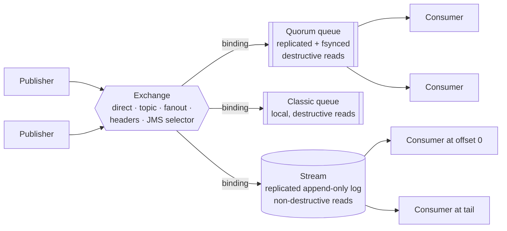
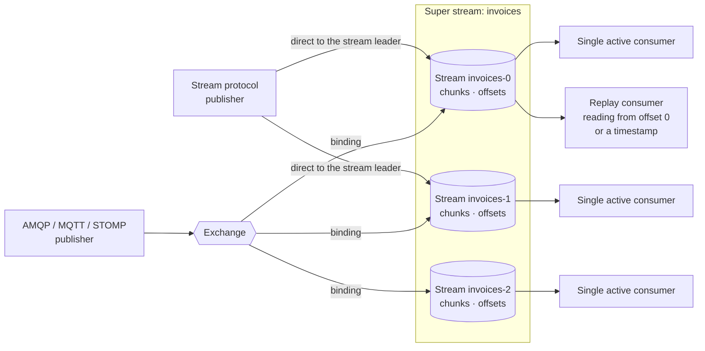
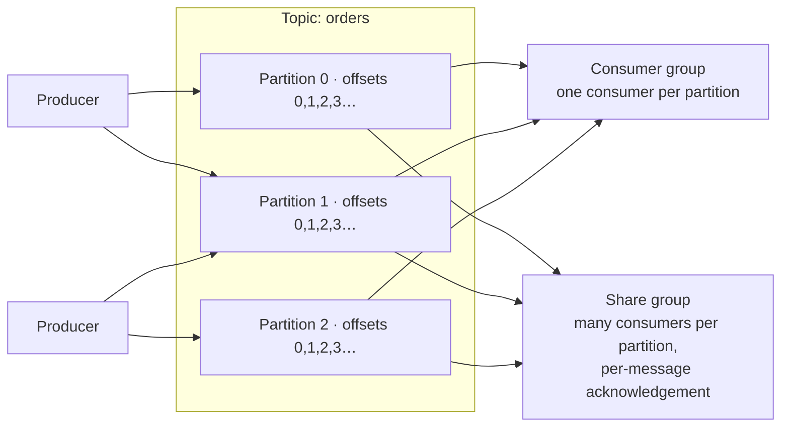

<!--
Copyright (c) 2005-2026 Broadcom. All Rights Reserved. The term "Broadcom" refers to Broadcom Inc. and/or its subsidiaries.

All rights reserved. This program and the accompanying materials
are made available under the terms of the under the Apache License,
Version 2.0 (the "License”); you may not use this file except in compliance
with the License. You may obtain a copy of the License at

https://www.apache.org/licenses/LICENSE-2.0

Unless required by applicable law or agreed to in writing, software
distributed under the License is distributed on an "AS IS" BASIS,
WITHOUT WARRANTIES OR CONDITIONS OF ANY KIND, either express or implied.
See the License for the specific language governing permissions and
limitations under the License.
-->

# RabbitMQ vs. Apache Kafka®

Most existing comparisons of these two systems were written years ago by someone who sells one of them.
This one is written by the team that builds RabbitMQ, so bear that in mind — but we have tried hard to describe Kafka the
way its own documentation describes it, and we are explicit about the things Kafka does that
RabbitMQ does not. If anything here reads as unfair to you, we would genuinely like
to know — [tell us](https://github.com/rabbitmq/rabbitmq-website/discussions).

The short version: the two systems started from opposite ends of the problem and have
been growing towards each other for years. RabbitMQ built its reputation as the
default choice for messaging and task queueing; Kafka built its reputation as the
default choice for event streaming. RabbitMQ then gained a durable, replicated log in
2021, and Kafka gained queue semantics in 2026. Their high-level capabilities now overlap
substantially.

If you are looking for a high-level summary and want to skip the technical details, you can [jump directly to the use cases](#use-cases).

## The line that used to divide them {#the-old-line}

For a long time the advice was easy to give:
> RabbitMQ for messaging and queueing, Kafka for streaming.

It was good advice. It is now out of date on both sides.

**RabbitMQ has had a real log since 3.9 (2021).** [Streams](../streams) are an
append-only, replicated, disk-based log with non-destructive reads, offset-based
positioning, retention policies and a [dedicated protocol](https://github.com/rabbitmq/rabbitmq-server/blob/main/deps/rabbitmq_stream/docs/PROTOCOL.adoc)
built for throughput. RabbitMQ 3.11 (2022) added [super streams](../streams#super-streams)
— partitioned streams — along with [single active consumer](../streams#single-active-consumer), giving ordered,
partition-parallel consumption. Streams have been a mature, widely deployed feature for
several release series, not a recent bolt-on. This is not a queue wearing a log costume;
it is a log, designed as one, with the same mechanical sympathies that make Kafka fast.

**Kafka has had queue semantics since 4.2 (2026).**
[KIP-932 "Queues for Kafka"](https://cwiki.apache.org/confluence/x/4hA0Dw) introduced
*share groups*, production-ready as of Kafka 4.2. Share consumers acquire individual
messages under a time-limited lock, acknowledge them one at a time, and can outnumber
the partitions they read from. Kafka's own documentation is refreshingly direct about
why this was needed: *"some traditional messaging workloads are not a good fit for
consumer groups."*

The idea had been circulating for years. In April 2020 the RabbitMQ team sketched its own
design for [competing readers over a stream](https://github.com/rabbitmq/osiris/issues/2) —
strikingly close in shape to share groups in Kafka, four years before KIP-932 was filed. We claim no
influence; the log imposes similar constraints on everyone who builds this.

So the honest framing is not "log versus queue". It is: two mature systems, each of
which now does both things, each still carrying the assumptions of where it started.
Kafka's queue semantics are a consumption mode layered on a log. RabbitMQ's queue is a queue,
and RabbitMQ's log is a log.

## Two models, side by side {#two-models}

### How RabbitMQ organises data {#rabbitmq-model}

RabbitMQ splits the problem in two. Publishers send to an [exchange](../exchanges).
[Bindings](../exchanges#what-are-bindings) — rules attached to the exchange — decide which queues
or streams receive a copy.
Exchanges and bindings are just metadata living inside RabbitMQ that decide on the routing algorithm and therefore define the routing and messaging topology.

Behind the exchange you choose a [queue type](../queues). Queue types are genuinely
different data structures storing your messages:

| Type | Storage | Reads | Best at |
| :-- | :-- | :-- | :-- |
| [Quorum queue](../quorum-queues) | Raft-replicated log, [fsync](https://man7.org/linux/man-pages/man2/fsync.2.html)ed before confirm | Destructive | Work distribution where data safety and high availability matters |
| [Classic queue](../classic-queues) | Local, per-message persistence | Destructive | Transient, high-churn, single-node queues |
| [Stream](../streams) | Replicated append-only log | Non-destructive | Fan-out, replay, large backlogs, high throughput |
| [JMS queue](/blog/2026/04/23/rabbitmq-4.3-release#jms-queue-type) *(VMware Tanzu RabbitMQ)* | Raft-replicated log, fsynced before confirm  | Destructive or non-destructive | [JMS](https://jakarta.ee/specifications/messaging/3.1/apidocs/jakarta.messaging/jakarta/jms/package-summary) applications needing [selectors](/blog/2026/04/23/rabbitmq-4.3-release#jms-message-selectors) or [queue browsers](/blog/2026/04/23/rabbitmq-4.3-release#queue-browser) |
| [MQTT QoS 0 queue](../mqtt#qos0-queue-type) | None | Destructive | Low-latency fire-and-forget fanouts to [MQTT QoS 0](https://docs.oasis-open.org/mqtt/mqtt/v5.0/os/mqtt-v5.0-os.html#_Toc3901103) subscribers |

A single RabbitMQ cluster runs all of these at once.

### How RabbitMQ streams organise data {#rabbitmq-stream-model}

Streams deserve their own picture, because this is where the comparison with Kafka is
closest — and where readers coming from Kafka usually want a mapping.

A **[super stream](../streams#super-streams)** is a logical stream partitioned into individual **streams**. Roughly:
a super stream corresponds to a Kafka topic, and a stream to one of its partitions.
The mapping is not exact, and the difference is worth understanding: a RabbitMQ stream
is a first-class, individually named object that exists on its own, whereas a Kafka
partition is a subordinate of a topic and has no independent identity. You can create,
bind, and consume a single RabbitMQ stream without any super stream in sight.

Two things in that diagram are worth calling out.

**Stream protocol publishers write straight to the stream.** A client using the
[RabbitMQ Stream protocol](https://github.com/rabbitmq/rabbitmq-server/blob/main/deps/rabbitmq_stream/docs/PROTOCOL.adoc) discovers which node hosts the stream leader
and publishes to it directly, with no exchange and no routing step in the path — the
same shape as a Kafka producer writing to a partition leader, and for the same
performance reason.

**Everything else can still use the exchange.** A stream is also integrated as an ordinary "queue" type, so a device publishing over MQTT, a microservice publishing over AMQP 1.0, and
a legacy application publishing over AMQP 0-9-1 can all land messages in the same
stream by way of a binding. You get the log's throughput without forcing every producer
in your estate onto one protocol. Kafka has no equivalent: to write to a Kafka topic,
you have to speak the Kafka protocol.

| Kafka | RabbitMQ | Difference that matters |
| :-- | :-- | :-- |
| Topic | Super stream | A super stream is a logical grouping of real, independently usable streams |
| Partition | Stream | A stream is a first-class named object; a partition is not |
| Offset | Offset | Broker-side [offset tracking](../streams#offset-tracking) in both |
| Record batch | [Chunk](../stream-filtering#on-disk-stream-layout) | Same idea, same purpose: amortise everything |
| Consumer group | [Single active consumer](../streams#single-active-consumer) per partition | Same ordered, partition-parallel consumption |
| Producer to partition leader | Stream protocol client to stream leader | Same; RabbitMQ *also* accepts writes via exchanges from other protocols |

### How Kafka organises data {#kafka-model}

A Kafka **topic** is split into **partitions**. A partition is an ordered, immutable
sequence of messages on disk. Producers append to the end; each message gets a
monotonically increasing **offset**. Messages with the same key land in the same
partition, which is how Kafka gives ordering guarantees for related events. Consumers
track their position by offset and can rewind or replay at will.

Routing happens in the producer: the client picks the partition, usually by hashing a
key. The broker does not inspect the message. Consumption parallelism in a **consumer
group** is bounded by the partition count, because each partition goes to at most one
consumer in the group. **Share groups** lift that bound — that is largely what they
exist for.

This is an excellent design for a log, and it is why Kafka is so hard to beat at
replaying terabytes of history.

## Where the two designs agree: streaming {#where-they-agree}

This section exists because comparisons usually skip it, and skipping it produces a
wrong mental model. RabbitMQ streams and Kafka partitions solve the same problem in
strikingly similar ways.

**Batching as the unit of work.** Kafka's [design document](https://kafka.apache.org/43/design/design/) explains that its protocol is
built around a *"message set"* abstraction so that network requests can group messages
together: *"The server in turn appends chunks of messages to its log in one go, and the
consumer fetches large linear chunks at a time."* RabbitMQ streams use exactly this
approach: a [stream segment](../stream-filtering#on-disk-stream-layout) is made of **chunks**,
and a chunk is made of messages. Both systems also support [compressing](../stream-core-plugin-comparison#stream-clients-sub-entry-batching-compression-options) a batch once
rather than each message individually — RabbitMQ calls these sub-entry batches.

**One binary format from producer to disk to consumer.** Kafka standardised its message
format across producer, broker and consumer so data moves between them without
re-encoding. RabbitMQ streams do the same, using the
[AMQP 1.0 message format](https://docs.oasis-open.org/amqp/core/v1.0/os/amqp-core-messaging-v1.0-os.html#section-message-format) as both the on-disk and on-wire representation.

**Zero-copy reads.** Because the on-disk format is the on-wire format, both brokers hand
a region of a log file straight to a socket with the [sendfile](https://man7.org/linux/man-pages/man2/sendfile.2.html) system call, skipping
several copies through user space. Both lose that optimisation under TLS.

**Page cache over heap.** Neither broker keeps the log in its own process memory. Both
write to the filesystem and let the operating system's page cache do what it is good
at. A caught-up consumer is served from RAM without reading from disk.

**Publisher-side deduplication.** Kafka's idempotent producer assigns each producer an
ID and deduplicates using a sequence number, so a retry after an ambiguous failure does
not create a duplicate entry in the log. RabbitMQ streams offer
[the same guarantee](../streams#deduplication-published-messages) through named
producers and publishing IDs.

**Raft for cluster metadata.** Kafka replaced ZooKeeper with [KRaft](https://kafka.apache.org/43/operations/kraft/). RabbitMQ replaced
Mnesia with [Khepri](../metadata-store#khepri), likewise built on Raft.
Both projects concluded independently that cluster metadata deserves a real consensus protocol.

If you have internalised how Kafka achieves its throughput, you already understand how
RabbitMQ streams achieve theirs.

## Where the two designs differ: queueing {#where-they-differ}

With the shared design philosophies of streaming in mind, let's take a look at how RabbitMQ and Kafka diverge around queuing.

### RabbitMQ messages are independent items of work

:::tip

In Kafka, a message is a position in a shared log. In RabbitMQ, a message is an independent item of work.

:::

That does not mean Kafka only tracks an offset: share
groups durably track a delivery state and a delivery count for every message.

It also does not mean RabbitMQ reads your payload.
For performance reasons a message body is opaque bytes to
RabbitMQ exactly as it is to Kafka. What RabbitMQ parses is the message envelope:
[headers](https://docs.oasis-open.org/amqp/core/v1.0/os/amqp-core-messaging-v1.0-os.html#type-header),
[annotations](https://docs.oasis-open.org/amqp/core/v1.0/os/amqp-core-messaging-v1.0-os.html#type-message-annotations)
and [properties](https://docs.oasis-open.org/amqp/core/v1.0/os/amqp-core-messaging-v1.0-os.html#type-properties),
which is what makes broker-side [routing](/tutorials/tutorial-four-java),
[filtering](../stream-filtering), [TTL](../ttl),
[priorities](../quorum-queues#priorities), and scheduled delivery possible.

What it does mean is **coupling**. A Kafka message's fate is tied to its neighbours'. Its
position in the log is fixed, a share group's progress is anchored at a start offset that
advances only once every earlier message has reached a terminal state, and the bytes stay
on disk until the topic's retention policy removes them. A RabbitMQ message has none of
those ties: it can be held back, rescheduled, rerouted, or deleted on its
own, without reference to the messages around it.

### Quorum Queues use Raft all the way down to the individual message {#raft-per-message}

A [quorum queue](../quorum-queues) is a replicated state machine built on
[Raft](https://raft.github.io/). Distributed consensus is about getting different nodes to agree
on a value, and in Raft that value is an ordered log of operations. Kafka uses Raft
for cluster metadata. RabbitMQ uses it for that *and* for the queue itself.

The operations in a quorum queue's Raft log are individual, per-message events:

* *enqueue this message*
* *this consumer granted credit — assign messages*
* *that message was acknowledged — delete it*
* *that message was rejected — dead-letter it*
* *message processing failed — increase the delivery count and re-queue*
* *hold that message until 14:32:10*

Each one is replicated to a majority of members and flushed to disk before it takes
effect, which means **delivery state in RabbitMQ is as durable as the message itself**.

That has a concrete payoff during failures. If the node hosting a quorum queue leader
dies, the new leader resumes with exactly the same view: which messages were acquired
by which consumer, how many attempts each has had, and which were parked or scheduled for
later. Consumers pick up where they left off. In Kafka, the delivery state and counter are
durable, but the *acquisition* — which consumer currently holds a message — is state in the
share-partition leader's memory. A leader change therefore returns in-flight messages to
`Available` to be delivered again. That is correct at-least-once behaviour, and for most
workloads it is fine; however, it does mean a Kafka broker failover produces a burst of redeliveries,
which matters if the work is expensive to repeat.

### The RabbitMQ per-message toolkit {#per-message-toolkit}

This is where Kafka is lacking features that RabbitMQ provides. None of these are niche; they are the
day-to-day mechanics of running work through a queue reliably. Each one needs the broker
to make a decision about one message independently of the rest.

**Message delays.** A publisher can send a message that the queue accepts, replicates and
confirms immediately but hides from consumers until a chosen time.

**[Delayed retry](../quorum-queues#delayed-retry).** A quorum queue sets a failed
message aside and makes it available again after a backoff derived from its [delivery count](../quorum-queues#when-is-delivery-count-incremented).
A consumer can override that per message with an exact [timestamp](../quorum-queues#explicit-delivery-time) — so when a
downstream API rate-limits *one* tenant with a `Retry-After` header, that single message is
rescheduled for precisely when the API is ready while everyone else's work continues at
full speed.

**Message deferral.** A consumer can *park* a message under a token of its choosing and
request that exact message back later, on demand, when an external condition occurs — a
supplier confirmation, a file landing, an approval. The message is held durably by the
queue rather than in consumer memory.

**[Message TTL](../ttl).** Individual messages can have distinct TTLs expiring on their own schedule.

**[32 strict priority levels](../quorum-queues#priorities).** An urgent message
overtakes the backlog.

**[Dead-letter routing](../dlx).** A rejected message is re-routed *through an
exchange*, so the failure path has the same routing power as the success path: different
failure categories to different queues, owned by different teams.

**[The modified outcome](/blog/2024/10/11/modified-outcome).** A consumer can
add or change [message annotations](https://docs.oasis-open.org/amqp/core/v1.0/os/amqp-core-messaging-v1.0-os.html#type-message-annotations) *on the way back* — recording why it failed, when, and
on which consumer. The next consumer to receive the message sees them. Better still, when
dead-lettering to a [headers exchange](/tutorials/amqp-concepts#exchange-headers), those annotations drive the routing, so the consumer
can effectively choose which dead-letter queue its failure lands in: one queue for
transient faults worth retrying, another for business-logic errors a human must inspect,
another for unknown schemas.

**[Poison message handling](../quorum-queues#poison-message-handling).** A message that
keeps failing is dead-lettered instead of looping forever.

**[Consumer timeouts](../quorum-queues#consumer-timeout).** A stuck consumer's messages
are returned and handed to a healthy one.

**[Single active consumer](../consumers#single-active-consumer) and
[consumer priorities](../consumer-priority).** Control over *which* consumer gets the
next message, including hot-standby patterns.

**[Message interceptors](../message-interceptors).** RabbitMQ can run your custom logic on every message — stamping, validating, annotating.

**Disk that tracks your backlog.** An acknowledged message is deleted and its space
eventually reclaimed, so a queue converges towards empty. A Kafka partition's disk usage tracks your
retention window instead: completed work is still stored, and still costs money, until
retention expires.

### What Kafka share groups do and do not change {#share-groups}

Share groups close a real gap. It is worth being precise about what they do, because the marketing around them is not.

They **do** give you: many consumers per partition, per-message acknowledgement, durable
per-message delivery counting with a configurable limit, a 30-second default acquisition
lock released automatically if a consumer dies, and explicit `release` / `reject` / `renew`
delivery states. If your requirement is *"spread work items across a variable pool of consumers
and retry the failures"*, that is now a thing Kafka can do.

What Kafka share groups do not change is the storage layer underneath:

* **Acknowledging does not delete.** The message stays in the partition until retention
  removes it, so you size disk for your retention window rather than your backlog.
* **No per-message TTL, priorities, delays, deferral, or consumer-annotated returns.**
* **No dead-letter routing.** Rejecting archives the message for that share group; where it
  should go and how it gets reprocessed is yours to build.
* **Head-of-line blocking is reduced, not eliminated.** A share group's in-flight window runs
  from the share-partition start offset to the last offset fetched, and that whole span is
  capped — 2000 offsets by default (`share.partition.max.record.locks`). The start offset
  advances only once *every* earlier message has reached a terminal state, and messages above
  an unfinished one cannot leave the window even after they are acknowledged. So a single
  message that is still in flight — whether it keeps failing or is simply slow — pins the
  start offset while completed work piles up behind it, and once the span reaches the cap
  no further messages are fetched from that partition at all. The stall lasts
  as long as that one message stays unfinished. In RabbitMQ an unacknowledged message never
  blocks the delivery of another one: other consumers keep receiving work, and a problem
  message can be dead-lettered, delayed or parked out of the delivery path altogether.
* **Every read is served by the partition leader.** A regular consumer can be steered to a
  nearby follower instead ([KIP-392](https://cwiki.apache.org/confluence/display/KAFKA/KIP-392%3A+Allow+consumers+to+fetch+from+closest+replica)), if the operator configures
  `replica.selector.class` and the consumer sets `client.rack`. That KIP exists because
  reading from a distant leader is expensive:
  > consumers are limited to fetching only from the leader, so there is no easy way to leverage locality in order to reduce expensive cross-dc traffic.

  Share groups do not get that escape hatch — the `ShareFetch` request
  carries no rack, its response carries no preferred read replica, and the broker always
  reads from the leader. In contrast, in RabbitMQ, a quorum queue
  [delivers from whichever member is local to the consumer](/blog/2020/06/23/quorum-queues-local-delivery), leader or follower, with nothing to
  configure. Quorum queue consumers therefore read from the node they are connected to, which spreads read
  load off the leader, and — for a cluster [stretched across data centers](../clustering#wan) — keeps the delivery
  path inside the local site.
* **No server-side filtering.** Neither consumer groups nor share groups can express "only
  give me the messages I care about"; every consumer receives everything in its assigned
  partitions and discards what it does not want, paying full network and deserialisation
  cost for the privilege.
* **Records remain opaque to the broker.** No interceptors, no broker-side selectors, no
  routing on content.

## Durability: what "acknowledged" actually means {#durability}

Martin Kleppmann writes in *Designing Data-Intensive Applications*:

> Perfect durability does not exist: if all your hard disks and all your backups are destroyed at the same time,
there’s obviously nothing your database can do to save you. [...]
In practice, there is no one technique that can provide absolute guarantees. There are
only various risk-reduction techniques, including writing to disk, replicating to
remote machines, and backups — and they can and should be used together.

Therefore, a system's durability guarantee depends on which of these risk-reduction techniques are switched on.
Both projects document their defaults clearly, so this comparison is easy to make fairly, and the difference is
substantial.

**Kafka relies on replication alone, by default.** Its [documentation](https://kafka.apache.org/43/operations/hardware-and-os/#application-vs-os-flush-management) is unambiguous:
> Note that durability in Kafka does not require syncing data to disk, as a failed node will always recover from its replicas.
We recommend using the default flush settings which disable application fsync entirely.

The per-topic `flush.messages` setting can force an fsync per message, but the [documentation](https://kafka.apache.org/43/configuration/topic-configs/#topicconfigs_flush.messages) advises against it:
> In general we recommend you not set this and use replication for durability

Be clear about what this means in practice. When a Kafka producer receives an
acknowledgement with `acks=all`, the message is in the page cache of every in-sync
replica. It is not necessarily on any physical disk. Kafka's default configuration does
not flush the log itself. Instead, it relies on the operating system to write those pages to disk,
meaning it can take several seconds by default before the data is physically stored.

The durability guarantee therefore holds as long as failures are independent. One machine dying is
survivable, because the others still have the data and will eventually flush it.

:::warning

If every in-sync replica in your on-prem data center loses power at once,
then messages Kafka has already acknowledged to the publisher - but not yet fsynced - are lost.

:::

Kafka's design assumes hardware failures are independent, and a correlated power event is
exactly what breaks that assumption. Spreading replicas across racks or availability
zones makes it unlikely, and for most cloud deployments that is a perfectly reasonable
trade — which is why it is the default.

That mitigation assumes separate zones with independent power. Many on-premises and
private-cloud deployments run from a single facility on a single utility feed, where no
amount of rack- or software-level separation delivers that — so it is worth confirming
with your infrastructure team whether your "zones" are genuinely on separate power before
relying on it.

For payments, orders, or anything with a legal or financial consequence, this should be a
conscious decision rather than an inherited one.

**RabbitMQ quorum queues do both, by default.**
A quorum queue issues a publisher confirm only once a majority of its Raft members have *written and
flushed* the message to disk. Pull the power on the whole data centre and the confirmed
messages are still there when it comes back. This is as durable as a practical system gets.

**RabbitMQ streams make the same trade as Kafka, and we should say so.**
[Streams do not explicitly fsync](../streams#data-safety); like Kafka, they rely on
replication plus the operating system's writeback, and they carry the same
correlated-failure exposure.

What differs is having the choice at all. **In Kafka, adopting queue semantics does not
change the durability story**: share groups consume from ordinary topics, so a work queue is
stored exactly like an event stream and inherits the same page-cache exposure — with the
discouraged `flush.messages`/`flush.ms` settings as the only levers. That matters because queueing
workloads, such as orders, payments and jobs you must not drop, are usually the ones where
durability matters most. In RabbitMQ you choose per destination: a stream where Kafka's trade
is the right one, a quorum queue where it is not, in the same cluster.

### Why fsync per message is cheap in RabbitMQ and expensive in Kafka {#fsync-cost}

Kafka's [documentation](https://kafka.apache.org/43/operations/hardware-and-os/#application-vs-os-flush-management)
gives two reasons for discouraging `flush.messages`:
> The drawback of using application level flush settings is that it is less efficient in its disk usage pattern (it gives the OS less leeway to re-order writes) and it can introduce latency as fsync in most Linux filesystems blocks writes to the file whereas the background flushing does much more granular page-level locking.

Both points are true, and the architecture explains why they bite at scale.

In Kafka, a log is **per partition**. The flush check sits in the append path, inside that
partition's own append lock, and each flush syncs the segment plus its offset, time and
transaction indexes. Nothing coordinates flushing across partitions, because there is nothing
shared to coordinate on: every partition is its own directory of segment files. Enabling
per-message fsync therefore costs a separate flush for every partition. This is not an
oversight — Kafka's design treats replication as *the* durability mechanism, so the flush path
was never meant to be a hot one.

RabbitMQ starts from the opposite assumption, and its Raft library,
[Ra](https://github.com/rabbitmq/ra), is explicitly a **multi-Raft** implementation: one node
runs thousands of independent Raft clusters — one per quorum queue — and they **share a single
write-ahead log** (WAL). The WAL is a batching server: it collects operations arriving from many
different quorum queues, writes them to the shared WAL file in one write, calls fsync **once**,
and only then notifies each queue that its entries are durable. Because every quorum
queue appends to the same file, a single fsync makes writes durable for all of them at once, so
the number of fsync calls tracks the batching cadence rather than the number of queues. In
Kafka, where each partition has its own files, one fsync cannot cover many partitions however
the calls are scheduled.

:::tip

RabbitMQ is designed for all three: many queues, data safety and throughput at the same time.
With thousands of quorum queues, every message is replicated and written to physical storage before it is acknowledged.

Kafka's architecture cannot give you all three: pick at most two, and the one you give up is usually data safety.

:::

**Enterprise disaster recovery.** [VMware Tanzu RabbitMQ](https://techdocs.broadcom.com/us/en/vmware-tanzu/data-solutions/tanzu-rabbitmq-on-kubernetes/4-3/tanzu-rabbitmq-kubernetes/standby-replication.html) adds continuous schema and data replication to standby clusters in
other data centres, so a site can be promoted after a disaster. Kafka's equivalent,
MirrorMaker 2, ships with Apache Kafka and is built on Kafka Connect; richer
multi-region capabilities come from commercial Kafka vendors.

| | Replicated | fsynced before confirm | Survives a site-wide power loss | Cross-site standby |
| :-- | :-- | :-- | :-- | :-- |
| Kafka topic — streaming and queue semantics | Yes | No, discouraged by default | No, acknowledged messages can be lost | MirrorMaker 2 |
| RabbitMQ stream | Yes | No, same trade as Kafka | No, same exposure as Kafka | [Warm Standby Replication](https://techdocs.broadcom.com/us/en/vmware-tanzu/data-solutions/tanzu-rabbitmq-on-kubernetes/4-3/tanzu-rabbitmq-kubernetes/standby-replication.html) |
| RabbitMQ quorum queue | Yes | Yes | Yes | [Warm Standby Replication](https://techdocs.broadcom.com/us/en/vmware-tanzu/data-solutions/tanzu-rabbitmq-on-kubernetes/4-3/tanzu-rabbitmq-kubernetes/standby-replication.html) |

## Broker-side routing and filtering {#routing}

In Kafka, routing is a producer-side concern: the client hashes a key to choose a
partition, and consumers subscribe to whole topics. Anything more selective happens in
the consuming application. Consumer groups and share groups have no filters — it is why
"selective fan-out to interested parties" tends to turn into topic sprawl on Kafka.

:::tip

One of the main strengths of RabbitMQ is its powerful model consisting of [exchanges](../exchanges), [bindings](../exchanges#what-are-bindings), and [queues](../queues) enabling flexible broker-side routing.

:::

RabbitMQ puts routing in the broker, where it can be changed by clients dynamically at
runtime without redeploying the client or broker.

[Exchanges](../exchanges) define the routing algorithm.
RabbitMQ ships several built-in exchange types including [direct](../exchanges#direct),
[topic](../exchanges#topic) (supporting wildcard patterns like `orders.eu.*.priority`), [fanout](../exchanges#fanout), [headers](/tutorials/amqp-concepts#exchange-headers), [local random](../local-random-exchange),
[consistent-hash](https://github.com/rabbitmq/rabbitmq-server/tree/main/deps/rabbitmq_consistent_hash_exchange) - and more.
[Exchange-to-exchange bindings](../e2e) let you compose them into more complex topologies:
For example, a JMS client subscribing to a [JMS topic](https://jakarta.ee/specifications/messaging/3.1/jakarta-messaging-spec-3.1#topic-semantics) with a [JMS message selector](https://jakarta.ee/specifications/messaging/3.1/jakarta-messaging-spec-3.1#using-message-selection) will create an exchange-to-exchange binding by using a topic exchange as the first filtering stage and the JMS message selector exchange as the second filtering stage.

Exchange types are an extension point - you can develop and deploy your own custom exchange types.

For streams, where consumers read a shared log rather than a private queue, RabbitMQ
supports broker-side filtering too ([full details](../stream-filtering)):

1. **[Bloom filters](../stream-filtering#stage-1-bloom-filter)** let the broker skip whole chunks on disk without decoding them —
   very cheap, and very effective when a stream carries many logical sub-topics.
2. **[AMQP filter expressions](../stream-filtering#stage-2-amqp-filter-expressions)** match on specific
   message properties, and can be written as [SQL expressions](/blog/2025/09/23/sql-filter-expressions).

The practical consequence: when you have thousands of distinct event kinds, Kafka pushes
you towards more topics or more partitions, each with its own metadata, file handles and
replication overhead. RabbitMQ lets you keep one stream and filter server-side, so
consumers pay network cost only for messages they actually want.

VMware Tanzu RabbitMQ extends the same idea to [JMS queues](/blog/2026/04/23/rabbitmq-4.3-release#jms-queue-type) with [JMS message selectors](/blog/2026/04/23/rabbitmq-4.3-release#jms-message-selectors), evaluated on the broker.

### A worked example: `orders.#` {#routing-example}

Suppose a consumer wants every message about an order — any region, any priority. In
RabbitMQ that is one binding to a [topic exchange](/tutorials/tutorial-five-java) with the
pattern `orders.#`, declared by the consumer at runtime. Publishers neither know nor care,
and no existing consumer is affected.

Kafka has no direct equivalent, because there is nothing for the pattern to match: the
broker does not look at a message's key or headers when deciding what to deliver. There are
three workarounds, and each costs something.

1. **Split the data across many topics** — `orders.eu.priority`, `orders.us.standard` and so
   on — then subscribe with a topic-*name* regex:
   `consumer.subscribe(Pattern.compile("orders\\..*"))`. This genuinely works and is the
   closest analogue. But the *producer* has to commit to the taxonomy at write time, every
   combination becomes a topic carrying its own partitions, files, metadata and replication
   overhead, and adding a dimension means creating a new generation of topic names. Note too
   that pattern subscription belongs to the regular consumer: `KafkaShareConsumer` accepts
   only an explicit list of topic names, so Kafka's queueing mode cannot subscribe by
   pattern at all.
2. **One topic, filter in the consumer** — straightforward, but every consumer fetches and
   deserialises every message in order to throw most of them away, paying the full network
   and CPU cost of the messages it does not want.
3. **A stream processing job** — read the topic, filter, write a derived topic. Correct and
   idiomatic, but it is another application to deploy and monitor, a second copy of the
   data on disk, and additional end-to-end latency.

The underlying difference is *who decides*. In Kafka, selection happens at the topic level,
and only there: the producer's choice of topic name fixes at write time what a consumer can
subscribe to. In RabbitMQ, the consumer declares what it is interested in whenever it
likes, and the broker does the matching.

## Protocols and clients {#protocols}

Kafka has one wire protocol. It is well documented and widely implemented.
It is not an independent or formal standard.
However, it has become a "de facto" standard because other "Kafka-compatible" streaming platforms have emerged in recent years.
The officially maintained client is the Java one.
Some commercial vendors support additional Kafka clients.

:::tip

RabbitMQ treats multi-protocol support as a feature: One broker for all your messaging use cases.
Numerous clients in numerous languages are [officially supported](/client-libraries/devtools).

:::

| Protocol | RabbitMQ | Apache Kafka |
| :-- | :-- | :-- |
| [AMQP 1.0](https://docs.oasis-open.org/amqp/core/v1.0/os/amqp-core-overview-v1.0-os.html) (ISO/IEC and OASIS Standard) | [Yes](/blog/2024/08/05/native-amqp) | No |
| [AMQP 0-9-1](https://github.com/rabbitmq/amqp-0.9.1-spec/blob/main/docs/amqp-0-9-1-reference.md) | Yes | No |
| MQTT 3.1, [3.1.1](https://docs.oasis-open.org/mqtt/mqtt/v3.1.1/os/mqtt-v3.1.1-os.html), [5.0](https://docs.oasis-open.org/mqtt/mqtt/v5.0/mqtt-v5.0.html) (ISO/IEC and OASIS Standard) | [Yes](/blog/2023/03/21/native-mqtt) | No |
| [STOMP](../stomp) | Yes | No |
| [RabbitMQ Stream protocol](../stream) | Yes | No |
| Kafka protocol | No | Yes |
| [WebSocket](https://datatracker.ietf.org/doc/html/rfc6455) (IETF standard) | Yes: [AMQP 1.0 over WebSocket](/blog/2025/04/16/amqp-websocket), [MQTT over WebSocket](../web-mqtt), and [STOMP over WebSocket](../web-stomp) | External community proxies only |
| [JMS](https://jakarta.ee/specifications/messaging/3.1/jakarta-messaging-spec-3.1) (Java Message Service API) | Yes: supported in [VMware Tanzu RabbitMQ](https://techdocs.broadcom.com/us/en/vmware-tanzu/data-solutions/tanzu-rabbitmq-oci/4-3/tanzu-rabbitmq-oci-image/site-jms.html) over AMQP 1.0 | No |
| HTTP | [Management HTTP API](../management#http-api) | Admin API; REST proxies are vendor products |

In RabbitMQ, a message published over MQTT from an IoT device can be consumed over AMQP 1.0 by a backend service and
read again from a stream over the RabbitMQ Stream Protocol by an analytics job. RabbitMQ handles the protocol
[conversions](../conversions) transparently broker-side and documents them precisely.

This matters most at the edges of an architecture. If you are terminating IoT traffic,
serving browsers, or integrating a Java estate that speaks JMS, RabbitMQ does it in the
broker you already run. With Kafka each of those is a separate component — an MQTT
broker, a WebSocket proxy, a JMS bridge — to deploy, secure, and monitor.

## Security {#security}

Both systems are enterprise-grade here, and neither should be a reason to rule the other
out. The differences are in granularity and in what comes built in.

| | RabbitMQ | Apache Kafka |
| :-- | :-- | :-- |
| Transport encryption | TLS on every protocol, including inter-node | TLS on client and inter-broker listeners |
| Authentication | [SASL](https://datatracker.ietf.org/doc/html/rfc4422): Username/password, mTLS, [x.509 certificates](../access-control#certificate-authentication), [LDAP](../ldap), [OAuth 2.0 / OIDC](../oauth2), pluggable backends | SASL: GSSAPI (Kerberos), PLAIN, SCRAM-SHA-256/512, OAUTHBEARER; mTLS |
| Authorisation | Per-[vhost](../vhosts) and per-user [permissions](../access-control#authorisation) supporting regular expressions, [topic authorisations](../access-control#topic-authorisation), [ACLs](../access-control#authorisation) | ACLs per resource, prefixed ACLs |
| Tenant isolation | [Virtual hosts](../vhosts): true namespaces with their own exchanges, queues, users, permissions and [limits](../vhosts#limits) | Topic naming conventions plus prefixed ACLs plus quotas |
| Resource protection | Per-vhost and per-user connection, and queue [limits](../limits) | Client and broker quotas, request rate throttling |
| Credential management | Management UI, HTTP API, CLI, definitions import/export | CLI, Admin API |

Two things are worth drawing out. First, **virtual hosts are a real boundary**, not a
convention: a user with access to the `payments` vhost cannot see, name, or collide with
anything in `analytics`, and you can export and re-import a vhost's entire topology as a
definitions file. Kafka's documented multi-tenancy approach is a hierarchical topic
naming structure enforced by prefixed ACLs — workable, widely used, and rather more of a
convention than a boundary. Second, **topic authorisation lets RabbitMQ authorise on the
routing key**, so permissions can follow your event taxonomy in addition to your queue
names.

[VMware Tanzu RabbitMQ](/commercial-features) adds FIPS 140-2 compliance, [audit logging](https://techdocs.broadcom.com/us/en/vmware-tanzu/data-solutions/tanzu-rabbitmq-on-kubernetes/4-3/tanzu-rabbitmq-kubernetes/audit-logger.html) of internal events such as who deleted a
queue, and continuous [CVE](/security#security-advisories) scanning of both RabbitMQ and its dependencies.

## Performance {#performance}

:::tip

Both systems can move more messages per second than the overwhelming majority of applications will ever produce.

:::

*"RabbitMQ is slow"* is the most common misconception that exists in the marketplace.
Let’s objectively review some numbers to see if this is indeed fact or fiction.

* A single **quorum queue** handles on the order of [**80,000 messages per second**](/blog/2024/08/21/amqp-benchmarks#summary-quorum-queues) — while replicating and fsyncing every one of them.
* A single **classic queue** handles on the order of [**100,000 messages per second**](/blog/2024/08/21/amqp-benchmarks#summary-classic-queues).
* A single **stream** reads at [**several million messages per second**](/blog/2025/09/26/stream-delivery-optimization) when chunks are well filled.
  With sub-entry batching, the end-to-end throughput of one stream has been measured above [**4 million messages per
  second**](https://youtu.be/GxdyQSUEj5U?si=I5e2F5KzIdhOR1lR&t=1689) and five streams above **17 million messages per second**

Throughput on a log is governed by how full the chunks are, in both systems. A stream
fed one message at a time is slow for the same reason a Kafka partition fed one message
at a time is slow. The [Delivery Optimization blog post](/blog/2025/09/26/stream-delivery-optimization) shows a 20x
difference between well-batched (high ingress) and poorly-batched (low ingress) streams.

The [RabbitMQ vs. Kafka experiments](https://github.com/ggreen/rabbit-vs-kafka-experiments) point the same way: for streaming,
RabbitMQ Streams and Kafka land in the same ballpark on both throughput and latency. Neither
has a structural speed advantage over the other here — expected, given how much of
[the underlying design the two share](#where-they-agree).

Treat any head-to-head benchmark you read elsewhere with that in mind. The two systems expose
very different knobs — batch and chunk sizes, acks/confirms settings, replication factors,
compression, disk and network setup — and a benchmark that tunes one side hard while leaving
the other on defaults is comparing tuning effort, not what the systems are capable of.
Always be sure to read and understand the configuration before the result.

## Operational considerations {#operations}

**A management UI in the box.** RabbitMQ ships a [management plugin](../management)
with a web UI, an [HTTP API](../management#http-api) and the [`rabbitmqadmin`](../management-cli) CLI — inspect
queues, [trace](../firehose) messages, change [policies](../policies), [export and re-import](../definitions) entire topologies. Apache
Kafka ships CLI tools; web UIs are third-party or commercial. VMware Tanzu RabbitMQ adds a
[Stream Browser](/blog/2026/04/23/rabbitmq-4.3-release#stream-browser) for inspecting stream contents by offset or
timestamp from the UI.

**Windows.** [Kafka's documentation says](https://kafka.apache.org/43/operations/hardware-and-os/#os):
> We have seen a few issues running on Windows and Windows is not currently a well supported platform.

:::tip

RabbitMQ [supports Windows](../install-windows) as a first-class platform.

:::

Some organisations — often in finance, manufacturing, healthcare and the public sector — run
their on-premises infrastructure under a Windows Server standard as a matter of policy.
Where that policy applies, it decides the question before any other criterion is considered.

**Kubernetes.** RabbitMQ [runs on Kubernetes](https://www.youtube.com/watch?v=GxdyQSUEj5U) and has official
[Kubernetes Operators](/kubernetes/operator/operator-overview) maintained by
the RabbitMQ team. Kafka's most popular operator, Strimzi, is an excellent CNCF project,
but it is not part of Apache Kafka.

**Deployment surface.** Both run on bare metal, VMs, containers, on-premises and in
every major cloud, and both are offered as managed services by multiple vendors.

### The runtime {#runtime}

Kafka is implemented in Java and runs on the Java Virtual Machine (JVM). RabbitMQ is
implemented in Erlang and runs on the BEAM.

The JVM is one of the great pieces of systems engineering: a superb JIT compiler,
decades of optimisation, world-class profiling
and debugging tooling, an enormous library ecosystem, and by far the largest talent pool of
any managed runtime. For general-purpose server software it is an outstanding default, and
Kafka's team has used it expertly.

But a message broker is not general-purpose server software. It is **critical
infrastructure**: when your broker stops, every application that depends on it stops with
it. For infrastructure in that position, the property that matters more than any other is
that **it stays up** — under load, under partial failure, under misbehaving clients, for
years at a time. And for that, you do not want an excellent general-purpose runtime. You
want a runtime built specifically for staying up.

That is exactly what the BEAM is. The [Erlang/OTP](https://www.erlang.org/) virtual machine
— also the foundation of [Elixir](https://elixir-lang.org/) — was built at Ericsson to run
telephone switches that were not permitted to stop. Today it also features a highly effective JIT compiler, but more importantly, it gives RabbitMQ properties
that matter enormously for a broker:

* **Fault isolation.** Every connection, session and queue is its own lightweight [Erlang
  process](https://www.erlang.org/doc/system/ref_man_processes.html) with its own heap, sharing no memory and communicating only by message passing —
  the actor model, with roots in Hoare's [communicating sequential processes
  (CSP)](https://en.wikipedia.org/wiki/Communicating_sequential_processes). When one process
  crashes, its supervisor restarts it in microseconds while everything else carries on
  undisturbed. A malformed frame from one badly-behaved client is a non-event, not an
  incident.
* **Scalability.** Erlang processes are cheap to create and destroy, so a node can host
  [millions](/blog/2023/03/21/native-mqtt) of them. One process per connection and per queue
  is not a design compromise; it is the natural unit.
* **Parallelism without locks.** Give a RabbitMQ node more CPU cores and the work spreads
  across them: connection processes parsing frames, session processes routing, queue
  processes dispatching to consumers, writer processes serialising frames to the socket — all in
  parallel, with no application-level locking.
* **Garbage collection that stays local.** The scheduler is pre-emptive, so one busy queue
  cannot starve the others. More importantly, there is no shared heap to collect: garbage
  collection runs per process on its own small heap, and that is true of both minor and major
  (fullsweep) collections. A major GC pauses the one process it belongs to, not the broker. So
  a node's tail latency does not fall off a cliff as total memory grows, and GC tuning is not
  a prerequisite for going to production.

:::tip

Fault tolerance, scalability and parallelism are properties RabbitMQ inherits from its
runtime, not features it had to build. The choice to use Erlang and BEAM was deliberate.
If we were starting RabbitMQ from scratch today, we would choose it again.

:::

Kafka's own [documentation](https://kafka.apache.org/25/design/design/#persistence) acknowledges the other side of this trade. It is precisely why
Kafka keeps data out of the heap and in the page cache, noting that
> 1. The memory overhead of objects is very high, often doubling the size of the data stored (or worse).
> 2. Java garbage collection becomes increasingly fiddly and slow as the in-heap data increases.

That is a sound and well-executed workaround. It is still a workaround for a problem the
BEAM does not have, to begin with.

### Monitoring {#monitoring}

RabbitMQ exposes [Prometheus metrics natively](../prometheus). The broker serves a
`/metrics` endpoint directly, and the project maintains a set of [Grafana dashboards](../prometheus#overview-grafana) to
go with it. Point Prometheus at your nodes and you have observability with no additional software in the path.

Kafka reports metrics through JMX. Getting them into Prometheus means either running a JMX
exporter agent inside every broker JVM, or enabling remote JMX and scraping that. Either way
there is real operational cost:

* **An extra moving part per broker** — with its own version and failure modes, inside the
  process you are trying to keep healthy.
* **A mapping file to maintain** — JMX metric names do not map cleanly onto Prometheus names,
  so you keep a set of regex rewrite rules. Kafka 4.2 renamed metrics to standardise on the
  `kafka.COMPONENT` convention, so those rules, and every dashboard and alert built on them,
  needed revisiting.
* **Security you have to add** — Kafka's documentation notes that remote JMX, and JMX
  authentication, are both disabled by default.

Both approaches end in a Grafana dashboard. Only Kafka requires an agent and a mapping file in between.

## What RabbitMQ does that Kafka does not {#rabbitmq-advantages}

* **Queue semantics designed as queue semantics**, not a consumption mode over a log:
  [dead-letter routing](../dlx) through [exchanges](../exchanges), [per-message TTL](../ttl), [32 strict priority levels](../quorum-queues#priorities),
  [delayed retry](../quorum-queues#delayed-retry) with per-message override, message deferral by token, publisher-set
  delivery delays, consumer-annotated returns via the [modified outcome](/blog/2024/10/11/modified-outcome), [consumer
  priorities](../consumer-priority), [single active consumer](../consumers#single-active-consumer) — and a backlog that converges to empty and returns
  the disk space.
* **replication *and* [fsync](https://man7.org/linux/man-pages/man2/fsync.2.html) by default** on [quorum queues](../quorum-queues), so a site-wide power failure
  does not lose confirmed messages.
* **Thousands of independent queues** on one cluster, efficiently, with amortised fsyncs.
* **Per-message delivery state replicated through Raft**, so what the broker knows about
  every message survives a leader failure exactly as the message does.
* **Broker-side routing** through [exchanges](../exchanges), [bindings](../exchanges#what-are-bindings) and [exchange-to-exchange](../e2e)
  composition, changeable at runtime without touching producers.
* **Broker-side filtering** — [Bloom filters](../stream-filtering#stage-1-bloom-filter) and [SQL expressions](/blog/2025/09/23/sql-filter-expressions) on streams, [JMS selectors](/blog/2026/04/23/rabbitmq-4.3-release#jms-message-selectors) on queues.
* **Five protocols in one broker** — [AMQP 1.0](/blog/2024/08/05/native-amqp), [AMQP 0-9-1](https://github.com/rabbitmq/amqp-0.9.1-spec/blob/main/docs/amqp-0-9-1-reference.md), [MQTT](../mqtt), [STOMP](../stomp) and the [stream
  protocol](../stream) — with documented broker-side [conversions](../conversions), plus WebSocket transports for browser apps.
* **Connectable through a load balancer**, rather than requiring every broker node to be
  individually addressable from every client.
* **[Local delivery from any queue replica](/blog/2020/06/23/quorum-queues-local-delivery)**: a consumer connected to a RabbitMQ node that hosts a quorum queue
  member is served by that member, leader or follower, with no configuration — so consumers
  exploit locality even when the cluster is [stretched across availability zones or data
  centers](../clustering#wan). Kafka's queue semantics always read from the partition
  leader, which results in expensive cross data center traffic.
* **[Virtual hosts](../vhosts)** as tenant boundaries, and [authorisation on topics](../access-control#topic-authorisation).
* **[Native Prometheus metrics](../prometheus) and a [built-in management UI](../management)**, with no agents to install.
* **[First-class Windows support](../install-windows)** — a first-class platform, not a caveat in the
  documentation.
* **A runtime built for always-on systems**, where a fault is contained to one process and
  garbage collection is per process rather than over one shared heap.
* **MQTT at scale**: [millions of concurrent device connections](/blog/2023/03/21/native-mqtt)
  on the same cluster that serves your backend queues.
* **[First-class JMS](/blog/2026/04/23/rabbitmq-4.3-release#jms-queue-type)** in VMware Tanzu RabbitMQ, with broker-evaluated [selectors](/blog/2026/04/23/rabbitmq-4.3-release#jms-message-selectors) and [queue
  browsers](/blog/2026/04/23/rabbitmq-4.3-release#queue-browser): the migration path off legacy enterprise brokers.

## What Kafka does that RabbitMQ does not {#kafka-advantages}

These are real, they are not small, and if you need one of them then you need Kafka. We
are aware of each and several are on our long-term roadmap; we are not going to attach
dates to that here.

* **Tiered storage.** Kafka can offload older log segments to object storage ([KIP-405](https://cwiki.apache.org/confluence/spaces/KAFKA/pages/97554472/KIP-405+Kafka+Tiered+Storage)),
  decoupling retention from broker disk. One nuance worth knowing: Apache Kafka provides
  the framework but, in its own [words](https://kafka.apache.org/43/operations/tiered-storage/#quick-start-example), *"doesn't provide an out-of-the-box RemoteStorageManager implementation"* — the actual backend comes from a vendor or a
  third-party project. RabbitMQ streams are bounded by local disk.
* **Log compaction.** Kafka can retain the last value per key indefinitely, turning a
  topic into a durable changelog you can rebuild state from — the backbone of change data
  capture. RabbitMQ streams retain by size and age only.
* **The stream processing ecosystem.** Apache Flink, Apache Spark, Iceberg integrations, ksqlDB
  and a long tail of connectors treat Kafka as the default source and sink. Kafka Connect
  itself is part of Apache Kafka, though many production-grade connectors and the
  Schema Registry are vendor products rather than Apache Kafka components.
  RabbitMQ has a [Spark connector](/blog/2026/04/23/rabbitmq-4.3-release#apache-spark-connector)
  in VMware Tanzu RabbitMQ, and [Shovel](../shovel) and [Federation](../federation) for
  broker-to-broker movement, but this is currently not approaching Kafka's breadth here.
* **Kafka Streams.** A Java stream processing library — joins, windows, aggregations, state
  stores, exactly-once — running in your Java application with no separate cluster.

## Which one for which use case {#use-cases}

With the mechanics on the table, here is how they cash out per workload. Most people
arrive at this page with a use case in mind, so this is the short answer — and every entry traces back to something
explained above.

| Use case | Recommendation | Why |
| :-- | :-- | :-- |
| Task and job queues, background workers | **RabbitMQ** | Exclusive assignment per message, [retries with backoff](../quorum-queues#delayed-retry), [dead-lettering](../dlx), [priorities](../quorum-queues#priorities). Kafka has no native answer to "retry this one job in 90 seconds". |
| Priority handling, SLAs, expiry, scheduled delivery | **RabbitMQ** | [32 strict priorities](../quorum-queues#priorities), [per-message TTL](../ttl), delayed delivery, deferral. Kafka has none of these. |
| Request/reply between services (RPC) | **RabbitMQ** | Efficient [Direct reply-to](../direct-reply-to), [exclusive](../queues#exclusive-queues) queues, per-message correlation. Kafka needs response topics and correlation logic you write yourself. |
| Microservice event notifications | **RabbitMQ** | [Topic exchanges](../exchanges#topic) route by pattern; a new subscriber is a [binding](../exchanges#what-are-bindings). In Kafka, selective fan-out means new topics or client-side filtering. |
| Order processing, payments, anything you cannot lose | **RabbitMQ** | [Quorum queues](../quorum-queues) replicate *and* fsync before confirming. Kafka's default is replication only. |
| IoT / device telemetry ingest | **RabbitMQ** | [Native MQTT](/blog/2023/03/21/native-mqtt) for millions of device connections, into the same cluster that serves your backends. Kafka needs a separate MQTT broker and a bridge. |
| Per-tenant / per-device / per-workflow isolation | **RabbitMQ** | Thousands of cheap independent queues. Every Kafka equivalent costs a partition. |
| Migrating off legacy JMS brokers | **RabbitMQ** | [JMS support](/blog/2026/04/23/rabbitmq-4.3-release#jms-queue-type), with broker-side [selectors](/blog/2026/04/23/rabbitmq-4.3-release#jms-message-selectors) and [queue browsers](/blog/2026/04/23/rabbitmq-4.3-release#queue-browser) in VMware Tanzu RabbitMQ. |
| Deploying on Windows Server | **RabbitMQ** | A [first-class platform](../install-windows) on desktop and server editions. Kafka's own documentation says [Windows "is not currently a well supported platform"](https://kafka.apache.org/43/operations/hardware-and-os/#os). |
| Streaming with tens of thousands of logical subjects (event types, customers, SKUs) | **RabbitMQ** | [Broker-side Bloom filters](../stream-filtering#stage-1-bloom-filter) let one stream serve many narrow subscriptions. A dedicated Kafka topic per logical subject does not scale well, and client-side filtering wastes network bandwidth reading everything to keep little. |
| Event streaming with replay and multiple independent readers | **Either** | [Streams](../streams) and Kafka topics do the same job with the same techniques. |
| Exactly-once read-process-write pipelines | **Either** | Kafka's transactional producer commits the result and the consumer offset together. RabbitMQ streams [achieve the same outcome](../stream-effectively-once-processing). Neither covers side effects on external systems. |
| Website activity tracking, metrics firehose, log aggregation | **Either** | Both handle millions of messages per second. Pick on ecosystem and operations, not throughput. |
| Stateful stream processing: joins, windows, aggregations | **Either** | RabbitMQ has an [Apache Spark connector](/blog/2026/04/23/rabbitmq-4.3-release#apache-spark-connector). However, Kafka has the broader ecosystem of integrations including Flink and Kafka Streams. |
| Retaining months or years of history cheaply | **Kafka** | Tiered storage to object storage. RabbitMQ streams are bounded by local disk. |
| Event sourcing with a keyed changelog you rebuild state from | **Kafka** | Log compaction. RabbitMQ streams retain by size and age only. |

If your list of ticks is entirely in the *RabbitMQ* or *Either* column, you do not need Kafka, and
running it anyway is a second distributed system to staff, secure and upgrade for no
return.

## Mythbusters: A few old claims worth retiring {#myths}

#### "Use Kafka for streaming and RabbitMQ for queueing." {#claim-streaming-queueing}

True in 2019. Since RabbitMQ 3.9
streams and Kafka 4.2 share groups, both systems do both. What survives is [how much the
broker knows about each message](#where-they-differ) — and there RabbitMQ is far ahead.

#### "RabbitMQ can't handle high throughput." {#claim-throughput}

A single stream provides a throughput of
[several million messages per second](#performance). This folklore was
formed long before streams existed and has not been true since.

#### "RabbitMQ deletes messages as soon as they are consumed, so you cannot replay them." {#claim-replay}

True for queues, false for streams. RabbitMQ [streams](../streams) are an append-only log that retain messages based on size or time limits, allowing consumers to rewind and replay history exactly as they do with Kafka topics.

#### "RabbitMQ needs a lot of RAM because it keeps messages in memory." {#claim-ram}

Not on modern
RabbitMQ. Both [classic queues](../classic-queues) and [quorum queues](../quorum-queues#resource-use) do not keep message bodies
in memory, streams rely on the page cache exactly as Kafka does. The following blog post
explains this in detail:
[How Are The Messages Stored? Not in Memory!](/blog/2025/01/17/how-are-the-messages-stored).

#### "Queues for Kafka means you don't need RabbitMQ any more." {#claim-queues-for-kafka}

Share groups add
cooperative consumption, per-message acknowledgement and durable delivery counting on top
of a log — genuinely useful, and enough for some work queues. What they do not add is
the [per-message toolkit](#per-message-toolkit):
per-message TTL, priorities, delivery delays, delayed retry, deferral, a routable failure
path, broker-side routing and filtering, custom message interceptors, modification of message
headers, or reclaiming disk when the work is done; and they still
cannot fully avoid head-of-line blocking. Crucially, Kafka has weaker [durability](#durability)
guarantees. If none of that matters for your workload, Kafka's queue semantics will serve you well.
If it does, the gap is not close.

#### "Only Kafka can do exactly-once processing." {#claim-exactly-once}

Both systems can make a
read-process-write loop produce each result downstream once, and neither does it by
executing the processing step only once. Kafka commits the result and the consumer offset
in one producer transaction; RabbitMQ streams make the resume point *part* of the result,
using the source offset as the [publishing ID](../streams#publishing-id) so that
deduplication discards a replayed result. Different designs, same guarantee — which
RabbitMQ calls [effectively-once](../stream-effectively-once-processing), the more
honest name.

#### "Erlang is a liability — it's hard to troubleshoot." {#claim-erlang}

The language a broker is written in
is not something its users interact with. Applications use
[client libraries](/client-libraries/devtools) in Java, .NET, Python, Go and more; operators
use the [management UI](../management), [CLI tools](../cli) and
[Prometheus metrics](../prometheus). Diagnosing a production problem means reading logs,
metrics and queue state — not broker source code. Erlang expertise is our job,
not yours, and [the Erlang runtime is one of RabbitMQ's biggest advantages](#runtime).

#### "RabbitMQ's replication is bolted on." {#claim-replication}

Kafka's [design document](https://kafka.apache.org/43/design/design/#replication) writes:
> Other messaging systems provide some replication-related features, but, in our (totally biased) opinion, this appears
to be a tacked-on thing, not heavily used, and with large downsides: replicas are inactive, throughput is heavily impacted,
it requires fiddly manual configuration, etc.

That was a fair description of RabbitMQ's old [classic mirrored queues](/docs/3.13/ha), which is why we entirely
removed them in RabbitMQ 4.0. Quorum queues — production-ready since 2019 — are [Raft-based](#raft-per-message), [active](/blog/2020/06/23/quorum-queues-local-delivery),
replicated-by-default data structures, and [Jepsen](https://jepsen.io/) tests run against quorum queues continuously.
Quorum queues provide all three: scalability (thousands of queues), strong durability guarantees (replication and fsync), and high throughput —
something Kafka cannot — [by design](#fsync-cost).

## Conclusion {#conclusion}

Apache Kafka is a well-engineered event streaming platform, and there are jobs it does better than any other messaging solution in the market.
If you need log compaction, tiered storage, or the Kafka Streams Java library, use Kafka.

For everything else, our honest assessment is that **RabbitMQ is the better default**, and increasingly so.

It does both halves of the job. Its streams [match Kafka's log design](#where-they-agree) technique for
technique — chunks, zero-copy reads, page cache, direct-to-leader publishing,
deduplication — at several million messages per second, and they have been production
technology since 2021. Its queues do things Kafka cannot: replicate
per-message delivery state through Raft, route messages through exchanges,
per-message TTL and priorities, hold a message until a chosen delivery time, retry one message in 3 minutes
without pausing the others, park a message until an external condition occurs, and give the disk
space back when the work is done.

RabbitMQ is [more durable](#durability) where durability counts: quorum queues replicate *and* fsync before
confirming, so a data-centre power failure does not silently destroy messages your
publishers were told were safe.

RabbitMQ is [easier to operate](#operations). Prometheus metrics and a management UI in the box rather than a
JMX agent per broker and a third-party console. Real virtual hosts instead of naming conventions.
[Five protocols instead of one](#protocols), so IoT devices, browsers and JMS applications connect to the broker you
already run rather than to three more components. First-class Windows support, which for
a large number of enterprises is not a preference but a requirement.

And RabbitMQ runs on a [virtual machine](#runtime) built for systems that are not allowed to stop.

Our recommendation: **start with RabbitMQ, and add Kafka when you hit something only Kafka does**.
After all, one solution is cheaper to operate than two different solutions.

## Learn more about RabbitMQ Streams {#learn-more-streams}

* RabbitMQ Streams [documentation](../streams)
* RabbitMQ Streams [blog posts](/blog/tags/streams)
* [Streams: past, present, and future](https://www.youtube.com/watch?v=i3zB5VDMMV8&list=PLvL2NEhYV4ZsALsESTtvpUSSnB-ut0SRJ&index=5) — RabbitMQ Summit 2023
* [RabbitMQ Streams — extreme performance with unrivalled flexibility](https://www.youtube.com/watch?v=gbf1_aqVKL0) — VMware Tanzu Webinar 2023
* [Spring for RabbitMQ Super Streams and SQL filters](https://www.youtube.com/watch?v=lbhGFw1GKQ0) — Spring I/O 2026

:::info

Found something on this page that is out of date or unfair to Kafka? Kafka moves quickly
and so do we. Please
[start a discussion](https://github.com/rabbitmq/rabbitmq-website/discussions) — we
would rather fix it than defend it.

:::
