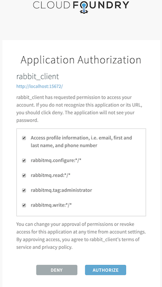
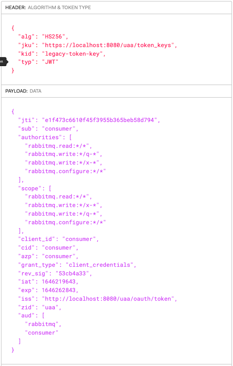

<!--
Copyright (c) 2007-2025 Broadcom. All Rights Reserved. The term "Broadcom" refers to Broadcom Inc. and/or its subsidiaries.

All rights reserved. This program and the accompanying materials
are made available under the terms of the under the Apache License,
Version 2.0 (the "License”); you may not use this file except in compliance
with the License. You may obtain a copy of the License at

https://www.apache.org/licenses/LICENSE-2.0

Unless required by applicable law or agreed to in writing, software
distributed under the License is distributed on an "AS IS" BASIS,
WITHOUT WARRANTIES OR CONDITIONS OF ANY KIND, either express or implied.
See the License for the specific language governing permissions and
limitations under the License.
-->

# OAuth 2.0 Authentication Examples

## Overview {#overview}

This tutorial-style guide has two primary goals:

1. Explore how applications and end users can [authenticate](./access-control) with RabbitMQ server using OAuth 2.0 rather than the traditional username/password pairs or x.509 certificates.
2. Explore what it takes to set up RabbitMQ Server with OAuth 2.0 authentication mechanism across several authorization servers.

The guide is accompanied by [a public GitHub repository](https://github.com/rabbitmq/rabbitmq-oauth2-tutorial/tree/next) which hosts all the scripts required to deploy the examples demonstrated on the guide.

## Table of Contents {#toc}

### Basics

* [Prerequisites to follow this guide](#prerequisites)
* [Getting started with UAA and RabbitMQ](#getting-started-with-uaa-and-rabbitmq)

### Management UI Access

* [Access management UI using OAuth 2.0 tokens](#access-management-ui)
* [Service-Provider initiated logon](#service-provider-initiated-logon)
* [Identity-Provider initiated logon](#identity-provider-initiated-logon)

### Using [JWT tokens in several protocols](#access-other-protocols) to access RabbitMQ

* [Management REST API](#management-rest-api)
* [AMQP 0-9-1](#amqp-protocol) (and [scopes for topic exchanges](#using-topic-exchanges) in a separate section)
* [AMQP 1.0](#amqp10-protocol)
* [JMS](#jms-clients)
* [MQTT](#mqtt-protocol)

### Signing Keys, Scope Aliases, Rich Authorization Requests

* [How to Use Advanced OAuth 2.0 Configuration](#advanced-configuration)
* [Using a custom scope field](#using-custom-scope-field)
* [Using multiple asymmetrical signing keys](#using-multiple-asymmetrical-signing-keys)
* [Using scope aliases](#using-scope-aliases)
* [Preferred username claims](#preferred-username-claims)
* [Using Rich Authorization Requests tokens](#use-rar-tokens)

### Examples for Specific OAuth 2.0 Identity Providers

 * [Keycloak](./oauth2-examples-keycloak)
 * [Auth0](./oauth2-examples-auth0)
 * [Microsoft Entra ID](./oauth2-examples-entra-id) (formerly known as Azure Active Directory)
 * [OAuth2 Proxy](./oauth2-examples-proxy)
 * [Okta](./oauth2-examples-okta)
 * [Google](./oauth2-examples-google)  **NOT SUPPORTED**
 * [Multiple OAuth 2.0 servers and/or audiences](./oauth2-examples-multiresource)

### Examples for Tanzu RabbitMQ (commercial-only feature)

 * [Forward proxy](./oauth2-examples-forward-proxy)

## Prerequisites Used by the Examples in This Guide {#prerequisites}

 * Docker must be installed
 * Ruby must be installed
 * make
 * A local clone of a [GitHub repository](https://github.com/rabbitmq/rabbitmq-oauth2-tutorial/tree/next) for branch `next` that contains all the configuration files and scripts used on this example.
 * The following entries must be in your `/etc/hosts` file:

  ```
  127.0.0.1 localhost uaa rabbitmq
  ```


## Getting started with UAA and RabbitMQ {#getting-started-with-uaa-and-rabbitmq}

To demonstrate OAuth 2.0 you need, at least, an OAuth 2.0 authorization server and RabbitMQ appropriately configured for the chosen authorization server. This guide uses [UAA](https://docs.cloudfoundry.org/concepts/architecture/uaa.html) as authorization server to demonstrate basic and advanced configuration to access to the Management UI and various messaging protocols.

This guide also demonstrates how to configure RabbitMQ to use other authorization servers besides [UAA](https://docs.cloudfoundry.org/concepts/architecture/uaa.html) such as [Keycloak](./oauth2-examples-keycloak). The table of content of this guide has the full list of authorization servers.

Run the following two commands to start UAA and RabbitMQ configured for UAA:

  1. `make start-uaa` to get UAA server running
  2. `make start-rabbitmq` to start RabbitMQ server

The last command starts a RabbitMQ with a specific configuration file, [rabbitmq.conf](https://github.com/rabbitmq/rabbitmq-oauth2-tutorial/blob/next/conf/uaa/rabbitmq.conf).

## Access [management UI](./management/) using OAuth 2.0 tokens {#access-management-ui}

The RabbitMQ Management UI can be configured with one of these two login modes:

* [Service-Provider initiated logon](#service-provider-initiated-logon): this is the default and traditional OAuth 2.0 logon mode.
  When the user visits the RabbitMQ Management UI, it shows a button with the label `Click here to logon`. When the user clicks it,
  the logon process starts by redirecting to the configured **authorization server**.
* [Identity-Provider initiated logon](#identity-provider-initiated-logon): this mode is opposite to the previous mode.
  The user must first access the RabbitMQ Management's `/login` endpoint with a token. If the token is valid, the user is allowed to access the RabbitMQ Management UI.
  This mode is very useful for Web sites which allow users to access the RabbitMQ Management UI with a single click.
  The original Web site get a token on user's behalf and redirects the user to the RabbitMQ Management's `/login` endpoint.

### Service-Provider initiated logon {#service-provider-initiated-logon}

The first time an end user arrives to the management UI, they are redirected to the configured OAuth 2.0 provider to authenticate.
Once they successfully authenticate, the user is redirected back to RabbitMQ
with a valid access token. RabbitMQ validates it and identify the user and its permissions from the token.

```plain
    [ UAA ] <----2. auth----    [ RabbitMQ ]
            ----3. redirect-->  [  http    ]
                                  /|\
                                   |
                            1. rabbit_admin from a browser
```

At step 2, if this is the first time the user is accessing RabbitMQ resource, UAA will prompt the user to
authorize RabbitMQ application as shown on the screenshot below.



UAA has previously been configured with two users:

* `rabbit_admin:rabbit_admin`
* and `rabbit_monitor:rabbit_monitor`

:::tip
First visit https://uaa:8443 so that your browser can trust the self-signed
certificate `uua` has. Otherwise, the management UI will fail to connect to
`uaa`.
:::

Now navigating to the [local node's management UI](http://localhost:15672) and login using any of those two users.

This is a token issued by UAA for the `rabbit_admin` user thru the redirect flow you just saw above.
It was signed with the symmetric key.


To configure the RabbitMQ Management UI with OAuth 2.0, the following configuration entries are required
in `rabbitmq.conf`:

```ini
# ...
management.oauth_enabled = true
management.oauth_client_id = rabbit_client_code
auth_oauth2.issuer = https://uaa:8443
# ...
```


### Identity-Provider initiated logon {#identity-provider-initiated-logon}

Like Service-Provider initiated logon, with Idp-initiated logon users get to the RabbitMQ Management UI with a valid token.
The following scenarios are examples of Idp-initiated logon:

* RabbitMQ is behind a web portal which conveniently allow users to navigate directly to RabbitMQ fully authenticated.
* There is an OAuth2 proxy in between users and RabbitMQ which intercepts their requests and forwards them to RabbitMQ inserting the token into the HTTP `Authorization` header.

The latter scenario is demonstrated [here](./oauth2-examples-proxy). The former scenario is covered in the following section.

#### Idp-initiated Logon using the Login Endpoint

A Web portal offers their authenticated users the option to navigate to RabbitMQ
by submitting a form with their OAuth token in the `access_token` form field as provided below:


```plain
    [ Idp | WebPortal ] ----> 2. /login [access_token: TOKEN]----   [ RabbitMQ Cluster ]
              /|\                                                        |       /|\
               |                                                         +--------+
      1. rabbit_admin from a browser                                   3. validate token
```

If the access token is valid, RabbitMQ redirects the user to the **Overview** page.

By default, the RabbitMQ Management UI is configured with **service-provider initiated logon**, to configure **Identity-Provider initiated logon**, the following configuration entries are required in `rabbitmq.conf`:

```ini
# ...
management.oauth_enabled = true
management.oauth_initiated_logon_type = idp_initiated
management.oauth_provider_url = http://localhost:8080
# ...
```

**Important**: when the user logs out, or its RabbitMQ session expires, or the token expires, the user is directed to the
RabbitMQ Management landing page which has a **Click here to login** button.
The user is never automatically redirected back to the url configured in the `auth_oauth2.issuer`.
It is only when the user clicks **Click here to login** , the user is redirected to the configured url in `auth_oauth2.issuer`.

## Using JWT tokens in several protocols to access RabbitMQ {#access-other-protocols}

The following subsections demonstrate how to use access tokens with any messaging protocol and also to access the management HTTP API.

### Management REST api {#management-rest-api}

In this scenario a monitoring agent uses RabbitMQ HTTP API to collect monitoring information.
Because it is not an end user, or human, you refer to it as a *service account*.
This *service account* could be our `mgt_api_client` client you created in UAA with the `monitoring` *user tag*.

This *monitoring agent* would use the *client credentials* or *password* grant flow to authenticate (1) with
UAA and get back a JWT token (2). Once it gets the token, it sends (3) a HTTP request
to the RabbitMQ management endpoint passing the JWT token within the `Authorization` header as a *Bearer token*.

```plain
[ UAA ]                  [ RabbitMQ ]
  /|\                    [  http    ]
    |                          /|\
    |                       3.http://broker:15672/api/overview passing JWT token
    |                           |
    +-----1.auth---------  monitoring agent
    --------2.JWT-------->
```

The following command launches the browser with `mgt_api_client` client with a JWT token previously obtained from UAA:

```bash
make curl-uaa url=http://localhost:15672/api/overview client_id=mgt_api_client secret=mgt_api_client
```


### AMQP protocol {#amqp-protocol}

An application connects to RabbitMQ using AMQP protocol and presents a JWT Token as a credential.
The application you are going to use is [PerfTest](https://github.com/rabbitmq/rabbitmq-perf-test) which is not an OAuth 2.0 aware application.
OAuth 2.0-aware application is covered in scenario four.

Instead you are launching the application with a token that you have previously obtained from UAA. This is just to probe AMQP access with a JWT Token. Needless to say that the application should instead obtain the JWT Token prior to connecting to RabbitMQ and it should also be able to refresh it before reconnecting. RabbitMQ validates the token before accepting it. If the token has expired, RabbitMQ will reject the connection.


First of all, an application which wants to connect to RabbitMQ using Oauth 2.0 must present a
valid JWT token. To obtain the token, the application must first authenticate (`1.`) with UAA. In case of a successful
authentication, it gets back a JWT token (`2.`) which uses it to connect (`3.`) to RabbitMQ.


```plain
[ UAA ]                  [ RabbitMQ ]
  /|\                    [  amqp    ]
    |                          /|\
    |                       3.connect passing JWT
    |                           |
    +-----1.auth---------  amqp application
    --------2.JWT-------->
```

You have previously configured UAA with these 2 OAuth 2.0 clients:

 * `consumer`
 * `producer`

In order to get a JWT token, an OAuth 2.0 client must be used.
Applications use the `Oauth client grant flow` to obtain a JWT token.

This the token issued by UAA for the `consumer` OAuth 2.0 client.



To launch the consumer application invoke the following command:

```bash
make start-perftest-consumer
```

To see consumer logs:

```bash
docker logs consumer -f
```

To launch the producer application invoke the following command:

```bash
make start-perftest-producer
```

To inspect producer logs:

```bash
docker logs producer -f
```


To stop all the applications call the following command:

```bash
make stop-all-apps
```


### JMS protocol {#jms-clients}

In this use case you are demonstrating a basic JMS application which reads, via an environment variable (`TOKEN`),
the JWT token that will use as password when authenticating with RabbitMQ.

It is **critically important** to grant the required permission to the *exchange* `jms.durable.queues`.

Applications which send JMS messages require of these permissions:

* `rabbitmq.configure:*/jms.durable.queues`
* `rabbitmq.write:*/jms.durable.queues`
* `rabbitmq.read:*/jms.durable.queues`

Those permissions grant access on all virtual hosts.

Before testing a publisher and a subscriber application you need to build a local image for the
basic jms application by invoking this command:

```bash
make build-jms-client
```

To test a JMS application sending a message and authenticating via OAuth 2.0 run this command:

```bash
make start-jms-publisher
```

It sends a message to a queue called `q-test-queue`

Applications which subscribe to a JMS queue require of these permissions:

 * `rabbitmq.write:*/jms.durable.queues`

Those permissions grant access to all virtual hosts.

To test a JMS application subscribing to a queue and authenticating via OAuth 2.0 run this command:

```bash
make start-jms-subscriber
```

It subscribes to a queue called `q-test-queue`

### MQTT protocol {#mqtt-protocol}

This scenario explores the use case where you authenticate with a JWT token to RabbitMQ MQTT port.

Note: in this example, RabbitMQ is already configured with the [`rabbitmq_mqtt` plugin](./mqtt).

This is no different than using AMQP or JMS protocols, all that matters is to pass an empty username and a JWT token as password.
However, **what it is really different** is how you encode the permissions. In this use case you are going to proceed as you did it in the previous use case where you handcrafted the JWT token rather than requesting it to UAA. Here is the the scopes required to publish
a message to a mqtt topic ([scopes-for-mqtt.json](https://github.com/rabbitmq/rabbitmq-oauth2-tutorial/blob/next/jwts/scopes-for-mqtt.json))

```javascript
{
  "scope": [
    "rabbitmq.write:*/*/*",
    "rabbitmq.configure:*/*/*",
    "rabbitmq.read:*/*/*"

  ],
  "extra_scope": "rabbitmq.tag:management",
  "aud": [
    "rabbitmq"
  ]
}
```

`rabbitmq.write:*/*/*` means allow write operation on a any vhost, on any exchange and any topic. In fact,
it is any "routing-key" because that is translated to a topic/queue.

You are going to publish a mqtt message by running the following command. If you have not run any of the
previous use cases, you need to launch rabbitmq first like this `make start-rabbitmq`.

```bash
make start-mqtt-publish TOKEN=$(bin/jwt_token scopes-for-mqtt.json legacy-token-key private.pem public.pem)
```

> IMPORTANT: If you try to access the Management UI and authenticate with UAA using rabbit_admin you
wont be able to do bind a queue with routing_key `test` to the `amq.topic` exchange because that user
in UAA does not have the required permissions. In our handcrafted token, you have granted ourselves the right permissions/scopes.

### AMQP 1.0 protocol {#amqp10-protocol}

In this use case you are demonstrating a basic AMQP 1.0 application which reads a JWT token from the `PASSWORD` environment variable.
The application then uses the token as a password when authenticating with RabbitMQ.

Before testing a publisher and a subscriber application you need to build a local image for the
basic AMQP 1.0 application by invoking this command:
```bash
make build-amqp1_0-client
```

Launch RabbitMQ with the following command. It will start RabbitMQ configured with UAA as its authorization server:
```bash
make start-rabbitmq
```

Launch UAA:
```bash
make start-uaa
```

And send a message. It uses the *client_id*  `jms_producer`, declared in UAA, to obtain a token:
```bash
make start-amqp1_0-publisher
```

## Using Topic Exchanges {#using-topic-exchanges}

This section explains what scopes will be necessary for applications that use topic exchanges.

:::important

None of the users and/or clients declared in any of authorization servers provided by this tutorial have the
appropriate scopes for topic exchanges. In the [MQTT](#mqtt-protocol) section, the application used a hand-crafted token
with appropriate the scopes because that protocol's routing is entirely topics-based.

:::

To bind and/or unbind a queue to/from a topic exchange, you need to have the following scopes:

<table>
  <caption>For consumers</caption>
  <thead>
    <tr>
      <td>Permission</td>
      <td>Example</td>
    </tr>
  </thead>

  <tbody>
    <tr>
      <td>**write** permission on the queue and routing key -> `rabbitmq.write:<vhost>/<queue>/<routingkey>`</td>
      <td>`rabbitmq.write:*/*/*`</td>
    </tr>
    <tr>
      <td>**read** permission on the exchange and routing key -> `rabbitmq.write:<vhost>/<exchange>/<routingkey>`</td>
      <td>`rabbitmq.read:*/*/*`</td>
    </tr>
  </tbody>
</table>

<table>
  <caption>For publishers</caption>
  <thead>
    <tr>
      <td>Permission</td>
      <td>Example</td>
    </tr>
  </thead>

  <tbody>
    <tr>
      <td>**write** permission on the exchange and routing key -> `rabbitmq.write:<vhost>/<exchange>/<routingkey>`</td>
      <td>`rabbitmq.write:*/*/*`</td>
    </tr>
  </tbody>
</table>


OAuth 2.0 authorisation backend supports variable expansion when checking permission on topics.
It supports any JWT claim whose value is a plain string and the `vhost` variable.

For example, if a user has connected with the token below against the vhost `prod`,
they should have write permission to send to any exchange starting with `x-prod-`
and any routing key starting with `u-bob-`:

```json
{
  "sub" : "bob",
  "scope" : [ "rabbitmq.write:*/q-{vhost}-*/u-{sub}-*" ]
}
```

## Advanced OAuth 2.0 Configuration Topics {#advanced-configuration}

### Using a Custom Scope Field {#using-custom-scope-field}

There are some authorization servers which cannot include RabbitMQ scopes into the standard
JWT `scope` field. Instead, they can include RabbitMQ scopes in a custom JWT scope of their choice.

It is possible to configure RabbitMQ with a different field to look for scopes as shown below:

```ini
...
auth_oauth2.additional_scopes_key = extra_scope
...
```

To test this feature you are going to build a token, sign it and use it to hit one of the RabbitMQ management endpoints.
The command below allows us to hit any management endpoint, in this case it is the `overview`, with a token.

```bash
make curl-with-token URL=http://localhost:15672/api/overview TOKEN=$(bin/jwt_token scope-and-extra-scope.json legacy-token-key private.pem public.pem)
```


You use the python script `bin/jwt_token.py` to build the minimal JWT token possible that RabbitMQ is able to
validate which is:

```javascript
{
  "scope": [

  ],
  "extra_scope": [
    "rabbitmq.tag:management"
  ],
  "aud": [
    "rabbitmq"
  ]
}
```

### Using Multiple Asymmetrical Signing Keys {#using-multiple-asymmetrical-signing-keys}

This scenario explores the use case where JWT tokens may be signed by different asymmetrical signing keys.

There are two ways to configure RabbitMQ with multiple signing keys:

 * **Statically** configure them via `rabbitmq.conf` as shown in the [plugin documentation page](./oauth2#configure-signing-keys).
 * **Dynamically** add the keys to a running RabbitMQ node without having to restart it.

First you add a second signing key called `legacy-token-2-key` whose public key is `conf/public-2.pem`:

```bash
docker exec -it rabbitmq rabbitmqctl add_signing_key legacy-token-2-key --pem-file=/conf/public-2.pem
Adding OAuth signing key "legacy-token-2-key" filename: "/conf/public-2.pem"
```

And then you issue a token using the corresponding private key and use it to access the management endpoint `/api/overview`.

```bash
make curl-with-token URL=http://localhost:15672/api/overview TOKEN=$(bin/jwt_token scope-and-extra-scope.json legacy-token-2-key private-2.pem public-2.pem)
```

`bin/jwt_token` searches for private and public key files under the `conf` directory and jwt files under `jwts`.


### Using Scope Aliases {#using-scope-aliases}

This example demonstrates how to use custom scopes with RabbitMQ.

**UAA** identity provider has been configured with two clients (`producer_with_roles`
and `consumer_with_roles`) with the following custom scopes:

  `producer_with_roles` with
    - `api://rabbitmq:producer`.

  `consumer_with_roles` with
    - `api://rabbitmq:Read.All`.
    - `api://rabbitmq:Write.All`.
    - `api://rabbitmq:Configure.All`.
    - `api://rabbitmq:Administrator`.

For more information about scope aliases, check out
the [section](./oauth2#scope-aliases) that explains it in more detail.

#### How to Configure Scope Aliases

This is the configuration required to map those custom scopes to RabbitMQ scopes.

:::tip
Since RabbitMQ 4.1, it is possible to configure **scope aliases** using the [ini-like](./configure#config-file) configuration style. Earlier versions only supported
the legacy Erlang-style.
:::

```ini
auth_oauth2.scope_aliases.1.alias = api://rabbitmq:Read.All
auth_oauth2.scope_aliases.1.scope = rabbitmq.read:*/*

auth_oauth2.scope_aliases.2.alias = api://rabbitmq:Write.All
auth_oauth2.scope_aliases.2.scope = rabbitmq.write:*/*

auth_oauth2.scope_aliases.3.alias = api://rabbitmq:Configure.All
auth_oauth2.scope_aliases.3.scope = rabbitmq.configure:*/*

auth_oauth2.scope_aliases.3.alias = api://rabbitmq:Administrator
auth_oauth2.scope_aliases.3.scope = rabbitmq.tag:administrator

auth_oauth2.scope_aliases.4.alias = api://rabbitmq:producer
auth_oauth2.scope_aliases.4.scope = rabbitmq.read:*/* rabbitmq.write:*/* rabbitmq.configure:*/* rabbitmq.tag:management

```


#### RabbitMQ Configuration

In the OAuth 2.0 tutorial repository, there are two RabbitMQ configuration files ready to be used, for UAA:

* [conf/uaa/advanced-scope-aliases.config](https://github.com/rabbitmq/rabbitmq-oauth2-tutorial/blob/next/conf/uaa/advanced-scope-aliases.config):
  configures a set of scope aliases.
* [conf/uaa/rabbitmq.conf](https://github.com/rabbitmq/rabbitmq-oauth2-tutorial/blob/next/conf/uaa/rabbitmq.conf):
  configure the rest of oauth2 configuration in addition to configuring `extra_scope` as another claim from where to read scopes from


#### Demo 1: Launch RabbitMQ with custom scopes in scope field

To launch RabbitMq with scope mappings and with *custom scopes* in the `scope` field you run the following command:

```bash
ADVANCED=advanced-scope-aliases.config make start-rabbitmq
```

This command will stop RabbitMQ if it is already running.

Launch a producer application with the client `producer_with_roles`

```bash
make start-perftest-producer PRODUCER=producer_with_roles
```

To inspect the logs:

```bash
docker logs producer_with_roles -f
```

Launch a consumer application with the client `consumer_with_roles`

```bash
make start-perftest-consumer CONSUMER=consumer_with_roles
```

To check the logs : docker logs consumer_with_roles -f

Access management api with the client `producer_with_roles`

```bash
make curl url=http://localhost:15672/api/overview client_id=producer_with_roles secret=producer_with_roles_secret
```

To stop the perf-test applications run :

```bash
make stop-perftest-producer PRODUCER=producer_with_roles
make stop-perftest-consumer CONSUMER=consumer_with_roles
```

#### Demo 2: Launch RabbitMQ with custom scopes in extra scope field

To launch RabbitMq with scope mappings and with *custom scopes* in the `extra_scope` you run the following command:

```bash
make start-rabbitmq
```

This command will stop RabbitMQ if it is already running

You cannot use UAA to issue the tokens because you cannot configure UAA to use a custom field for scopes.
Instead you are going to issue the token ourselves with the command `bin/jwt_token`.

Launch a producer application with the token [producer-role-in-scope.json](https://github.com/rabbitmq/rabbitmq-oauth2-tutorial/blob/next/jwts/producer-roles-in-extra-scope.json):

```bash
make start-perftest-producer-with-token PRODUCER=producer_with_roles TOKEN=$(bin/jwt_token producer-role-in-extra-scope.json legacy-token-key private.pem public.pem)
```

To inspect the logs:

```bash
docker logs producer_with_roles -f
```

Launch a consumer application with the token [consumer-roles-in-extra-scope.json](https://github.com/rabbitmq/rabbitmq-oauth2-tutorial/blob/next/jwts/consumer-roles-in-extra-scope.json):

```bash
make start-perftest-consumer-with-token CONSUMER=consumer_with_roles TOKEN=$(bin/jwt_token consumer-roles-in-extra-scope.json legacy-token-key private.pem public.pem)
```

Access management api with the token [producer-roles-in-extra-scope.json](https://github.com/rabbitmq/rabbitmq-oauth2-tutorial/blob/next/jwts/producer-roles-in-extra-scope.json)

```bash
make curl-with-token URL="http://localhost:15672/api/overview" TOKEN=$(bin/jwt_token producer-roles-in-extra-scope.json legacy-token-key private.pem public.pem)
```

To stop the `perf-test` applications, run:

```bash
make stop-perftest-producer PRODUCER=producer_with_roles
make stop-perftest-consumer CONSUMER=consumer_with_roles
```

### Preferred username claims {#preferred-username-claims}

RabbitMQ needs to figure out the username associated to the token so that it can display it in the Management UI.
By default, RabbitMQ will first look for the `sub` claim and if it is not found it uses the `client_id`.

Most authorization servers return the user's GUID in the `sub` claim rather than the actual user's username or email address, anything the user can relate to. When the `sub` claim does not carry a *user-friendly username*, you can configure one or several claims to extract the username from the token.

Given this configuration:

```ini
...
auth_oauth2.resource_server_id = rabbitmq
auth_oauth2.preferred_username_claims.1 = user_name
auth_oauth2.preferred_username_claims.2 = email
...
```

RabbitMQ would first look for the `user_name` claim and if it is not found it looks for `email`. Else it uses its default lookup mechanism which first looks for `sub` and then `client_id`.


### Use Rich Authorization Request Tokens {#use-rar-tokens}

The [Rich Authorization Request](https://oauth.net/2/rich-authorization-requests/) extension provides a way for
OAuth 2.0 clients to request fine-grained permissions during an authorization request.
It moves away from the concept of scopes that are text labels and instead
defines a more sophisticated permission model.

RabbitMQ supports JWT tokens compliant with the extension. Below is a sample example section of JWT token:

```javascript
{
  "authorization_details": [
    { "type" : "rabbitmq",
      "locations": ["cluster:finance/vhost:primary-*"],
      "actions": [ "read", "write", "configure"  ]
    },
    { "type" : "rabbitmq",
      "locations": ["cluster:finance", "cluster:inventory", ],
      "actions": ["tag:administrator" ]
    }
  ]
}
```

*Get the environment ready*

To demonstrate this new capability you have to deploy RabbitMQ with the appropriate configuration file
under [conf/uaa/rabbitmq-for-rar-tokens.config](https://github.com/rabbitmq/rabbitmq-oauth2-tutorial/blob/next/conf/uaa/rabbitmq-for-rar-tokens.config).

```bash
export CONFIG=rabbitmq-for-rar-tokens.config
make start-rabbitmq
```

**NOTE**: You do not need to run any OAuth 2.0 server like UAA. This is because you are creating a token and signing it using the same
private-public key pair RabbitMQ is configured with.

*Use a Rich Authorization Token to access the management HTTP API*

You are going use this token [jwts/rar-token.json](https://github.com/rabbitmq/rabbitmq-oauth2-tutorial/blob/next/jwts/rar-token.json) to access an endpoint of the Management HTTP API.

```bash
make curl-with-token URL=http://localhost:15672/api/overview TOKEN=$(bin/jwt_token rar-token.json legacy-token-key private.pem public.pem)
```

Note: You are using curl to go to the URL using a TOKEN which you have built using the command bin/jwt_token which takes the JWT payload, the name of the signing key and the private and public certificates to sign the token

*Use a Rich Authorization Token to Application authentication and authorization*

This time, You are going to use the same token you used in the previous section to access the AMQP protocol via the PerfTest tool which acts as a AMQP producer application:

```bash
make start-perftest-producer-with-token PRODUCER=producer_with_roles TOKEN=$(bin/jwt_token rar-token.json legacy-token-key private.pem public.pem)
```

The command above launches the application in the background, you can check the logs by running this command:
```bash
docker logs producer_with_roles -f
```

For more information on this new capability check out the [OAuth 2 guide](./oauth2#rich-authorization-request).
