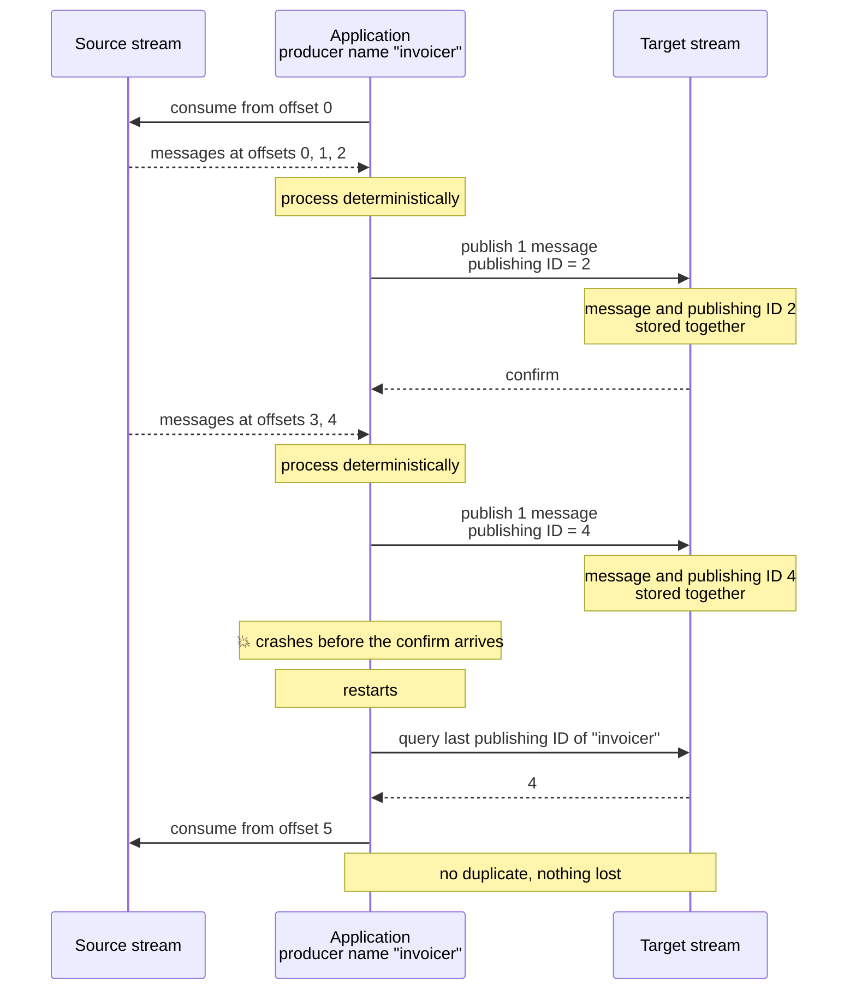

<!--
Copyright (c) 2005-2026 Broadcom. All Rights Reserved. The term "Broadcom" refers to Broadcom Inc. and/or its subsidiaries.

All rights reserved. This program and the accompanying materials
are made available under the terms of the under the Apache License,
Version 2.0 (the "License”); you may not use this file except in compliance
with the License. You may obtain a copy of the License at

https://www.apache.org/licenses/LICENSE-2.0

Unless required by applicable law or agreed to in writing, software
distributed under the License is distributed on an "AS IS" BASIS,
WITHOUT WARRANTIES OR CONDITIONS OF ANY KIND, either express or implied.
See the License for the specific language governing permissions and
limitations under the License.
-->

# Effectively-Once Stream Processing

## Overview {#overview}

Many stream applications are a *read-process-write* loop: they consume messages from one stream, compute something from them, and publish the result to another stream.

This guide explains how to make such a loop **effectively-once**: a crash at any point never produces a duplicate result and never loses one.
Effectively-once is what other stream processing systems, including Apache Kafka®, call *exactly-once* — see below for why this guide uses the more precise name.
It uses only the [RabbitMQ Stream protocol](./stream) and two features that already exist: stream offsets and [deduplication of published messages](./streams#deduplication-published-messages).

## The Problem {#problem}

A read-process-write application has to remember how far it has got in the source stream — its *resume point* — so that it can carry on from there after a restart.
The usual way is [server-side offset tracking](./streams#offset-tracking): the application tells the broker the offset of the last message it processed, the broker stores that offset in the source stream, and the application asks for it again on startup.
An external store, such as a database, amounts to the same thing.

Either way, storing the offset is a **second write**, separate from publishing the result, and a crash can land in between the two:

* **Publish the result, then store the offset.** If the application crashes in between, it restarts from the offset it stored earlier, re-processes the same source messages and publishes the result a second time. This is *at-least-once*: duplicates.
* **Store the offset, then publish the result.** If the application crashes in between, it restarts past source messages whose result was never published. This is *at-most-once*: lost results.

Retrying more carefully does not help, because after a restart the application cannot tell which of the two writes made it.

## The Idea {#idea}

Make the resume point part of the result.

When publishing the result to the target stream, use the **offset of the last source message that was processed** as the **[publishing ID](./streams#publishing-id)** of that result.

This works because both sides fit together naturally:

* Stream offsets are, by definition, monotonically increasing.
* Publishing IDs must be a strictly increasing sequence, and [gaps are allowed](./streams#deduplication-published-messages). This matters here: a processing step usually advances the offset by more than one, and consecutive messages in a stream do not necessarily have consecutive offsets.

Three things follow from it:

1. There is only **one** write per processing step, so there is nothing that can get out of sync.
2. The broker's deduplication **discards any result that is published again** after a restart, because its publishing ID is not greater than the one the broker already stored.
3. The publishing ID that the broker stored **is** the resume point. On startup, ask the broker for the last publishing ID of the producer name and resume consuming the source stream from the next offset.

:::note Effectively-once, not exactly-once execution

"Effectively-once" describes the **effect** on the target stream: the result appears there exactly once, never duplicated, never lost.
It does not mean the processing step executes exactly one time.
After a crash, the application may run it again for source messages it already produced a result for — this is why [determinism](#requirements) matters: re-running it has to produce the same result, so the broker's deduplication can recognize it as the same result and discard it.

Other stream processing systems have the same characteristic under a different name.
Kafka's transactional exactly-once semantics, for example, can also re-execute a processing step after a crash — what is guaranteed is the effect it commits downstream, not the number of times it runs.
Effectively-once is the more precise name for that guarantee.

:::



## Why the Result and the Resume Point Are Stored Together {#atomicity}

The guarantee rests on the broker storing the message and its publishing ID atomically.
It does.

A stream is a sequence of *chunks* written to [segment files](./stream-filtering#on-disk-stream-layout).
A chunk holds a batch of messages plus a small trailer, and the highest publishing ID of every producer that contributed to that chunk is recorded in the trailer.
The whole chunk — header, messages and trailer — is written in a single write, and a chunk only becomes part of the stream once its index entry is in place.
So a crash either leaves both the message and its publishing ID in the stream, or neither.

After a restart the broker rebuilds its publishing IDs by reading them back out of the stream itself.
There is no separate store that could drift from the messages.

## Recovery After a Crash {#recovery}

On startup, the application:

1. Creates a producer on the target stream with the same producer name as before.
2. Asks the broker for the last publishing ID of that producer name.
3. Resumes consuming the source stream at that offset plus one. See the note below for the special case of `0`.

The interesting case is a crash between publishing a result and receiving its confirmation, because the application cannot know whether the result was stored.
It does not need to know.
Both outcomes end up correct:

* The result **was** stored. The broker returns its publishing ID, the application resumes past those source messages, and the result exists exactly once.
* The result was **not** stored. The broker returns the previous publishing ID, the application re-processes the same source messages and publishes the result again — this time for real.

If the application re-processes source messages it had already published a result for, that result is published again with an already used publishing ID and the broker discards it, while still confirming it.

:::note

A broker that returns `0` for the last publishing ID is either reporting that this producer name has never published, or that its last publishing ID was genuinely `0` (offset `0` of the source stream).
The two cannot be told apart, so treat `0` as "start from the beginning of the source stream".
Re-processing offset `0` is harmless: the result is published with publishing ID `0`, which the broker discards.

:::

## Processing Several Source Messages at a Time {#batching}

The loop does **not** have to process one source message at a time.
It can consume and process any number of source messages, as long as it publishes **exactly one** message to the target stream for them, using the offset of the last one as the publishing ID.

RabbitMQ (currently) has no way to publish several messages atomically, so a result that spans several messages could be half-written by a crash, and the publishing ID would no longer be a reliable resume point.
If several logical records have to be produced together, put them into a single [message](https://docs.oasis-open.org/amqp/core/v1.0/os/amqp-core-messaging-v1.0-os.html#section-message-format).

## Requirements {#requirements}

Effectively-once holds only if all of the following are true.

* **Exactly one message is published to the target stream per processing step.** See [above](#batching).
* **Processing is deterministic.** The same source messages must always produce the same result, because after a crash the application may process them again. Avoid timestamps, random values and lookups whose answers change over time in the result.
* **Publishing to the target stream is the only side effect.** Deduplication protects the target stream, nothing else. A processing step that also writes to a database or calls an HTTP API can repeat that side effect after a crash.
* **Only one instance publishes under a given producer name at a time.** Deduplication does not support concurrent publishing under the same name. Use the [single active consumer](./streams#single-active-consumer) feature on the source stream to make sure only one instance is processing.
* **The producer name is stable across restarts and unique per target stream.** Publishing IDs are tracked per stream and producer name. Use a descriptive name such as `invoicer`, not a value that changes on every start.
* **Results are published in order and none is skipped.** Publishing the next result moves the resume point past the previous one, so a result that fails to be published must not be silently dropped. Configure the producer to keep retrying rather than to time out, and stop the loop on a permanent publishing error.

:::note

Combining this pattern with the single active consumer feature needs one extra step in most client libraries.
A single active consumer has a name, and a name usually turns on automatic server-side [offset tracking](./streams#offset-tracking), which would make the instance resume from the tracked offset instead of the one derived from the last publishing ID.
Turn automatic offset tracking off, and compute the start offset from the last publishing ID whenever the instance becomes the active one.
With the stream Java client this means `noTrackingStrategy()` plus a `consumerUpdateListener` that returns that offset.

:::

## Use Cases {#use-cases}

The pattern fits whenever a processing step naturally produces a single result message.

* **Windowed aggregation.** Read all events of a time window or a fixed count and publish one aggregate: a per-minute rollup, an hourly summary, a running total. Many messages in, one message out.
* **Batching for a slower downstream stage.** Read many small events and publish one envelope message, so the next stage does fewer and larger units of work.
* **Compacting a change stream.** Read a burst of updates for the same entity and publish only the resulting state, instead of every intermediate step.
* **Transformations where duplicates are expensive.** Normalize, re-encode or redact each source message and publish one result. A duplicate in the target stream is seen by every downstream consumer, and in financial or billing pipelines it is double counted.
* **Multi-stage pipelines.** Each stage is its own read-process-write loop with its own producer name. If every stage is effectively-once, the pipeline is.

## Java Example {#java-example}

The following example uses the [stream Java client](https://github.com/rabbitmq/rabbitmq-stream-java-client).
It aggregates source messages in batches of ten and publishes one result per batch.

```java
Environment environment = Environment.builder().build();

Producer producer = environment.producerBuilder()
    .stream("target-stream")
    .name("invoicer")                  // a name activates deduplication
    .confirmTimeout(Duration.ZERO)     // never stop retrying
    .build();

// The last publishing ID is the offset of the last source message whose
// result is stored in the target stream.
long lastPublishingId = producer.getLastPublishingId();
OffsetSpecification start = lastPublishingId == 0
    ? OffsetSpecification.first()      // nothing processed yet, or offset 0 was:
                                       // re-processing it is safe
    : OffsetSpecification.offset(lastPublishingId + 1);

List<Message> window = new ArrayList<>();

environment.consumerBuilder()
    .stream("source-stream")
    .offset(start)
    .messageHandler((context, message) -> {
        window.add(message);
        if (window.size() == 10) {
            // Deterministic: the same window always produces the same result.
            byte[] result = aggregate(window);
            Message out = producer.messageBuilder()
                // the offset of the last source message in this window
                .publishingId(context.offset())
                .addData(result)
                .build();
            producer.send(out, confirmationStatus -> { });
            window.clear();
        }
    })
    .build();
```

Note that the application stores no offset of its own, and does not use [server-side offset tracking](./streams#offset-tracking) for the source stream.
The publishing ID in the target stream is the only resume point, which is what makes the loop effectively-once.

A partially filled window at the moment of a crash is simply consumed again after the restart, because its source messages are past the last publishing ID.

## Limitations {#limitations}

* **Keep the number of producer names per stream small.** A stream tracks the publishing IDs of at most 255 producer names.

