<!--
Copyright (c) 2005-2025 Broadcom. All Rights Reserved. The term "Broadcom" refers to Broadcom Inc. and/or its subsidiaries.

All rights reserved. This program and the accompanying materials
are made available under the terms of the under the Apache License,
Version 2.0 (the "License”); you may not use this file except in compliance
with the License. You may obtain a copy of the License at

https://www.apache.org/licenses/LICENSE-2.0

Unless required by applicable law or agreed to in writing, software
distributed under the License is distributed on an "AS IS" BASIS,
WITHOUT WARRANTIES OR CONDITIONS OF ANY KIND, either express or implied.
See the License for the specific language governing permissions and
limitations under the License.
-->

import Tabs from '@theme/Tabs';
import TabItem from '@theme/TabItem';

# Stream Filtering

RabbitMQ can deliver the same messages in a stream to multiple consumers.
Since some consumers need only specific subsets of messages, RabbitMQ provides filtering features that allow consumers to receive only the messages they're interested in.

## On Disk Stream Layout

When messages are appended to a stream, RabbitMQ assigns each message a monotonically increasing offset.

The on disk layout of a stream looks as follows:


A stream consists of many segment files.
There is one index file per segment file.
The index file contains a mapping from an offset and timestamp to a position in the segment file.
When a client application provides a stream offset, the index file enables RabbitMQ to quickly locate the corresponding message in the segment file.

Each segment file is made up of chunks and each chunk is made up of messages.
The number of messages in a chunk depends on the ingress rate, i.e. how fast messages are published to the stream.
If the ingress rate is high, there are many messages within a chunk.
If the ingress rate is low, it can happen that each chunk contains only a single message.

## Filter Stages Overview

Stream messages can be filtered at three distinct stages, highlighted in green below.
Each filtering stage is optional.
Without any filters configured, clients consume all messages from the stream they attach to.

```mermaid
graph TB
    subgraph "RabbitMQ Server"
        Disk[(RabbitMQ Stream<br/>On Disk)]
        BloomFilter{{"🔍 Stage 1<br/>Bloom Filter<br/>Does Chunk Match?"}}
        StreamProtocol["RabbitMQ Stream Protocol<br/>sends chunk"]
        AMQP1[AMQP 1.0]
        AMQPOther[AMQP 0.9.1 / STOMP]
        Memory["RabbitMQ parses<br/>all messages in chunk"]
        AMQPFilter{{"🔍 Stage 2<br/>AMQP Filter Expressions<br/>(Property or SQL)<br/>Does Message Match?"}}
        Skip[Chunk Skipped]
        Discard[Message Skipped]
    end

    Network(("📡 Network<br/>Transmission"))

    subgraph "Client"
        ClientFilter{{"🔍 Stage 3<br/>Client-side Filtering<br/>Does Message Match?"}}
        ProcessedMessages[Client App<br/>processes message]
        MessageSkipped[Message Skipped]
    end

    Disk --> BloomFilter
    BloomFilter -->|Yes| StreamProtocol
    BloomFilter -->|Yes| Memory
    BloomFilter -->|No| Skip
    StreamProtocol --> Network
    Memory --> AMQP1
    Memory --> AMQPOther
    AMQP1 --> AMQPFilter
    AMQPOther --> Network
    AMQPFilter -->|Yes| Network
    AMQPFilter -->|No| Discard
    Network --> ClientFilter
    ClientFilter -->|Yes| ProcessedMessages
    ClientFilter -->|No| MessageSkipped

    classDef filterStage fill:#e1f5e1,stroke:#4caf50,stroke-width:3px
    classDef protocol fill:#fff3e0,stroke:#ff9800,stroke-width:2px
    classDef skip fill:#ffebee,stroke:#f44336,stroke-width:2px

    class BloomFilter,AMQPFilter,ClientFilter filterStage
    class Disk,StreamProtocol,AMQP1,AMQPOther,Memory,Network,ProcessedMessages protocol
    class Skip,Discard,MessageSkipped skip
```



## Stage 1: Bloom Filter

A [Bloom filter](https://en.wikipedia.org/wiki/Bloom_filter) is a space-efficient probabilistic data structure that is used to test whether an element is a member of a set. False positive are possible, but false negatives are not.

Bloom filtering works as follows:
Publishers can optionally assign a filter value (string) to each message.
Before writing a chunk of messages to disk, RabbitMQ collects all these filter values into a Bloom filter data structure and stores it in the chunk's header.

A consumer can optionally provide one or multiple filter values when attaching to a stream.
When reading a chunk header including the Bloom filter from disk, RabbitMQ evaluates efficiently whether **any** of the filter values provided by the consumer matches any message in the chunk. If there is at least one match, RabbitMQ will read all messages in that chunk from disk.

:::tip

**Bloom filters are highly efficient.**

When a Bloom filter evaluates to false, RabbitMQ skips the entire chunk — it doesn't read messages from disk, parse them into memory, or send them to the client.
This saves resources across the entire system: server CPU, memory, and disk I/O; network bandwidth; and client CPU and memory.

:::

Bloom filters are the most efficient way to filter.
However, since they operate on the chunk level (rather than the message level) and since false positives can occur, Bloom filters are most commonly used together with [Stage 2: AMQP Filter Expressions](#stage-2-amqp-filter-expressions) or [Stage 3: Client-Side Filtering](#stage-3-client-side-filtering).

By default, when a consumer sets a Bloom filter, RabbitMQ does not deliver messages that lack a filter value.
To change this behavior and receive also messages without a filter value, set the AMQP 1.0 filter `rabbitmq:stream-match-unfiltered` or the AMQP 0.9.1 consumer argument `x-stream-match-unfiltered` to `true`.

As described in [Declaring a RabbitMQ stream](./streams#declaring), the `x-stream-filter-size-bytes` argument can be configured to set the Bloom filter size.
The default of 16 bytes should be sufficient for most use cases.
Configuring a higher value can reduce the false positive rate of the Bloom filter, but leads to more storage overhead.
Increasing the Bloom filter size can make sense if your workload requires a high number of unique filter values (high cardinality), for example the filter value represents a customer ID and each message has a different customer ID.

Bloom filters can be used with AMQP 1.0, AMQP 0.9.1, the RabbitMQ Stream protocol, and STOMP.

For a detailed description of Bloom filters and the RabbitMQ Stream protocol, read the following blog posts:
1. [Stream Filtering](/blog/2023/10/16/stream-filtering)
2. [Stream Filtering Internals](/blog/2023/10/24/stream-filtering-internals)

#### Example: Bloom Filter AMQP 1.0 {#example-bloom-amqp-10}

For the Bloom filtering feature to work, a message must be published with an associated Bloom filter value, specified by the `x-stream-filter-value` message annotation:

<Tabs groupId="languages">
<TabItem value="java" label="Java">
```java
Message message = publisher.message(body)
    .annotation("x-stream-filter-value", "invoices"); // set Bloom filter value
publisher.publish(message, context -> {
    // confirm callback
});
```
</TabItem>

<TabItem value="csharp" label="C#">
```csharp
var message = new AmqpMessage(body);
message.Annotation("x-stream-filter-value", "invoices"); // set Bloom filter value
PublishResult pr = await publisher.PublishAsync(message);
```
</TabItem>

<TabItem value="Python" label="Python">
```python
publisher.publish(
    Message(
        Converter.string_to_bytes(body="myBody"),
        annotations={"x-stream-filter-value": "invoices"}, # set Bloom filter value
    )
```
</TabItem>

<TabItem value="Go" label="Go">
```go
message := amqp.NewMessage(body)
message.Annotations = amqp.Annotations{
    "x-stream-filter-value": "invoices", // set Bloom filter value
}
publishResult, err := publisher.Publish(context.Background(), message)
```
</TabItem>

<TabItem value="Erlang" label="Erlang">
```erlang
Msg = amqp10_msg:set_message_annotations(
        %% set Bloom filter value
        #{<<"x-stream-filter-value">> => <<"invoices>>},
        amqp10_msg:set_application_properties(
          #{<<"category">> => <<"invoices">>},
          amqp10_msg:new(<<"my-tag">>, <<"my-payload">>))),
amqp10_client:send_msg(Sender, Msg),
```
</TabItem>
</Tabs>

A receiver must use a filter with descriptor `rabbitmq:stream-filter`.
This filter accepts a string or a list of strings.
If a list of strings is provided, they are logically concatenated with an `OR` operator, that is, it's enough for one or some of the strings to apply.

Most language examples that follow combine a Bloom filter (Stage 1) with client-side filtering (Stage 3).
The Erlang example shows how to combine a Bloom filter (Stage 1) with an AMQP Filter Expression (Stage 2), such that there is no need for client-side filtering (Stage 3).

<Tabs groupId="languages">

<TabItem value="java" label="Java">
```java
Consumer consumer = connection.consumerBuilder()
    .queue("some-stream")
    .stream()
         // This Bloom filter will be evaluated server-side per chunk (Stage 1).
        .filterValues("invoices", "orders")
        .filterMatchUnfiltered(true)
    .builder()
    .messageHandler((ctx, msg) -> {
        String filterValue = (String) msg.annotation("x-stream-filter-value");
        // This filter will be evaluted client-side per message (Stage 3).
        if ("invoices".equals(filterValue) || "orders".equals(filterValue)) {
            // message processing
        }
        ctx.accept();
    })
    .build();
```
</TabItem>

<TabItem value="csharp" label="C#">
```csharp
IConsumer consumer = await connection.ConsumerBuilder()
    .Queue("some-stream")
    .Stream()
    // This Bloom filter will be evaluated server-side per chunk (Stage 1).
    .FilterValues(["invoices", "orders"])
    .FilterMatchUnfiltered(true)
    .Builder()
    .MessageHandler(async (context, message) => {
        string filterValue = (string)message.Annotation("x-stream-filter-value");
        // This filter will be evaluted client-side per message (Stage 3).
        if (filterValue.Equals("invoices")|| filterValue.Equals("orders"))
        {
            // message processing
        }
        context.Accept();
    }
).BuildAndStartAsync();
```

</TabItem>
<TabItem value="python" label="Python">
```python
class MyMessageHandler(AMQPMessagingHandler):

    def __init__(self):
        super().__init__()

    def on_message(self, event: Event):
        filterValue = event.message.annotations["x-stream-filter-value"]
        ### This filter will be evaluted client-side per message (Stage 3).
        if filterValue == "invoices" or filterValue == "orders":
            ### message processing

        self.delivery_context.accept(event)

stream_address = AddressHelper.queue_address("some-stream")
consumer = connection.consumer(
    stream_address,
    message_handler=MyMessageHandler(),
    ### This Bloom filter will be evaluated server-side per chunk (Stage 1).
    stream_filter_options=StreamOptions(stream_filters=["invoices", "orders"], match_unfiltered=True),
)
```
</TabItem>

<TabItem value="Go" label="Go">
```Go
consumer, err := connection.NewConsumer(context.Background(), qName, &
        StreamConsumerOptions{
            Offset:           &OffsetFirst{},
            // This Bloom filter will be evaluated server-side per chunk (Stage 1).
            Filters:          []string{"invoices", "orders"},
        })

deliveryContext, err := consumer.Receive(context.Background())
var filterValue string
filterValue = deliveryContext.Message().Annotations["x-stream-filter-value"].(string)
// This filter will be evaluted client-side per message (Stage 3).
if filterValue == "orders" || filterValue == "invoices"  {
    // process message ...
}
err = deliveryContext.Accept(context.Background())
```
</TabItem>

<TabItem value="Erlang" label="Erlang">
```erlang
Address = rabbitmq_amqp_address:queue(<<"some-stream">>),
Filter = #{%% This Bloom filter will be evaluated server-side per chunk (Stage 1).
           <<"my Bloom filter">> =>
           #filter{descriptor = <<"rabbitmq:stream-filter">>,
                   value = {utf8, <<"invoices">>}},

           %% This filter will be evaluted server-side per message (Stage 2).
           <<"my AMQP Property filter">> =>
           #filter{descriptor = <<"amqp:application-properties-filter">>,
                   value = {map, [{{utf8, <<"category">>},
                                   {utf8, <<"invoices">>}}]}}},
{ok, Receiver} = amqp10_client:attach_receiver_link(
                   Session, <<"my receiver">>, Address,
                   unsettled, none, Filter),
receive {amqp10_event, {link, Receiver, attached}} -> ok
after 5000 -> exit(missing_attached)
end,

%% No need for client-side filtering (Stage 3) because the server will
%% deliver only messages with category=invoices
ok = amqp10_client:flow_link_credit(Receiver, 100, 50),
receive {amqp10_msg, Receiver, Message} ->
            %% Process message...
            ok = amqp10_client:accept_msg(Receiver, Message)
after 5000 -> exit(missing_msg)
end,
```
</TabItem>
</Tabs>


#### Example: Bloom Filter AMQP 0.9.1 {#example-bloom-amqp-091}

For the Bloom filtering feature to work, a message must be published with an associated Bloom filter value, specified by the `x-stream-filter-value` header:

<Tabs groupId="languages">

<TabItem value="Java" label="Java">
```java
channel.basicPublish(
  "", // default exchange
  "invoices",
  new AMQP.BasicProperties.Builder()
    .headers(Collections.singletonMap(
      // set Bloom filter value
      "x-stream-filter-value", "emea"
    ))
    .build(),
  body
);
```
</TabItem>

</Tabs>

A consumer must use the `x-stream-filter` consumer argument if it wants to receive only messages for the given filter value(s).
This argument accepts a string or an array of strings.
If an array of strings is provided, they are logically concatenated with an `OR` operator, that is, it's enough for one or some of the strings to apply.

<Tabs groupId="languages">

<TabItem value="Java" label="Java">
```java
// Consumer prefetch must be specified when consuming from a stream.
channel.basicQos(100);

channel.basicConsume(
  "invoices",
  false,
  // This Bloom filter will be evaluated server-side per chunk (Stage 1).
  Collections.singletonMap("x-stream-filter", "emea"),
  (consumerTag, message) -> {
    Map<String, Object> headers = message.getProperties().getHeaders();
    // This filter will be evaluted client-side per message (Stage 3).
    if ("emea".equals(headers.get("x-stream-filter-value"))) {
      // message processing ...
    }
    // Ack is required to receive more messages from the stream.
    channel.basicAck(message.getEnvelope().getDeliveryTag(), false);
  },
  consumerTag -> { });
```
</TabItem>

</Tabs>

As shown in the snippet above, there should be some client-side filtering logic as well because server-side Bloom filter can contain false positives and is performed only on the entire chunk level.

#### Example: Bloom Filter Stream Protocol {#example-bloom-stream}

<Tabs groupId="languages">

<TabItem value="Java" label="Java">
```java
Producer producer = environment.producerBuilder()
  .stream("invoices")
  // The Java library will set the Bloom filter value by extracting
  // the value from key "region" in the message's application properties.
  .filterValue(msg -> msg.getApplicationProperties().get("region").toString())  
  .build();
```
</TabItem>

</Tabs>

<Tabs groupId="languages">

<TabItem value="Java" label="Java">
```java
Consumer consumer = environment.consumerBuilder()
  .stream("invoices")
  .filter()
    // This Bloom filter will be evaluated server-side per chunk (Stage 1).
    .values("emea")  
    // This filter will be evaluted client-side per message (Stage 3).
    .postFilter(msg -> "emea".equals(msg.getApplicationProperties().get("region")))  
  .builder()
  .messageHandler((ctx, msg) -> {
    // message processing ...
  })
  .build();
```
</TabItem>

</Tabs>


## Stage 2: AMQP Filter Expressions

AMQP filter expressions are logical statements that consumers provide when attaching to a stream.
RabbitMQ nodes evaluate these expressions against message metadata.
If the message matches, RabbitMQ delivers the message to the client.

The filter syntax is defined in the AMQP 1.0 extension specification [AMQP Filter Expressions Version 1.0 Committee Specification Draft 01](https://docs.oasis-open.org/amqp/filtex/v1.0/csd01/filtex-v1.0-csd01.html).
RabbitMQ supports a subset of this specification as described below.

AMQP filter expressions are either [**Property** Filter Expressions](https://docs.oasis-open.org/amqp/filtex/v1.0/csd01/filtex-v1.0-csd01.html#_Toc67929259) or [**SQL** Filter Expressions](https://docs.oasis-open.org/amqp/filtex/v1.0/csd01/filtex-v1.0-csd01.html#_Toc67929276).
 

:::note

Property Filter Expressions and SQL Filter Expressions are mutually exclusive.
A consumer can define either a Property Filter or SQL Filter, but not both.

:::

AMQP filter expressions enable multiple clients to concurrently consume specific subsets of messages from the same stream while preserving message order.

### Property Filter Expressions

Property filter expressions enable RabbitMQ to match each message's metadata against reference patterns provided by the consumer when attaching to the stream.

RabbitMQ implements:
* [§ 4.2.4 properties filter](https://docs.oasis-open.org/amqp/filtex/v1.0/csd01/filtex-v1.0-csd01.html#_Toc67929270): Applies to the immutable properties section of the message.
* [§ 4.2.5 application-properties filter](https://docs.oasis-open.org/amqp/filtex/v1.0/csd01/filtex-v1.0-csd01.html#_Toc67929271): Applies to the immutable application-properties section of the message.

As described in the specification, prefix and suffix matching is supported using `&p:<prefix>` and `&s:<suffix>` modifiers.


#### Example: Property Filter Expressions

The following example causes RabbitMQ to deliver only messages for which **all** of the following apply:
* field `user-id` is `John`
* field `subject` starts with the prefix `Order`
* the application property key `region` is `emea`

<Tabs groupId="languages">
<TabItem value="java" label="Java">
```java
Consumer consumer = connection.consumerBuilder()
    .stream().filter()
        .userId("John".getBytes(UTF_8))
        .subject("&p:Order")
        .property("region", "emea")
    .stream().builder()
    .queue("my-queue")
    .messageHandler((ctx, msg ) -> {
        // message processing
    })
    .build();
```
</TabItem>

<TabItem value="csharp" label="C#">
```csharp
IConsumer consumer = await connection.ConsumerBuilder().Queue("my-queue").
    MessageHandler((context, message) =>
        {
            // process the messages
        }
    ).Stream().Offset(StreamOffsetSpecification.First).Filter()
    .UserId("John"u8.ToArray())
    .Subject("&p:Order")
    .Property("region", "emea")
    .Stream().Builder()
    .BuildAndStartAsync();
```
</TabItem>

<TabItem value="go" label="Go">
```go
    var subjectPrt = "&p:Order"
    consumer, err := amqpConnection.NewConsumer(context.Background(), "my-queue",
    &rmq.StreamConsumerOptions{
        Offset: &rmq.OffsetFirst{},
        StreamFilterOptions: &rmq.StreamFilterOptions{
            Properties: &amqp.MessageProperties{Subject: &subjectPrt, UserID: []byte("John")},
            ApplicationProperties: map[string]interface{}{"region": "emea"},
            },
    })
```
</TabItem>

<TabItem value="python" label="Python">
```python
   consumer = connection.consumer(
        "my-queue",
        message_handler=MyMessageHandler(),
        consumer_options=StreamConsumerOptions(
            offset_specification=OffsetSpecification.first,
            filter_options=StreamFilterOptions(
                message_properties=MessageProperties(
                    subject="&p:Order",
                    user_id= "John".encode("utf-8"),

                ),
                application_properties={"region": "emea"},
            ),
        ),
    )
```
</TabItem>

<TabItem value="Erlang" label="Erlang">
```erlang
Filter = #{<<"filter-name-1">> =>
           #filter{
              descriptor = <<"amqp:properties-filter">>,
              value = {map, [{{symbol, <<"user-id">>}, {binary, <<"John">>}},
                             {{symbol, <<"subject">>}, {utf8, <<"&p:Order">>}}]}},

           <<"filter-name-2">> =>
           #filter{
              descriptor = <<"amqp:application-properties-filter">>,
              value = {map, [{{utf8, <<"region">>}, {utf8, <<"emea">>}}]}}},

{ok, Receiver} = amqp10_client:attach_receiver_link(
                   Session, <<"my receiver">>, Address,
                   unsettled, none, Filter),
```
</TabItem>

</Tabs>

### SQL Filter Expressions

RabbitMQ supports filtering messages using complex expressions based on SQL WHERE clause syntax.
Consumers provide these SQL statements when attaching to the stream.

SQL Filter Expressions provide a superset of the functionalities provided by Property Filter Expressions.

RabbitMQ supports a subset of the [SQL Filter Expressions syntax](https://docs.oasis-open.org/amqp/filtex/v1.0/csd01/filtex-v1.0-csd01.html#_Toc67929276).
Below, we describe what is currently supported and what is not.

Reserved words and operator names must be written in upper case:
* `AND` `OR`, `NOT`
* `IN`, `IS`, `NULL`, `LIKE`, `ESCAPE`
* `TRUE`, `FALSE`
* `UTC`

#### AMQP 1.0 Message Sections

##### ✅ Supported Sections

- **Header** - `header` or `h` (only `priority` field)
  - Example: `header.priority = 4`
  - Example: `h.priority = 4`

- **Properties** - `properties` or `p`
  - Example: `properties.message_id = 12345`
  - Example: `p.user_id = 0x426F62`
  - Example: `p.to = 'orders'`
  - Example: `p.subject LIKE 'Order%'`
  - Example: `p.reply_to = '/queues/q1'`
  - Example: `p.correlation_id IS NOT NULL`
  - Example: `p.content_type = 'application/json'`
  - Example: `p.content_encoding IN ('gzip', 'zstd', 'deflate')`
  - Example: `p.absolute_expiry_time > UTC()`
  - Example: `p.creation_time < 1753365622460`
  - Example: `p.group_id = 'Group A'`
  - Example: `p.group_sequence % 3 = 0`
  - Example: `p.reply_to_group_id = 'Group B'`

- **Application Properties** - `application_properties` or `a`
  - Example: `application_properties.color = 'blue'` (fully qualified)
  - Example: `a.color = 'blue'` (shorthand)
  - Example: `color = 'blue'` (unqualified fields default to application properties)

##### ❌ Unsupported Sections

- **Header** - Fields other than `priority`
- **Delivery Annotations** - `delivery_annotations` or `d`
- **Message Annotations** - `message_annotations` or `m`
- **Footer** - `footer` or `f`

#### Constants

##### ✅ Supported

- **Integer constants**
  - Example: `age = 25`

- **Decimal and Approximate number constants**
  - Example: `temperature = -5.5`
  - Example: `value = 1.23E6` (scientific notation)

- **Boolean constants**
  - Example: `active = TRUE`
  - Example: `deleted = FALSE`

- **String constants** (single or double quotes)
  - Example: `name = 'Alice'`
  - Example: `city = "New York"`
  - Example: `quote = 'It''s great'` (escaped quotes)
  - Example: `emojis = '😎☀️'` (UTF-8 characters)

- **Binary constants**
  - Example: `properties.message_id = 0x0123456789ABCDEF`

##### ❌ Not Supported

- **Special numeric constants**
  - IEEE 754 infinity value: `INF`
  - IEEE 754 not-a-number value: `NAN`

#### Identifiers

Identifiers refer for example to fields of the properties section or keys of the application properties section.

##### ✅ Supported

- **Regular identifiers**
  - Example: `properties.subject = 'EMEA'`
  - Example: `order_status = 'pending'`

- **Delimited identifiers** (for special characters or reserved words)
  - Example: `[order-status] = 'pending'`
  - Example: `[order status] = 'pending'`
  - Example: `[注文状況] = 'pending'`

##### ❌ Not Supported

- **Composite type references** (array/map access)

#### Unary and Binary Logical Operators

##### ✅ All Supported

- **AND**
  - Example: `header.priority > 4 AND properties.subject = 'orders'`

- **OR**
  - Example: `status = 'new' OR status = 'pending'`

- **NOT**
  - Example: `NOT cancelled`

- **Parentheses for grouping**
  - Example: `(category = 'books' OR category = 'music') AND price < 20`

#### Comparison Operators

##### ✅ All Supported

- **Equality**: `=`
  - Example: `customer_id = 12345`
  
- **Inequality**: `<>` or `!=`
  - Example: `status <> 'cancelled'`
  - Example: `region != 'EU'`

- **Greater than**: `>`
  - Example: `age > 18`

- **Greater than or equal**: `>=`
  - Example: `p.creation_time >= 1753690918262`

- **Less than**: `<`
  - Example: `quantity < 10`

- **Less than or equal**: `<=`
  - Example: `discount <= 0.25`

#### Arithmetic Operators

##### ✅ Supported (for numeric types only)

- **Addition**: `+`
  - Example: `quantity + 5 > stock_level`

- **Subtraction**: `-`
  - Example: `price - discount > 10`

- **Multiplication**: `*`
  - Example: `quantity * price > 100`

- **Division**: `/`
  - Example: `total / quantity < 50`

- **Modulo**: `%`
  - Example: `p.group_sequence % 2 = 0` (even group sequences)

- **Unary plus/minus**: `+`, `-`
  - Example: `balance < +100`
  - Example: `balance < -100`

##### ❌ Not Supported

- **String or symbol concatenation with `+`**
  - Example: `firstname + lastname = 'JohnDoe'`

#### Other Logical Predicates

##### ✅ Supported

- **IS NULL**
  - Example: `p.reply_to IS NULL`
  - Example: `category IS NOT NULL`

- **LIKE** (with `%` and `_` wildcards)
  - Example: `name LIKE 'John%'` (starts with John)
  - Example: `name NOT LIKE 'John%'` (does not start with John)
  - Example: `product LIKE 'John % Doe'` (John Doe with any middle name)
  - Example: `email LIKE '%@example.com'` (ends with @example.com)
  - Example: `code LIKE '___ABC'` (3 characters followed by ABC)

- **LIKE with ESCAPE**
  - Example: `underscored LIKE '\_%' ESCAPE '\'` is true for `'_foo'` and false for `'bar'`

- **IN**
  - Example: `status IN ('new', 'pending', 'processing')`
  - Example: `environment NOT IN ('DEV', 'STAGING')`

##### ❌ Not Supported

- **EXISTS** predicate

#### Functions

##### ✅ Supported

- **UTC()** - returns current UTC time in milliseconds
  - Example: `p.absolute_expiry_time IS NULL OR p.absolute_expiry_time > UTC()` selects non-expired messages

##### ❌ Not Supported

- **LOWER** - lowercase conversion
- **UPPER** - uppercase conversion  
- **LEFT** - left substring
- **RIGHT** - right substring
- **SUBSTRING** - substring extraction
- **DATE** - ISO 8601 date parsing

#### Example: SQL Filter Expressions

The following example causes RabbitMQ to deliver only messages for which **all** of the following apply:
* field `user-id` is `John`
* field `subject` starts with the prefix `Order`
* the application provided key `region` is `emea`

<Tabs groupId="languages">
<TabItem value="Java" label="Java">
```java
Consumer consumer = connection.consumerBuilder()
    .stream().filter()
        .sql("properties.user_id = 'John' AND " +
             "properties.subject LIKE 'Order%' AND " +
             "region = 'emea'")
    .stream().builder()
    .queue("my-queue")
    .messageHandler((ctx, msg ) -> {
        // message processing
    })
    .build();
```
</TabItem>

<TabItem value="csharp" label="C#">
```csharp
IConsumer consumer = await connection.ConsumerBuilder().Queue("my-queue").
    MessageHandler((context, message) =>
        {
            // process the messages
        }
    ).Stream().Offset(StreamOffsetSpecification.First).Filter()
      .Sql("properties.user_id = 'John' AND" 
         + "properties.subject LIKE 'Order%' AND region = 'emea'")
      .Stream().Builder()
    .Stream().Builder()
    .BuildAndStartAsync();
```
</TabItem>

<TabItem value="go" label="Go">
```go
consumer, err := amqpConnection.NewConsumer(context.Background(), "my-queue",
        &rmq.StreamConsumerOptions{
            Offset: &rmq.OffsetFirst{},
            StreamFilterOptions: &rmq.StreamFilterOptions{
                SQL: "properties.user_id = 'John' AND " 
                + "properties.subject LIKE 'Order%' AND region = 'emea'",
            },
        })
```
</TabItem>

<TabItem value="python" label="Python">
```python
consumer = connection.consumer(
        "my-queue",
        message_handler=MyMessageHandler(),
        consumer_options=StreamConsumerOptions(
            offset_specification=OffsetSpecification.first,
            filter_options=StreamFilterOptions(
                sql="properties.user_id = 'John' AND "
                    + "properties.subject LIKE 'Order%' AND region = 'emea'",
            ),
        ),
    )
```
</TabItem>


<TabItem value="Erlang" label="Erlang">
```erlang
Expression = <<"properties.user_id = 'John' AND "
               "properties.subject LIKE 'Order%' AND "
               "region = 'emea'">>,
Filter = #{<<"sql-filter">> => #filter{descriptor = <<"amqp:sql-filter">>,
                                       value = {utf8, Expression}}},

{ok, Receiver} = amqp10_client:attach_receiver_link(
                   Session, <<"my receiver">>, Address,
                   unsettled, none, Filter),
```
</TabItem>

</Tabs>

### Error Handling

#### Definitional Errors
At the time the consumer attaches to the stream, RabbitMQ will check for the syntactic correctness of the filter, for example whether the SQL expression is valid.
If the provided filter is invalid, RabbitMQ will exclude this filter in the [attach](https://docs.oasis-open.org/amqp/core/v1.0/os/amqp-core-transport-v1.0-os.html#type-attach) frame sent to the client.
In addition, RabbitMQ might log a warning with a reason why the filter is invalid.
The client library should then detach the link and return an error to the client application.

#### Evaluation Errors

Evaluation errors occur when RabbitMQ evaluates the filter against messages at runtime and the evaluation cannot be completed.

Examples of such evaluation errors include:
* comparison of non-like types: e.g. is the number 3 is greater than the string "London"?
* arithmetic division by zero: e.g. `3 / 0`
* integer division remained with floating points: e.g. `3 % 1.2`

Filters that run into evaluation errors are treated as if they returned `false` or `unknown` depending on the error.
RabbitMQ will deliver only messages to the client for which the SQL conditional expression evaluates to `true`.

### Bloom Filter vs. AMQP Filter Expressions

This table compares the characteristics of Bloom filters (Stage 1) and AMQP Filter Expressions (Stage 2).

| Feature | Bloom Filter | AMQP Filter Expressions |
| --- | --- | --- |
| Server-side filtering? | Yes | Yes |
| Stage | Stage 1: After reading the chunk header from disk, but before reading any messages from disk | Stage 2: After RabbitMQ read messages from disk into memory and before they are delivered to the client |
| Granularity | Publisher sets filter value per message, but RabbitMQ evaluates the filter per chunk | Per message |
| False Positives | Possible: Requires additional per-message filtering at stage 2 or stage 3. | None |
| Supported Protocols | AMQP 1.0, AMQP 0.9.1, RabbitMQ Stream protocol, STOMP | AMQP 1.0 |
| Support for Multiple Values to Filter on (Publisher) | No: Publishers can assign only one filter value per message. | Yes: Publishers can define multiple values in the properties or application-properties sections. |
| Support for Multiple Filter Expressions (Consumer) | Yes: Consumers can specify multiple filter values, and a message is delivered if *any* filter value matches. | Yes: Consumers can provide multiple filter expressions. |
| Filter Complexity | Low: Simple string equality match | High: Complex SQL queries possible |
| Evaluation Speed in messages per second | up to millions | up to hundreds of thousands |
| Broker Overhead | Minimal: Bloom filter membership checks use constant time. If chunk matches and the RabbitMQ Streams protocol is used, the [sendfile](https://man7.org/linux/man-pages/man2/sendfile.2.html) system call optimizes chunk delivery without messages entering user space. If chunk does not match, RabbitMQ won't even read messages from disk. | Implemented mostly using efficient Erlang pattern matching. However, every message is read into memory for each consumer (unless combined with a Bloom filter). |
| Network and client-side Overhead | Higher: Entire chunk is transferred even if only the filter value of a single message matches. | Lower: Only messages matching the filter are transferred. |


### Combining Bloom Filter and AMQP Filter Expressions

:::tip

By combining Bloom filters with AMQP (and especially SQL) filter expressions, RabbitMQ delivers the best of both:
efficient chunk-level filtering at stage 1 to skip unnecessary disk I/O, CPU, and memory usage, followed by precise message-level filtering stage 2 for complex business logic — all server-side.

:::

#### Example: Combining Bloom Filter and SQL Filter Expressions {#example-bloom-sql}

Consider a stream containing various customer-related events such as:
* `user.login`
* `product.view`
* `cart.add`
* `cart.remove`
* `order.created`
* `review.submitted`
* etc.

The following example provides a complex SQL filter expression that queries events where all of the following conditions apply:
* order created within the last hour
* in one of the regions `AMER`, `EMEA`, or `AJP`
* the order must be of high priority or high price or be submitted by a premium customer

<Tabs groupId="languages">
<TabItem value="Java" label="Java">
```java
Consumer consumer = connection.consumerBuilder()
    .stream()
        // This Bloom filter will be evaluated server-side per chunk (Stage 1).
        .filterValues("order.created")
        .filter()
            // This complex SQL filter expression will be evaluted server-side
            // per message at stage 2.
            .sql("p.subject = 'order.created' AND " +
                 "p.creation_time > UTC() - 3600000 AND " +
                 "region IN ('AMER', 'EMEA', 'APJ') AND " +
                 "(h.priority > 4 OR price >= 99.99 OR premium_customer = TRUE)")
    .stream().builder()
    .queue("my-queue")
    .messageHandler((ctx, msg ) -> {
        // message processing
    })
    .build();
```
</TabItem>

<TabItem value="csharp" label="C#">
```csharp
IConsumer consumer = await connection.ConsumerBuilder().Queue("my-queue").
    MessageHandler((context, message) =>
    // message processing
    }).Stream().Offset(StreamOffsetSpecification.First)
    // This Bloom filter will be evaluated server-side per chunk (Stage 1). 
    .FilterValues("order.created")
    .Filter()
     // This complex SQL filter expression will be evaluted server-side
     // per message at stage 2.     
    .Sql("p.subject = 'order.created' AND " +
         "p.creation_time > UTC() - 3600000 AND " +
         "region IN ('AMER', 'EMEA', 'APJ') AND " +
         "(h.priority > 4 OR price >= 99.99 OR premium_customer = TRUE)").Stream().Builder()
    .BuildAndStartAsync().ConfigureAwait(false);
```
</TabItem>

<TabItem value="go" label="Go">
```csharp
consumer, err := amqpConnection.NewConsumer(context.Background(), "my-queue",
    &rmq.StreamConsumerOptions{
        Offset: &rmq.OffsetFirst{},
        StreamFilterOptions: &rmq.StreamFilterOptions{
            // This Bloom filter will be evaluated server-side per chunk (Stage 1).
            Values: []string{"order.created"},
            // This complex SQL filter expression will be evaluted server-side
            // per message at stage 2.
            SQL:"p.subject = 'order.created' AND " +
                "p.creation_time > UTC() - 3600000 AND " +
                "region IN ('AMER', 'EMEA', 'APJ') AND " +
                "(h.priority > 4 OR price >= 99.99 OR premium_customer = TRUE)",
            },
        })
```
</TabItem>

<TabItem value="python" label="Python">
```python
    consumer = consumer_connection.consumer(
        "my-queue",
        message_handler=MyMessageHandler(),
        # the consumer will only receive messages with filter value banana and subject yellow
        # and application property from = italy
        consumer_options=StreamConsumerOptions(
            offset_specification=OffsetSpecification.first,
            filter_options=StreamFilterOptions(
                # This Bloom filter will be evaluated server-side per chunk (Stage 1).
                values=["order.created"],
                # This complex SQL filter expression will be evaluted server-side
                # per message at stage 2.
                sql="p.subject = 'order.created' AND " +
                "p.creation_time > UTC() - 3600000 AND " +
                "region IN ('AMER', 'EMEA', 'APJ') AND " +
                "(h.priority > 4 OR price >= 99.99 OR premium_customer = TRUE)",
            ),
        ),
    )
```
</TabItem>


<TabItem value="Erlang" label="Erlang">
```erlang
Expression = <<"p.subject = 'order.created' AND "
               "p.creation_time > UTC() - 3600000 AND "
               "region IN ('AMER', 'EMEA', 'APJ') AND "
               "(h.priority > 4 OR price >= 99.99 OR premium_customer = TRUE)">>,

Filter = #{%% This Bloom filter will be evaluated server-side per chunk at stage 1.
           <<"my Bloom filter">> =>
           #filter{descriptor = <<"rabbitmq:stream-filter">>,
                   value = {utf8, <<"order.created">>}},

           %% This complex SQL filter expression will be evaluted server-side
           %% per message at stage 2.
           <<"sql-filter">> => #filter{descriptor = <<"amqp:sql-filter">>,
                                       value = {utf8, Expression}}},

{ok, Receiver} = amqp10_client:attach_receiver_link(
                   Session, <<"my receiver">>, Address,
                   unsettled, none, Filter),
```
</TabItem>

</Tabs>

If `order.created` events represent only a small percentage of all events, RabbitMQ can filter the stream efficiently because only a small fraction of messages need to be parsed and evaluated in memory.

## Stage 3: Client-Side Filtering

After RabbitMQ sends messages to the client, additional filtering can occur either in the client library or in the client application itself.

Filtering client-side allows for the highest flexibility because the client is not constrained by the server-side filtering primitives. For example, the client can filter by examining the message body.

Examples of how to combine client-side filtering (Stage 3) with server-side Bloom filtering (Stage 1) are provided in the [Bloom Filter AMQP 1.0 Example](#example-bloom-amqp-10) and [Bloom Filter AMQP 0.9.1 Example](#example-bloom-amqp-091).
