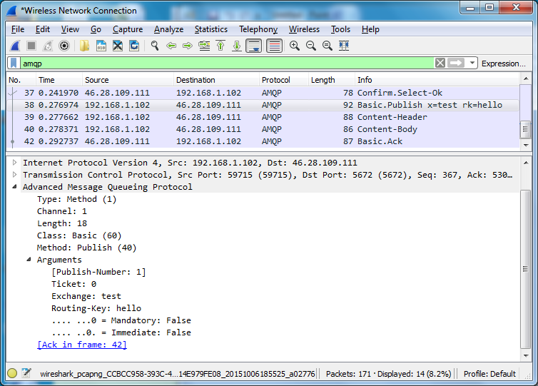
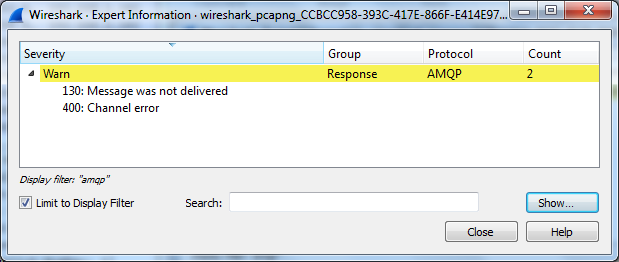

<!--
Copyright (c) 2005-2024 Broadcom. All Rights Reserved. The term "Broadcom" refers to Broadcom Inc. and/or its subsidiaries.

All rights reserved. This program and the accompanying materials
are made available under the terms of the under the Apache License,
Version 2.0 (the "License”); you may not use this file except in compliance
with the License. You may obtain a copy of the License at

https://www.apache.org/licenses/LICENSE-2.0

Unless required by applicable law or agreed to in writing, software
distributed under the License is distributed on an "AS IS" BASIS,
WITHOUT WARRANTIES OR CONDITIONS OF ANY KIND, either express or implied.
See the License for the specific language governing permissions and
limitations under the License.
-->

# Inspecting AMQP 0-9-1 Traffic using Wireshark

## <a id="overview" class="anchor" href="#overview">Overview</a>

<a href="https://www.wireshark.org/#download">Wireshark 2.0</a>
contains enhanced support for AMQP traffic inspection and
analysis. It can dissect (parse, visualise, filter) AMQP 0-9-1 and AMQP 1.0 traffic,
including AMQP 0-9-1 <a href="amqp-0-9-1-errata.html#section_3">Errata</a>
and RabbitMQ <a href="extensions.html">Extensions</a>.

Wireshark is based on the same foundation as [tcpdump](https://www.tcpdump.org/), `libpcap`, and can be used to inspect
`pcap` traffic capture files taken in a server environment.

Together, tcpdump and Wireshark provide a lot of information explaining what clients (applications) and RabbitMQ nodes
do. This information can and should be used to derive insights into system behavior that is difficult
to observe otherwise. These tools complement [monitoring systems](./monitoring.html) and allow operators and developers
troubleshoot a distributed system more efficiently.

## <a id="tracing" class="anchor" href="#tracing">Tracing Packages</a>

Packet List provides a summary of protocol frames and methods exchanged by a client and a RabbitMQ node.
The Info column indicates the Class and Method (e.g. Basic.Publish)
and then the most significant arguments. For example:

 * Connection.Open vhost=_(vhost)_
 * Connection.Close reply=_(reply-text)_
 * Channel.Close reply=_(reply-text)_
 * Exchange.Declare x=_(exchange-name)_
 * Exchange.Bind dx=_(dest-exchange)_ sx=_(source-exchange)_ bk=_(routing-key)_
 * Queue.Declare q=_(queue-name)_
 * Queue.Bind q=_(queue-name)_ x=_(exchange-name)_ bk=_(routing-key)_
 * Queue.Delete q=_(queue-name)_
 * Basic.Publish x=_(exchange-name)_ rk=_(routing-key)_

Packet Details then indicate all arguments of the frame. It
also includes dynamically calculated values enclosed in square
brackets. This is explained in next section.

## <a id="linking" class="anchor" href="#linking">Links Between Related Frames</a>

Wireshark analyzes the AMQP 0-9-1 packet flow and displays
additional information enclosed in square brackets:

 * Arguments of basic.publish include a publish sequence number, which is the sequence number used by
   <a href="confirms.html">Publisher Confirms</a>
 * Each acknowledged basic.publish or `basic.deliver` includes a reference to the frame that contains the
   corresponding `basic.ack` or `basic.nack` frame that acknowledged it (if any).
 * Similarly, each basic.ack contains a reference (possibly multiple) to frame(s) that is being confirmed by this Ack

## <a id="more-metrics" class="anchor" href="#more-metrics">More Metrics</a>

Wireshark automatically highlights AMQP 0-9-1 packets with:

 * [Connection errors](connections.html) (server-sent `connection.close` frames) and [channel errors](channels.html)
   (server-sent `channel.close` frames)
 * [Returned unroutable](./publishers.html) messages (`basic.return` frames)

You may display summary of significant frames in a dedicated
dialog. Go to Analyze > Expert Information and possibly apply
the display filter:

## <a id="inspecting-tls-connections" class="anchor" href="#inspecting-tls-connections">Inspecting Traffic on TLS-enabled Connections</a>

Wireshark enables you to inspect the AMQPS traffic, however you
can decrypt only the traffic that have been encrypted using the
RSA keys, excluding the RSA ephemeral and Diffie-Hellman
Ephemeral (DHE/EDH) cipher suites. You should
<a href="ssl.html#cipher-suites">set cipher suites</a> used
by RabbitMQ and restrict the list to RSA only.

In classic configuration format this would look something like this:

<pre class="lang-erlang">
[
 {rabbit, [
           {ssl_options, [{ciphers, [{rsa,aes_256_cbc,sha256},
                                     {rsa,aes_128_cbc,sha256},
                                     {rsa,aes_256_cbc,sha},
                                     {rsa,'3des_ede_cbc',sha},
                                     {rsa,aes_128_cbc,sha},
                                     {rsa,des_cbc,sha}]}
                         ]}
          ]}
].
</pre>

Also, you must supply Wireshark with the private key used to
encrypt the data. If a mutual authentication is used, you need to
supply both private keys.
Go to the Edit > Preferences dialog, select Protocols > SSL and
then click Edit the RSA keys list.

 * IP Address and Port identify the host that holds the
   private key, usually the server. A wildcard IP address
   of 0.0.0.0 and wildcard port of 0 or data can be used.
 * Protocol should identify <code>amqp</code>.
 * The private key file should be in the PEM or PKCS12
   format, possibly protected by a password.
