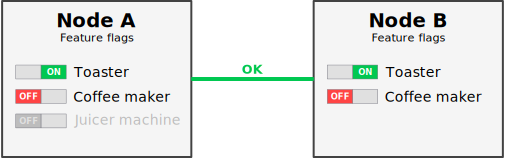
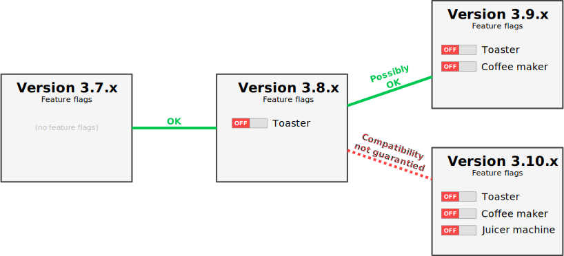

<!--
Copyright (c) 2005-2024 Broadcom. All Rights Reserved. The term "Broadcom" refers to Broadcom Inc. and/or its subsidiaries.

All rights reserved. This program and the accompanying materials
are made available under the terms of the under the Apache License,
Version 2.0 (the "License”); you may not use this file except in compliance
with the License. You may obtain a copy of the License at

https://www.apache.org/licenses/LICENSE-2.0

Unless required by applicable law or agreed to in writing, software
distributed under the License is distributed on an "AS IS" BASIS,
WITHOUT WARRANTIES OR CONDITIONS OF ANY KIND, either express or implied.
See the License for the specific language governing permissions and
limitations under the License.
-->

# Feature Flags

## Overview

In a mixed version cluster (e.g. some versions are 3.11.x and some are 3.12.x)
during an upgrade, some nodes will support a different set of features, behave
differently in certain scenarios, and otherwise not act exactly the same: they
are different versions after all.

Feature flags are a mechanism that controls what features are considered
to be enabled or available on all cluster nodes. If a feature flag is
enabled, so is its associated feature (or behavior). If not then all
nodes in the cluster will disable the feature (behavior).

The feature flag subsystem allows RabbitMQ nodes with different versions
to determine if they are compatible and then communicate together,
despite having different versions and thus potentially having different
feature sets or implementation details.

This subsystem was introduced to allow for **[rolling
upgrades](./upgrade.html#rolling-upgrades) of cluster members without shutting
down the entire cluster**.

Feature flags are not meant to be used as a form of cluster configuration.
After a successful rolling upgrade, users should enable all feature flags.

Each feature flag will become mandatory (graduate) at some point. For example,
<a
href="https://github.com/rabbitmq/rabbitmq-server/blob/main/release-notes/3.11.0.md#compatibility-notes">
RabbitMQ 3.11 requires feature flags introduced in 3.8 to be enabled prior to
the upgrade</a>.

## <a id="tldr" class="anchor" href="#tldr">Quick summary (TL;DR)</a>

### Feature Flag Ground Rules

 * A feature flag can be enabled only if all nodes in the cluster support it
 * A node can join or re-join a cluster only if:
    1. it supports all the feature flags enabled in the cluster and
    2. if every other cluster member supports all the feature flags enabled on
       that node
 * Once enabled, a feature flag cannot be disabled

For example, RabbitMQ 3.12.x and 3.11.x nodes are compatible as long as no
3.12.x-specific feature flags are enabled.

This subsystem does not guarantee that all future changes in
RabbitMQ can be implemented as feature flags and entirely backwards
compatible with older release series. Therefore, <strong>a future
version of RabbitMQ might still require a cluster-wide shutdown for
upgrading</strong>.

Please always read <a href="./changelog.html">release notes</a> to see if a
rolling upgrade to the next minor or major RabbitMQ version is possible.

### Key CLI Tool Commands

 *  To list feature flags:
    <pre class="lang-bash">rabbitmqctl list_feature_flags</pre>
 *  To enable a feature flag (or all currently disabled flags):
    <pre class="lang-bash">rabbitmqctl enable_feature_flag &lt;all | name&gt;</pre>

It is also possible to list and enable feature flags from the
[Management plugin UI](./management.html), in "*Admin > Feature flags*".

### Examples

#### Example 1: Compatible Nodes

 * If nodes A and B are not clustered, they can be clustered.
 * If nodes A and B are clustered:
    * "*Coffee maker*" can be enabled.
    * "*Juicer machine*" cannot be enabled because it is unsupported by node B.

#### Example 2: Incompatible Nodes

 * If nodes A and B are not clustered, they cannot be clustered because
   "*Juicer machine*" is unsupported on node B.
 * If nodes A and B are clustered and "*Juicer machine*" was enabled
   while node B was stopped, node B cannot re-join the cluster on restart.

## <a id="version-compatibility" class="anchor" href="#version-compatibility">Feature Flags and RabbitMQ Versions</a>

As covered earlier, the feature flags subsystem's primary goal is to allow
upgrades regardless of the version of cluster members, to the extent possible.

Feature flags make it possible to safely perform a rolling upgrade to the
next patch or minor release, except if it is stated otherwise
in the release notes. Indeed, there are some changes which cannot be
implemented as feature flags.

However, note that only upgrading from one minor to the next minor
or major is supported. To upgrade from e.g. 3.9.16 to 3.12.3, it is
necessary to upgrade to 3.9.29 first, then to the latest 3.10 patch release,
then the latest 3.11 release, then 3.12.3. After certain steps in the
upgrade process it will also be necessary to enable all stable feature
flags available in that version. For example, 3.12.0 is a release
that requires all feature flags to be enabled before a node can be
upgraded to it.

Likewise if there is one or more
minor release branches between the minor version used and the next
major release. That might work (i.e. there could be no incompatible
changes between major releases), but this scenario is unsupported by design
for the following reasons:

 * Skipping minor versions is not tested in CI.
 * Non-sequential releases may or may not support the same set of feature
   flags. Feature flags present for several minor branches can be marked as
   required and their associated feature/behavior is now implicitly enabled by
   default. The compatibility code is removed in the process, preventing
   clustering with older nodes. Remember their purpose is to allow upgrades,
   they are not a configuration mechanism.

Their is no policy defining the life cycle of a feature flag in general. E.g.
there is no guaranty that a feature flag will go from "stable" to "required"
after N minor releasees. Because new code builds on top of existing code,
feature flags are marked as required and the compatibility code is removed
whenever it is needed.

## <a id="how-to-list-feature-flags" class="anchor" href="#how-to-list-feature-flags">How to List Supported Feature Flags</a>

When a node starts for the first time, all stable feature flags are enabled by
default. When a node is upgraded to a newer version of RabbitMQ, new feature
flags are left disabled.

**To list the feature flags**, use `rabbitmqctl list_feature_flags`:

<pre class="lang-bash">
rabbitmqctl list_feature_flags

# => Listing feature flags ...
# => name	state
# => empty_basic_get_metric	enabled
# => implicit_default_bindings	enabled
# => quorum_queue	enabled
</pre>

For improved table readability, switch to the `pretty_table` formatter:

<pre class="lang-bash">
rabbitmqctl -q --formatter pretty_table list_feature_flags \
  name state provided_by desc doc_url
</pre>

which would produce a table that looks like this:

<pre class="lang-bash" style="line-height: 1.2em;">
┌───────────────────────────┬─────────┬───────────────────────────┬───────┬────────────┐
│ name                      │ state   │ provided_by               │ desc  │ doc_url    │
├───────────────────────────┼─────────┼───────────────────────────┼───────┼────────────┤
│ empty_basic_get_metric    │ enabled │ rabbitmq_management_agent │ (...) │            │
├───────────────────────────┼─────────┼───────────────────────────┼───────┼────────────┤
│ implicit_default_bindings │ enabled │ rabbit                    │ (...) │            │
├───────────────────────────┼─────────┼───────────────────────────┼───────┼────────────┤
│ quorum_queue              │ enabled │ rabbit                    │ (...) │ http://... │
└───────────────────────────┴─────────┴───────────────────────────┴───────┴────────────┘
</pre>

As shown in the example above, the `list_feature_flags` command accepts
a list of columns to display. The available columns are:

 * `name`: the name of the feature flag.
 * `state`: *enabled* or *disabled* if the feature flag is enabled or
   disabled, *unsupported* if one or more nodes in the cluster do not
   know this feature flag (and therefore it cannot be enabled).
 * `provided_by`: the RabbitMQ component or plugin which provides the
   feature flag.
 * `desc`: the description of the feature flag.
 * `doc_url`: the URL to a webpage to learn more about the feature flag.
 * `stability`: indicates if the feature flag is *required*, *stable* or
   *experimental*.

## <a id="how-to-enable-feature-flags" class="anchor" href="#how-to-enable-feature-flags">How to Enable Feature Flags</a>

After upgrading one node or the entire cluster, it will be possible
to enable new feature flags. Note that it will be impossible to roll
back the version or add a cluster member using the old version once new
feature flags are enabled.

**To enable a feature flag**, use `rabbitmqctl enable_feature_flag`:

<pre class="lang-bash">
rabbitmqctl enable_feature_flag &lt;name&gt;
</pre>

**To enable all feature flags**, use `rabbitmqctl enable_feature_flag all`:

<pre class="lang-bash">
rabbitmqctl enable_feature_flag all
</pre>

The `list_feature_flags` command can be used again to verify the feature
flags' states. Assuming all feature flags were disabled initially, here
is the state after enabling the `quorum_queue` feature flag:

<pre class="lang-bash" style="line-height: 1.2em;">
rabbitmqctl -q --formatter pretty_table list_feature_flags

┌───────────────────────────┬──────────┐
│ name                      │ state    │
├───────────────────────────┼──────────┤
│ empty_basic_get_metric    │ disabled │
├───────────────────────────┼──────────┤
│ implicit_default_bindings │ disabled │
├───────────────────────────┼──────────┤
│ quorum_queue              │ enabled  │
└───────────────────────────┴──────────┘
</pre>

It is also possible to list and enable feature flags from the
[Management Plugin UI](./management.html), in "*Admin > Feature flags*":

## <a id="how-to-disable-feature-flags" class="anchor" href="#how-to-disable-feature-flags">How to Disable Feature Flags</a>

It is **impossible to disable a feature flag** once it is enabled.

## <a id="how-to-start-new-node-disabled-feature-flags" class="anchor" href="#how-to-start-new-node-disabled-feature-flags">How to Override the List of Feature Flags to Enable on Initial Startup</a>

By default a new and unclustered node will start with all stable feature flags
enabled, but this setting can be overridden. **Since enabled feature flags
cannot be disabled, overriding the list of enabled feature flags is a safe
thing to do for the first node boot only**.

This mechanism is only useful to allow a user to expand an existing cluster
with a node running a newer version of RabbitMQ compared to the rest of the
cluster. The compatibility with the new node is still verified and adding it to
the cluster may still fail if it is incompatible.

There are two ways to do this:

 1. Using the `RABBITMQ_FEATURE_FLAGS` environment variable:
    <pre class="lang-bash">RABBITMQ_FEATURE_FLAGS=quorum_queue,implicit_default_bindings</pre>
 2. Using the `forced_feature_flags_on_init` configuration parameter:
    <pre class="lang-erlang">{rabbit, [{forced_feature_flags_on_init, [quorum_queue, implicit_default_bindings]}]}</pre>

The environment variable has precedence over the configuration parameter.

Obviously, required feature flags will always be enabled, regardless of this.

## <a id="graduation" class="anchor" href="#graduation">Feature Flag Maturation and Graduation Process</a>

After their initial introduction into RabbitMQ, feature flags are *optional*,
that is, they only serve the purpose of allowing for a safe rolling cluster
upgrade.

Over time, however, features become more mature and future development of
RabbitMQ assumes that a certain set of features is available and can be relied
on by the users and developers alike. When that happens, feature flags
*graduate* to core (required) features in the next minor feature release.

It is very important to enable all feature flags after performing a rolling
cluster upgrade: in the future these flags will become mandatory, and
proactively enabling them will allow for a smoother upgrade experience in the
future.

## <a id="list-of-feature-flags" class="anchor" href="#list-of-feature-flags">List of Feature Flags</a>

The feature flags listed below are provided by RabbitMQ core or one of the
tier-1 plugins bundled with RabbitMQ.

Column `Required` shows the RabbitMQ version **before** which a feature flag
MUST have been enabled. For example, if a feature flag is required in 3.12.0,
this feature flag must be enabled in 3.11.x (or earlier) before upgrading to
3.12.x. Otherwise, if a RabbitMQ node is upgraded to 3.12.x while this feature
flag is disabled, the RabbitMQ node will refuse to start in 3.12.x.

Column `Stable` shows the RabbitMQ version that introduced a feature flag. For
example, if a feature flag is stable in 3.11.0, that feature flag SHOULD be
enabled promptly after upgrading all nodes in a RabbitMQ cluster to version
3.11.x.

### <a id="core-feature-flags" class="anchor" href="#core-feature-flags">Core Feature Flags</a>

The following feature flags are provided by RabbitMQ core.

<table>
  <tr>
   <th>Required</th>
   <th>Stable</th>
   <th>Feature flag name</th>
   <th>Description</th>
  </tr>

  <tr>
    <td></td>
    <td>3.12.0</td>
    <td>restart_streams</td>
    <td>
      Support for restarting streams with optional preferred next leader
      argument. Used to implement stream leader rebalancing
    </td>
  </tr>
  <tr>
    <td></td>
    <td>3.12.0</td>
    <td>stream_sac_coordinator_unblock_group</td>
    <td>
      <a href="https://github.com/rabbitmq/rabbitmq-server/issues/7743">Bug
      fix</a> to unblock a group of consumers in a super stream partition
    </td>
  </tr>
  <tr>
    <td>3.12.0</td>
    <td>3.11.0</td>
    <td>classic_mirrored_queue_version</td>
    <td>
      Support setting version for classic mirrored queues
    </td>
  </tr>
  <tr>
    <td>3.12.0</td>
    <td>3.11.0</td>
    <td>direct_exchange_routing_v2</td>
    <td>
      v2 direct exchange routing implementation
    </td>
  </tr>
  <tr>
    <td>3.12.0</td>
    <td>3.11.0</td>
    <td>feature_flags_v2</td>
    <td>
      Feature flags subsystem v2
    </td>
  </tr>
  <tr>
    <td>3.12.0</td>
    <td>3.11.0</td>
    <td>listener_records_in_ets</td>
    <td>
      Store listener records in ETS instead of Mnesia
    </td>
  </tr>
  <tr>
    <td>3.12.0</td>
    <td>3.11.0</td>
    <td>stream_single_active_consumer</td>
    <td>
      <a href="https://blog.rabbitmq.com/posts/2022/07/rabbitmq-3-11-feature-preview-single-active-consumer-for-streams/">Single active consumer for streams</a>
    </td>
  </tr>
  <tr>
    <td>3.12.0</td>
    <td>3.11.0</td>
    <td>tracking_records_in_ets</td>
    <td>
      Store tracking records in ETS instead of Mnesia
    </td>
  </tr>
  <tr>
    <td>3.12.0</td>
    <td>3.10.9</td>
    <td>classic_queue_type_delivery_support</td>
    <td>
      <a href="https://github.com/rabbitmq/rabbitmq-server/issues/5931">Bug
      fix</a> for classic queue deliveries using mixed versions
    </td>
  </tr>
  <tr>
    <td>3.12.0</td>
    <td>3.9.0</td>
    <td>stream_queue</td>
    <td>
      Support queues of type <a
      href="https://www.rabbitmq.com/stream.html">stream</a>
    </td>
  </tr>
  <tr>
    <td>3.11.0</td>
    <td>3.8.10</td>
    <td>user_limits</td>
    <td>
      Configure connection and channel limits for a user
    </td>
  </tr>
  <tr>
    <td>3.11.0</td>
    <td>3.8.8</td>
    <td>maintenance_mode_status</td>
    <td>
      Maintenance mode status
    </td>
  </tr>
  <tr>
    <td>3.11.0</td>
    <td>3.8.0</td>
    <td>implicit_default_bindings</td>
    <td>
      Default bindings are now implicit, instead of being stored in the
      database
    </td>
  </tr>
  <tr>
    <td>3.11.0</td>
    <td>3.8.0</td>
    <td>quorum_queue</td>
    <td>
      Support queues of type <a
      href="https://www.rabbitmq.com/quorum-queues.html">quorum</a>
    </td>
  </tr>
  <tr>
    <td>3.11.0</td>
    <td>3.8.0</td>
    <td>virtual_host_metadata</td>
    <td>
      Virtual host metadata (description, tags, etc.)
    </td>
  </tr>
</table>

### <a id="rabbitmq_management_agent-feature-flags" class="anchor" href="#rabbitmq_management_agent-feature-flags">rabbitmq_management_agent Feature Flags</a>

The following feature flags are provided by plugin
[rabbimq_management_agent](https://github.com/rabbitmq/rabbitmq-server/tree/main/deps/rabbitmq_management_agent).

<table>
  <tr>
   <th>Required</th>
   <th>Stable</th>
   <th>Feature flag name</th>
   <th>Description</th>
  </tr>

  <tr>
    <td>3.12.0</td>
    <td>3.8.10</td>
    <td>drop_unroutable_metric</td>
    <td>
      Count unroutable publishes to be dropped in stats
    </td>
  </tr>
  <tr>
    <td>3.12.0</td>
    <td>3.8.10</td>
    <td>empty_basic_get_metric</td>
    <td>
      Count AMQP basic.get on empty queues in stats
    </td>
  </tr>
</table>

### <a id="rabbitmq_mqtt-feature-flags" class="anchor" href="#rabbitmq_mqtt-feature-flags">rabbitmq_rabbitmq_mqtt Feature Flags</a>

The following feature flags are provided by plugin
[rabbimq_mqtt](https://www.rabbitmq.com/mqtt.html).

<table>
  <tr>
   <th>Required</th>
   <th>Stable</th>
   <th>Feature flag name</th>
   <th>Description</th>
  </tr>

  <tr>
    <td></td>
    <td>3.12.0</td>
    <td>delete_ra_cluster_mqtt_node</td>
	<td>
	  <a href="https://blog.rabbitmq.com/posts/2023/03/native-mqtt/#what-else-improves-with-native-mqtt-in-312">Delete Ra cluster mqtt_node since MQTT client IDs are tracked locally</a>
	</td>
  </tr>
  <tr>
    <td></td>
    <td>3.12.0</td>
    <td>rabbit_mqtt_qos0_queue</td>
	<td>
	  Support <a href="https://blog.rabbitmq.com/posts/2023/03/native-mqtt/#new-mqtt-qos-0-queue-type">pseudo queue type for MQTT QoS 0 subscribers</a> omitting a queue process
	</td>
  </tr>
</table>

## <a id="implementation" class="anchor" href="#implementation">How Do Feature Flags Work?</a>

### <a id="implementation-for-operators" class="anchor" href="#implementation-for-operators">From an Operator Point of View</a>

#### Node and Version Compatibility

There are two times when an operator has to consider feature flags:

 * When [extending an existing cluster](./clustering.html) by adding
   nodes using a different version of RabbitMQ (older or newer), the
   operator needs to pay attention to feature flags: they might prevent
   clustering.
 * After [upgrading a cluster](./upgrade.html), the operator should take
   a look at the new feature flags and perhaps enable them.

A node compares its own list of feature flags with remote nodes' list
of feature flags to determine if it can join a cluster. The rules are
defined as:

 * All feature flags enabled locally must be supported remotely.
 * All feature flags enabled remotely must be supported locally.

It is important to understand the difference between *enabled* and
*supported*:

 * A *supported* feature flag is one which is known by the node. It can
   be enabled or disabled, but its state is irrelevant at this point.
 * An *enabled* feature flag is one which is activated and used by the
   node. Per the definition above, it is implicitly a *supported*
   feature flag.

If one of those two conditions is not verified, the node cannot join or
re-join the cluster.

However, if it can join the cluster, the state of *enabled* feature
flags is synchronized between nodes: if a feature flag is enabled on one
node, it is enabled on all other nodes.

#### Scope of the Feature Flags

The feature flags subsystem covers inter-node communication only. This
means the following scenarios are not covered and may not work as
initially expected.

#### Using `rabbitmqctl` on a remote node

Controlling a remote node with `rabbitmqctl` is only supported if the
remote node is running the same version of RabbitMQ as`rabbitmqctl`.

If [CLI tools](./cli.html) from a different minor/major version of RabbitMQ is
used on a remote node, they may fail to work as expected or even have
unexpected side effects on the node.

#### Load-balancing Requests to the HTTP API

If a request sent to the HTTP API exposed by the [Management
plugin](./management.html) goes through a load balancer, including one
from the management plugin UI, the API's behavior and its response may
be different, depending on the version of the node which handled the
request. This is exactly the same if the domain name of the HTTP API
resolves to multiple IP addresses.

This situation may happen during a rolling upgrade if the management UI
is open in a browser with periodic automatic refresh.

For example, if the management UI was loaded from a RabbitMQ 3.11.x node
but it then queries a RabbitMQ 3.12.x node, the JavaScript code running
in the browser may fail with exceptions due to HTTP API changes.

#### What Happens When a Feature Flag is Enabled

When a feature flag is enabled with `rabbitmqctl`, here is what happens
internally:

 1. RabbitMQ verifies if the feature flag is already enabled. If yes, it
    stops.
 2. It verifies if the feature flag is supported. If no, it stops.
 3. It marks the feature flag state as *state_changing*. This is an
    internal transitional state to inform consumers of this feature
    flag. Most of the time, it means that components depending on this
    particular feature flag will be blocked until the state changes to
    *enabled* or *disabled*.
 4. It enables all feature flags this one depends on. Therefore for each
    one of them, we go through this same procedure.
 5. It executes the migration function, if there is one. This function
    is responsible for preparing or converting various resources, such as
    changing the schema of a database.
 6. If all the steps above succeed, the feature flag state becomes
    *enabled*. Otherwise, it is reverted back to *disabled*.

  As an operator, the most important part of this procedure to
  remember is that <strong>if the migration takes time</strong>, some
  components and thus <strong>some operations in RabbitMQ might be
  blocked</strong> during the migration.

### <a id="implementation-for-developers" class="anchor" href="#implementation-for-developers">From a Developer Point of View</a>

When working on a plugin or a RabbitMQ core contribution, feature flags
should be used to make the new version of the code compatible with older
versions of RabbitMQ.

#### When to Use a Feature Flag

It is developer's responsibility to look at the list of existing and
future (i.e. those added to the `main` branch) feature flags and see
if the new code can be adapted to take advantage of them.

Here is an example. When developing a plugin which used to use the
`#amqqueue{}` record defined in `rabbit_common/include/rabbit.hrl`, the
plugin has to be adapted to use the new `amqqueue` API which hides the
previous record (which is private now). However, there is no need to
query feature flags for that: the plugin will be ABI-compatible (i.e. no
need to recompile it) with RabbitMQ 3.8.0 and later. It should also be
ABI-compatible with RabbitMQ 3.7.x once the `amqqueue` appears in that
branch.

However if the plugin targets quorum queues introduced in RabbitMQ
3.8.0, it may have to query feature flags to determine what it can do.
For instance, can it declare a quorum queue? Can it even expect the new
fields added to `amqqueue` as part of the quorum queues implementation?

If the plugin carefully checks feature flags to avoid any incorrect
expectations, it will be compatible with many versions of RabbitMQ:
the user will not have to recompile anything or download another
version-specific copy of the plugin.

#### When to Declare a Feature Flag

If a plugin or core broker change modifies one of the following aspects:

 * record definitions
 * replicated database schemas
 * the format of Erlang messages passed between nodes
 * modules and functions called from remote nodes

Then compatibility with older versions of RabbitMQ becomes a concern.
This is where a new feature flag can help ensure a smoother upgrade
experience.

The two most important parts of a feature flag are:

 * the declaration as a module attribute
 * the migration function

The declaration is a module attribute which looks like this:
<pre class="lang-erlang">
-rabbit_feature_flag(
   {quorum_queue,
    #{desc          => "Support queues of type quorum",
      doc_url       => "https://www.rabbitmq.com/quorum-queues.html",
      stability     => stable,
      migration_fun => {?MODULE, quorum_queue_migration}
     }}).
</pre>

The migration function is a stateless function which looks like this:

<pre class="lang-erlang">
quorum_queue_migration(FeatureName, _FeatureProps, enable) ->
    Tables = ?quorum_queue_tables,
    rabbit_table:wait(Tables),
    Fields = amqqueue:fields(amqqueue_v2),
    migrate_to_amqqueue_with_type(FeatureName, Tables, Fields);
quorum_queue_migration(_FeatureName, _FeatureProps, is_enabled) ->
    Tables = ?quorum_queue_tables,
    rabbit_table:wait(Tables),
    Fields = amqqueue:fields(amqqueue_v2),
    mnesia:table_info(rabbit_queue, attributes) =:= Fields andalso
    mnesia:table_info(rabbit_durable_queue, attributes) =:= Fields.
</pre>

More implementation docs can be found in the [`rabbit_feature_flags` module
source
code](https://github.com/rabbitmq/rabbitmq-server/blob/main/deps/rabbit/src/rabbit_feature_flags.erl).

Erlang's `edoc` reference can be generated locally from a RabbitMQ
repository clone or source archive:

<pre class="lang-bash">
gmake edoc
# =>  ... Ignore warnings and errors...

# Now open `doc/rabbit_feature_flags.html` in the browser.
</pre>

#### How to Adapt and Run Testsuites with mixed-version clusters

When a feature or behavior depends on a feature flag (either in the
core broker or in a plugin), the associated testsuites must be adapted
to take this feature flag into account. It means that before running
the actual testcase, the setup code must verify if the feature flag is
supported and either enable it if it is, or skip the testcase. This is
the same for setup code running at the group or suite level.

There are helper functions in `rabbitmq-ct-heleprs` to ease that check.
Here is an example, taken from the `dynamic_qq_SUITE.erl` testsuite in
rabbitmq-server:

<pre class="lang-erlang">
init_per_testcase(Testcase, Config) ->
    % (...)

    % 1.
    % The broker or cluster is started: we rely on this to query feature
    % flags.
    Config1 = rabbit_ct_helpers:run_steps(
                Config,
                rabbit_ct_broker_helpers:setup_steps() ++
                rabbit_ct_client_helpers:setup_steps()),

    % 2.
    % We try to enable the `quorum_queue` feature flag. The helper is
    % responsible for checking if the feature flag is supported and
    % enabling it.
    case rabbit_ct_broker_helpers:enable_feature_flag(Config1, quorum_queue) of
        ok ->
            % The feature flag is enabled at this point. The setup can
            % continue to play with `Config1` and the cluster.
            Config1;
        Skip ->
            % The feature flag is unavailable/unsupported. The setup
            % calls `end_per_testcase()` to stop the node/cluster and
            % skips the testcase.
            end_per_testcase(Testcase, Config1),
            Skip
    end.
</pre>

It is possible to run testsuites locally in the context of a
mixed-version cluster. If configured to do so, `rabbitmq-ct-helpers`
will use a second version of RabbitMQ to start half of the nodes when
starting a cluster:

 * Node 1 will be on the primary copy (the one used to start the testsuite)
 * Node 2 will be on the secondary copy (the one provided explicitly to
   `rabbitmq-ct-helpers`)
 * Node 3 will be on the primary copy
 * Node 4 will be on the secondary copy
 * ...

To run a testsuite in the context of a mixed-version cluster:

 1. Clone the `rabbitmq-public-umbrella` repository and checkout the
    appropriate branch or tag. This will be the **secondary Umbrella**.
    In this example, the `v3.12.x` branch is used:

    <pre class="lang-bash">
    git clone https://github.com/rabbitmq/rabbitmq-server.git secondary-umbrella
    cd secondary-umbrella
    git checkout v3.12.x
    make co
    </pre>

 2. Compile RabbitMQ or the plugin being tested in the secondary
    Umbrella. The `rabbitmq-federation` plugin is used as an example:

    <pre class="lang-bash">
    cd secondary-umbrella/deps/rabbitmq_federation
    make dist
    </pre>

 3. Go to RabbitMQ or the same plugin in the primary copy:

    <pre class="lang-bash">
    cd /path/to/primary/rabbitmq_federation
    </pre>

 4. Run the testsuite. Here, two environment variables are specified to
    configure the "mixed-version cluster" mode:

    <pre class="lang-bash">
    SECONDARY_UMBRELLA=/path/to/secondary-umbrella \
    RABBITMQ_FEATURE_FLAGS= \
    make tests
    </pre>

    The first environment variable, `SECONDARY_UMBRELLA`, tells
    `rabbitmq-ct-helpers` where to find the secondary Umbrella, as
    the name suggests. This is how the mixed-version cluster mode is
    enabled.

    The secondary environment variable, `RABBITMQ_FEATURE_FLAGS`, is set
    to the empty string and tells RabbitMQ to start with all feature
    flags disabled: this is mandatory to have a newer node compatible
    with an older one.
