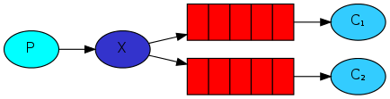

<!--
Copyright (c) 2005-2024 Broadcom. All Rights Reserved. The term "Broadcom" refers to Broadcom Inc. and/or its subsidiaries.

All rights reserved. This program and the accompanying materials
are made available under the terms of the under the Apache License,
Version 2.0 (the "License”); you may not use this file except in compliance
with the License. You may obtain a copy of the License at

https://www.apache.org/licenses/LICENSE-2.0

Unless required by applicable law or agreed to in writing, software
distributed under the License is distributed on an "AS IS" BASIS,
WITHOUT WARRANTIES OR CONDITIONS OF ANY KIND, either express or implied.
See the License for the specific language governing permissions and
limitations under the License.
-->

# RabbitMQ Tutorials

These tutorials cover the basics of creating messaging
applications using RabbitMQ.

You need to have the RabbitMQ server installed to go through
the tutorials, please see the [installation guide](download.html) or
use the [Docker image](https://hub.docker.com/_/rabbitmq/).

Executable versions of these tutorials [are open source](https://github.com/rabbitmq/rabbitmq-tutorials),
as is [this website](https://github.com/rabbitmq/rabbitmq-website).

These tutorials focus on just one (the original) protocol supported by RabbitMQ.
Examples for [RabbitMQ streams](streams.html) on the [RabbitMQ blog](https://blog.rabbitmq.com/categories/streams/).

<table id="tutorials">
  <tr>
  <td id="tutorial-one">
    <h2>1 <a href="./tutorials/tutorial-one-python.html">"Hello World!"</a></h2>
    

      The simplest thing that does <em>something</em>
    

    
 Queue -> Consuming: send and receive messages from a named queue."/>

    <ul>
      <li><a href="./tutorials/tutorial-one-python.html">Python</a></li>
      <li><a href="./tutorials/tutorial-one-java.html">Java</a></li>
      <li><a href="./tutorials/tutorial-one-ruby.html">Ruby</a></li>
      <li><a href="./tutorials/tutorial-one-php.html">PHP</a></li>
      <li><a href="./tutorials/tutorial-one-dotnet.html">C#</a></li>
      <li><a href="./tutorials/tutorial-one-javascript.html">JavaScript</a></li>
      <li><a href="./tutorials/tutorial-one-go.html">Go</a></li>
      <li><a href="./tutorials/tutorial-one-elixir.html">Elixir</a></li>
      <li><a href="./tutorials/tutorial-one-objectivec.html">Objective-C</a></li>
      <li><a href="./tutorials/tutorial-one-swift.html">Swift</a></li>
      <li><a href="./tutorials/tutorial-one-spring-amqp.html">Spring AMQP</a></li>
    </ul>
  </td>

  <td id="tutorial-two">
    <h2>2 <a href="./tutorials/tutorial-two-python.html">Work Queues</a></h2>
    

      Distributing tasks among workers (the <a href="http://www.enterpriseintegrationpatterns.com/patterns/messaging/CompetingConsumers.html">competing consumers pattern</a>)
    

    
 Queue -> Consuming: Work Queue used to distribute time-consuming tasks among multiple workers."/>

    <ul>
        <li><a href="./tutorials/tutorial-two-python.html">Python</a></li>
        <li><a href="./tutorials/tutorial-two-java.html">Java</a></li>
        <li><a href="./tutorials/tutorial-two-ruby.html">Ruby</a></li>
        <li><a href="./tutorials/tutorial-two-php.html">PHP</a></li>
        <li><a href="./tutorials/tutorial-two-dotnet.html">C#</a></li>
        <li><a href="./tutorials/tutorial-two-javascript.html">JavaScript</a></li>
        <li><a href="./tutorials/tutorial-two-go.html">Go</a></li>
        <li><a href="./tutorials/tutorial-two-elixir.html">Elixir</a></li>
        <li><a href="./tutorials/tutorial-two-objectivec.html">Objective-C</a></li>
        <li><a href="./tutorials/tutorial-two-swift.html">Swift</a></li>
        <li><a href="./tutorials/tutorial-two-spring-amqp.html">Spring AMQP</a></li>
    </ul>
  </td>

  <td id="tutorial-three">
    <h2>3 <a href="./tutorials/tutorial-three-python.html">Publish/Subscribe</a></h2>
    

      Sending messages to many consumers at once
    

    
 Queue -> Consuming: deliver a message to multiple consumers. This pattern is known as publish/subscribe"/>

    <ul>
      <li><a href="./tutorials/tutorial-three-python.html">Python</a></li>
      <li><a href="./tutorials/tutorial-three-java.html">Java</a></li>
      <li><a href="./tutorials/tutorial-three-ruby.html">Ruby</a></li>
      <li><a href="./tutorials/tutorial-three-php.html">PHP</a></li>
      <li><a href="./tutorials/tutorial-three-dotnet.html">C#</a></li>
      <li><a href="./tutorials/tutorial-three-javascript.html">JavaScript</a></li>
      <li><a href="./tutorials/tutorial-three-go.html">Go</a></li>
      <li><a href="./tutorials/tutorial-three-elixir.html">Elixir</a></li>
      <li><a href="./tutorials/tutorial-three-objectivec.html">Objective-C</a></li>
      <li><a href="./tutorials/tutorial-three-swift.html">Swift</a></li>
      <li><a href="./tutorials/tutorial-three-spring-amqp.html">Spring AMQP</a></li>
    </ul>
  </td>
  </tr>

  <tr>
  <td id="tutorial-four">
    <h2>4 <a href="./tutorials/tutorial-four-python.html">Routing</a></h2>
    

      Receiving messages selectively
    

    
 Queue -> Consuming: subscribe to a subset of the messages only." />

    <ul>
      <li><a href="./tutorials/tutorial-four-python.html">Python</a></li>
      <li><a href="./tutorials/tutorial-four-java.html">Java</a></li>
      <li><a href="./tutorials/tutorial-four-ruby.html">Ruby</a></li>
      <li><a href="./tutorials/tutorial-four-php.html">PHP</a></li>
      <li><a href="./tutorials/tutorial-four-dotnet.html">C#</a></li>
      <li><a href="./tutorials/tutorial-four-javascript.html">JavaScript</a></li>
      <li><a href="./tutorials/tutorial-four-go.html">Go</a></li>
      <li><a href="./tutorials/tutorial-four-elixir.html">Elixir</a></li>
      <li><a href="./tutorials/tutorial-four-objectivec.html">Objective-C</a></li>
      <li><a href="./tutorials/tutorial-four-swift.html">Swift</a></li>
      <li><a href="./tutorials/tutorial-four-spring-amqp.html">Spring AMQP</a></li>
    </ul>
  </td>

  <td id="tutorial-five">
    <h2>5 <a href="./tutorials/tutorial-five-python.html">Topics</a></h2>
    

      Receiving messages based on a pattern (topics)
    

    
 Queue -> Consuming: receiving messages based on a pattern (topics)."/>

    <ul>
      <li><a href="./tutorials/tutorial-five-python.html">Python</a></li>
      <li><a href="./tutorials/tutorial-five-java.html">Java</a></li>
      <li><a href="./tutorials/tutorial-five-ruby.html">Ruby</a></li>
      <li><a href="./tutorials/tutorial-five-php.html">PHP</a></li>
      <li><a href="./tutorials/tutorial-five-dotnet.html">C#</a></li>
      <li><a href="./tutorials/tutorial-five-javascript.html">JavaScript</a></li>
      <li><a href="./tutorials/tutorial-five-go.html">Go</a></li>
      <li><a href="./tutorials/tutorial-five-elixir.html">Elixir</a></li>
      <li><a href="./tutorials/tutorial-five-objectivec.html">Objective-C</a></li>
      <li><a href="./tutorials/tutorial-five-swift.html">Swift</a></li>
      <li><a href="./tutorials/tutorial-five-spring-amqp.html">Spring AMQP</a></li>
    </ul>
  </td>

  <td id="tutorial-six">
    <h2>6 <a href="./tutorials/tutorial-six-python.html">RPC</a></h2>
    

      <a href="http://www.enterpriseintegrationpatterns.com/patterns/messaging/RequestReply.html">Request/reply pattern</a> example
    

    
 Queue -> Consuming: RPC (Remote Procedure Call), the request/reply pattern."/>

    <ul>
      <li><a href="./tutorials/tutorial-six-python.html">Python</a></li>
      <li><a href="./tutorials/tutorial-six-java.html">Java</a></li>
      <li><a href="./tutorials/tutorial-six-ruby.html">Ruby</a></li>
      <li><a href="./tutorials/tutorial-six-php.html">PHP</a></li>
      <li><a href="./tutorials/tutorial-six-dotnet.html">C#</a></li>
      <li><a href="./tutorials/tutorial-six-javascript.html">JavaScript</a></li>
      <li><a href="./tutorials/tutorial-six-go.html">Go</a></li>
      <li><a href="./tutorials/tutorial-six-elixir.html">Elixir</a></li>
      <li><a href="./tutorials/tutorial-six-spring-amqp.html">Spring AMQP</a></li>
    </ul>
  </td>
  </tr>
  <tr>
  <td id="tutorial-seven">
    <h2>7 <a href="./tutorials/tutorial-seven-java.html">Publisher Confirms</a></h2>
    

      Reliable publishing with publisher confirms
    

    <ul>
      <li><a href="./tutorials/tutorial-seven-java.html">Java</a></li>
      <li><a href="./tutorials/tutorial-seven-dotnet.html">C#</a></li>
      <li><a href="./tutorials/tutorial-seven-php.html">PHP</a></li>
    </ul>
  </td>
  <td class="tutorial-empty"></td>
  <td class="tutorial-empty"></td>
  </tr>
</table>

## Getting Help

If you have any questions or comments regarding RabbitMQ, feel free to
ask them on [RabbitMQ mailing list](https://groups.google.com/forum/#!forum/rabbitmq-users),
[RabbitMQ community Discord server](https://rabbitmq.com/discord/), or the public [RabbitMQ community Slack](https://rabbitmq.com/slack/).

## AMQP 0-9-1 Overview and Quick Reference

Once you have been through the tutorials (or if you want to
skip ahead), you may wish to read an
[Introduction to RabbitMQ Concepts](./tutorials/amqp-concepts.html)
and browse our
[AMQP 0-9-1 Quick Reference Guide](amqp-0-9-1-quickref.html).

## Tutorials in Other Languages

The tutorials here use a number of popular technologies,
however, there are [ports available](https://github.com/rabbitmq/rabbitmq-tutorials) for
many more languages and client libraries, for example:

 * Rust using [amqprs](https://github.com/rabbitmq/rabbitmq-tutorials/tree/main/rust-amqprs)
 * Rust using [Lapin](https://github.com/rabbitmq/rabbitmq-tutorials/tree/main/rust-lapin))
 * [Clojure](https://github.com/rabbitmq/rabbitmq-tutorials/tree/main/clojure) (using [Langohr](http://clojurerabbitmq.info))
 * [Erlang](https://github.com/rabbitmq/rabbitmq-tutorials/tree/main/erlang) (using [RabbitMQ Erlang client](https://github.com/rabbitmq/rabbitmq-erlang-client))
 * [Haskell](https://github.com/rabbitmq/rabbitmq-tutorials/tree/main/haskell) (using [Network.AMQP](http://hackage.haskell.org/package/amqp))
 * [Perl](https://github.com/rabbitmq/rabbitmq-tutorials/tree/main/perl) (using [Net::RabbitFoot](https://github.com/cooldaemon/RabbitFoot))
 * [Perl](https://github.com/oylenshpeegul/RabbitMQ-Tutorial-Perl) (using [Net::AMQP::RabbitMQ](http://p3rl.org/Net::AMQP::RabbitMQ))
 * [Scala](https://github.com/rabbitmq/rabbitmq-tutorials/tree/main/scala) (using [RabbitMQ Java client](https://www.rabbitmq.com/api-guide.html))

We also maintain a list of community-developed [clients and developer tools](./devtools.html)
for a range of platforms.
