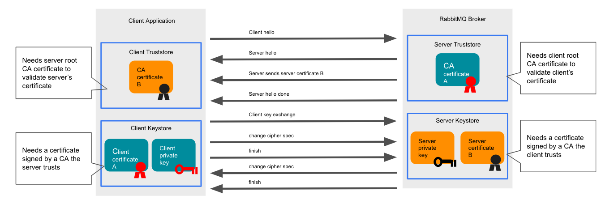

# Using the &product-name; Cluster Kubernetes Operator

## <a id='overview' class='anchor' href='#overview'>How to use the RabbitMQ Cluster Kubernetes Operator</a>

Use this information to learn how to deploy custom resource objects that are then managed by the [RabbitMQ Cluster Kubernetes Operator](./operator-overview.html).

If the RabbitMQ Cluster Kubernetes Operator is not installed at this point,
refer to [installing the RabbitMQ Cluster Operator in a Kubernetes Cluster](./install-operator.html) now. For instructions on getting started quickly, refer to the [quickstart](./quickstart-operator.html) information.

This following information is structured into these sections:

* [Confirm Service Availability](#service-availability)
* [Apply Pod Security Policies](#psp)
* [Create a RabbitMQ Instance](#create)
* [Existing examples](#examples)
* [Configure a RabbitMQ Instance](#configure)
* [Update a RabbitMQ Instance](#update)
* [Set a Pod Disruption Budget](#set-pdb)
* [Configure TLS](#tls)
* [Find Your RabbitmqCluster Service Name and Admin Credentials](#find)
* [Use HashiCorp Vault](#vault)
* [Verify the Instance is Running](#verify-instance)
* [Use the RabbitMQ Service in Your App](#use)
* [Monitor RabbitMQ Clusters](#monitoring)
* [Restrict traffic using Network Policies](#network-policies)
* [Delete a RabbitMQ Instance](#delete)
* [Pause Reconciliation for a RabbitMQ Instance](#pause)
* [Configure Log Level for the Operator](#operator-log)

Additional information about using the RabbitMQ Cluster Kubernetes Operator on Openshift can be found at
[Using the RabbitMQ Kubernetes Operators on Openshift](using-on-openshift.html).

## <a id='service-availability' class='anchor' href='#service-availability'>Confirm Service Availability</a>

Before configuring your app to use RabbitMQ Cluster Kubernetes Operator, ensure that RabbitmqCluster Custom Resource is deployed
to your Kubernetes cluster and is available.

To confirm this availability, run

<pre class="lang-bash">
kubectl get customresourcedefinitions.apiextensions.k8s.io
</pre>

Then verify that `rabbitmqclusters.rabbitmq.com` is on the list, as in the example below:

<pre class="lang-bash">
kubectl get customresourcedefinitions.apiextensions.k8s.io
# NAME                                   CREATED AT
# rabbitmqclusters.rabbitmq.com   2019-10-23T10:11:06Z
</pre>

If it is not, install it by following the steps in the [installation guide](./install-operator.html).

## <a id='psp' class='anchor' href='#psp'>(Optional) Apply Pod Security Policies</a>

If [pod security policies](https://kubernetes.io/docs/concepts/policy/pod-security-policy/) are enabled in the Kubernetes cluster,
a `[Cluster]Role` and `[Cluster]RoleBinding` must be created to enable the Pods to be scheduled. For more information about Pod security policies,
see the [Kubernetes documentation](https://kubernetes.io/docs/concepts/policy/pod-security-policy/).
If `Role` and `RoleBinding` are used, it will only be effective in the Namespace where the RBACs are deployed.

If Pod security policies are not enabled, skip to <a href="#create">Create a RabbitMQ Instance</a> below.

The `Role` and `RoleBinding` should be created before a `RabbitmqCluster` instance is created. It's ok to create a binding that refers to a non-existing
Service Account or User. The Operator creates a Service Account using the pattern `INSTANCE-NAME-server`. For example, a `RabbitmqCluster` named
'mycluster' will generate a Service Account named `mycluster-server`. In order to allow a Service Account to use PSPs, a Role with the verb 'use' must
be bound to the Service Account. For example:

<pre class="lang-bash">
# Assuming RabbitmqCluster name is 'mycluster'

kubectl create role rabbitmq:psp:unprivileged \
    --verb=use \
    --resource=podsecuritypolicy \
    --resource-name=some-pod-security-policy
# role "rabbitmq:psp:unprivileged" created

kubectl create rolebinding rabbitmq-mycluster:psp:unprivileged \
    --role=rabbitmq:psp:unprivileged \
    --serviceaccount=some-namespace:mycluster-server
# rolebinding "rabbitmq-mycluster:psp:unprivileged" created
</pre>

[Kubernetes documentation](https://kubernetes.io/docs/concepts/policy/pod-security-policy/#example) has an example
to create RBAC rules and a policy.

## <a id='create' class='anchor' href='#create'>Create a RabbitMQ Instance</a>

To create a RabbitMQ instance, a `RabbitmqCluster` resource definition must be created and applied.
RabbitMQ Cluster Kubernetes Operator creates the necessary resources, such as Services and StatefulSet, in the same namespace
in which the `RabbitmqCluster` was defined.

First, create a YAML file to define a `RabbitmqCluster` resource named `definition.yaml`.

  <strong>Note:</strong> The YAML file can have any name, but the steps that follow assume it is named
  <code>definition</code>.

Then copy and paste the below snippet into the file and save it:

<pre class='lang-yaml'>
apiVersion: rabbitmq.com/v1beta1
kind: RabbitmqCluster
metadata:
  name: definition
</pre>

<strong>Note:</strong> when creating RabbitmqClusters on Openshift, there are extra parameters that must be added to
all RabbitmqCluster manifests. See <a href="./using-on-openshift.html#arbitrary-user-ids">Support for Arbitrary User IDs</a> for details.

Next, apply the definition by running:

<pre class='lang-bash'>
kubectl apply -f definition.yaml
</pre>

Then verify that the process was successful by running:

<pre class='lang-bash'>
kubectl get all -l app.kubernetes.io/name=definition
</pre>

If successful, there will be a running pod and a service that exposes the instance.
For example:

<pre class='lang-bash'>
kubectl get all -l app.kubernetes.io/name=definition
# NAME                      READY   STATUS    RESTARTS   AGE
# pod/definition-server-0   1/1     Running   0          112s
#
# NAME                          TYPE        CLUSTER-IP       EXTERNAL-IP   PORT(S)                        AGE
# service/definition-nodes      ClusterIP   None             None        4369/TCP                       113s
# service/definition            ClusterIP   10.103.214.196   None        5672/TCP,15672/TCP,15692/TCP   113s
</pre>

A RabbitMQ cluster is now ready to be used by applications. Continue for more advanced configuration options.
For more information, see the [RabbitMQ documentation guides](../../documentation.html).

### <a id='internal-labels' class='anchor' href='#internal-labels'> Internal labels and annotations</a>

The child resources created by the Cluster Operator always have the following set of labels:

* `app.kubernetes.io/name` - the value is the `RabbitmqCluster` name associated to the resource.
* `app.kubernetes.io/component` - the component it belongs to. Currently always set to `rabbitmq`.
* `app.kubernetes.io/part-of` - The name of a higher level application this one is part of. Currently always set to `rabbitmq`.

The same set of labels is applied to the Pods created by the StatefulSet. In addition to the above, the following
two annotations are added to the Pods:

* `prometheus.io/port` - with value `15692`.
* `prometheus.io/scrape` - with value `true`.

## <a id='examples' class='anchor' href='#examples'>Existing examples</a>

There are examples for some common use cases in the [GitHub repository](https://github.com/rabbitmq/cluster-operator/tree/main/docs/examples).
Some interesting use cases are:

* [How to import a definitions file](https://github.com/rabbitmq/cluster-operator/tree/main/docs/examples/import-definitions) in RabbitMQ using the Operator
* [How to configure memory and CPU limits for RabbitMQ](https://github.com/rabbitmq/cluster-operator/tree/main/docs/examples/resource-limits)
* [A production ready example](https://github.com/rabbitmq/cluster-operator/tree/main/docs/examples/production-ready), tested in Google Cloud Platform and
a good baseline to start.

There are more [examples available](https://github.com/rabbitmq/cluster-operator/tree/main/docs/examples).

## <a id='configure' class='anchor' href='#configure'>Configure a RabbitMQ Instance</a>

To configure a RabbitMQ instance, open `definition.yaml` or edit the configuration in place by running:

<pre class='lang-bash'>
kubectl edit rabbitmqcluster definition
</pre>

Next, add any of the properties described below along with their values. Every property listed below is optional.

A number of [configuration examples](https://github.com/rabbitmq/cluster-operator/tree/main/docs/examples) are available
in the Operator repository on GitHub.

### <a name='labels-annotations' class='anchor' href='#labels-annotations'>Labels and Annotations</a>

**Description:** Labels and annotations in RabbitmqCluster metadata are propagated to the resources created by
the Operator. The Pods **do not** inherit these labels and/or annotations.

**Default Value:** N/A - Empty

**Example:**

<pre class="lang-yaml">
apiVersion: rabbitmq.com/v1beta1
kind: RabbitmqCluster
metadata:
  labels:
    app: rabbitmq
  annotations:
    some: annotation
  name: rabbitmqcluster-sample
</pre>

### <a name='replicas' class='anchor' href='#replicas'>Number of Replicas</a>

**Description:** Specify the number of replicas for the RabbitmqCluster. [An even number of replicas
is highly discouraged](../../clustering.html#node-count). Odd numbers (1, 3, 5, 7, and so on)
[must be used](../../clustering.html#node-count).

**Default Value:** 1

**Example:**

<pre class="lang-yaml">
apiVersion: rabbitmq.com/v1beta1
kind: RabbitmqCluster
metadata:
  name: rabbitmqcluster-sample
spec:
  replicas: 3
</pre>

### <a name='images' class='anchor' href='#images'>Image</a>

**Description:** Specify the RabbitMQ image reference.
This property is necessary if a private registry is used.

**Default Value:** The community [RabbitMQ with management plugin image](https://hub.docker.com/_/rabbitmq).

**Example:**

<pre class="lang-yaml">
apiVersion: rabbitmq.com/v1beta1
kind: RabbitmqCluster
metadata:
  name: rabbitmqcluster-sample
spec:
  image: my-private-registry/rabbitmq:my-custom-tag
</pre>

### <a name='image-pull-secrets' class='anchor' href='#image-pull-secrets'>imagePullSecrets</a>

**Description:** An array of `Secret` names to be used as `imagePullSecrets` for the RabbitMQ image.
If the registry requires authentication, this array must have the name of the secret used to pull images.
Kubernetes Secrets can be created by running:

<pre class='lang-bash'>
kubectl -n rabbitmq-system create secret docker-registry
</pre>

**Default Value:** N/A

**Example:**

<pre class="lang-yaml">
apiVersion: rabbitmq.com/v1beta1
kind: RabbitmqCluster
metadata:
  name: rabbitmqcluster-sample
spec:
  image: my-private-registry/rabbitmq:3.10
  imagePullSecrets:
  - name: some-secret
</pre>

### <a name='service-type' class='anchor' href='#service-type'>Service Type</a>

**Description:** Specify the Kubernetes Service type for the RabbitmqCluster Service.
The available types are:

* ClusterIP
* NodePort
* LoadBalancer

RabbitMQ Cluster Kubernetes Operator currently does not support the ExternalName Service Type.

**Default Value:** ClusterIP

**Example:**

<pre class="lang-yaml">
apiVersion: rabbitmq.com/v1beta1
kind: RabbitmqCluster
metadata:
  name: rabbitmqcluster-sample
spec:
  service:
    type: LoadBalancer
</pre>

### <a name='service-annotations' class='anchor' href='#service-annotations'>Service Annotations</a>

**Description:** Specify the Kubernetes Service annotations for the RabbitmqCluster Service. The Services created
by the RabbitMQ Cluster Kubernetes Operator will have these annotations.

**Default Value:** N/A

**Example:**

<pre class="lang-yaml">
apiVersion: rabbitmq.com/v1beta1
kind: RabbitmqCluster
metadata:
  name: rabbitmqcluster-sample
spec:
  service:
    annotations:
      service.beta.kubernetes.io/aws-load-balancer-internal: 0.0.0.0/0
</pre>

### <a name='persistence' class='anchor' href='#persistence'>Persistence</a>

**Description:** Specify the persistence settings for the RabbitmqCluster Service.
The available settings are:

* `storageClassName`: The name of the Kubernetes StorageClass to use.
    

      <strong>Note:</strong> If your cluster does not have a default StorageClass, this property
      must be set, otherwise RabbitMQ Pods will not be scheduled because they require a Persistent Volume.
    

* `storage`: The capacity of the persistent volume, expressed as a Kubernetes resource quantity. Set to `0` to deactivate persistence altogether (this may be convenient in CI/CD and test deloyments that should always start fresh).

**Default Values:**

* `storageClassName`: Not set by default. If you do not set a value, the default `StorageClass` for the Kubernetes cluster is used.
* `storage`: 10Gi

To see the default `StorageClass`, run `kubectl get storageclasses`.

**Example:**

<pre class="lang-yaml">
apiVersion: rabbitmq.com/v1beta1
kind: RabbitmqCluster
metadata:
  name: rabbitmqcluster-sample
spec:
   persistence:
    storageClassName: fast
    storage: 20Gi
</pre>

For more information about concepts mentioned above, see:

<table class="nice">
<col width="50%"></col>
<col width="50%">
	<th>Concept</th>
	<th>More information in…</th>
	<tr>
		<td>StorageClass</td>
		<td>The <a href="https://kubernetes.io/docs/concepts/storage/storage-classes/#the-storageclass-resource">Kubernetes documentation</a></td>
	</tr>
	<tr>
		<td>Persistent volume capacity</td>
		<td>The <a href="https://kubernetes.io/docs/concepts/storage/persistent-volumes/#capacity">Kubernetes documentation</a></td>
	</tr>
	<tr>
		<td>Kubernetes Resource Quantity</td>
		<td>The <a href="https://kubernetes.io/docs/concepts/configuration/manage-resources-containers/">Kubernetes Resource Model documentation</a> in GitHub</td>
	</tr>
    </col>
 </table>

 

   <strong>Note:</strong> using <a href="https://github.com/rancher/local-path-provisioner" target="_blank">local-path provisioner</a> does not enforce a disk size.
   This means that RabbitMQ will report more disk available than the configured in <code>.spec.peristence.storage</code>. This happens because the
   Persistent Disk is created as a local folder in the Kubernetes node hosting the Pod.
 

### <a name='resource-reqs' class='anchor' href='#resource-reqs'>Resource Requirements</a>

**Description:** Specify the resource requests and limits of the `RabbitmqCluster` Pods.
CPU requirements must be in CPU units. Memory requirements must be in bytes.
Both values must be expressed as a Kubernetes resource quantity.

The `RabbitMQCluster` does not deploy if these configurations are provided but not valid.

**Default Values:**

  * Memory limit: 2 Gi
  * CPU limit: 2000 millicores
  * Memory request: 2 Gi
  * CPU request: 1000 millicores

The RabbitMQ high-water mark is set to 0.4 times the memory limit.
It is recommended to keep the memory requests and limits as the same value.

**Example:**

<pre class="lang-yaml">
apiVersion: rabbitmq.com/v1beta1
kind: RabbitmqCluster
metadata:
  name: rabbitmqcluster-sample
spec:
  resources:
    requests:
      cpu: 1000m
      memory: 2Gi
    limits:
      cpu: 1000m
      memory: 2Gi
</pre>

**Note:** It's possible for RabbitMQ and Erlang to temporarily exceed the total available memory, which could cause an immediate OOM kill.
To prevent this from happening, the cluster operator sets memory headroom of 20% (with a max value of 2GB) by configuring `total_memory_available_override_value`.
This means the actual memory limit set in RabbitMQ is 20% less than the specified resource requirement.

For more information about concepts mentioned above, see:

<table class="nice">
  <col width="50%"></col>
  <col width="50%">
	<th>Concept</th>
	<th>More information in…</th>
	<tr>
		<td>Resource request and limit requirements</td>
		<td>The <a href="https://kubernetes.io/docs/concepts/configuration/manage-compute-resources-container/">Kubernetes documentation</a></td>
	</tr>
	<tr>
		<td>CPU measurement</td>
		<td>The <a href="https://kubernetes.io/docs/concepts/configuration/manage-compute-resources-container/#meaning-of-cpu">Kubernetes documentation</a></td>
	</tr>
	<tr>
		<td>High-water mark</td>
		<td>The <a href="../../memory.html#threshold">RabbitMQ documentation</a></td>
	</tr>
  </col>
</table>

### <a name='affinity' class='anchor' href='#affinity'>Affinity and Anti-affinity Rules</a>

**Description:** Affinity and anti-affinity rules are structured in the same way as [Kubernetes affinity rules](https://kubernetes.io/docs/concepts/configuration/assign-pod-node/#affinity-and-anti-affinity).

**Default Value:** N/A

**Example:**

<pre class="lang-yaml">
apiVersion: rabbitmq.com/v1beta1
kind: RabbitmqCluster
metadata:
  name: rabbitmqcluster-sample
spec:
  affinity:
    nodeAffinity:
      requiredDuringSchedulingIgnoredDuringExecution:
        nodeSelectorTerms:
        - matchExpressions:
          - key: kubernetes.io/hostname
            operator: In
            values:
            - node-1
</pre>

### <a name='tolerations' class='anchor' href='#tolerations'>Pod Tolerations</a>

**Description:** Add [tolerations](https://kubernetes.io/docs/concepts/configuration/taint-and-toleration) for the RabbitmqCluster pods.

**Default Value:** N/A

**Example:**

<pre class="lang-yaml">
apiVersion: rabbitmq.com/v1beta1
kind: RabbitmqCluster
metadata:
  name: rabbitmqcluster-sample
spec:
  tolerations:
    - key: "dedicated"
      operator: "Equal"
      value: "rabbitmq"
      effect: "NoSchedule"
</pre>

### <a name='additional-config' class='anchor' href='#additional-config'>RabbitMQ Additional Configuration</a>

**Description:** Additional RabbitMQ configuration options that will be written to `/etc/rabbitmq/conf.d/90-userDefinedConfiguration.conf`. The RabbitMQ Cluster Kubernetes Operator
generates a configuration file `/etc/rabbitmq/conf.d/10-operatorDefaults.conf` with the following properties:

<pre class="lang-ini">
queue_master_locator = min-masters
disk_free_limit.absolute = 2GB
cluster_partition_handling = pause_minority
cluster_formation.peer_discovery_backend = rabbit_peer_discovery_k8s
cluster_formation.k8s.host = kubernetes.default
cluster_formation.k8s.address_type = hostname
cluster_formation.target_cluster_size_hint = ${number-of-replicas}
cluster_name = ${instance-name}
</pre>

All the values in additional config will be applied after this list. If any property is specified twice, the latest
will take effect. To learn more about RabbitMQ configuration options and formart, check out the dedicated [Configuration Documentation](../../configure.html).

**Default Value:** N/A

**Example:**

<pre class="lang-yaml">
apiVersion: rabbitmq.com/v1beta1
kind: RabbitmqCluster
metadata:
  name: rabbitmqcluster-sample
spec:
  rabbitmq:
    additionalConfig: |
      channel_max = 1050
</pre>

### <a name='advanced-config' class='anchor' href='#advanced-config'>RabbitMQ Advanced Configuration</a>

**Description:** Advanced configuration that will be written to `/etc/rabbitmq/advanced.config` file.

**Default Value:** N/A

**Example:**

<pre class="lang-yaml">
apiVersion: rabbitmq.com/v1beta1
kind: RabbitmqCluster
metadata:
  name: rabbitmqcluster-sample
spec:
  rabbitmq:
    advancedConfig: |
      [
          {ra, [
              {wal_data_dir, '/var/lib/rabbitmq/quorum-wal'}
          ]}
      ].
</pre>

### <a name='env-config' class='anchor' href='#env-config'>RabbitMQ Environment Configuration</a>

**Description:** RabbitMQ uses `rabbitmq-env.conf` to override the defaults built-in into the RabbitMQ scripts and CLI tools.
The value of `spec.rabbitmq.envConfig` will be written to `/etc/rabbitmq/rabbitmq-env.conf`.

**Default Value:** N/A

**Example:**

<pre class="lang-yaml">
apiVersion: rabbitmq.com/v1beta1
kind: RabbitmqCluster
metadata:
  name: rabbitmqcluster-sample
spec:
  rabbitmq:
    envConfig: |
      RABBITMQ_DISTRIBUTION_BUFFER_SIZE=some_value
</pre>

Please refer to [the `spec.override` property](#override) for additional ways of customizing the environment.

### <a name='additional-plugins' class='anchor' href='#additional-plugins'>RabbitMQ Additional Plugins</a>

**Description:** Additional plugins to enable in RabbitMQ. RabbitMQ Cluster Kubernetes Operator enabled `rabbitmq_peer_discovery_k8s`,
`rabbitmq_prometheus` and `rabbitmq_management` by default. Plugins on this list will also be enabled.

**Default Value:** N/A

**Example:**

<pre class="lang-yaml">
apiVersion: rabbitmq.com/v1beta1
kind: RabbitmqCluster
metadata:
  name: rabbitmqcluster-sample
spec:
  rabbitmq:
    additionalPlugins:
      - rabbitmq_top
      - rabbitmq_shovel
</pre>

If community plugins need to be provisioned, they should be included into a custom image or [downloaded on node startup](https://github.com/rabbitmq/cluster-operator/tree/main/docs/examples/community-plugins). The latter option is generally
**not recommended** as it goes against the philosophy of immutable images and repeatable builds.

### <a name='erlang-inet' class='anchor' href='#erlang-inet'>Erlang INET configuration</a>

**Description:** [runtime](/runtime.html) configuration related to networking. All supported settings are documented
in [this Erlang documentation guide](https://www.erlang.org/doc/apps/erts/inet_cfg). This can be useful to configure nodes to use IPv6.

The contents of this field are copied into a `ConfigMap` and mounted in the RabbitMQ container in the path `/etc/rabbitmq/erl_inetrc`.

This field was introduced in Cluster Operator 2.6.0.

**Default Value:** N/A

**Example:**

<pre class="lang-yaml">
apiVersion: rabbitmq.com/v1beta1
kind: RabbitmqCluster
metadata:
  name: rabbitmqcluster-sample
spec:
  rabbitmq:
    erlangInetConfig: |
      {inet6, true}.
    envConfig: |
        SERVER_ADDITIONAL_ERL_ARGS="-kernel inetrc '/etc/rabbitmq/erl_inetrc'  -proto_dist inet6_tcp"
        RABBITMQ_CTL_ERL_ARGS="-proto_dist inet6_tcp"
</pre>

### <a name='tls-conf' class='anchor' href='#tls-conf'>TLS Configuration</a>

**Description:** Configure RabbitMQ to use the certificates provided by Secret `spec.tls.secretName`. The Secret must
already exist in the same Namespace as the `RabbitmqCluster` object. It is expected that the Secret contains `tls.key`
and `tls.crt` for the private key and public certificate respectively.

By default, enabling [TLS for client connections](../../ssl.html) does not disable non-TLS listeners. Therefore, unencrypted connections will still be accepted.
To disable non-TLS listeners and only accept TLS connections, set `spec.tls.disableNonTLSListeners: true`.

It is also possible to make RabbitMQ [verify peer certificates](../../ssl.html#peer-verification) against a provided CA certificate.
The same can be done by clients, so peer verification can be mutual ("mTLS").
This certificate must be stored in a Secret of name `spec.tls.caSecretName`, in the same Namespace as the `RabbitmqCluster`
object. Note that this can be the same Secret as `spec.tls.secretName`. This Secret **must** have a key `ca.crt` containing
the CA certificate.

RabbitMQ nodes can reload TLS certificates without a node restart. To rotate the TLS certificate, update the TLS Secret object
with the new certificate directly and this change will be picked up by the RabbitMQ pods within several minutes.
If you need to speed up the process, you can force RabbitMQ to reload the certificate immediately by running:

<pre class='lang-bash'>
kubectl exec -it INSTANCE-server-0 -- rabbitmqctl eval "ssl:clear_pem_cache()."
</pre>

or directly from within the node pod:

<pre class='lang-bash'>
rabbitmqctl eval "ssl:clear_pem_cache()."
</pre>

Since each node has its own cache, if you decide to run this command, you should execute it on all cluster nodes.

**Default Value:** N/A

**Example:**

<pre class="lang-yaml">
apiVersion: rabbitmq.com/v1beta1
kind: RabbitmqCluster
metadata:
  name: rabbitmqcluster-sample
spec:
  tls:
    secretName: rabbitmq-server-certs
    caSecretName: rabbitmq-ca-cert
    disableNonTLSListeners: true
</pre>

### <a name='SkipPostDeploySteps' class='anchor' href='#SkipPostDeploySteps'>Skip Post Deploy</a>

**Description:** If unset, or set to false, operator will run `rabbitmq-queues rebalance all` whenever the cluster is updated.
When set to true, operator will skip running `rabbitmq-queues rebalance all`.
For more information, see [rabbitmq-queues rebalance all](../../rabbitmq-queues.8.html#rebalance).

**Default Value:** false

**Example:**

<pre class="lang-yaml">
apiVersion: rabbitmq.com/v1beta1
kind: RabbitmqCluster
metadata:
  name: rabbitmqcluster-sample
spec:
  skipPostDeploySteps: true
</pre>

### <a name='TerminationGracePeriodSeconds' class='anchor' href='#TerminationGracePeriodSeconds'>Termination Grace Period Timeout</a>

**Description:** TerminationGracePeriodSeconds is the timeout that each rabbitmqcluster pod will have to run the container preStop lifecycle hook to ensure graceful termination.
The lifecycle hook checks quorum status of existing quorum queues and synchronization of mirror queues, before safely terminates pods.
See [rabbitmq-queues check_if_node_is_quorum_critical](../..//rabbitmq-queues.8.html#check_if_node_is_quorum_critical) and [rabbitmq-queues check_if_node_is_mirror_sync_critical](../../rabbitmq-queues.8.html#check_if_node_is_mirror_sync_critical) for more details.
It defaults to 604800 seconds ( a week long) to ensure that the hook can finish running.
If pods are terminated before the lifecycle hook finishes running, there could be potential data loss.

**Default Value:** 604800

**Example:**

<pre class="lang-yaml">
apiVersion: rabbitmq.com/v1beta1
kind: RabbitmqCluster
metadata:
  name: rabbitmqcluster-sample
spec:
  terminationGracePeriodSeconds: 60
</pre>

### <a name='override' class='anchor' href='#override'>Override Resource Properties</a>

**Description:** Use with caution! Customize resources created by the operator by overriding their properties or providing additional settings. This is an advanced feature that allows you to enable features that are not explicitly supported but can easily render your RabbitMQ Cluster unusable if used incorrectly. You can customize the StatefulSet and the Service used by client applications. The values for <code>spec.override.statefulSet</code> and <code>spec.override.service</code> should match [StatefulSet object](https://kubernetes.io/docs/reference/generated/kubernetes-api/v1.18/#statefulset-v1-apps) and [Service object](https://kubernetes.io/docs/reference/generated/kubernetes-api/v1.18/#service-v1-core) specification respectively.

**Default Value:** N/A

**Example:**

<pre class="lang-yaml">
apiVersion: rabbitmq.com/v1beta1
kind: RabbitmqCluster
metadata:
  name: additional-port
spec:
  replicas: 1
  override:
    service:
      spec:
        ports:
          - name: additional-port # adds an additional port on the service
            protocol: TCP
            port: 12345
    statefulSet:
      spec:
        template:
          spec:
            containers:
              - name: rabbitmq
                ports:
                  - containerPort: 12345 # opens an additional port on the rabbitmq server container
                    name: additional-port
                    protocol: TCP
</pre>

When customizing the environment variables of a container (`env` property), you can refer to `MY_POD_NAME`, `MY_POD_NAMESPACE` and
`K8S_SERVICE_NAME` variables to access container metadata. For example:

<pre class="lang-yaml">
- name: MY_VARIABLE
  value: test-$(MY_POD_NAME).$(K8S_SERVICE_NAME).$(MY_POD_NAMESPACE)
</pre>

## <a id='update' class='anchor' href='#update'>Update a RabbitMQ Instance</a>

It is possible to add, change, or remove properties in a `RabbitmqCluster` object for an existing RabbitMQ instance.

If a property is removed, it reverts to its default value, if it has one.
To view the default values, see [Configure a RabbitMQ Instance](#configure) above.

The configurations are listed in the table below.

<table class="nice">
    <col width="33%">
    <th>Custom Resource attribute</th>
    <th>Description</th>
    <tr>
      <td>
        <code>metadata.labels</code>
      </td>
      <td>
        These are labels to add to every child resource, such as StatefulSet and Service.
        Labels starting with <code>app.kubernetes.io</code> are ignored because these are reserved for internal use.
        Labels are not applied to Pods.
      </td>
    </tr>
    <tr>
      <td>
        <code>metadata.annotations</code>
      </td>
      <td>
        These are annotations to add to every child resource, such as StatefulSet and Service.  
        Annotations containing <code>kubernetes.io</code> and <code>k8s.io</code> are ignored because these
        are reserved for Kubernetes core components.
        When <code>spec.service.annotations</code> is specified, annotations for the service are merged between
        <code>spec.service.annotations</code> and <code>metadata.annotations</code>.  
        If the same key is specified in both configurations, the value from <code>spec.service.annotations</code>
        is applied.
      </td>
    </tr>
    <tr>
      <td>
        <code>spec.image</code>
      </td>
      <td>
      The RabbitMQ image reference.
      </td>
    </tr>
    <tr>
      <td>
        <code>spec.replicas</code>
      </td>
      <td>
      The number of replicas of RabbitMQ nodes. Even numbers are
      <a href='../../clustering.html#node-count'>highly discouraged</a>
      and it is strongly recommended to use odd numbers.
      </td>
    </tr>
    <tr>
      <td>
        <code>spec.imagePullSecrets</code>
      </td>
      <td>An array of names of <a href='https://kubernetes.io/docs/tasks/configure-pod-container/pull-image-private-registry/#create-a-secret-by-providing-credentials-on-the-command-line'>Kubernetes secrets</a>,
      used to access the registry which contains the RabbitMQ image. This is only required for private registries.
      </td>
    </tr>
    <tr>
      <td>
        <code>spec.service.type</code>
      </td>
      <td>
      The Kubernetes Service type for the RabbitmqCluster Service. This must be ClusterIP, NodePort, or LoadBalancer.
      </td>
    </tr>
    <tr>
      <td>
        <code>spec.service.annotations</code>
      </td>
      <td>
      These are annotations on the service. Note that annotations containing <code>kubernetes.io</code> and <code>k8s.io</code>
      are <b>not</b> filtered at this level.
      </td>
    </tr>
    <tr>
      <td>
        <code>spec.persistence.storage</code>
      </td>
      <td>
      The capacity of the persistent volume, expressed as a Kubernetes resource quantity. Set to `0` to deactivate persistence altogether (this may be convenient in CI/CD and test deloyments that should always start fresh).
      </td>
    </tr>
    <tr>
      <td>
        <code>spec.persistence.storageClassName</code>
      </td>
      <td>
      The name of the Kubernetes StorageClass that will be used to request Persistent Volumes.
      </td>
    </tr>
    <tr>
      <td>
        <code>spec.resources.requests.cpu</code>
      </td>
      <td>
        The CPU units required by the Kubernetes scheduler for the container running RabbitMQ.
      </td>
    </tr>
    <tr>
      <td>
        <code>spec.resources.requests.memory</code>
      </td>
      <td>
        The memory units required by the Kubernetes scheduler for the container running RabbitMQ.
      </td>
    </tr>
    <tr>
      <td>
        <code>spec.resources.limits.cpu</code>
      </td>
      <td>
        The CPU units used to calculate the share of CPU time available to the RabbitMQ container per 100 ms.
      </td>
    </tr>
    <tr>
      <td>
        <code>spec.resources.limits.memory</code>
      </td>
      <td>
        The memory limit allowed to be used by RabbitMQ container. The container won't be allowed to use more than this limit.
      </td>
    </tr>
    <tr>
      <td>
        <code>spec.affinity</code>
      </td>
      <td>
        The Pod affinity and anti-affinity rules.
      </td>
    </tr>
    <tr>
      <td>
        <code>spec.tolerations</code>
      </td>
      <td>
        Pod tolerations that will be applied to RabbitMQ Pods.
      </td>
    </tr>
    <tr>
      <td>
        <code>spec.tls.secretName</code>
      </td>
      <td>
        The Secret name used to configure RabbitMQ TLS. The Secret must exist and contain keys `tls.key` and `tls.crt`.
      </td>
    </tr>
    <tr>
      <td>
        <code>spec.tls.caSecretName</code>
      </td>
      <td>
        The Secret name used to configure RabbitMQ mTLS (used to verify clients' certificates). The Secret must exist and contain key `ca.crt`.
      </td>
    </tr>
    <tr>
      <td>
        <code>spec.tls.disableNonTLSListeners</code>
      </td>
      <td>
        When set to `true`, only TLS connections are allowed (non-TLS listeners are disabled).
      </td>
    </tr>
    <tr>
      <td>
        <code>spec.rabbitmq.additionalPlugins</code>
      </td>
      <td>
        List of plugins to enabled in RabbitMQ. By default, RabbitMQ Cluster Kubernetes Operator enables Prometheus, K8s Peer
	Discovery and Management plugins.
      </td>
    </tr>
    <tr>
      <td>
        <code>spec.rabbitmq.additionalConfig</code>
      </td>
      <td>
        Additional configuration to append to the Cluster Generated configuration. Check <a href='#additional-config'>Additional Config</a>
	section for the list of always generated configuration.
      </td>
    </tr>
    <tr>
      <td>
        <code>spec.rabbitmq.advancedConfig</code>
      </td>
      <td>
        RabbitMQ <code>advanced.config</code>. See <a href='#advanced-config'>RabbitMQ Advanced Configuration</a> for an example.
      </td>
    </tr>
    <tr>
      <td>
        <code>spec.override</code>
      </td>
      <td>
        Arbitrary overrides to the resources created by RabbitMQ Cluster Kubernetes Operator. This feature should be
        used with <strong>great care</strong> as overriding essential properties can render a RabbitMQ cluster unusable
        to applications or unreachable to the Operator.
        See the <a href='#override'>Override section</a> to learn more.
      </td>
    </tr>
    </col>
</table>

For more information about CPU units, the Kubernetes scheduler, and CPU time availability, see the
[Kubernetes guide on compute resources](https://kubernetes.io/docs/concepts/configuration/manage-compute-resources-container).

For more information about Pod affinity and anti-affinity rules, see the
[Kubernetes guide on affinity rules](https://kubernetes.io/docs/concepts/configuration/assign-pod-node/#affinity-and-anti-affinity).

To update a RabbitMQ instance:

1. Open `definition.yaml`.
1. Add or modify any of the properties listed in the table above.
1. Save your changes to `definition.yaml`.
1. Apply the definition by running: `kubectl apply -f definition.yaml`

## <a id='set-pdb' class='anchor' href='#set-pdb'>(Optional) Set a Pod Disruption Budget</a>

A Pod Disruption Budget (PDB) limits the number of Pod replicas that are down simultaneously because of
voluntary disruptions.

For example, a PDB can help:

* Maintain the availability of quorum-based distributed workloads during maintenance events, such
as Kubernetes API upgrades or kernel upgrades.
* Reduce downtime for RabbitMQ configurations that normally sacrifice availability in favor of data
consistency, such as pause-minority mode for partition tolerance.

### <a id='create-pdb' class='anchor' href='#create-pdb'>Create a `PodDisruptionBudget` Object</a>

To create and set a `PodDisruptionBudget` object, first create a file called `rabbitmq-pdb.yaml` that includes:

<pre class="lang-yaml">
    apiVersion: policy/v1beta1
    kind: PodDisruptionBudget
    metadata:
      name: pdb-rabbitmq
    spec:
      maxUnavailable: 1
      selector:
        matchLabels:
          app.kubernetes.io/name: YOUR-RABBITMQ-CUSTOM-RESOURCE-NAME
</pre>

Then run

<pre class='lang-bash'>
kubectl apply -f rabbitmq-pdb.yaml
</pre>

For more information about concepts mentioned above, see:

<table class="nice">
  <col width="50%"></col>
  <col width="50%">
	<th>Concept</th>
	<th>More information in…</th>
	<tr>
		<td>PDBs</td>
		<td>The <a href="https://kubernetes.io/docs/tasks/run-application/configure-pdb/">Kubernetes documentation</a></td>
	</tr>
	<tr>
		<td>Voluntary and involuntary disruptions</td>
		<td>The <a href="https://kubernetes.io/docs/concepts/workloads/pods/disruptions/#voluntary-and-involuntary-disruptions">Kubernetes documentation</a></td>
	</tr>
	<tr>
		<td>pause-minority mode</td>
		<td>The <a href="../../partitions.html#automatic-handling">RabbitMQ documentation</a></td>
	</tr>
  </col>
</table>

## <a id='tls' class='anchor' href='#tls'>(Optional) Configure TLS</a>

Transport Layer Security (TLS) is a protocol for encrypting network traffic. <a href="../../ssl.html">RabbitMQ supports TLS</a>, and the cluster operator simplifies the process of configuring a RabbitMQ cluster with [TLS](#one-way-tls) or
[mutual TLS (mTLS)](#mutual-tls) encrypted traffic between clients and the cluster, as well
as supporting [encrypting RabbitMQ inter-node traffic with mTLS](https://github.com/rabbitmq/cluster-operator/tree/main/docs/examples/mtls-inter-node).
A [basic overview of TLS](../../ssl.html#certificates-and-keys) is helpful for understanding this guide.

### <a id='one-way-tls' class='anchor' href='#one-way-tls'>TLS encrypting traffic between clients and RabbitMQ</a>

In order to encrypt traffic between clients and the RabbitMQ cluster, the RabbitMQ cluster must be configured with a server certificate and key pair signed by a Certificate Authority (CA) trusted by the clients. This allows clients to verify that the server is trusted, and traffic sent between the client and server are encrypted using the server's keys.

The certificate's Subject Alternative Name (SAN) must contain at least the following attributes:
* `*.<RabbitMQ cluster name>-nodes.<namespace>.svc.<K8s cluster domain name>`
* `<RabbitMQ cluster name>.<namespace>.svc.<K8s cluster domain name>`

If wildcards are not permitted, the certificate must provide a SAN attribute for each RabbitMQ node in the RabbitMQ cluster.
For example, if you deploy a 3-node RabbitMQ cluster named `myrabbit` in namespace `mynamespace` with the default Kubernetes cluster domain `cluster.local`, the SAN must include at least the following attributes:
* `myrabbit-server-0.myrabbit-nodes.mynamespace.svc.cluster.local`
* `myrabbit-server-1.myrabbit-nodes.mynamespace.svc.cluster.local`
* `myrabbit-server-2.myrabbit-nodes.mynamespace.svc.cluster.local`
* `myrabbit.mynamespace.svc.cluster.local`

Note that the last SAN attribute is the client service DNS name.
Depending on the service type used (`spec.service.type`), further SAN attributes may be required.
For example, if using service type `NodePort`, the SAN must include the external IP address of each Kubernetes node.

To enable TLS, create a Kubernetes secret containing the PEM-encoded server certificate `server.pem` and private key `server-key.pem`

<pre class='lang-bash'>
kubectl create secret tls tls-secret --cert=server.pem --key=server-key.pem
</pre>

or use a tool such as <a href="https://cert-manager.io/">Cert Manager</a> to generate a TLS secret.

Once this secret exists, a RabbitMQ cluster can be deployed following the <a href="https://github.com/rabbitmq/cluster-operator/tree/main/docs/examples/tls">TLS example</a>.

<pre class="lang-yaml">
apiVersion: rabbitmq.com/v1beta1
kind: RabbitmqCluster
metadata:
  name: additional-port
spec:
  replicas: 1
  tls:
    secretName: tls-secret
</pre>

### <a id='mutual-tls' class='anchor' href='#mutual-tls'>Mutual TLS encryption between clients and RabbitMQ</a>

Mutual TLS (mTLS) enhances TLS by requiring that the server verify the identity of the client, in addition to the client verifying the server, which already occurs in TLS encryption. In order for this mutual verification to occur, both the client and server must be configured with certificate and key pairs, with the client pair signed by a CA trusted by the server and the server pair signed by a CA trusted by the client. The mutual verification process is shown in the following diagram:

In addition to the [configuration required to support TLS](#one-way-tls), configuring mutual TLS requires the RabbitMQ cluster to be configured with the CA certificate
used to sign the client certificate and key pair, `ca.pem`. Create a Kubernetes secret with key `ca.crt` containing this secret

<pre class='lang-bash'>
kubectl create secret generic ca-secret --from-file=ca.crt=ca.pem
</pre>

or create this secret using a tool such as <a href="https://cert-manager.io/">Cert Manager</a>.

Once this secret and the `tls-secret` exist, a RabbitMQ cluster can be deployed following the [mTLS example](https://github.com/rabbitmq/cluster-operator/tree/main/docs/examples/mtls).

<pre class="lang-yaml">
apiVersion: rabbitmq.com/v1beta1
kind: RabbitmqCluster
metadata:
  name: mtls
spec:
  replicas: 1
  tls:
    secretName: tls-secret
    caSecretName: ca-secret
</pre>

In order to enforce client verification, RabbitMQ must be configured to reject clients that do not present certificates. This can be done by enabling [TLS peer verification](../../ssl.html#peer-verification) using
the `ssl_options.fail_if_no_peer_cert` option in the additional config:

<pre class="lang-yaml">
spec:
  rabbitmq:
    additionalConfig: |
      ssl_options.fail_if_no_peer_cert = true
</pre>

## <a id='find' class='anchor' href='#find'>Find Your RabbitmqCluster Service Name and Admin Credentials</a>

If an app is deployed in the same Kubernetes cluster as RabbitMQ, the RabbitmqCluster Service name
and admin credentials can be used to connect such app to RabbitMQ.
The steps required to make that connection can vary greatly by deployment and are beyond the scope of this
documentation.

Follow the procedures below to find your `RabbitmqCluster` Service name and admin credentials.

### <a id='name' class='anchor' href='#name'>Find Your RabbitmqCluster Service Name</a>

The Service used to access RabbitMQ Pods is displayed in the Custom Resource Status field as `status.serviceReference`.
This field shows the Service name and namespace. The following command shows how to fetch this information:

<pre class="lang-bash">
kubectl get rabbitmqcluster INSTANCE \
-ojsonpath='Name: {.status.admin.serviceReference.name} -- Namespace: {.status.admin.serviceReference.namespace}'
</pre>

Where `INSTANCE` is the name of `RabbitmqCluster` resource.

For more information on how to connect using Services, check
[Kubernetes documentation](https://kubernetes.io/docs/concepts/services-networking/dns-pod-service/#services)
regarding Service DNS.

### <a id='creds' class='anchor' href='#creds'>Retrieve Your RabbitMQ Admin Credentials</a>

Admin credentials for a RabbitmqCluster are stored in a Kubernetes secret called `INSTANCE-default-user`,
where `INSTANCE` is the name of the `RabbitmqCluster` object.
Kubernetes encodes secrets using base64.

The name and namespace of the secret is also present in the custom resource status. To retrieve the Secret name,
run `kubectl get rabbitmqcluster INSTANCE -ojsonpath='{.status.defaultUser.secretReference.name}'`

To retrieve credentials and display them in plaintext, first display the username by running:

<pre class='lang-bash'>
kubectl -n NAMESPACE get secret INSTANCE-default-user -o jsonpath="{.data.username}" | base64 --decode
</pre>

Where:

<ul>
  <li><code>INSTANCE</code> is the name of your <code>RabbitmqCluster</code></li>
  <li><code>NAMESPACE</code> is the Kubernetes namespace that contains <code>RabbitmqCluster</code></li>
</ul>

Next, display the password by running:

<pre class='lang-bash'>
kubectl -n NAMESPACE get secret INSTANCE-default-user -o jsonpath="{.data.password}" | base64 --decode
</pre>

## <a id='vault' class='anchor' href='#vault'>(Optional) Use HashiCorp Vault</a>
The RabbitMQ Cluster Operator supports storing RabbitMQ admin credentials and RabbitMQ server certificates
in [HashiCorp Vault](https://www.vaultproject.io/).

Note that the Operator works with Vault [KV secrets engine version 2](https://www.vaultproject.io/docs/secrets/kv/kv-v2) only. 

### <a id='vault-default-user' class='anchor' href='#vault-default-user'>Read RabbitMQ Admin Credentials from Vault</a>
Instead of having the Operator create RabbitMQ admin credentials putting them into a Kubernetes Secret object
as described in [Retrieve Your RabbitMQ Admin Credentials](#creds), you can configure a RabbitmqCluster to
read RabbitMQ admin credentials from Vault.
To do so, follow the [vault-default-user example](https://github.com/rabbitmq/cluster-operator/tree/main/docs/examples/vault-default-user) and configure the Vault secret backend:

<pre class='lang-yaml'>
spec:
  secretBackend:
    vault:
      role: rabbitmq
      # Optionally, set Vault annotations as listed in
      # https://www.vaultproject.io/docs/platform/k8s/injector/annotations
      annotations:
        vault.hashicorp.com/template-static-secret-render-interval: "15s"
      defaultUserPath: secret/data/rabbitmq/config
</pre>

The credentials must have been written to Vault before the RabbitmqCluster is created.
As described in the example, RabbitMQ admin password rotation is supported without the need to restart the RabbitMQ server.

### <a id='vault-tls' class='anchor' href='#vault-tls'>Issue RabbitMQ Server Certificates from Vault</a>
To configure TLS, instead of providing a Kubernetes Secret object containing RabbitMQ server private key, certificate, and certificate authority
as described in [TLS Configuration](#tls-conf), you can configure a RabbitmqCluster to request new short-lived server certificates from
[Vault PKI Secrets Engine](https://www.vaultproject.io/docs/secrets/pki) upon every RabbitMQ Pod (re)start.
To do so, follow the [vault-tls example](https://github.com/rabbitmq/cluster-operator/tree/main/docs/examples/vault-tls) and configure the vault secret backend:

<pre class='lang-yaml'>
spec:
  secretBackend:
    vault:
      role: rabbitmq
      tls:
        pkiIssuerPath: pki/issue/cert-issuer
</pre>

The RabbitMQ server private key will never be stored in Vault.

## <a id='verify-instance' class='anchor' href='#verify-instance'>Verify the Instance is Running</a>

Deploy the RabbitMQ throughput testing tool PerfTest to quickly verify that your instance is running correctly.
For more information, see [PerfTest](https://github.com/rabbitmq/rabbitmq-perf-test) in GitHub.

  <strong>Note:</strong> if the below commands are executed from outside the namespace where <code>RabbitmqCluster</code>
  object was created, add <code>-n NAMESPACE</code> to the kubectl commands below.

To install and run PerfTest, run these commands:

<pre class="lang-bash">
instance=INSTANCE-NAME
username=$(kubectl get secret ${instance}-default-user -o jsonpath="{.data.username}" | base64 --decode)
password=$(kubectl get secret ${instance}-default-user -o jsonpath="{.data.password}" | base64 --decode)
service=${instance}
kubectl run perf-test --image=pivotalrabbitmq/perf-test -- --uri "amqp://${username}:${password}@${service}"
</pre>

To verify that PerfTest is sending and receiving messages by running:

<pre class='lang-bash'>
kubectl logs -f perf-test
</pre>

A log appears as in this example:

<pre class="lang-bash">
kubectl logs -f perf-test
# id: test-104555-858, starting consumer #0
# id: test-104555-858, starting consumer #0, channel #0
# id: test-104555-858, starting producer #0
# id: test-104555-858, starting producer #0, channel #0
# id: test-104555-858, time: 1.000s, sent: 19057 msg/s, received: 11768 msg/s, min/median/75th/95th/99th consumer latency: 4042/140608/190841/251618/258979 micro-s
# id: test-104555-858, time: 2.000s, sent: 24020 msg/s, received: 16283 msg/s, min/median/75th/95th/99th consumer latency: 222998/507432/642110/754038/776600 micro-s
</pre>

To delete a PerfTest instance, use

<pre class='lang-bash'>
kubectl delete pod perf-test
</pre>

## <a id='use' class='anchor' href='#use'>Use the RabbitMQ Service in Your App</a>

For information about how to start using your apps, see
[RabbitMQ tutorials](../../getstarted.html)
and guides on [Connections](../../consumers.html), [Publishers](../../publishers.html), and [Consumers](../../consumers.html).

## <a id='monitoring' class='anchor' href='#monitoring'>Monitor RabbitMQ Clusters</a>

For production systems, it is critically important to enable RabbitMQ cluster [monitoring](../../monitoring.html).

See [Monitoring RabbitMQ in Kubernetes](./operator-monitoring.html) to learn about
the recommended monitoring options for Kubernetes-deployed clusters.

## <a id='network-policies' class='anchor' href='#network-policies'>Restrict traffic using Network Policies</a>

[Network Policies](https://kubernetes.io/docs/concepts/services-networking/network-policies/), akin to firewalls, allow you to restrict traffic to/from Pods in your RabbitmqCluster at the IP address or port level.
This may be worth doing on a production cluster, for example, to ensure only Pods in the RabbitmqCluster can access the [inter-node communication ports](../../clustering.html#ports) (epmd and clustering), or to restrict messaging traffic to only be permitted from known
trusted client Pods.

The cluster-operator repo has [a documented example](https://github.com/rabbitmq/cluster-operator/tree/main/docs/examples/network-policies) with several sample NetworkPolicies that you can use as guides for
defining your own secure network topology.

## <a id='delete' class='anchor' href='#delete'>Delete a RabbitMQ Instance</a>

To delete a RabbitMQ service instance, run

<pre class="lang-bash">
kubectl delete rabbitmqcluster INSTANCE
</pre>

where `INSTANCE` is the name of your RabbitmqCluster,
or use

<pre class="lang-bash">
kubectl delete -f INSTANCE.yaml
</pre>

## <a id='pause' class='anchor' href='#pause'>Pause Reconciliation for a RabbitMQCluster</a>

It is possible to pause reconciliation for a RabbitMQ instance: this will prevent the cluster operator from watching and updating the instance. To do so, set a special label "rabbitmq.com/pauseReconciliation=true" on your RabbitmqCluster.

This feature can be used if you wish to upgrade to a new version of the cluster operator but do not wish for the operator to start updating some of your RabbitmqCluster. Please be aware that pausing reconciliation means that the operator will not watch this RabbitmqCluster until the special label is removed. Any updates to the paused RabbitmqCluster will be ignored by the operator and if you accidentally delete a child resource of the RabbitmqCluster (e.g. the Stateful Set or Service object), deleted object won't be recreated automatically. We do not recommend using this feature unless absolutely necessary.

To pause reconciliation, set the label by running:

<pre class="lang-bash">
kubectl label rabbitmqclusters INSTANCE-NAME rabbitmq.com/pauseReconciliation=true
</pre>

where `INSTANCE` is the name of your RabbitmqCluster.

To resume reconciliation, remove the label by running:

<pre class="lang-bash">
kubectl label rabbitmqclusters INSTANCE-NAME rabbitmq.com/pauseReconciliation-
</pre>

## <a id='operator-log' class='anchor' href='#operator-log'>Configure Log Level for the Operator</a>

The Operator logs reconciliation results and errors. Operator logs can be inspected by `kubectl -n rabbitmq-system logs -l app.kubernetes.io/name=rabbitmq-cluster-operator`.
It uses zap logger which can be configured via passing command line flags in the Operator deployment manifest.

For example, to configure the log level to 'debug':

<pre class="lang-yaml">
apiVersion: apps/v1
kind: Deployment
metadata:
  name: rabbitmq-cluster-operator
  namespace: rabbitmq-system
spec:
  template:
    spec:
      containers:
      - args:
        - --zap-log-level=debug
        command:
        - /manager
</pre>

Other available command line flags for the zap logger can be found documented in [controller runtime](https://github.com/kubernetes-sigs/controller-runtime/blob/v0.10.2/pkg/log/zap/zap.go#L240-L246).
