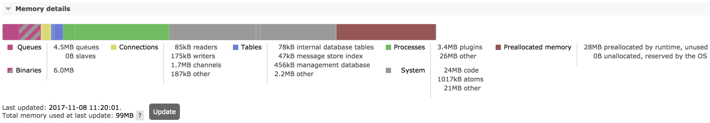
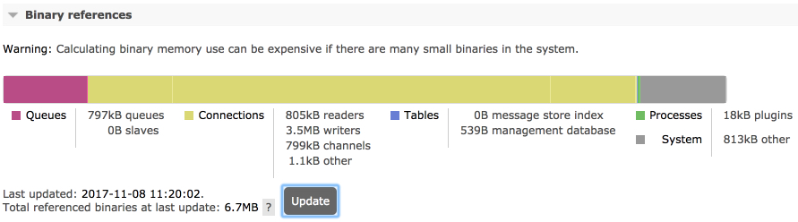
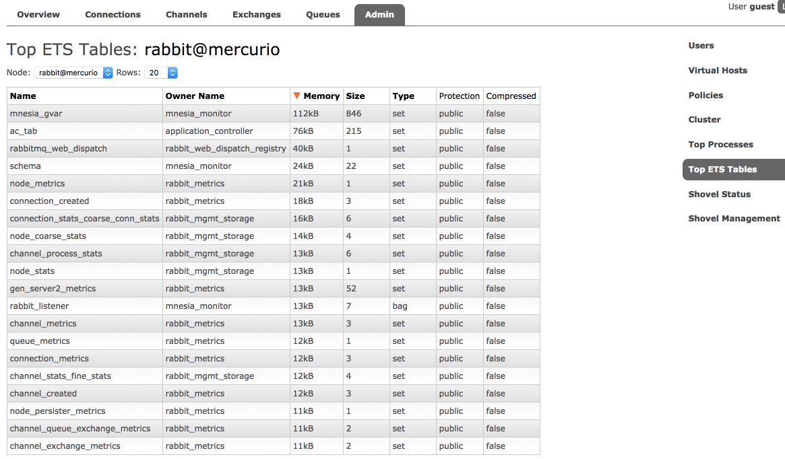

<!--
Copyright (c) 2005-2024 Broadcom. All Rights Reserved. The term "Broadcom" refers to Broadcom Inc. and/or its subsidiaries.

All rights reserved. This program and the accompanying materials
are made available under the terms of the under the Apache License,
Version 2.0 (the "License”); you may not use this file except in compliance
with the License. You may obtain a copy of the License at

https://www.apache.org/licenses/LICENSE-2.0

Unless required by applicable law or agreed to in writing, software
distributed under the License is distributed on an "AS IS" BASIS,
WITHOUT WARRANTIES OR CONDITIONS OF ANY KIND, either express or implied.
See the License for the specific language governing permissions and
limitations under the License.
-->

# Reasoning About Memory Use

## <a id="overview" class="anchor" href="#overview">Overview</a>

Operators need to be able to reason about node's memory use,
both absolute and relative ("what uses most memory"). This is an
important aspect of [system monitoring](./monitoring.html).

RabbitMQ provides tools that report and help analyse node memory use:

 * [`rabbitmq-diagnostics memory_breakdown`](./cli.html)
 * [`rabbitmq-diagnostics status`](./cli.html) includes the above breakdown as a section
 * [Prometheus and Grafana](./prometheus.html)-based monitoring makes it possible to observe memory breakdown over time
 * [Management UI](./management.html) provides the same breakdown on the node page as `rabbitmq-diagnostics status`
 * [HTTP API](./management.html#http-api) provides the same information as the management UI, useful [for monitoring](./monitoring.html)
 * [rabbitmq-top](https://github.com/rabbitmq/rabbitmq-top) and `rabbitmq-diagnostics observer` provide a more fine-grained [top](https://en.wikipedia.org/wiki/Top_(software))-like per Erlang process view

Obtaining a node memory breakdown should be the first step when reasoning about node memory use.

Note that all measurements are somewhat approximate, based on values
returned by the underlying runtime or the kernel at a specific point in
time, usually within a 5 seconds time window.

## <a id="strategies" class="anchor" href="#strategies">Total Memory Use Calculation Strategies</a>

RabbitMQ can use different strategies to compute how much memory a node uses.
Historically, nodes obtained this information from the runtime, reporting how much
memory is used (not just allocated). This strategy, known as `legacy` (alias for `erlang`) tends to
underreport and is not recommended.

Effective strategy is configured using the `vm_memory_calculation_strategy` key.
There are two primary options:

 * `rss` uses OS-specific means of querying the kernel to find
   RSS (Resident Set Size) value of the node OS process. This strategy is most precise
   and used by default on Linux, MacOS, BSD and Solaris systems. When
  this strategy is used, RabbitMQ runs short lived subprocesses once a second.

 * `allocated` is a strategy that queries runtime memory allocator
   information. It is usually quite close to the values reported by the `rss`
  strategy. This strategy is used by default on Windows.

The `vm_memory_calculation_strategy` setting also impacts
memory breakdown reporting. If set to `legacy` (`erlang`) or `allocated`,
some memory breakdown fields will not be reported. This is covered in more detail
further in this guide.

The following configuration example uses the `rss` strategy:

<pre class="lang-ini">
vm_memory_calculation_strategy = rss
</pre>

Similarly, for the `allocated` strategy, use:

<pre class="lang-ini">
vm_memory_calculation_strategy = allocated
</pre>

To find out what strategy a node uses, see its [effective configuration](configure.html).

## <a id="breakdown" class="anchor" href="#breakdown">Memory Use Breakdown</a>

A RabbitMQ node can report its memory usage breakdown. The breakdown is provided
as a list of categories (shown below) and the memory footprint of that category.

Each category is a sum of runtime-reported memory footprint of every process or table
of that kind. This means that the connections category is the sum of memory used by
all connection processes, the channels category is the sum of memory used by all channel
processes, ETS tables is the sum of memory used of all in-memory tables on the node,
and so on.

### <a id="breakdown-intro" class="anchor" href="#breakdown-intro">How Memory Breakdown Works</a>

Memory use breakdown reports allocated memory distribution on the target node, by category:

 * [Connections](#breakdown-connections) (further split into four categories: readers, writers, channels, other)
 * [Quorum queue](./quorum-queues.html) replicas
 * Classic mirrored queue leader replicas
 * Classic mirrored queue mirror (follower) replicas
 * Message Store and Indices
 * [Binary heap references](#breakdown-binaries)
 * Node-local metrics (stats database)
 * Internal database tables
 * Plugins
 * Memory allocated but not yet used
 * Code (bytecode, module metadata)
 * ETS (in memory key/value store) tables
 * Atom tables
 * Other

Generally there is no overlap between the categories (no double accounting for the same memory).
Plugins and runtime versions may affect this.

### <a id="breakdown-cli" class="anchor" href="#breakdown-cli">Producing Memory Use Breakdown Using CLI Tools</a>

A common way of producing memory breakdown is via `rabbitmq-diagnostics memory_breakdown`.

<pre class="lang-ini">
quorum_queue_procs: 0.4181 gb (28.8%)
binary: 0.4129 gb (28.44%)
allocated_unused: 0.1959 gb (13.49%)
connection_other: 0.1894 gb (13.05%)
plugins: 0.0373 gb (2.57%)
other_proc: 0.0325 gb (2.24%)
code: 0.0305 gb (2.1%)
quorum_ets: 0.0303 gb (2.09%)
connection_readers: 0.0222 gb (1.53%)
other_system: 0.0209 gb (1.44%)
connection_channels: 0.017 gb (1.17%)
mgmt_db: 0.017 gb (1.17%)
metrics: 0.0109 gb (0.75%)
other_ets: 0.0073 gb (0.5%)
connection_writers: 0.007 gb (0.48%)
atom: 0.0015 gb (0.11%)
mnesia: 0.0006 gb (0.04%)
msg_index: 0.0002 gb (0.01%)
queue_procs: 0.0002 gb (0.01%)
queue_slave_procs: 0.0 gb (0.0%)
reserved_unallocated: 0.0 gb (0.0%)
</pre>

<table>
  <thead>
    <td>Report Field</td>
    <td>Category</td>
    <td>Details</td>
  </thead>

  <tr>
    <td>total</td>
    <td></td>
    <td>Total amount as reported by the effective memory calculation strategy (see above)</td>
  </tr>

  <tr>
    <td>connection_readers</td>
    <td>Connections</td>
    <td>
      Processes responsible for connection parser and most of connection state. Most of their memory attributes
      to TCP buffers. The more client connections a node has, the more memory will be used by this category.
      See <a href="./networking.html">Networking guide</a> for more information.
    </td>
  </tr>

  <tr>
    <td>connection_writers</td>
    <td>Connections</td>
    <td>
      Processes responsible for serialisation of outgoing protocol frames and writing to client connection sockets.
      The more client connections a node has, the more memory will be used by this category.
      See <a href="./networking.html">Networking guide</a> for more information.
    </td>
  </tr>

  <tr>
    <td>connection_channels</td>
    <td>Channels</td>
    <td>The more channels client connections use, the more memory will be used by this category.</td>
  </tr>

  <tr>
    <td>connection_other</td>
    <td>Connections</td>
    <td>Other memory related to client connections</td>
  </tr>

  <tr>
    <td>quorum_queue_procs</td>
    <td>Queues</td>
    <td>
      <a href=".//quorum-queues.html">Quorum queue</a> processes, both currently elected leaders and followers.
      Memory footprint can be capped on a per-queue basis.
      See the <a href="./quorum-queues.html">Quorum Queues</a> guide for more information.
    </td>
  </tr>

  <tr>
    <td>queue_procs</td>
    <td>Queues</td>
    <td>
      Classic queue leaders, indices and messages kept in memory. The greater the number of messages enqueued,
      the more memory will generally be attributed to this section. However, this greatly depends on
      queue properties and whether messages were published as transient.
      See <a href="./memory.html">Memory</a>, <a href="./queues.html">Queues</a>, and <a href="./lazy-queues.html">Lazy Queues</a> guides
      for more information.
    </td>
  </tr>

  <tr>
    <td>queue_slave_procs</td>
    <td>Queues</td>
    <td>
      Classic queue mirrors, indices and messages kept in memory. Reducing the number of mirrors (replicas) or not mirroring queues with
      inherently transient data can reduce the amount of RAM used by mirrors. The greater the number of messages enqueued,
      the more memory will generally be attributed to this section. However, this greatly depends on
      queue properties and whether messages were published as transient.
      See <a href="./memory.html">Memory</a>, <a href="./queues.html">Queues</a>, <a href="./ha.html">Mirroring</a>, and <a href="./lazy-queues.html">Lazy Queues</a> guides
      for more information.
    </td>
  </tr>

  <tr>
    <td>metrics</td>
    <td><a href="./management.html">Stats DB</a></td>
    <td>
      Node-local metrics. The more connections, channels, queues are node hosts, the more stats there are to collect and keep.
      See <a href="./management.html">management plugin guide</a> for more information.
    </td>
  </tr>

  <tr>
    <td>stats_db</td>
    <td>Stats DB</td>
    <td>
      Aggregated and pre-computed metrics, inter-node HTTP API request cache and everything else related to the stats DB.
      See <a href="./management.html">management plugin guide</a> for more information.
    </td>
  </tr>

  <tr>
    <td>binaries</td>
    <td>Binaries</td>
    <td>Runtime binary heap. Most of this section is usually message bodies and properties (metadata).</td>
  </tr>

  <tr>
    <td>plugins</td>
    <td>Plugins</td>
    <td>
      Plugins such as <a href="./shovel.html">Shovel</a>, <a href="./federation.html">Federation</a>, or protocol implementations such as <a href="./stomp.html">STOMP</a>
      can accumulate messages in memory.
    </td>
  </tr>

  <tr>
    <td>allocated_unused</td>
    <td>Preallocated Memory</td>
    <td>Allocated by the runtime but not yet used.</td>
  </tr>

  <tr>
    <td>reserved_unallocated</td>
    <td>Preallocated Memory</td>
    <td>Allocated/reserved by the kernel but not the runtime</td>
  </tr>

  <tr>
    <td>mnesia</td>
    <td>Internal Database</td>
    <td>Virtual hosts, users, permissions, queue metadata and state, exchanges, bindings, runtime parameters and so on.</td>
  </tr>

  <tr>
    <td>quorum_ets</td>
    <td>Internal Database</td>
    <td>Raft implementation's WAL and other memory tables. Most of these are periodically moved to disk.</td>
  </tr>

  <tr>
    <td>other_ets</td>
    <td>Internal Database</td>
    <td>Some plugins can use ETS tables to store their state</td>
  </tr>

  <tr>
    <td>code</td>
    <td>Code</td>
    <td>
      Bytecode and module metadata. This should only consume double digit % of
      memory on blank/empty nodes.
    </td>
  </tr>

  <tr>
    <td>other</td>
    <td>Other</td>
    <td>
      All other processes that RabbitMQ cannot categorise
    </td>
  </tr>
</table>

## <a id="breakdown-management-ui" class="anchor" href="#breakdown-management-ui">Producing Memory Use Breakdown Using Management UI</a>

Management UI can be used to produce a memory breakdown chart. This information is available on the
node metrics page that can be accessed from Overview:

On the node metrics page, scroll down to the memory breakdown buttons:

Memory and binary heap breakdowns can be expensive to calculate and are produced on demand when the <code>Update</code> button is pressed:

It is also possible to display a breakdown of binary heap use by various
things in the system (e.g. connections, queues):

## <a id="breakdown-http-api-curl" class="anchor" href="#breakdown-http-api-curl">Producing Memory Use Breakdown Using HTTP API and curl</a>

It is possible to produce memory use breakdown over [HTTP API](./management.html)
by issuing a `GET` request to the `/api/nodes/{node}/memory` endpoint.

<pre class="lang-json">
curl -s -u guest:guest http://127.0.0.1:15672/api/nodes/rabbit@mercurio/memory | python -m json.tool

{
    "memory": {
        "atom": 1041593,
        "binary": 5133776,
        "code": 25299059,
        "connection_channels": 1823320,
        "connection_other": 150168,
        "connection_readers": 83760,
        "connection_writers": 113112,
        "metrics": 217816,
        "mgmt_db": 266560,
        "mnesia": 93344,
        "msg_index": 48880,
        "other_ets": 2294184,
        "other_proc": 27131728,
        "other_system": 21496756,
        "plugins": 3103424,
        "queue_procs": 2957624,
        "queue_slave_procs": 0,
        "total": 89870336
    }
}
</pre>

It is also possible to retrieve a relative breakdown using the
`GET` request to the `/api/nodes/{node}/memory` endpoint.
Note that reported relative values are rounded to integers. This endpoint is
intended to be used for relative comparison (identifying top contributing categories),
not precise calculations.

<pre class="lang-json">
curl -s -u guest:guest http://127.0.0.1:15672/api/nodes/rabbit@mercurio/memory/relative | python -m json.tool

{
    "memory": {
        "allocated_unused": 32,
        "atom": 1,
        "binary": 5,
        "code": 22,
        "connection_channels": 2,
        "connection_other": 1,
        "connection_readers": 1,
        "connection_writers": 1,
        "metrics": 1,
        "mgmt_db": 1,
        "mnesia": 1,
        "msg_index": 1,
        "other_ets": 2,
        "other_proc": 21,
        "other_system": 19,
        "plugins": 3,
        "queue_procs": 4,
        "queue_slave_procs": 0,
        "reserved_unallocated": 0,
        "total": 100
    }
}
</pre>

## <a id="breakdown-categories" class="anchor" href="#breakdown-categories">Memory Breakdown Categories</a>

### <a id="breakdown-connections" class="anchor" href="#breakdown-connections">Connections</a>

This includes memory used by client connections (including [Shovels](shovel.html) and [Federation links](federation.html))
and channels, and outgoing ones (Shovels and Federation upstream links). Most of the memory
is usually used by TCP buffers, which on Linux autotune to about 100 kB in size by default.
TCP buffer size can be reduced at the cost of a proportional decrease in connection throughput.
See the [Networking guide](networking.html) for details.

Channels also consume RAM. By optimising how many channels applications use, that amount
can be decreased. It is possible to cap the max number of channels on a connection using
the `channel_max` configuration setting:

<pre class="lang-ini">
channel_max = 16
</pre>

Note that some libraries and tools that build on top of RabbitMQ clients may implicitly require
a certain number of channels. Finding an optimal value is usually a matter of trial and error.

### <a id="breakdown-queues" class="anchor" href="#breakdown-queues">Queues and Messages</a>

Memory used by queues, queue indices, queue state. Messages enqueued will
in part contribute to this category.

Queues will [swap their contents out to disc when under memory pressure](./memory.html).
The exact behavior of this depends on [queue properties](queues.html),
whether clients publish messages as persistent or transient, and [persistence configuration](./persistence-conf.html) of the node.

Message bodies do not show up here but in Binaries.

### <a id="breakdown-message-store-indexes" class="anchor" href="#breakdown-message-store-indexes">Message Store Indexes</a>

By default message store uses an in-memory
index of all messages, including those paged out to disc.
Plugins allow for replacing it with disk-based implementations.

### <a id="breakdown-plugins" class="anchor" href="#breakdown-plugins">Plugins</a>

Memory used by plugins (apart from the Erlang client which
is counted under Connections, and the management database
which is counted separately). This category will include
some per-connection memory here for protocol plugins such as
STOMP and MQTT as well as messages enqueued by plugins such
as Shovel and Federation.

### <a id="breakdown-preallocated-memory" class="anchor" href="#breakdown-preallocated-memory">Preallocated Memory</a>

Memory preallocated by the runtime (VM allocators) but not yet
used. This is covered in more detail below.

### <a id="breakdown-internal-database" class="anchor" href="#breakdown-internal-database">Internal Database</a>

Internal database (Mnesia) tables keep an in-memory copy of all its data (even on disc
nodes). Typically this will only be large when there are a
large number of queues, exchanges, bindings, users or
virtual hosts. Plugins can store data in the same database as well.

### <a id="breakdown-management-stats-db" class="anchor" href="#breakdown-management-stats-db">Management (Stats) Database</a>

The stats database (if the management plugin is enabled). In
a cluster, most stats are stored locally on the
node. Cross-node requests needed to aggregate stats in a
cluster can be cached. The cached data will be reported in
this category.

### <a id="breakdown-binaries" class="anchor" href="#breakdown-binaries">Binaries</a>

Memory used by shared binary data in the runtime. Most of this
memory is message bodies and metadata.

With some workloads binary data heap can be garbage collected infrequently.
`rabbitmqctl force_gc` can be used force collection. The following
couple of commands forces collection and reports top processes that released most
binary heap references:

<pre class="lang-bash">
rabbitmqctl eval 'recon:bin_leak(10).'

rabbitmqctl force_gc
</pre>

With RabbitMQ versions that do not provide `rabbitmqctl force_gc`, use

<pre class="lang-bash">
rabbitmqctl eval 'recon:bin_leak(10).'

rabbitmqctl eval '[garbage_collect(P) || P &lt;- processes()].'
</pre>

### <a id="breakdown-ets-tables" class="anchor" href="#breakdown-ets-tables">Other ETS tables</a>

Other in-memory tables besides those belonging to the stats database
and internal database tables.

### <a id="breakdown-code" class="anchor" href="#breakdown-code">Code</a>

Memory used by code (bytecode, module metadata). This
section is usually fairly constant and relatively small
(unless the node is entirely blank and stores no data).

### <a id="breakdown-atoms" class="anchor" href="#breakdown-atoms">Atoms</a>

Memory used by atoms. Should be fairly constant.

### <a id="breakdown-top" class="anchor" href="#breakdown-top">Per-process Analysis with rabbitmq-top</a>

[rabbitmq-top](https://github.com/rabbitmq/rabbitmq-top) is a plugin that helps
identify runtime processes ("lightweight threads") that consume most memory or scheduler (CPU)
time.

The plugin ships with RabbitMQ. Enable it with

<pre class="lang-bash">
[sudo] rabbitmq-plugins enable rabbitmq_top
</pre>

The plugin adds new administrative tabs to the [management UI](./management.html). One
tab displays top processes by one of the metrics:

 * Memory used
 * Reductions (unit of scheduler/CPU consumption)
 * Erlang mailbox length
 * For `gen_server2` processes, internal operation buffer length

Second tab displays ETS (internal key/value store) tables. The tables can be sorted by
the amount of memory used or number of rows:

## <a id="preallocated-memory" class="anchor" href="#breakdown-preallocated-memory">Preallocated Memory</a>

Erlang memory breakdown reports only memory is currently being used, and not
the memory that has been allocated for later use or reserved by the operating system.
OS tools like `ps` can report more memory used than the runtime.

This memory consists of allocated but not used,
as well as unallocated but reserved by the OS. Both values depend on the OS and Erlang VM allocator
settings and can fluctuate significantly.

How the value in both sections is computed depend on the `vm_memory_calculation_strategy` setting.
If the strategy is set to `erlang`, unused
memory will not be reported.
If memory calculation strategy is set to `allocated`, memory
reserved by OS will not be reported. Therefore `rss` is the strategy
that provides most information from both the kernel and the runtime.

When a node reports a large amount of allocated but unused memory on a long running node, it may be
an indicator of runtime memory fragmentation. A different set of allocator settings can reduce fragmentation
and increase the percentage of efficiently used memory. The right set of settings depends on
the workload and message payload size distribution.

Runtime's memory allocator behavior can be tuned, please refer to
<a href="http://erlang.org/doc/man/erl.html" target="_blank" rel="noopener noreferrer">erl</a> and
<a href="http://erlang.org/doc/man/erts_alloc.html" target="_blank" rel="noopener noreferrer">erts_alloc</a>
documentation.

## <a id="page-cache" class="anchor" href="#page-cache">Kernel Page Cache</a>

Besides the memory allocated and used directly by a RabbitMQ node, files read by that node
can be cached by the operating system. This cache improves I/O operation efficiency and is
evicted (cleared) when the OS detects that a high percentage of available memory is in used.

Workloads that use [RabbitMQ streams](./streams.html) often lead to large kernel page cache size,
in particular when consumers access messages that span days or weeks.

Some monitoring tools do not include the size of page cache into process monitoring metrics. Others
add it to the residential set size (RSS)
footprint of the process. This can lead to confusion: the **page cache is not maintained or controlled
by RabbitMQ nodes. It is maintained, controlled and evicted (cleared) by the operating system kernel**.

This is particularly [common in Kubernetes-based](https://github.com/kubernetes/kubernetes/issues/43916) deployments
[that do not use cgroup v2](https://kubernetes.io/blog/2022/08/31/cgroupv2-ga-1-25/)) and run RabbitMQ
using container images based on [older distributions](https://kubernetes.io/blog/2022/08/31/cgroupv2-ga-1-25/#how-do-you-use-cgroup-v2) that use cgroups v1.

Kubernetes 1.25.0 and the following distributions are highly recommended as they
use a more reasonable approach to kernel page cache memory accounting:

 * CentOS Stream 9 or later
 * Fedora 31 or later
 * Ubuntu 21.10 or later
 * Debian 11 Bullseye or later

### What Does a Large Page Cache Size Tell Us About a Workload?

Usually a large page cache size simply indicates that the workload is I/O heavy and likely uses streams
with large data sets. It does not indicate a memory leak by the node: the cache will be cleared
by the kernel when it detects that the system runs low on available memory.

### Inspecting Page Cache without Containerization (in Virtual or Physical Machines)

In non-containerized environments (e.g. RabbitMQ nodes run in virtual machines or on bare metal hardware),
use

<pre class="lang-bash">
cat /proc/meminfo | grep -we "Cached"
</pre>

to inspect the size of the kernel page cache.

### Inspecting Page Cache Size in Containerized Environments

In containerized environments such as Kubernetes, the following two `/sys` pseudo filesystem
paths can be used to inspect both RSS and page cache footprint:

<pre class="lang-bash">
cat /sys/fs/cgroup/memory/memory.stat
cat /sys/fs/cgroup/memory/memory.usage_in_bytes
</pre>

The two key metrics are named `rss` (for resident set size) and `cache` (for page cache).

## <a id="memory-breakdown-and-monitoring" class="anchor" href="#memory-breakdown-and-monitoring">Memory Use Monitoring</a>

It is recommended that production systems monitor memory usage of all cluster nodes,
ideally with a breakdown, together with [infrastructure-level metrics](./monitoring.html).
By correlating breakdown categories with other metrics, e.g. the number of concurrent
connections or enqueued messages, it becomes possible to detect problems that
stem from an application-specific behavior (e.g. connection leaks or ever growing queues without consumers).

## <a id="queue-memory" class="anchor" href="#queue-memory">Queue Memory</a>

### <a id="message-memory-usage" class="anchor" href="#message-memory-usage">How much memory does a message use?</a>

A message has multiple parts that use up memory:

 * Payload: >= 1 byte, variable size, typically few hundred bytes to a few hundred kilobytes
 * Protocol attributes: >= 0 bytes, variable size, contains headers, priority, timestamp, reply to, etc.
 * RabbitMQ metadata: >= 720 bytes, variable size, contains exchange, routing keys, message properties, persistence, redelivery status, etc.
 * RabbitMQ message ordering structure: 16 bytes

Messages with a 1KB payload will use up 2KB of memory once attributes and metadata is factored in.

Some messages can be stored on disk, but still have their metadata kept in memory.

### <a id="queue-memory-usage" class="anchor" href="#queue-memory-usage">How much memory does a queue use?</a>

A message has multiple parts that use up memory. Every queue is backed by an Erlang process.
If a queue is replicated, each replica is a separate Erlang process running on separate cluster nodes.

Since every replica of a queue, whether leader or follower, is a single Erlang process, message ordering can be guaranteed.
Multiple queues means multiple Erlang processes which get an even amount of CPU time.
This ensures that no queue can block other queues.

The memory use of a single queue can be obtained via the HTTP API:

<pre class="lang-json">
curl -s -u guest:guest http://127.0.0.1:15672/api/queues/%2f/queue-name |
  python -m json.tool

{
    ..
    "memory": 97921904,
    ...
    "message_bytes_ram": 2153429941,
    ...
}
</pre>

 * `memory`: memory used by the queue process, accounts for message metadata (at least 720 bytes per message), does not account for message payloads over 64 bytes
 * `message_bytes_ram`: memory used by the message payloads, regardless of the size

If messages are small, message metadata can use more memory than the message payload.
10,000 messages with 1 byte of payload will use 10KB of `message_bytes_ram` (payload) &amp; 7MB of `memory` (metadata).

If message payloads are large, they will not be reflected in the queue process memory.
10,000 messages with 100 KB of payload will use 976MB of `message_bytes_ram` (payload) &amp; 7MB of `memory` (metadata).

### <a id="queue-memory-usage-dynamics" class="anchor" href="#queue-memory-usage-dynamics">Why does the queue memory grow and shrink when publishing/consuming?</a>

Erlang uses [generational garbage collection](https://www.erlang-solutions.com/blog/erlang-19-0-garbage-collector.html) for each Erlang process.
Garbage collection is done per queue, independently of all other Erlang processes.

When garbage collection runs, it will copy used process memory before deallocating unused memory.
This can lead to the queue process using up to twice as much memory during garbage collection, as shown here (queue contains a lot of messages):

### <a id="queue-memory-usage-gc" class="anchor" href="#queue-memory-usage-gc">Is queue memory growth during garbage collection a concern?</a>

If Erlang VM tries to allocate more memory than is available, the VM itself will either crash or be killed by the OOM killer.
When the Erlang VM crashes, RabbitMQ will lose all non-persistent data.

High memory watermark blocks publishers and prevents new messages from being enqueued.
Since garbage collection can double the memory used by a queue, it is unsafe to set the high memory watermark above `0.5`.
The default high memory watermark is set to `0.4` since this is safer as not all memory is used by queues.
This is entirely workload specific, which differs across RabbitMQ deployments.

We recommend many queues so that memory allocation / garbage collection is spread across many Erlang processes.

If the messages in a queue take up a lot of memory, we recommend lazy queues so that they are stored on disk
as soon as possible and not kept in memory longer than is necessary.
