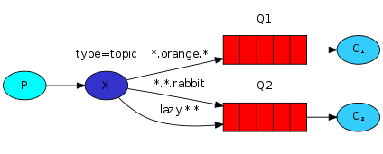

<!--
Copyright (c) 2005-2024 Broadcom. All Rights Reserved. The term "Broadcom" refers to Broadcom Inc. and/or its subsidiaries.

All rights reserved. This program and the accompanying materials
are made available under the terms of the under the Apache License,
Version 2.0 (the "License”); you may not use this file except in compliance
with the License. You may obtain a copy of the License at

https://www.apache.org/licenses/LICENSE-2.0

Unless required by applicable law or agreed to in writing, software
distributed under the License is distributed on an "AS IS" BASIS,
WITHOUT WARRANTIES OR CONDITIONS OF ANY KIND, either express or implied.
See the License for the specific language governing permissions and
limitations under the License.
-->
# RabbitMQ tutorial - Topics SUPPRESS-RHS

## Topics
### (using the amqp Elixir library)

<xi:include href="site/tutorials/tutorials-help.xml.inc"/>

In the [previous tutorial](tutorial-four-elixir.html) we improved our
logging system. Instead of using a `fanout` exchange only capable of
dummy broadcasting, we used a `direct` one, and gained a possibility
of selectively receiving the logs.

Although using the `direct` exchange improved our system, it still has
limitations - it can't do routing based on multiple criteria.

In our logging system we might want to subscribe to not only logs
based on severity, but also based on the source which emitted the log.
You might know this concept from the
[`syslog`](http://en.wikipedia.org/wiki/Syslog) unix tool, which
routes logs based on both severity (info/warn/crit...) and facility
(auth/cron/kern...).

That would give us a lot of flexibility - we may want to listen to
just critical errors coming from 'cron' but also all logs from 'kern'.

To implement that in our logging system we need to learn about a more
complex `topic` exchange.

Topic exchange
--------------

Messages sent to a `topic` exchange can't have an arbitrary
`routing_key` - it must be a list of words, delimited by dots. The
words can be anything, but usually they specify some features
connected to the message. A few valid routing key examples:
"`stock.usd.nyse`", "`nyse.vmw`", "`quick.orange.rabbit`". There can be as
many words in the routing key as you like, up to the limit of 255
bytes.

The binding key must also be in the same form. The logic behind the
`topic` exchange is similar to a `direct` one - a message sent with a
particular routing key will be delivered to all the queues that are
bound with a matching binding key. However there are two important
special cases for binding keys:

  * `*` (star) can substitute for exactly one word.
  * `#` (hash) can substitute for zero or more words.

It's easiest to explain this in an example:

  
  

    digraph {
      bgcolor=transparent;
      truecolor=true;
      rankdir=LR;
      node [style="filled"];
      //
      P [label="P", fillcolor="#00ffff"];
      subgraph cluster_X1 {
        label="type=topic";
	color=transparent;
        X [label="X", fillcolor="#3333CC"];
      };
      subgraph cluster_Q1 {
        label="Q1";
	color=transparent;
        Q1 [label="{||||}", fillcolor="red", shape="record"];
      };
      subgraph cluster_Q2 {
        label="Q2";
	color=transparent;
        Q2 [label="{||||}", fillcolor="red", shape="record"];
      };
      C1 [label=&lt;C&lt;font point-size="7"&gt;1&lt;/font&gt;&gt;, fillcolor="#33ccff"];
      C2 [label=&lt;C&lt;font point-size="7"&gt;2&lt;/font&gt;&gt;, fillcolor="#33ccff"];
      //
      P -&gt; X;
      X -&gt; Q1 [label="*.orange.*"];
      X -&gt; Q2 [label="*.*.rabbit"];
      X -&gt; Q2 [label="lazy.#"];
      Q1 -&gt; C1;
      Q2 -&gt; C2;
    }
  

In this example, we're going to send messages which all describe
animals. The messages will be sent with a routing key that consists of
three words (two dots). The first word in the routing key
will describe a celerity, second a colour and third a species:
"`<celerity>.<colour>.<species>`".

We created three bindings: Q1 is bound with binding key "`*.orange.*`"
and Q2 with "`*.*.rabbit`" and "`lazy.#`".

These bindings can be summarised as:

  * Q1 is interested in all the orange animals.
  * Q2 wants to hear everything about rabbits, and everything about lazy
    animals.

A message with a routing key set to "`quick.orange.rabbit`"
will be delivered to both queues. Message
"`lazy.orange.elephant`" also will go to both of them. On the other hand
"`quick.orange.fox`" will only go to the first queue, and
"`lazy.brown.fox`" only to the second. "`lazy.pink.rabbit`" will
be delivered to the second queue only once, even though it matches two bindings.
"`quick.brown.fox`" doesn't match any binding so it will be discarded.

What happens if we break our contract and send a message with one or
four words, like "`orange`" or "`quick.orange.new.rabbit`"? Well,
these messages won't match any bindings and will be lost.

On the other hand "`lazy.orange.new.rabbit`", even though it has four
words, will match the last binding and will be delivered to the second
queue.

> #### Topic exchange
>
> Topic exchange is powerful and can behave like other exchanges.
>
> When a queue is bound with "`#`" (hash) binding key - it will receive
> all the messages, regardless of the routing key - like in `fanout` exchange.
>
> When special characters "`*`" (star) and "`#`" (hash) aren't used in bindings,
> the topic exchange will behave just like a `direct` one.

Putting it all together
-----------------------

We're going to use a `topic` exchange in our logging system. We'll
start off with a working assumption that the routing keys of logs will
have two words: "`<facility>.<severity>`".

The code is almost the same as in the
[previous tutorial](tutorial-four-elixir.html).

The code for `emit_log_topic.exs`:

<pre class="lang-elixir">
{:ok, connection} = AMQP.Connection.open
{:ok, channel} = AMQP.Channel.open(connection)

{topic, message} =
  System.argv
  |> case do
    []            -> {"anonymous.info", "Hello World!"}
    [message]     -> {"anonymous.info", message}
    [topic|words] -> {topic, Enum.join(words, " ")}
  end

AMQP.Exchange.declare(channel, "topic_logs", :topic)

AMQP.Basic.publish(channel, "topic_logs", topic, message)
IO.puts " [x] Sent '[#{topic}] #{message}'"

AMQP.Connection.close(connection)
</pre>

The code for `receive_logs_topic.exs`:

<pre class="lang-elixir">
defmodule ReceiveLogsTopic do
  def wait_for_messages(channel) do
    receive do
      {:basic_deliver, payload, meta} ->
      IO.puts " [x] Received [#{meta.routing_key}] #{payload}"

      wait_for_messages(channel)
    end
  end
end

{:ok, connection} = AMQP.Connection.open
{:ok, channel} = AMQP.Channel.open(connection)

AMQP.Exchange.declare(channel, "topic_logs", :topic)

{:ok, %{queue: queue_name}} = AMQP.Queue.declare(channel, "", exclusive: true)

if length(System.argv) == 0 do
  IO.puts "Usage: mix run receive_logs_topic.exs [binding_key]..."
  System.halt(1)
end
for binding_key &lt;- System.argv do
  AMQP.Queue.bind(channel, queue_name, "topic_logs", routing_key: binding_key)
end

AMQP.Basic.consume(channel, queue_name, nil, no_ack: true)

IO.puts " [*] Waiting for messages. To exit press CTRL+C, CTRL+C"

ReceiveLogsTopic.wait_for_messages(channel)
</pre>

To receive all the logs run:

<pre class="lang-bash">
mix run receive_logs_topic.exs "#"
</pre>

To receive all logs from the facility "`kern`":

<pre class="lang-bash">
mix run receive_logs_topic.exs "kern.*"
</pre>

Or if you want to hear only about "`critical`" logs:

<pre class="lang-bash">
mix run receive_logs_topic.exs "*.critical"
</pre>

You can create multiple bindings:

<pre class="lang-bash">
mix run receive_logs_topic.exs "kern.*" "*.critical"
</pre>

And to emit a log with a routing key "`kern.critical`" type:

<pre class="lang-bash">
mix run emit_log_topic.exs "kern.critical" "A critical kernel error"
</pre>

Have fun playing with these programs. Note that the code doesn't make
any assumption about the routing or binding keys, you may want to play
with more than two routing key parameters.

(Full source code for [emit_logs_topic.exs](https://github.com/rabbitmq/rabbitmq-tutorials/blob/main/elixir/emit_log_topic.exs)
and [receive_logs_topic.exs](https://github.com/rabbitmq/rabbitmq-tutorials/blob/main/elixir/receive_logs_topic.exs))

Move on to [tutorial 6](tutorial-six-elixir.html) to learn about *RPC*.
