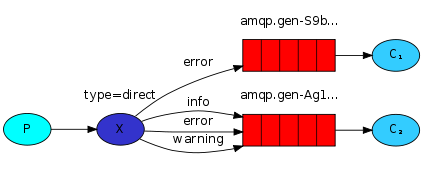

<!--
Copyright (c) 2005-2024 Broadcom. All Rights Reserved. The term "Broadcom" refers to Broadcom Inc. and/or its subsidiaries.

All rights reserved. This program and the accompanying materials
are made available under the terms of the under the Apache License,
Version 2.0 (the "License”); you may not use this file except in compliance
with the License. You may obtain a copy of the License at

https://www.apache.org/licenses/LICENSE-2.0

Unless required by applicable law or agreed to in writing, software
distributed under the License is distributed on an "AS IS" BASIS,
WITHOUT WARRANTIES OR CONDITIONS OF ANY KIND, either express or implied.
See the License for the specific language governing permissions and
limitations under the License.
-->
# RabbitMQ tutorial - Routing SUPPRESS-RHS

## Routing

### (using Spring AMQP)

<xi:include href="site/tutorials/tutorials-help.xml.inc"/>

In the [previous tutorial](tutorial-three-spring-amqp.html) we built a
simple fanout exchange. We were able to broadcast messages to many
receivers.

In this tutorial we're going to add a feature to it - we're going to
make it possible to subscribe only to a subset of the messages. For
example, we will be able to direct only  messages to the
certain colors of interest ("orange", "black", "green"), while still being
able to print all of the messages on the console.

Bindings
--------

In previous examples we were already creating bindings. You may recall
code like this in our `Tut3Config` file:

<pre class="lang-java">
@Bean
public Binding binding1(FanoutExchange fanout,
    Queue autoDeleteQueue1) {
    return BindingBuilder.bind(autoDeleteQueue1).to(fanout);
}
</pre>

A binding is a relationship between an exchange and a queue. This can
be simply read as: the queue is interested in messages from this
exchange.

Bindings can take an extra binding key parameter. Spring AMQP uses
a fluent API to make this relationship very clear. We pass in
the exchange and queue into the `BindingBuilder` and simply bind
the queue "to" the exchange "with a binding key" as follows:

<pre class="lang-java">
@Bean
public Binding binding1a(DirectExchange direct,
    Queue autoDeleteQueue1) {
    return BindingBuilder.bind(autoDeleteQueue1)
        .to(direct)
        .with("orange");
}
</pre>

The meaning of a binding key depends on the exchange type. The
`fanout` exchanges, which we used previously, simply ignored its
value.

Direct exchange
---------------

Our messaging system from the previous tutorial broadcasts all messages
to all consumers. We want to extend that to allow filtering messages
based on their color type. For example, we may want a program which
writes log messages to the disk to only receive critical errors, and
not waste disk space on warning or info log messages.

We were using a `fanout` exchange, which doesn't give us much
flexibility - it's only capable of mindless broadcasting.

We will use a `direct` exchange instead. The routing algorithm behind
a `direct` exchange is simple - a message goes to the queues whose
binding key exactly matches the routing key of the message.

To illustrate that, consider the following setup:

  
  

    digraph {
      bgcolor=transparent;
      truecolor=true;
      rankdir=LR;
      node [style="filled"];
      //
      P [label="P", fillcolor="#00ffff"];
      subgraph cluster_X1 {
        label="type=direct";
	color=transparent;
        X [label="X", fillcolor="#3333CC"];
      };
      subgraph cluster_Q1 {
        label="Q1";
	color=transparent;
        Q1 [label="{||||}", fillcolor="red", shape="record"];
      };
      subgraph cluster_Q2 {
        label="Q2";
	color=transparent;
        Q2 [label="{||||}", fillcolor="red", shape="record"];
      };
      C1 [label=&lt;C&lt;font point-size="7"&gt;1&lt;/font&gt;&gt;, fillcolor="#33ccff"];
      C2 [label=&lt;C&lt;font point-size="7"&gt;2&lt;/font&gt;&gt;, fillcolor="#33ccff"];
      //
      P -&gt; X;
      X -&gt; Q1 [label="orange"];
      X -&gt; Q2 [label="black"];
      X -&gt; Q2 [label="green"];
      Q1 -&gt; C1;
      Q2 -&gt; C2;
    }
  

In this setup, we can see the `direct` exchange `X` with two queues bound
to it. The first queue is bound with binding key `orange`, and the second
has two bindings, one with binding key `black` and the other one
with `green`.

In such a setup a message published to the exchange with a routing key
`orange` will be routed to queue `Q1`. Messages with a routing key of `black`
or `green` will go to `Q2`. All other messages will be discarded.

Multiple bindings
-----------------

  
  

    digraph {
      bgcolor=transparent;
      truecolor=true;
      rankdir=LR;
      node [style="filled"];
      //
      P [label="P", fillcolor="#00ffff"];
      subgraph cluster_X1 {
        label="type=direct";
	color=transparent;
        X [label="X", fillcolor="#3333CC"];
      };
      subgraph cluster_Q1 {
        label="Q1";
	color=transparent;
        Q1 [label="{||||}", fillcolor="red", shape="record"];
      };
      subgraph cluster_Q2 {
        label="Q2";
	color=transparent;
        Q2 [label="{||||}", fillcolor="red", shape="record"];
      };
      C1 [label=&lt;C&lt;font point-size="7"&gt;1&lt;/font&gt;&gt;, fillcolor="#33ccff"];
      C2 [label=&lt;C&lt;font point-size="7"&gt;2&lt;/font&gt;&gt;, fillcolor="#33ccff"];
      //
      P -&gt; X;
      X -&gt; Q1 [label="black"];
      X -&gt; Q2 [label="black"];
      Q1 -&gt; C1;
      Q2 -&gt; C2;
    }
  

It is perfectly legal to bind multiple queues with the same binding
key. In our example we could add a binding between `X` and `Q1` with
binding key `black`. In that case, the `direct` exchange will behave
like `fanout` and will broadcast the message to all the matching
queues. A message with routing key `black` will be delivered to both
`Q1` and `Q2`.

Publishing messages
-------------

We'll use this model for our routing system. Instead of `fanout` we'll
send messages to a `direct` exchange. We will supply the color as
a routing key. That way the receiving program will be able to select
the color it wants to receive (or subscribe to). Let's focus on sending
messages first.

As always, we do some spring boot configuration in `Tut4Config`:

<pre class="lang-java">
@Bean
public DirectExchange direct() {
    return new DirectExchange("tut.direct");
}
</pre>

And we're ready to send a message. Colors, as in the diagram, can be one
of 'orange', 'black', or 'green'.

Subscribing
-----------

Receiving messages will work just like in the previous tutorial, with
one exception - we're going to create a new binding for each color
we're interested in. This also goes into the `Tut4Config`:

<pre class="lang-java">
@Bean
public DirectExchange direct() {
    return new DirectExchange("tut.direct");
}
...
@Bean
public Binding binding1a(DirectExchange direct,
    Queue autoDeleteQueue1) {
    return BindingBuilder.bind(autoDeleteQueue1)
        .to(direct)
        .with("orange");
}
</pre>

Putting it all together
-----------------------

  
  

    digraph {
      bgcolor=transparent;
      truecolor=true;
      rankdir=LR;
      node [style="filled"];
      //
      P [label="P", fillcolor="#00ffff"];
      subgraph cluster_X1 {
        label="type=direct";
	color=transparent;
        X [label="X", fillcolor="#3333CC"];
      };
      subgraph cluster_Q2 {
        label="amqp.gen-S9b...";
	color=transparent;
        Q2 [label="{||||}", fillcolor="red", shape="record"];
      };
      subgraph cluster_Q1 {
        label="amqp.gen-Ag1...";
	color=transparent;
        Q1 [label="{||||}", fillcolor="red", shape="record"];
      };
      C1 [label=&lt;C&lt;font point-size="7"&gt;1&lt;/font&gt;&gt;, fillcolor="#33ccff"];
      C2 [label=&lt;C&lt;font point-size="7"&gt;2&lt;/font&gt;&gt;, fillcolor="#33ccff"];
      //
      P -&gt; X;
      X -&gt; Q1 [label="info"];
      X -&gt; Q1 [label="error"];
      X -&gt; Q1 [label="warning"];
      X -&gt; Q2 [label="error"];
      Q1 -&gt; C2;
      Q2 -&gt; C1;
    }
  

As in the previous tutorials, create a new package for this tutorial called
`tut4` and create the `Tut4Config` class. The code for `Tut4Config.java` class:

<pre class="lang-java">
import org.springframework.amqp.core.*;
import org.springframework.context.annotation.Bean;
import org.springframework.context.annotation.Configuration;
import org.springframework.context.annotation.Profile;

@Profile({"tut4","routing"})
@Configuration
public class Tut4Config {

	@Bean
	public DirectExchange direct() {
		return new DirectExchange("tut.direct");
	}

	@Profile("receiver")
	private static class ReceiverConfig {

		@Bean
		public Queue autoDeleteQueue1() {
			return new AnonymousQueue();
		}

		@Bean
		public Queue autoDeleteQueue2() {
			return new AnonymousQueue();
		}

		@Bean
		public Binding binding1a(DirectExchange direct,
		    Queue autoDeleteQueue1) {
			return BindingBuilder.bind(autoDeleteQueue1)
			    .to(direct)
			    .with("orange");
		}

		@Bean
		public Binding binding1b(DirectExchange direct,
		    Queue autoDeleteQueue1) {
			return BindingBuilder.bind(autoDeleteQueue1)
			    .to(direct)
			    .with("black");
		}

		@Bean
		public Binding binding2a(DirectExchange direct,
		    Queue autoDeleteQueue2) {
			return BindingBuilder.bind(autoDeleteQueue2)
			    .to(direct)
			    .with("green");
		}

		@Bean
		public Binding binding2b(DirectExchange direct,
		    Queue autoDeleteQueue2) {
			return BindingBuilder.bind(autoDeleteQueue2)
			    .to(direct)
			    .with("black");
		}

		@Bean
		public Tut4Receiver receiver() {
	 	 	return new Tut4Receiver();
		}
	}

	@Profile("sender")
	@Bean
	public Tut4Sender sender() {
		return new Tut4Sender();
	}
}
</pre>

The code for our sender class is:

<pre class="lang-java">
package org.springframework.amqp.tutorials.tut4;

import org.springframework.amqp.core.DirectExchange;
import org.springframework.amqp.rabbit.core.RabbitTemplate;
import org.springframework.beans.factory.annotation.Autowired;
import org.springframework.scheduling.annotation.Scheduled;
import java.util.concurrent.atomic.AtomicInteger;

public class Tut4Sender {

	@Autowired
	private RabbitTemplate template;

	@Autowired
	private DirectExchange direct;

	AtomicInteger index = new AtomicInteger(0);

	AtomicInteger count = new AtomicInteger(0);

	private final String[] keys = {"orange", "black", "green"};

	@Scheduled(fixedDelay = 1000, initialDelay = 500)
	public void send() {
		StringBuilder builder = new StringBuilder("Hello to ");
		if (this.index.incrementAndGet() == 3) {
			this.index.set(0);
		}
		String key = keys[this.index.get()];
		builder.append(key).append(' ');
		builder.append(this.count.get());
		String message = builder.toString();
		template.convertAndSend(direct.getName(), key, message);
		System.out.println(" [x] Sent '" + message + "'");
	}

}
</pre>

The code for `Tut4Receiver.java` is:

<pre class="lang-java">
import org.springframework.amqp.rabbit.annotation.RabbitListener;
import org.springframework.util.StopWatch;

public class Tut4Receiver {

	@RabbitListener(queues = "#{autoDeleteQueue1.name}")
	public void receive1(String in) throws InterruptedException {
		receive(in, 1);
	}

	@RabbitListener(queues = "#{autoDeleteQueue2.name}")
	public void receive2(String in) throws InterruptedException {
		receive(in, 2);
	}

	public void receive(String in, int receiver) throws InterruptedException {
		StopWatch watch = new StopWatch();
		watch.start();
		System.out.println("instance " + receiver + " [x] Received '" + in + "'");
		doWork(in);
		watch.stop();
		System.out.println("instance " + receiver + " [x] Done in " +
		    watch.getTotalTimeSeconds() + "s");
	}

	private void doWork(String in) throws InterruptedException {
		for (char ch : in.toCharArray()) {
			if (ch == '.') {
				Thread.sleep(1000);
			}
		}
	}

}
</pre>

Compile as usual (see [tutorial one](tutorial-one-spring-amqp.html)
for maven compilation and executing the options from the jar).

<pre class="lang-bash">
./mvnw clean package
</pre>

In one terminal window you can run:

<pre class="lang-bash">
java -jar target/rabbitmq-tutorials.jar \
    --spring.profiles.active=routing,receiver \
    --tutorial.client.duration=60000
</pre>

and in the other terminal window run the sender:

<pre class="lang-bash">
java -jar target/rabbitmq-tutorials.jar \
    --spring.profiles.active=routing,sender \
    --tutorial.client.duration=60000
</pre>

Full source code for [Tut4Receiver.java source](https://github.com/rabbitmq/rabbitmq-tutorials/blob/main/spring-amqp/src/main/java/org/springframework/amqp/tutorials/tut4/Tut4Receiver.java)
and [Tut4Sender.java source](https://github.com/rabbitmq/rabbitmq-tutorials/blob/main/spring-amqp/src/main/java/org/springframework/amqp/tutorials/tut4/Tut4Sender.java).
The configuration is in [Tut4Config.java source](https://github.com/rabbitmq/rabbitmq-tutorials/blob/main/spring-amqp/src/main/java/org/springframework/amqp/tutorials/tut4/Tut4Config.java).

Move on to [tutorial 5](tutorial-five-spring-amqp.html) to find out how to listen
for messages based on a pattern.
