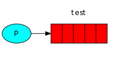
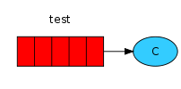

# RabbitMQ tutorial - "Hello world!" SUPPRESS-RHS

## Introduction

<xi:include href="site/tutorials/tutorials-help.xml.inc"/>
<xi:include href="site/tutorials/tutorials-intro.xml.inc"/>

Hello World!
------------
### (using the amqp Elixir library)

In this part of the tutorial we'll write two small programs in Elixir; a
producer (sender) that sends a single message, and a consumer (receiver) that receives
messages and prints them out. It's a "Hello World" of messaging.

In the diagram below, "P" is our producer and "C" is our consumer. The
box in the middle is a queue - a message buffer that RabbitMQ keeps
on behalf of the consumer.

Our overall design will look like:

   Queue -> Consuming: send and receive messages from a named queue."/>
  

digraph G {
      bgcolor=transparent;
      truecolor=true;
      rankdir=LR;
      node [style="filled"];
      //
      P1 [label="P", fillcolor="#00ffff"];
      subgraph cluster_Q1 {
        label="hello";
	color=transparent;
        Q1 [label="{||||}", fillcolor="red", shape="record"];
      };
      C1 [label="C", fillcolor="#33ccff"];
      //
      P1 -> Q1 -> C1;
}

> #### RabbitMQ libraries
>
> RabbitMQ speaks multiple protocols. This tutorial uses AMQP 0-9-1, which is an open, general-purpose
> protocol for messaging. There are a number of clients for RabbitMQ
> in [many different languages](../devtools.html).  In this tutorial
> series we're going to use [amqp](http://github.com/pma/amqp).
>
> To install it you can use the [`hex`](http://hex.pm/) package
> management tool. Let's make a new project.
>
> <pre class="lang-bash">
> mix new rabbitmq_tutorials
> cd rabbitmq_tutorials
> </pre>
>
> Now let's add the dependency on the `amqp` library. Please modify the `applications` and `deps`
> sections of your `mix.exs` file to match below:
>
> <pre class="lang-elixir">
> def application do
>   [applications: [:amqp]]
> end
> defp deps() do
>   [
>     {:amqp, "~> 3.3"},
>   ]
> end
> </pre>
>
> The `application` section of `mix.exs` will ensure that the `amqp` dependency will
> be loaded and started when your project runs. The `deps` section declares which external
> libraries your project needs. We will now use `mix` to retrieve and compile the `amqp` library.
>
> <pre class="lang-bash">
> mix deps.get
> mix deps.compile
> </pre>
>
> The `amqp` library will now be loaded and available to your project when executed via `mix run`.
>

### Sending

   [|||]" />
  

  digraph {
      bgcolor=transparent;
      truecolor=true;
      rankdir=LR;
      node [style="filled"];
      //
      P1 [label="P", fillcolor="#00ffff"];
      subgraph cluster_Q1 {
        label="hello";
        color=transparent;
        Q1 [label="{||||}", fillcolor="red", shape="record"];
      };
      //
      P1 -> Q1;
  }
  

Our first program `send.exs` will send a single message to a queue. The first thing we need to do is to establish a connection with RabbitMQ server.

<pre class="lang-elixir">
{:ok, connection} = AMQP.Connection.open
{:ok, channel} = AMQP.Channel.open(connection)
</pre>

We're connected now, to a broker on the local machine. By default, [AMQP.Connection.open](http://hexdocs.pm/amqp/AMQP.Connection.html#open/1)
connects to _localhost_. If we wanted to connect to a broker on a different
machine we'd simply specify its name or IP address as the `host: ` option.

Next, before sending we need to make sure the recipient queue
exists. If we send a message to non-existing location, RabbitMQ will
just trash the message. Let's create a queue to which the message will
be delivered, let's name it _hello_:

<pre class="lang-elixir">
AMQP.Queue.declare(channel, "hello")
</pre>

At that point we're ready to send a message. Our first message will
just contain a string _Hello World!_ and we want to send it to our
_hello_ queue.

In RabbitMQ a message can never be sent directly to the queue, it always
needs to go through an _exchange_. But let's not get dragged down by the
details &#8210; you can read more about _exchanges_ in [the third part of this
tutorial](tutorial-three-elixir.html). All we need to know now is how to use a default exchange
identified by an empty string. This exchange is special &#8210; it
allows us to specify exactly to which queue the message should go.
The queue name needs to be specified in the `routing_key` parameter:

<pre class="lang-elixir">
AMQP.Basic.publish(channel, "", "hello", "Hello World!")
IO.puts " [x] Sent 'Hello World!'"
</pre>

Before exiting the program we need to make sure the network buffers
were flushed and our message was actually delivered to RabbitMQ. We
can do it by gently closing the connection.

<pre class="lang-elixir">
AMQP.Connection.close(connection)
</pre>

[Here's the whole send.exs script](https://github.com/rabbitmq/rabbitmq-tutorials/blob/main/elixir/send.exs).

> #### Sending doesn't work!
>
> If this is your first time using RabbitMQ and you don't see the "Sent"
> message then you may be left scratching your head wondering what could
> be wrong. Maybe the broker was started without enough free disk space
> (by default it needs at least 200 MB free) and is therefore refusing to
> accept messages. Check the broker logfile to confirm and reduce the
> limit if necessary. The <a
> href="https://www.rabbitmq.com/configure.html#config-items">configuration
> file documentation</a> will show you how to set <code>disk_free_limit</code>.

### Receiving

That's it for our producer. Our consumer listens for messages from
RabbitMQ, so unlike the producer which publishes a single message,
we'll keep the consumer running to listen for messages and print them out.

   (C)" />
  

  digraph {
      bgcolor=transparent;
      truecolor=true;
      rankdir=LR;
      node [style="filled"];
      //
      subgraph cluster_Q1 {
        label="hello";
	color=transparent;
	Q1 [label="{||||}", fillcolor="red", shape="record"];
      };
      C1 [label="C", fillcolor="#33ccff"];
      //
      Q1 -> C1;
  }
  

Our second program `receive.exs` will receive messages from the queue
and print them on the screen.

Again, first we need to connect to RabbitMQ server. The code
responsible for connecting to Rabbit is the same as previously.

The next step, just like before, is to make sure that the queue
exists. Creating a queue using `AMQP.Queue.declare` is idempotent &#8210; we
can run the command as many times as we like, and only one will be
created.

<pre class="lang-elixir">
AMQP.Queue.declare(channel, "hello")
</pre>

You may ask why we declare the queue again &#8210; we have already declared it
in our previous code. We could avoid that if we were sure
that the queue already exists. For example if `send.exs` program was
run before. But we're not yet sure which
program to run first. In such cases it's a good practice to repeat
declaring the queue in both programs.

Receiving messages from the queue is more complex. It works by sending
Elixir messages to an Elixir process. Whenever the client library
receives a delivery from RabbitMQ, a `{:basic_deliver, payload, metadata}`
Elixir message is sent to the specified Elixir process. We can then
handle the payload and metadata any way we like.  In our case we will
print on the screen the contents of the message.

<pre class="lang-elixir">
defmodule Receive do
  def wait_for_messages do
    receive do
      {:basic_deliver, payload, _meta} ->
        IO.puts " [x] Received #{payload}"
        wait_for_messages()
    end
  end
end
</pre>

Next, we need to tell RabbitMQ that this particular process should
receive messages from our _hello_ queue:

<pre class="lang-elixir">
AMQP.Basic.consume(channel,
                   "hello",
                   nil, # consumer process, defaults to self()
                   no_ack: true)
</pre>

For that command to succeed we must be sure that a queue which we want
to subscribe to exists. Fortunately we're confident about that &#8210; we've
created a queue above &#8210; using `AMQP.Queue.declare`.

> #### Listing queues
>
> You may wish to see what queues RabbitMQ has and how many
> messages are in them. You can do it (as a privileged user) using the `rabbitmqctl` tool:
>
> <pre class="lang-bash">
> sudo rabbitmqctl list_queues
> </pre>
>
> On Windows, omit the sudo:
> <pre class="lang-powershell">
> rabbitmqctl.bat list_queues
> </pre>

The `no_ack` parameter will be described [later on](tutorial-two-elixir.html).

And finally, we enter a never-ending recursion that waits for data and displays messages
whenever necessary.

<pre class="lang-elixir">
IO.puts " [*] Waiting for messages. To exit press CTRL+C, CTRL+C"
Receive.wait_for_messages()
</pre>

### Putting it all together

Full code for `send.exs`:

<pre class="lang-elixir">
{:ok, connection} = AMQP.Connection.open
{:ok, channel} = AMQP.Channel.open(connection)
AMQP.Queue.declare(channel, "hello")
AMQP.Basic.publish(channel, "", "hello", "Hello World!")
IO.puts " [x] Sent 'Hello World!'"
AMQP.Connection.close(connection)
</pre>

[(send.exs source)](http://github.com/rabbitmq/rabbitmq-tutorials/blob/main/elixir/send.exs)

Full `receive.exs` code:

<pre class="lang-elixir">
defmodule Receive do
  def wait_for_messages do
    receive do
      {:basic_deliver, payload, _meta} ->
        IO.puts " [x] Received #{payload}"
        wait_for_messages()
    end
  end
end

{:ok, connection} = AMQP.Connection.open
{:ok, channel} = AMQP.Channel.open(connection)
AMQP.Queue.declare(channel, "hello")
AMQP.Basic.consume(channel, "hello", nil, no_ack: true)
IO.puts " [*] Waiting for messages. To exit press CTRL+C, CTRL+C"

Receive.wait_for_messages()
</pre>

[(receive.exs source)](http://github.com/rabbitmq/rabbitmq-tutorials/blob/main/elixir/receive.exs)

Now we can try out our programs in a terminal. First, let's start
a consumer, which will run continuously waiting for deliveries:

<pre class="lang-bash">
mix run receive.exs
# => [*] Waiting for messages. To exit press CTRL+C, CTRL+C
# ...
# => [x] Received Hello World!
</pre>

Now start the producer. The producer program will stop after every run:

<pre class="lang-bash">
mix run send.exs
# => [x] Sent 'Hello World!'
</pre>

Hurray! We were able to send our first message through RabbitMQ. As you might
have noticed, the `receive.exs` program doesn't exit. It will stay ready to
receive further messages, and may be interrupted with Ctrl-C, Ctrl-C.

Try to run `send.exs` again in a new terminal.

We've learned how to send and receive a message from a named
queue. It's time to move on to [part 2](tutorial-two-elixir.html)
and build a simple _work queue_.
