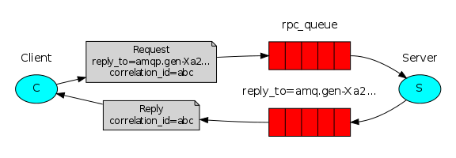

<!--
Copyright (c) 2005-2024 Broadcom. All Rights Reserved. The term "Broadcom" refers to Broadcom Inc. and/or its subsidiaries.

All rights reserved. This program and the accompanying materials
are made available under the terms of the under the Apache License,
Version 2.0 (the "License”); you may not use this file except in compliance
with the License. You may obtain a copy of the License at

https://www.apache.org/licenses/LICENSE-2.0

Unless required by applicable law or agreed to in writing, software
distributed under the License is distributed on an "AS IS" BASIS,
WITHOUT WARRANTIES OR CONDITIONS OF ANY KIND, either express or implied.
See the License for the specific language governing permissions and
limitations under the License.
-->
# RabbitMQ tutorial - Remote procedure call (RPC) SUPPRESS-RHS

## Remote procedure call (RPC)
### (using the Pika Python client)

<xi:include href="site/tutorials/tutorials-help.xml.inc"/>

### Prerequisites

As with other Python tutorials, we will use the [Pika](https://pypi.python.org/pypi/pika) RabbitMQ client
[version 1.0.0](https://pika.readthedocs.io/en/stable/).

### What This Tutorial Focuses On

In the [second tutorial](tutorial-two-python.html) we learned how to
use _Work Queues_ to distribute time-consuming tasks among multiple
workers.

But what if we need to run a function on a remote computer and wait for
the result?  Well, that's a different story. This pattern is commonly
known as _Remote Procedure Call_ or _RPC_.

In this tutorial we're going to use RabbitMQ to build an RPC system: a
client and a scalable RPC server. As we don't have any time-consuming
tasks that are worth distributing, we're going to create a dummy RPC
service that returns Fibonacci numbers.

### Client interface

To illustrate how an RPC service could be used we're going to
create a simple client class. It's going to expose a method named `call`
which sends an RPC request and blocks until the answer is received:

<pre class="lang-python">
fibonacci_rpc = FibonacciRpcClient()
result = fibonacci_rpc.call(4)
print(f"fib(4) is {result}")
</pre>

> #### A note on RPC
>
> Although RPC is a pretty common pattern in computing, it's often criticised.
> The problems arise when a programmer is not aware
> whether a function call is local or if it's a slow RPC. Confusions
> like that result in an unpredictable system and adds unnecessary
> complexity to debugging. Instead of simplifying software, misused RPC
> can result in unmaintainable spaghetti code.
>
> Bearing that in mind, consider the following advice:
>
>  * Make sure it's obvious which function call is local and which is remote.
>  * Document your system. Make the dependencies between components clear.
>  * Handle error cases. How should the client react when the RPC server is
>    down for a long time?
>
> When in doubt avoid RPC. If you can, you should use an asynchronous
> pipeline - instead of RPC-like blocking, results are asynchronously
> pushed to a next computation stage.

### Callback queue

In general doing RPC over RabbitMQ is easy. A client sends a request
message and a server replies with a response message. In order to
receive a response the client needs to send a 'callback' queue address with the
request. Let's try it:

<pre class="lang-python">
result = channel.queue_declare(queue='', exclusive=True)
callback_queue = result.method.queue

channel.basic_publish(exchange='',
                      routing_key='rpc_queue',
                      properties=pika.BasicProperties(
                            reply_to = callback_queue,
                            ),
                      body=request)

# ... and some code to read a response message from the callback_queue ...
</pre>

> #### Message properties
>
> The AMQP 0-9-1 protocol predefines a set of 14 properties that go with
> a message. Most of the properties are rarely used, with the exception of
> the following:
>
> * `delivery_mode`: Marks a message as persistent (with a value of `2`)
>    or transient (any other value). You may remember this property
>    from [the second tutorial](tutorial-two-python.html).
> * `content_type`: Used to describe the mime-type of the encoding.
>    For example for the often used JSON encoding it is a good practice
>    to set this property to: `application/json`.
> * `reply_to`: Commonly used to name a callback queue.
> * `correlation_id`: Useful to correlate RPC responses with requests.

### Correlation id

In the method presented above we suggest creating a callback queue for
every RPC request. That's pretty inefficient, but fortunately there is
a better way - let's create a single callback queue per client.

That raises a new issue, having received a response in that queue it's
not clear to which request the response belongs. That's when the
`correlation_id` property is used. We're going to set it to a unique
value for every request. Later, when we receive a message in the
callback queue we'll look at this property, and based on that we'll be
able to match a response with a request. If we see an unknown
`correlation_id` value, we may safely discard the message - it
doesn't belong to our requests.

You may ask, why should we ignore unknown messages in the callback
queue, rather than failing with an error? It's due to a possibility of
a race condition on the server side. Although unlikely, it is possible
that the RPC server will die just after sending us the answer, but
before sending an acknowledgment message for the request. If that
happens, the restarted RPC server will process the request again.
That's why on the client we must handle the duplicate responses
gracefully, and the RPC should ideally be idempotent.

### Summary

  
  

    digraph {
      bgcolor=transparent;
      truecolor=true;
      rankdir=LR;
      node [style="filled"];
      //
      subgraph cluster_C {
        label="Client";
	color=transparent;
        C [label="C", fillcolor="#00ffff"];
      };
      subgraph cluster_XXXa {
	color=transparent;
      subgraph cluster_Note {
	color=transparent;
        N [label="Request\nreply_to=amqp.gen-Xa2...\ncorrelation_id=abc",
	   fontsize=12,
	   shape=note];
      };
      subgraph cluster_Reply {
	color=transparent;
        R [label="Reply\ncorrelation_id=abc",
	   fontsize=12,
	   shape=note];
      };
      };
      subgraph cluster_XXXb {
	color=transparent;
      subgraph cluster_RPC {
        label="rpc_queue";
	color=transparent;
        RPC [label="{&lt;s&gt;||||&lt;e&gt;}", fillcolor="red", shape="record"];
      };
      subgraph cluster_REPLY {
        label="reply_to=amq.gen-Xa2...";
	color=transparent;
        REPLY [label="{&lt;s&gt;||||&lt;e&gt;}", fillcolor="red", shape="record"];
      };
      };
      subgraph cluster_W {
        label="Server";
	color=transparent;
        W [label="S", fillcolor="#00ffff"];
      };
      //
      C -&gt; N;
      N -&gt; RPC:s;
      RPC:e -&gt; W;
      W -&gt; REPLY:e;
      REPLY:s -&gt; R;
      R -&gt; C;
    }
  

Our RPC will work like this:

  * When the Client starts up, it creates an anonymous exclusive
    callback queue.
  * For an RPC request, the Client sends a message with two properties:
    `reply_to`, which is set to the callback queue and `correlation_id`,
    which is set to a unique value for every request.
  * The request is sent to an `rpc_queue` queue.
  * The RPC worker (aka: server) is waiting for requests on that queue.
    When a request appears, it does the job and sends a message with the
    result back to the Client, using the queue from the `reply_to` field.
  * The client waits for data on the callback queue. When a message
    appears, it checks the `correlation_id` property. If it matches
    the value from the request it returns the response to the
    application.

Putting it all together
-----------------------

`rpc_server.py` ([source](https://github.com/rabbitmq/rabbitmq-tutorials/blob/main/python/rpc_server.py))

<pre class="lang-python">
#!/usr/bin/env python
import pika

connection = pika.BlockingConnection(
    pika.ConnectionParameters(host='localhost'))

channel = connection.channel()

channel.queue_declare(queue='rpc_queue')

def fib(n):
    if n == 0:
        return 0
    elif n == 1:
        return 1
    else:
        return fib(n - 1) + fib(n - 2)

def on_request(ch, method, props, body):
    n = int(body)

    print(f" [.] fib({n})")
    response = fib(n)

    ch.basic_publish(exchange='',
                     routing_key=props.reply_to,
                     properties=pika.BasicProperties(correlation_id = \
                                                         props.correlation_id),
                     body=str(response))
    ch.basic_ack(delivery_tag=method.delivery_tag)

channel.basic_qos(prefetch_count=1)
channel.basic_consume(queue='rpc_queue', on_message_callback=on_request)

print(" [x] Awaiting RPC requests")
channel.start_consuming()
</pre>

The server code is rather straightforward:

  * As usual we start by establishing the connection and declaring
    the queue `rpc_queue`.
  * We declare our fibonacci function. It assumes only valid positive integer input.
    (Don't expect this one to work for big numbers,
    it's probably the slowest recursive implementation possible).
  * We declare a callback `on_request` for `basic_consume`,
    the core of the RPC server. It's executed when the request
    is received. It does the work and sends the response back.
  * We might want to run more than one server process. In order
    to spread the load equally over multiple servers we need to set the
    `prefetch_count` setting.

`rpc_client.py` ([source](https://github.com/rabbitmq/rabbitmq-tutorials/blob/main/python/rpc_client.py))

<pre class="lang-python">
#!/usr/bin/env python
import pika
import uuid

class FibonacciRpcClient(object):

    def __init__(self):
        self.connection = pika.BlockingConnection(
            pika.ConnectionParameters(host='localhost'))

        self.channel = self.connection.channel()

        result = self.channel.queue_declare(queue='', exclusive=True)
        self.callback_queue = result.method.queue

        self.channel.basic_consume(
            queue=self.callback_queue,
            on_message_callback=self.on_response,
            auto_ack=True)

        self.response = None
        self.corr_id = None

    def on_response(self, ch, method, props, body):
        if self.corr_id == props.correlation_id:
            self.response = body

    def call(self, n):
        self.response = None
        self.corr_id = str(uuid.uuid4())
        self.channel.basic_publish(
            exchange='',
            routing_key='rpc_queue',
            properties=pika.BasicProperties(
                reply_to=self.callback_queue,
                correlation_id=self.corr_id,
            ),
            body=str(n))
        while self.response is None:
            self.connection.process_data_events(time_limit=None)
        return int(self.response)

fibonacci_rpc = FibonacciRpcClient()

print(" [x] Requesting fib(30)")
response = fibonacci_rpc.call(30)
print(f" [.] Got {response}")
</pre>

The client code is slightly more involved:

  * We establish a connection, channel and declare an
    exclusive `callback_queue` for replies.
  * We subscribe to the `callback_queue`, so that
    we can receive RPC responses.
  * The `on_response` callback that gets executed on every response is
    doing a very simple job, for every response message it checks if
    the `correlation_id` is the one we're looking for. If so, it saves
    the response in `self.response` and breaks the consuming loop.
  * Next, we define our main `call` method - it does the actual
    RPC request.
  * In `call` method, we generate a unique `correlation_id`
    number and save it - the `on_response` callback function will
    use this value to catch the appropriate response.
  * Also in `call` method, we publish the request message, with two properties:
    `reply_to` and `correlation_id`.
  * At the end we wait until the proper response
    arrives and return the response back to the user.

Our RPC service is now ready. We can start the server:

<pre class="lang-bash">
python rpc_server.py
# => [x] Awaiting RPC requests
</pre>

To request a fibonacci number run the client:

<pre class="lang-python">
python rpc_client.py
# => [x] Requesting fib(30)
</pre>

The presented design is not the only possible implementation of an RPC
service, but it has some important advantages:

 * If the RPC server is too slow, you can scale up by just running
   another one. Try running a second `rpc_server.py` in a new console.
 * On the client side, the RPC requires sending and
   receiving only one message. No synchronous calls like `queue_declare`
   are required. As a result the RPC client needs only one network
   round trip for a single RPC request.

Our code is still pretty simplistic and doesn't try to solve more
complex (but important) problems, like:

 * How should the client react if there are no servers running?
 * Should a client have some kind of timeout for the RPC?
 * If the server malfunctions and raises an exception, should it be
   forwarded to the client?
 * Protecting against invalid incoming messages
   (e.g. checking bounds) before processing.

>
>If you want to experiment, you may find the [management UI](../management.html) useful for viewing the queues.
>
