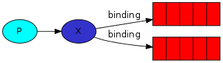
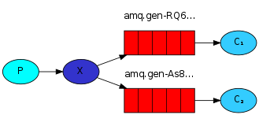

<!--
Copyright (c) 2005-2024 Broadcom. All Rights Reserved. The term "Broadcom" refers to Broadcom Inc. and/or its subsidiaries.

All rights reserved. This program and the accompanying materials
are made available under the terms of the under the Apache License,
Version 2.0 (the "License”); you may not use this file except in compliance
with the License. You may obtain a copy of the License at

https://www.apache.org/licenses/LICENSE-2.0

Unless required by applicable law or agreed to in writing, software
distributed under the License is distributed on an "AS IS" BASIS,
WITHOUT WARRANTIES OR CONDITIONS OF ANY KIND, either express or implied.
See the License for the specific language governing permissions and
limitations under the License.
-->
# RabbitMQ tutorial - Publish/Subscribe SUPPRESS-RHS

## Publish/Subscribe

### (using Spring AMQP)

<xi:include href="site/tutorials/tutorials-help.xml.inc"/>

In the [first tutorial](tutorial-one-spring-amqp.html) we showed how
to use start.spring.io to leverage Spring Initializr to create a project
with the RabbitMQ starter dependency to create Spring AMQP
applications.

In the [previous tutorial](tutorial-two-spring-amqp.html) we created
a new package `tut2` to place our configuration, sender and receiver and
created a work queue with two consumers. The assumption behind a work
queue is that each task is delivered to exactly one worker.

In this part we'll implement the fanout pattern to deliver
a message to multiple consumers. This pattern is also known as "publish/subscribe"
and is implemented by configuring a number of beans in our `Tut3Config` file.

Essentially, published messages are going to be broadcast to all the receivers.

Exchanges
---------

In previous parts of the tutorial we sent and received messages to and
from a queue. Now it's time to introduce the full messaging model in
RabbitMQ.

Let's quickly go over what we covered in the previous tutorials:

 * A _producer_ is a user application that sends messages.
 * A _queue_ is a buffer that stores messages.
 * A _consumer_ is a user application that receives messages.

The core idea in the messaging model in RabbitMQ is that the producer
never sends any messages directly to a queue. Actually, quite often
the producer doesn't even know if a message will be delivered to any
queue at all.

Instead, the producer can only send messages to an _exchange_. An
exchange is a very simple thing. On one side it receives messages from
producers and the other side it pushes them to queues. The exchange
must know exactly what to do with a message it receives. Should it be
appended to a particular queue? Should it be appended to many queues?
Or should it get discarded. The rules for that are defined by the
_exchange type_.

  
  

    digraph {
      bgcolor=transparent;
      truecolor=true;
      rankdir=LR;
      node [style="filled"];
      //
      P1 [label="P", fillcolor="#00ffff"];
      X [label="X", fillcolor="#3333CC"];
      Q1 [label="{||||}", fillcolor="red", shape="record"];
      Q2 [label="{||||}", fillcolor="red", shape="record"];
      //
      P1 -&gt; X;
      X -&gt; Q1;
      X -&gt; Q2;
    }
  

There are a few exchange types available: `direct`, `topic`, `headers`
and `fanout`. We'll focus on the last one -- the fanout. Let's configure
a bean to describe an exchange of this type, and call it `tut.fanout`:

<pre class="lang-java">
import org.springframework.amqp.core.*;
import org.springframework.context.annotation.Bean;
import org.springframework.context.annotation.Configuration;
import org.springframework.context.annotation.Profile;

@Profile({"tut3", "pub-sub", "publish-subscribe"})
@Configuration
public class Tut3Config {

	@Bean
	public FanoutExchange fanout() {
		return new FanoutExchange("tut.fanout");
	}

	@Profile("receiver")
	private static class ReceiverConfig {

		@Bean
		public Queue autoDeleteQueue1() {
			return new AnonymousQueue();
		}

		@Bean
		public Queue autoDeleteQueue2() {
			return new AnonymousQueue();
		}

		@Bean
		public Binding binding1(FanoutExchange fanout,
		    Queue autoDeleteQueue1) {
			return BindingBuilder.bind(autoDeleteQueue1).to(fanout);
		}

		@Bean
		public Binding binding2(FanoutExchange fanout,
		    Queue autoDeleteQueue2) {
			return BindingBuilder.bind(autoDeleteQueue2).to(fanout);
		}

		@Bean
		public Tut3Receiver receiver() {
			return new Tut3Receiver();
		}
	}

	@Profile("sender")
	@Bean
	public Tut3Sender sender() {
		return new Tut3Sender();
	}
}
</pre>

We follow the same approach as in the previous two tutorials.  We create three
profiles for the tutorial (`tut3`, `pub-sub`, or `publish-subscribe`). They are
all synonyms for running the fanout profile tutorial. Next we configure
the `FanoutExchange` as a Spring bean. Within the `Tut3Receiver` class we
define four beans: 2 `AnonymousQueue`s (non-durable, exclusive, auto-delete queues
in AMQP terms) and 2 bindings to bind those queues to the exchange.

The fanout exchange is very simple. As you can probably guess from the
name, it just broadcasts all the messages it receives to all the
queues it knows. And that's exactly what we need for fanning out our
messages.

> #### Listing exchanges
>
> To list the exchanges on the server you can run the ever useful `rabbitmqctl`:
>
> <pre class="lang-bash">
> sudo rabbitmqctl list_exchanges
> </pre>
>
> In this list there will be some `amq.*` exchanges and the default (unnamed)
> exchange. These are created by default, but it is unlikely you'll need to
> use them at the moment.

> #### Nameless exchange
>
> In previous parts of the tutorial we knew nothing about exchanges,
> but still were able to send messages to queues. That was possible
> because we were using a default exchange, which we identify by the empty string (`""`).
>
> Recall how we published a message before:
>
> <pre class="lang-java">
>    template.convertAndSend(queue.getName(), message)
> </pre>
>
> The first parameter is the routing key and the `RabbitTemplate`
> sends messages by default to the default exchange. Each queue is automatically
> bound to the default exchange with the name of queue as the binding key.
> This is why we can use the name of the queue as the routing key to make
> sure the message ends up in the queue.

Now, we can publish to our named exchange instead:

<pre class="lang-java">
@Autowired
private RabbitTemplate template;

@Autowired
private FanoutExchange fanout;   // configured in Tut3Config above

template.convertAndSend(fanout.getName(), "", message);
</pre>

From now on the `fanout` exchange will append messages to our queue.

Temporary queues
----------------

As you may remember previously we were using queues that had
specific names (remember `hello`). Being able to name
a queue was crucial for us -- we needed to point the workers to the
same queue.  Giving a queue a name is important when you
want to share the queue between producers and consumers.

But that's not the case for our fanout example. We want to hear about
all messages, not just a subset of them. We're
also interested only in currently flowing messages, not in the old
ones. To solve that we need two things.

Firstly, whenever we connect to Rabbit, we need a fresh, empty queue.
To do this, we could create a queue with a random name, or --
even better -- let the server choose a random queue name for us.

Secondly, once we disconnect the consumer, the queue should be
automatically deleted. To do this with the Spring AMQP client,
we defined an _AnonymousQueue_, which creates a non-durable,
exclusive, auto-delete queue with a generated name:

<pre class="lang-java">
@Bean
public Queue autoDeleteQueue1() {
	return new AnonymousQueue();
}

@Bean
public Queue autoDeleteQueue2() {
	return new AnonymousQueue();
}
</pre>

At this point, our queues have random queue names. For example,
it may look like `spring.gen-1Rx9HOqvTAaHeeZrQWu8Pg`.

Bindings
--------

  
  

    digraph {
      bgcolor=transparent;
      truecolor=true;
      rankdir=LR;
      node [style="filled"];
      //
      P1 [label="P", fillcolor="#00ffff"];
      X [label="X", fillcolor="#3333CC"];
      Q1 [label="{||||}", fillcolor="red", shape="record"];
      Q2 [label="{||||}", fillcolor="red", shape="record"];
      //
      P1 -&gt; X;
      X -&gt; Q1 [label="binding"];
      X -&gt; Q2 [label="binding"];
    }
  

We've already created a fanout exchange and a queue. Now we need to
tell the exchange to send messages to our queue. That relationship
between exchange and a queue is called a _binding_. In the above
`Tut3Config` you can see that we have two bindings, one for each
`AnonymousQueue`.

<pre class="lang-java">
@Bean
public Binding binding1(FanoutExchange fanout,
        Queue autoDeleteQueue1) {
	return BindingBuilder.bind(autoDeleteQueue1).to(fanout);
}
</pre>

> #### Listing bindings
>
> You can list existing bindings using, you guessed it,
> <pre class="lang-bash">
> rabbitmqctl list_bindings
> </pre>

Putting it all together
-----------------------

  
  

    digraph {
      bgcolor=transparent;
      truecolor=true;
      rankdir=LR;
      node [style="filled"];
      //
      P [label="P", fillcolor="#00ffff"];
      X [label="X", fillcolor="#3333CC"];
      subgraph cluster_Q1 {
        label="amq.gen-RQ6...";
	color=transparent;
        Q1 [label="{||||}", fillcolor="red", shape="record"];
      };
      subgraph cluster_Q2 {
        label="amq.gen-As8...";
	color=transparent;
        Q2 [label="{||||}", fillcolor="red", shape="record"];
      };
      C1 [label=&lt;C&lt;font point-size="7"&gt;1&lt;/font&gt;&gt;, fillcolor="#33ccff"];
      C2 [label=&lt;C&lt;font point-size="7"&gt;2&lt;/font&gt;&gt;, fillcolor="#33ccff"];
      //
      P -&gt; X;
      X -&gt; Q1;
      X -&gt; Q2;
      Q1 -&gt; C1;
      Q2 -&gt; C2;
    }
  

The producer program, which emits messages, doesn't look much
different from the previous tutorial. The most important change is that
we now want to publish messages to our `fanout` exchange instead of the
nameless one. We need to supply a `routingKey` when sending, but its
value is ignored for `fanout` exchanges. Here goes the code for
`tut3.Sender.java` program:

<pre class="lang-java">
package org.springframework.amqp.tutorials.tut3;

import org.springframework.amqp.core.FanoutExchange;
import org.springframework.amqp.rabbit.core.RabbitTemplate;
import org.springframework.beans.factory.annotation.Autowired;
import org.springframework.scheduling.annotation.Scheduled;
import java.util.concurrent.atomic.AtomicInteger;

public class Tut3Sender {

	@Autowired
	private RabbitTemplate template;

	@Autowired
	private FanoutExchange fanout;

	AtomicInteger dots = new AtomicInteger(0);

	AtomicInteger count = new AtomicInteger(0);

	@Scheduled(fixedDelay = 1000, initialDelay = 500)
	public void send() {
		StringBuilder builder = new StringBuilder("Hello");
		if (dots.getAndIncrement() == 3) {
			dots.set(1);
		}
		for (int i = 0; i &lt; dots.get(); i++) {
			builder.append('.');
		}
		builder.append(count.incrementAndGet());
		String message = builder.toString();
		template.convertAndSend(fanout.getName(), "", message);
		System.out.println(" [x] Sent '" + message + "'");
	}

}
</pre>

[Tut3Sender.java source](https://github.com/rabbitmq/rabbitmq-tutorials/blob/main/spring-amqp/src/main/java/org/springframework/amqp/tutorials/tut3/Tut3Sender.java)

As you see, we leverage the beans from the `Tut3Config` file and
autowire in the `RabbitTemplate` along with our configured
`FanoutExchange`. This step is necessary as publishing to a non-existing
exchange is forbidden.

The messages will be lost if no queue is bound to the exchange yet,
but that's okay for us; if no consumer is listening yet we can safely discard the message.

The code for `Tut3Receiver.java`:

<pre class="lang-java">
import org.springframework.amqp.rabbit.annotation.RabbitListener;
import org.springframework.util.StopWatch;

public class Tut3Receiver {

	@RabbitListener(queues = "#{autoDeleteQueue1.name}")
	public void receive1(String in) throws InterruptedException {
		receive(in, 1);
	}

	@RabbitListener(queues = "#{autoDeleteQueue2.name}")
	public void receive2(String in) throws InterruptedException {
		receive(in, 2);
	}

	public void receive(String in, int receiver) throws InterruptedException {
		StopWatch watch = new StopWatch();
		watch.start();
		System.out.println("instance " + receiver + " [x] Received '" + in + "'");
		doWork(in);
		watch.stop();
		System.out.println("instance " + receiver + " [x] Done in "
		    + watch.getTotalTimeSeconds() + "s");
	}

	private void doWork(String in) throws InterruptedException {
		for (char ch : in.toCharArray()) {
			if (ch == '.') {
				Thread.sleep(1000);
			}
		}
	}

}
</pre>

[Tut3Receiver.java source](https://github.com/rabbitmq/rabbitmq-tutorials/blob/main/spring-amqp/src/main/java/org/springframework/amqp/tutorials/tut3/Tut3Receiver.java)

Compile as before and we're ready to execute the fanout sender and receiver.

<pre class="lang-bash">
./mvnw clean package
</pre>

And of course, to execute the tutorial do the following:

<pre class="lang-bash">
# shell 1
java -jar target/rabbitmq-tutorials.jar --spring.profiles.active=pub-sub,receiver \
    --tutorial.client.duration=60000
# shell 2
java -jar target/rabbitmq-tutorials.jar --spring.profiles.active=pub-sub,sender \
    --tutorial.client.duration=60000
</pre>

Using `rabbitmqctl list_bindings` you can verify that the code actually
creates bindings and queues as we want. With two `ReceiveLogs.java`
programs running you should see something like:

<pre class="lang-bash">
sudo rabbitmqctl list_bindings
tut.fanout	exchange	8b289c9c-a1eb-4a3a-b6a9-163c4fdcb6c2	queue		[]
tut.fanout	exchange	d7e7d193-65b1-4128-a532-466a5256fd31	queue		[]
</pre>

The interpretation of the result is straightforward: data from
exchange `logs` goes to two queues with server-assigned names. And
that's exactly what we intended.

To find out how to listen for a subset of messages, let's move on to
[tutorial 4](tutorial-four-spring-amqp.html)
