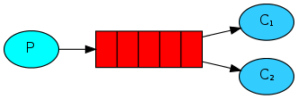

<!--
Copyright (c) 2005-2024 Broadcom. All Rights Reserved. The term "Broadcom" refers to Broadcom Inc. and/or its subsidiaries.

All rights reserved. This program and the accompanying materials
are made available under the terms of the under the Apache License,
Version 2.0 (the "License”); you may not use this file except in compliance
with the License. You may obtain a copy of the License at

https://www.apache.org/licenses/LICENSE-2.0

Unless required by applicable law or agreed to in writing, software
distributed under the License is distributed on an "AS IS" BASIS,
WITHOUT WARRANTIES OR CONDITIONS OF ANY KIND, either express or implied.
See the License for the specific language governing permissions and
limitations under the License.
-->
# RabbitMQ tutorial - Work Queues SUPPRESS-RHS

## Work Queues
### (using the .NET Client)

<xi:include href="site/tutorials/tutorials-help.xml.inc"/>

   Queue -> Consuming: Work Queue used to distribute time-consuming tasks among multiple workers." />
  

    digraph {
      bgcolor=transparent;
      truecolor=true;
      rankdir=LR;
      node [style="filled"];
      //
      P1 [label="P", fillcolor="#00ffff"];
      Q1 [label="{||||}", fillcolor="red", shape="record"];
      C1 [label=&lt;C&lt;font point-size="7"&gt;1&lt;/font&gt;&gt;, fillcolor="#33ccff"];
      C2 [label=&lt;C&lt;font point-size="7"&gt;2&lt;/font&gt;&gt;, fillcolor="#33ccff"];
      //
      P1 -&gt; Q1 -&gt; C1;
      Q1 -&gt; C2;
    }
  

In the [first tutorial](tutorial-one-dotnet.html) we
wrote programs to send and receive messages from a named queue. In this
one we'll create a _Work Queue_ that will be used to distribute
time-consuming tasks among multiple workers.

The main idea behind Work Queues (aka: _Task Queues_) is to avoid
doing a resource-intensive task immediately and having to wait for
it to complete. Instead we schedule the task to be done later. We encapsulate a
_task_ as a message and send it to a queue. A worker process running
in the background will pop the tasks and eventually execute the
job. When you run many workers the tasks will be shared between them.

This concept is especially useful in web applications where it's
impossible to handle a complex task during a short HTTP request
window.

Preparation
------------

In the previous part of this tutorial we sent a message containing
"Hello World!". Now we'll be sending strings that stand for complex
tasks. We don't have a real-world task, like images to be resized or
pdf files to be rendered, so let's fake it by just pretending we're
busy - by using the `Thread.Sleep()` function (you will need to add
 `using System.Threading;` near the top of the file to get access to
the threading APIs).
We'll take the number of dots in the string as its complexity; every
dot will account for one second
of "work".  For example, a fake task described by `Hello...`
will take three seconds.

We will slightly modify the _Send_ program from our previous example,
to allow arbitrary messages to be sent from the command line. This
program will schedule tasks to our work queue, so let's name it
`NewTask`:

Like [tutorial one](tutorial-one-dotnet.html) we need to generate two projects.

<pre class="lang-powershell">
dotnet new console --name NewTask
mv NewTask/Program.cs NewTask/NewTask.cs
dotnet new console --name Worker
mv Worker/Program.cs Worker/Worker.cs
cd NewTask
dotnet add package RabbitMQ.Client
cd ../Worker
dotnet add package RabbitMQ.Client
</pre>

Copy the code from our old _Send.cs_ to _NewTask.cs_ and make the following modifications.

Update the initialization of the _message_ variable:
<pre class="lang-csharp">
var message = GetMessage(args);
</pre>

Add the _GetMessage_ method to the end of the _NewTask_ class:
<pre class="lang-csharp">
static string GetMessage(string[] args)
{
    return ((args.Length > 0) ? string.Join(" ", args) : "Hello World!");
}
</pre>

Our old _Receive.cs_ script also requires some changes to
fake a second of work for every dot in the message body. It will
handle messages delivered by RabbitMQ and perform the task, so let's copy it to
_Worker.cs_ and modify it as follows.

After our existing _WriteLine_ for receiving the message, add the fake task to simulate execution time:
<pre class="lang-csharp">
Console.WriteLine($" [x] Received {message}");

int dots = message.Split('.').Length - 1;
Thread.Sleep(dots * 1000);

Console.WriteLine(" [x] Done");
</pre>

Round-robin dispatching
-----------------------

One of the advantages of using a Task Queue is the ability to easily
parallelise work. If we are building up a backlog of work, we can just
add more workers and that way, scale easily.

First, let's try to run two `Worker` instances at the same time. They
will both get messages from the queue, but how exactly? Let's see.

You need three consoles open. Two will run the `Worker` program.
These consoles will be our two consumers - C1 and C2.

<pre class="lang-bash">
# shell 1
cd Worker
dotnet run
# => Press [enter] to exit.
</pre>

<pre class="lang-bash">
# shell 2
cd Worker
dotnet run
# => Press [enter] to exit.
</pre>

In the third one we'll publish new tasks. Once you've started
the consumers you can publish a few messages:

<pre class="lang-bash">
# shell 3
cd NewTask
dotnet run "First message."
dotnet run "Second message.."
dotnet run "Third message..."
dotnet run "Fourth message...."
dotnet run "Fifth message....."
</pre>

Let's see what is delivered to our workers:

<pre class="lang-bash">
# shell 1
# => Press [enter] to exit.
# => [x] Received First message.
# => [x] Done
# => [x] Received Third message...
# => [x] Done
# => [x] Received Fifth message.....
# => [x] Done
</pre>

<pre class="lang-bash">
# shell 2
# => Press [enter] to exit.
# => [x] Received Second message..
# => [x] Done
# => [x] Received Fourth message....
# => [x] Done
</pre>

By default, RabbitMQ will send each message to the next consumer,
in sequence. On average every consumer will get the same number of
messages. This way of distributing messages is called round-robin. Try
this out with three or more workers.

Message acknowledgment
----------------------

Doing a task can take a few seconds. You may wonder what happens if
one of the consumers starts a long task and dies with it only partly done.
With our current code, once RabbitMQ delivers a message to the consumer it
immediately marks it for deletion. In this case, if you terminate a worker
we will lose the message it was just processing. We'll also lose all
the messages that were dispatched to this particular worker but were not
yet handled.

But we don't want to lose any tasks. If a worker dies, we'd like the
task to be delivered to another worker.

In order to make sure a message is never lost, RabbitMQ supports
[message _acknowledgments_](../confirms.html). An ack(nowledgement) is sent back by the
consumer to tell RabbitMQ that a particular message has been received,
processed and that RabbitMQ is free to delete it.

If a consumer dies (its channel is closed, connection is closed, or
TCP connection is lost) without sending an ack, RabbitMQ will
understand that a message wasn't processed fully and will re-queue it.
If there are other consumers online at the same time, it will then quickly redeliver it
to another consumer. That way you can be sure that no message is lost,
even if the workers occasionally die.

A timeout (30 minutes by default) is enforced on consumer delivery acknowledgement.
This helps detect buggy (stuck) consumers that never acknowledge deliveries.
You can increase this timeout as described in
[Delivery Acknowledgement Timeout](../consumers.html#acknowledgement-timeout).

[Manual message acknowledgments](../confirms.html) are turned on by default. In previous
examples we explicitly turned them off by setting the autoAck
("automatic acknowledgement mode") parameter to true. It's time to
remove this flag and manually send a proper acknowledgment from the
worker, once we're done with a task.

After the existing _WriteLine_, add a call to _BasicAck_ and update _BasicConsume_ with _autoAck:false_:
<pre class="lang-csharp">
    Console.WriteLine(" [x] Done");

    // here channel could also be accessed as ((EventingBasicConsumer)sender).Model
    channel.BasicAck(deliveryTag: ea.DeliveryTag, multiple: false);
};
channel.BasicConsume(queue: "hello",
                     autoAck: false,
                     consumer: consumer);
</pre>

Using this code, you can  ensure that even if you terminate a worker node using
CTRL+C while it was processing a message, nothing is lost. Soon
after the worker node is terminated, all unacknowledged messages will be redelivered.

Acknowledgement must be sent on the same channel that received the
delivery. Attempts to acknowledge using a different channel will result
in a channel-level protocol exception. See the [doc guide on confirmations](../confirms.html)
to learn more.

> #### Forgotten acknowledgment
>
> It's a common mistake to miss the `BasicAck`. It's an easy error,
> but the consequences are serious. Messages will be redelivered
> when your client quits (which may look like random redelivery), but
> RabbitMQ will eat more and more memory as it won't be able to release
> any unacked messages.
>
> In order to debug this kind of mistake you can use `rabbitmqctl`
> to print the `messages_unacknowledged` field:
>
> <pre class="lang-bash">
> sudo rabbitmqctl list_queues name messages_ready messages_unacknowledged
> </pre>
>
> On Windows, drop the sudo:
> <pre class="lang-bash">
> rabbitmqctl.bat list_queues name messages_ready messages_unacknowledged
> </pre>

Message durability
------------------

We have learned how to make sure that even if the consumer dies, the
task isn't lost. But our tasks will still be lost if RabbitMQ server stops.

When RabbitMQ quits or crashes it will forget the queues and messages
unless you tell it not to. Two things are required to make sure that
messages aren't lost: we need to mark both the queue and messages as
durable.

First, we need to make sure that the queue will survive a RabbitMQ node restart.
In order to do so, we need to declare it as _durable_:

<pre class="lang-csharp">
channel.QueueDeclare(queue: "hello",
                     durable: true,
                     exclusive: false,
                     autoDelete: false,
                     arguments: null);
</pre>

Although this command is correct by itself, it won't work in our present
setup. That's because we've already defined a queue called `hello`
which is not durable. RabbitMQ doesn't allow you to redefine an existing queue
with different parameters and will return an error to any program
that tries to do that. But there is a quick workaround - let's declare
a queue with different name, for example `task_queue`:

<pre class="lang-csharp">
channel.QueueDeclare(queue: "task_queue",
                     durable: true,
                     exclusive: false,
                     autoDelete: false,
                     arguments: null);
</pre>

This `QueueDeclare` change needs to be applied to both the producer
and consumer code. You also need to change the name of the queue for `BasicConsume` and `BasicPublish`.

At this point we're sure that the `task_queue` queue won't be lost
even if RabbitMQ restarts. Now we need to mark our messages as persistent.

After the existing _GetBytes_, set `IBasicProperties.Persistent` to `true`:
<pre class="lang-csharp">
var body = Encoding.UTF8.GetBytes(message);

var properties = channel.CreateBasicProperties();
properties.Persistent = true;
</pre>

> #### Note on Message Persistence
>
> Marking messages as persistent doesn't fully guarantee that a message
> won't be lost. Although it tells RabbitMQ to save the message to disk,
> there is still a short time window when RabbitMQ has accepted a message and
> hasn't saved it yet. Also, RabbitMQ doesn't do `fsync(2)` for every
> message -- it may be just saved to cache and not really written to the
> disk. The persistence guarantees aren't strong, but it's more than enough
> for our simple task queue. If you need a stronger guarantee then you can use
> [publisher confirms](../confirms.html).

## Fair Dispatch

You might have noticed that the dispatching still doesn't work exactly
as we want. For example in a situation with two workers, when all
odd messages are heavy and even messages are light, one worker will be
constantly busy and the other one will do hardly any work. Well,
RabbitMQ doesn't know anything about that and will still dispatch
messages evenly.

This happens because RabbitMQ just dispatches a message when the message
enters the queue. It doesn't look at the number of unacknowledged
messages for a consumer. It just blindly dispatches every n-th message
to the n-th consumer.

   Queue -> Consuming: RabbitMQ dispatching messages." />
  

    digraph {
      bgcolor=transparent;
      truecolor=true;
      rankdir=LR;
      node [style="filled"];
      //
      P1 [label="P", fillcolor="#00ffff"];
      subgraph cluster_Q1 {
        label="queue_name=hello";
    color=transparent;
        Q1 [label="{||||}", fillcolor="red", shape="record"];
      };
      C1 [label=&lt;C&lt;font point-size="7"&gt;1&lt;/font&gt;&gt;, fillcolor="#33ccff"];
      C2 [label=&lt;C&lt;font point-size="7"&gt;2&lt;/font&gt;&gt;, fillcolor="#33ccff"];
      //
      P1 -&gt; Q1;
      Q1 -&gt; C1 [label="prefetch=1"] ;
      Q1 -&gt; C2 [label="prefetch=1"] ;
    }
  

In order to change this behavior we can use the `BasicQos` method with the
`prefetchCount` = `1` setting. This tells RabbitMQ not to give more than
one message to a worker at a time. Or, in other words, don't dispatch
a new message to a worker until it has processed and acknowledged the
previous one. Instead, it will dispatch it to the next worker that is not still busy.

After the existing _QueueDeclare_ in _Worker.cs_ add the call to `BasicQos`:
<pre class="lang-csharp">
channel.QueueDeclare(queue: "task_queue",
                     durable: true,
                     exclusive: false,
                     autoDelete: false,
                     arguments: null);

channel.BasicQos(prefetchSize: 0, prefetchCount: 1, global: false);
</pre>

> #### Note about queue size
>
> If all the workers are busy, your queue can fill up. You will want to keep an
> eye on that, and maybe add more workers, or have some other strategy.

## Putting It All Together

Open two terminals.

Run the consumer (worker) first so that the topology (primarily the queue) is in place.
Here is its complete code:

<pre class="lang-csharp">
using System.Text;
using RabbitMQ.Client;
using RabbitMQ.Client.Events;

var factory = new ConnectionFactory { HostName = "localhost" };
using var connection = factory.CreateConnection();
using var channel = connection.CreateModel();

channel.QueueDeclare(queue: "task_queue",
                     durable: true,
                     exclusive: false,
                     autoDelete: false,
                     arguments: null);

channel.BasicQos(prefetchSize: 0, prefetchCount: 1, global: false);

Console.WriteLine(" [*] Waiting for messages.");

var consumer = new EventingBasicConsumer(channel);
consumer.Received += (model, ea) =>
{
    byte[] body = ea.Body.ToArray();
    var message = Encoding.UTF8.GetString(body);
    Console.WriteLine($" [x] Received {message}");

    int dots = message.Split('.').Length - 1;
    Thread.Sleep(dots * 1000);

    Console.WriteLine(" [x] Done");

    // here channel could also be accessed as ((EventingBasicConsumer)sender).Model
    channel.BasicAck(deliveryTag: ea.DeliveryTag, multiple: false);
};
channel.BasicConsume(queue: "task_queue",
                     autoAck: false,
                     consumer: consumer);

Console.WriteLine(" Press [enter] to exit.");
Console.ReadLine();
</pre>

Now run the task publisher (NewTask). Its final code is:

<pre class="lang-csharp">
using System.Text;
using RabbitMQ.Client;

var factory = new ConnectionFactory { HostName = "localhost" };
using var connection = factory.CreateConnection();
using var channel = connection.CreateModel();

channel.QueueDeclare(queue: "task_queue",
                     durable: true,
                     exclusive: false,
                     autoDelete: false,
                     arguments: null);

var message = GetMessage(args);
var body = Encoding.UTF8.GetBytes(message);

var properties = channel.CreateBasicProperties();
properties.Persistent = true;

channel.BasicPublish(exchange: string.Empty,
                     routingKey: "task_queue",
                     basicProperties: properties,
                     body: body);
Console.WriteLine($" [x] Sent {message}");

Console.WriteLine(" Press [enter] to exit.");
Console.ReadLine();

static string GetMessage(string[] args)
{
    return ((args.Length > 0) ? string.Join(" ", args) : "Hello World!");
}
</pre>

[(NewTask.cs source)](https://github.com/rabbitmq/rabbitmq-tutorials/blob/main/dotnet/NewTask/NewTask.cs)

Using message acknowledgments and `BasicQos` you can set up a
work queue. The durability options let the tasks survive even if
RabbitMQ is restarted.

For more information on `IModel` methods and `IBasicProperties`, you can browse the
[RabbitMQ .NET client API reference online](https://rabbitmq.github.io/rabbitmq-dotnet-client/api/RabbitMQ.Client.html).

Now we can move on to [tutorial 3](tutorial-three-dotnet.html) and learn how
to deliver the same message to many consumers.
