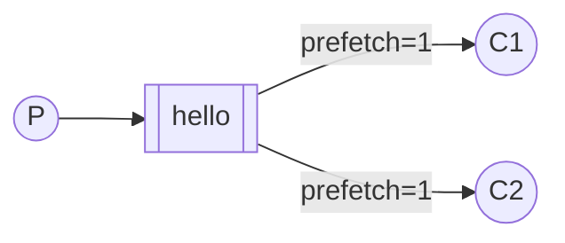

```mermaid
flowchart LR
    P((P)) --> Q[[hello]]
    Q -- prefetch=1 --> C1((C1))
    Q -- prefetch=1 --> C2((C2))

    class P mermaid-producer
    class Q mermaid-queue
    class C1 mermaid-consumer
    class C2 mermaid-consumer
```
