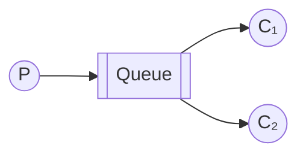

```mermaid
flowchart LR
    P((P))
    Q[[Queue]]
    C1((C₁))
    C2((C₂))

    P --> Q --> C1 & C2

    class P mermaid-producer
    class Q mermaid-queue
    class C1 mermaid-consumer
    class C2 mermaid-consumer
```
