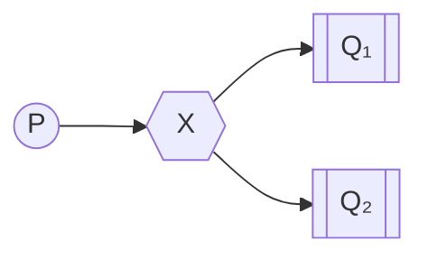

```mermaid
flowchart LR
    P((P))
    X{{X}}
    Q1[[Q₁]]
    Q2[[Q₂]]

    P --> X --> Q1 & Q2

    class P mermaid-producer
    class X mermaid-exchange
    class Q1 mermaid-queue
    class Q2 mermaid-queue
```
