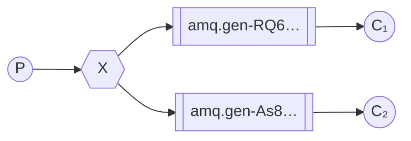

```mermaid
flowchart LR
    P((P))
    X{{X}}
    Q1[[amq.gen-RQ6…]]
    Q2[[amq.gen-As8…]]
    C1((C₁))
    C2((C₂))

    P --> X
    X --> Q1
    X --> Q2
    Q1 --> C1
    Q2 --> C2

    class P mermaid-producer
    class X mermaid-exchange
    class Q1 mermaid-queue
    class Q2 mermaid-queue
    class C1 mermaid-consumer
    class C2 mermaid-consumer
```
