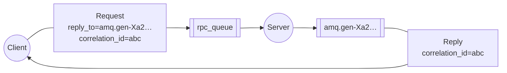

```mermaid
flowchart LR
    C((Client))
    S((Server))
    Q1[[rpc_queue]]
    Q2[[amq.gen-Xa2…]]
    Request["`Request
    reply_to=amq.gen-Xa2…
    correlation_id=abc`"]
    Reply["`Reply
    correlation_id=abc`"]

    C --- Request --> Q1 --> S --> Q2 --- Reply --> C

    class C mermaid-producer
    class Q1 mermaid-queue
    class Q2 mermaid-queue
    class S mermaid-consumer
    class Request mermaid-msg
    class Reply mermaid-msg
```
