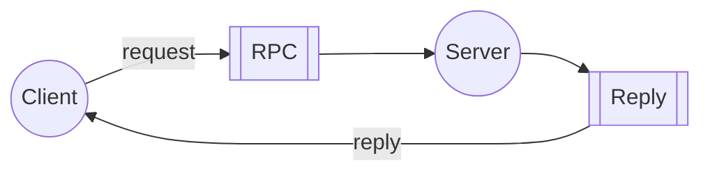

```mermaid
flowchart LR
    C((Client))
    S((Server))
    Q1[[RPC]]
    Q2[[Reply]]

    C -- request --> Q1 --> S --> Q2 -- reply --> C

    class C mermaid-producer
    class Q1 mermaid-queue
    class Q2 mermaid-queue
    class S mermaid-consumer
```
