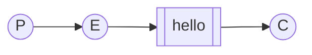
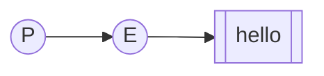
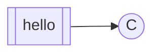

import Tabs from '@theme/Tabs';
import TabItem from '@theme/TabItem';

# Simple publisher and consumer

:::info
#### Protocols and Libraries

[RabbitMQ speaks multiple protocols](/docs/protocols). This tutorial uses AMQP 0-9-1, which is an
open, general-purpose protocol for messaging. You may be interested in using
other supported protocols, such as AMQP 1.0, [MQTT](/docs/mqtt), [STOMP](/docs/stomp)
or [RabbitMQ Streams](/docs/streams) (a high performance protocol specifically designed for
RabbitMQ Streams).

See [developer tools](/docs/devtools) for more information.
:::

## Introduction

RabbitMQ is a message broker - it accepts and forwards messages. You can think
about it as a postal service: when you want a message to be delivered, you hand
it over to the postal service and you trust it will get to the receipient.

Of course RabbitMQ doesn't deal with paper, but rather it accepts, stores, and forwards
binary blobs of data ‒ messages. Moreover, you don't necessarily specify the exact
receipient of the message - you can just describe what the message is about
(topic, header) and the message will be delivered to those interested. Importantly,
there can be multiple interested parties and they may all get a copy of the message,
even though you only sent one.

RabbitMQ, and messaging in general, uses some jargon.

* A **producer** is a program that sends (publishes, produces) messages

    ```mermaid
    flowchart LR
        P((P))
        class P mermaid-producer
    ```

* A **consumer** is a program that receives messages

    ```mermaid
    flowchart LR
        C((C))
        class C mermaid-consumer
    ```

* A **queue** is like a post office - messages from the publishers
  are delivered to queues and then from queues to consumers. If consumers are not
  ready to receive messages (eg. they are not present/running), messages wait in the queue.

  Many producers can send messages that go into one single queue, and many consumers
  can receive messages from one queue. This is how we represent a queue: 

    ```mermaid
    flowchart LR
        Q[[queue_name]]
        class Q mermaid-queue
    ```

* An **exchange** is like a sorting office - messages from the publishers are not
  delivered directly to a queue, but rather they are addressed to an exchange
  which decides which queue(s) should receive the message. If an exchange decides
  the message should be delivered to multiple queues, each queue receives
  a copy of the message.

The simplest flow of messages, with a single publisher, exchange, queue and consumer
can be represented like this:



## Hello World!

In this part of the tutorial we'll implement a message flow as pictured above.
To do that, we will write two small programs:
* a producer (sender) that sends a single message, and
* a consumer (receiver) that receives messages and prints them out.

It's a "Hello World" of messaging.

:::note
This tutorial assumes RabbitMQ is [installed](/docs/download) and running on
`localhost` on the [standard port](/docs/networking#ports) (5672). If you
use a different host, port or credentials, connection settings need to be adjusted.

If you're having trouble going through this tutorial you can ask a question
on one of the [community forums](/community).
:::

### Sending

Our first program will send a single message to the queue.



Below you can see a complete sender implementation in many programming languagess.
Regardless of the language, the key steps are the following:

1. Connect to the server. By default RabbitMQ listens on port 5672 and has
a `guest` user with `guest` password. Client libraries generally use the same
defaults, so these details can usually be omitted when working locally.

2. Once we have a connection, we open a channel. A channel is an AMQP 0.9.1
protocol concept and is where most of the API resides.

3. Declare a queue. RabbitMQ supports multiple queue types and additional queue arguments/features.
For now we'll keep it simple and only provide the name of the queue, which is `hello`.

4. Publish a message. Messages can never be sent directly to a queue, they always need
to go through an **exchange**. We'll learn more about exchanges in [the third part of this
tutorial](/docs/tutorials/tutorial-3). For now we'll use the
default exchange, identified by an empty string. This exchange is special — it
allows us to specify exactly which queue the message should be sent to.
Therefore, the `routing_key` is set to the queue name.

5. Close the channel and connection.

@RMQincludeFile("send")

### Receiving

Our second program will receive messages from the queue and print
them on the screen.




The first steps are the same - we need to connect to the RabbitMQ server,
create a channel and declare the queue.

You may ask why we declare the queue again, given the publisher already does that.
The reason to do that is that in many cases, the order in which applications start
is not predictable. Therefore, it's better to declare the queues in all
applications that expect the queues to exists.

Once we have the basics, we need to:

1. Subscribe to a queue. By subscribing, our application tells RabbitMQ it wants
to receive messages from that queue. If multiple consumers consume from a single
queue, they will **NOT** receive the same messages - each message will be
delivered to only one consumer. Each consumer should receive a roughly equal
amount of messages. We'll learn more about this in [the third part of this
tutorial](/docs/tutorials/tutorial-3).

2. Based on the language and library, we may need to register a callback to handle
a message that gets delivered from RabbitMQ to our consumer.

@RMQincludeFile("receive")

Let's take a closer look at the Python code - it is pretty representative for
what happens in other languages as well. We define the **callback** function
(in this case, it also called `callback`) which the `pika` library will call
whenever a message is delivered to our consumer. Our callback implementation 
simply prints the message:

```python
def callback(ch, method, properties, body):
    print(f" [x] Received {body.decode()}")

```

Next, we to tell RabbitMQ that we want to receive messages from the `hello` queue
and we tell the `pika` library, that this particular callback function should
be called when messages from this queue are received:

```python
channel.basic_consume(queue='hello',
                      auto_ack=True,
                      on_message_callback=callback)
```

For that command to succeed we must be sure that a queue which we want
to subscribe to exists. Fortunately we're confident about that - we've
created a queue above - using `queue_declare`.

The `auto_ack` parameter will be described [later on](/docs/tutorials/tutorial-2).

And finally, we enter a never-ending loop that waits for data and runs callbacks
whenever necessary (well, we handle `KeyboardInterrupt` to allow terminating
the program with `CTRL+C`).

```python
print(' [*] Waiting for messages. To exit press CTRL+C')
channel.start_consuming()
```

### Putting it all together

Now we can try out our programs in a terminal. First, let's start
a consumer, which will run continuously waiting for deliveries:

<Tabs groupid="programming-language" queryString="lang">
<TabItem value="python" label="Python">
```bash
python receive.py
# => [*] Waiting for messages. To exit press CTRL+C
```
</TabItem>
<TabItem value="java" label="Java">
```bash
javac -cp amqp-client-5.16.0.jar Send.java Recv.java
java -cp .:amqp-client-5.16.0.jar:slf4j-api-1.7.36.jar:slf4j-simple-1.7.36.jar Recv
```
</TabItem>

<TabItem value="go" label="Go">
```bash
go run send.go
```
</TabItem>
<TabItem value="elixir" label="Elixir">
```bash
mix run receive.exs
```
</TabItem>
<TabItem value="php" label="PHP">
```bash
php receive.php
```
</TabItem>

<TabItem value="ruby" label="Ruby">
```bash
ruby receive.rb
```
</TabItem>
</Tabs>


Now start the producer in a new terminal. The producer program will stop after every run:

<Tabs groupid="programming-language" queryString="lang">
<TabItem value="python" label="Python">
```bash
python send.py
# => [x] Sent 'Hello World!'
```
</TabItem>
<TabItem value="java" label="Java">
```bash
java -cp .:amqp-client-5.16.0.jar:slf4j-api-1.7.36.jar:slf4j-simple-1.7.36.jar Send
```
</TabItem>
<TabItem value="go" label="Go">
```bash
go run receive.go
```
</TabItem>

<TabItem value="elixir" label="Elixir">
```bash
mix run send.exs
```
</TabItem>

<TabItem value="cpp" label="C++">
```bash
```
</TabItem>

<TabItem value="php" label="PHP">
```bash
php send.php
```
</TabItem>

<TabItem value="ruby" label="Ruby">
```bash
ruby send.rb
```
</TabItem>
</Tabs>

The consumer should print the message:

```bash
# => [x] Received 'Hello World!'
```

Hurray! We were able to send our first message through RabbitMQ. As you might
have noticed, the consumer program doesn't exit. It will stay ready to
receive further messages, and may be interrupted with Ctrl-C.

Run the publisher a few times to see the messages are still delivered
to the consumer.

### Summary

We've learned how to send and receive a message from a named
queue. It's time to move on to [part 2](./tutorial-two-python)
and build a simple _work queue_.

:::info
If you want to see the queues that currently exist and how many messages
they contain, you can do that with the
[Management UI](http://localhost:15672/) or the `rabbitmqctl` CLI:

<Tabs groupId="operating-system">
<TabItem value="unix" label="Linux/macOS">
```bash
rabbitmqctl list_queues
```
If this doesn't work, try `sudo rabbitmqctl` instead.
</TabItem>
<TabItem value="windows" label="Windows">
```powershell
rabbitmqctl.bat list_queues
```
</TabItem>
</Tabs>
:::

