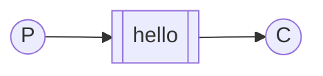
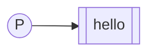

import Tabs from '@theme/Tabs';
import TabItem from '@theme/TabItem';

# Tutorial 1: Hello World!

## Introduction

RabbitMQ is a message broker: it accepts and forwards messages. You can think
about it as a post office: when you put the mail that you want posting in a
post box, you can be sure that the letter carrier will eventually deliver the
mail to your recipient. In this analogy, RabbitMQ is a post box, a post office,
and a letter carrier.

The major difference between RabbitMQ and the post office is that it doesn't
deal with paper, instead it accepts, stores, and forwards binary blobs of data
‒ messages.

RabbitMQ, and messaging in general, uses some jargon.

* *Producing* means nothing more than sending. A program that sends messages is
  a *producer*:

    ```mermaid
    flowchart LR
        P((P))
        class P mermaid-producer
    ```

* A *queue* is the name for the post box in RabbitMQ. Although messages flow
  through RabbitMQ and your applications, they can only be stored inside a
  queue. A queue is only bound by the host's memory & disk limits, it's
  essentially a large message buffer. Many producers can send messages that go
  to one queue, and many consumers can try to receive data from one queue. This
  is how we represent a queue: 

    ```mermaid
    flowchart LR
        Q[[queue_name]]
        class Q mermaid-queue
    ```

* *Consuming* has a similar meaning to receiving. A *consumer* is a program
  that mostly waits to receive messages:

    ```mermaid
    flowchart LR
        C((C))
        class C mermaid-consumer
    ```

:::note
This tutorial assumes RabbitMQ is [installed](/docs/download) and running on
`localhost` on the [standard port](/docs/networking#ports) (5672). In case you
use a different host, port or credentials, connections settings would require
adjusting.

If you're having trouble going through this tutorial you can contact us through
the [mailing list](https://groups.google.com/forum/#!forum/rabbitmq-users) or
[RabbitMQ community Slack](https://www.rabbitmq.com/slack/).
:::

## Hello World!

In this part of the tutorial we'll write two small programs:
* a producer (sender) that sends a single message, and
* a consumer (receiver) that receives messages and prints them out.

It's a "Hello World" of messaging.

In the diagram below, *P* is our producer and *C* is our consumer. The box in
the middle is a queue — a message buffer that RabbitMQ keeps on behalf of the
consumer.

Our overall design will look like:



Producer sends messages to the "hello" queue. The consumer receives messages
from that queue.

:::info
#### RabbitMQ libraries

RabbitMQ speaks multiple protocols. This tutorial uses AMQP 0-9-1, which is an
open, general-purpose protocol for messaging. There are a number of clients for
RabbitMQ in [many different languages](/docs/devtools).

<Tabs groupId="programming-language">
<TabItem value="java" label="Java">
Download the [client library](https://repo1.maven.org/maven2/com/rabbitmq/amqp-client/5.16.0/amqp-client-5.16.0.jar)
and its dependencies ([SLF4J API](https://repo1.maven.org/maven2/org/slf4j/slf4j-api/1.7.36/slf4j-api-1.7.36.jar) and
[SLF4J Simple](https://repo1.maven.org/maven2/org/slf4j/slf4j-simple/1.7.36/slf4j-simple-1.7.36.jar)).
Copy those files in your working directory, along the tutorials Java files.

Please note SLF4J Simple is enough for tutorials but you should use a full-blown
logging library like [Logback](https://logback.qos.ch/) in production.

(The RabbitMQ Java client is also in the central Maven repository,
with the groupId `com.rabbitmq` and the artifactId `amqp-client`.)
</TabItem>
<TabItem value="python" label="Python">
In this tutorial series we're going to use [Pika
1.0.0](https://pika.readthedocs.org/en/stable/), which is the Python client
recommended by the RabbitMQ team. To install it you can use the
[`pip`](https://pip.pypa.io/en/stable/quickstart/) package management tool:

```bash
python -m pip install pika --upgrade
```
</TabItem>
</Tabs>
:::

### Sending



Our first program will send a single message to the queue. The first thing we
need to do is to establish a connection with RabbitMQ server.

<Tabs groupId="programming-language">
<TabItem value="java" label="Java">
In [`Send.java`](https://github.com/rabbitmq/rabbitmq-tutorials/blob/main/java/Send.java),
we need some classes imported:

```java
import com.rabbitmq.client.ConnectionFactory;
import com.rabbitmq.client.Connection;
import com.rabbitmq.client.Channel;
```

Set up the class and name the queue:

```java
public class Send {
  private final static String QUEUE_NAME = "hello";
  public static void main(String[] argv) throws Exception {
      ...
  }
}
```

then we can create a connection to the server:

```java
ConnectionFactory factory = new ConnectionFactory();
factory.setHost("localhost");
try (Connection connection = factory.newConnection();
     Channel channel = connection.createChannel()) {

}
```
</TabItem>
<TabItem value="python" label="Python">
In a file called `send.py`:
```python
#!/usr/bin/env python
import pika

connection = pika.BlockingConnection(pika.ConnectionParameters('localhost'))
channel = connection.channel()
```
</TabItem>
</Tabs>

We're connected now, to a broker on the local machine - hence the `localhost`.
If we wanted to connect to a broker on a different machine we'd simply specify
its name or IP address here.

Next, before sending we need to make sure the recipient queue exists. If we
send a message to non-existing location, RabbitMQ will just drop the message.
Let's create a `hello` queue to which the message will be delivered:

<Tabs groupId="programming-language">
<TabItem value="java" label="Java">
```java
channel.queueDeclare(QUEUE_NAME, false, false, false, null);
```
</TabItem>
<TabItem value="python" label="Python">
```python
channel.queue_declare(queue='hello')
```
</TabItem>
</Tabs>

At this point we're ready to send a message. Our first message will just
contain a string *Hello World!* and we want to send it to our `hello` queue.

In RabbitMQ a message can never be sent directly to the queue, it always needs
to go through an *exchange*. But let's not get dragged down by the details —
you can read more about exchanges in [the third part of this
tutorial](/docs/tutorials/tutorial-three-python). All we need to know now is how to use a
default exchange identified by an empty string. This exchange is special — it
allows us to specify exactly to which queue the message should go. The queue
name needs to be specified in the `routing_key` parameter:

<Tabs groupId="programming-language">
<TabItem value="java" label="Java">
```java
String message = "Hello World!";
channel.basicPublish("", QUEUE_NAME, null, message.getBytes());
System.out.println(" [x] Sent '" + message + "'");
```
</TabItem>
<TabItem value="python" label="Python">
```python
channel.basic_publish(exchange='',
                      routing_key='hello',
                      body='Hello World!')
print(" [x] Sent 'Hello World!'")
```
</TabItem>
</Tabs>

Before exiting the program we need to make sure the network buffers were
flushed and our message was actually delivered to RabbitMQ. We can do it by
gently closing the connection.

<Tabs groupId="programming-language">
<TabItem value="java" label="Java">
Note we can use a try-with-resources statement because both `Connection` and
`Channel` implement `java.lang.AutoCloseable`. This way we don't need to close
them explicitly in our code.
</TabItem>
<TabItem value="python" label="Python">
```python
connection.close()
```
</TabItem>
</Tabs>

:::tip
> Sending doesn't work!

If this is your first time using RabbitMQ and you don't see the "Sent" message
then you may be left scratching your head wondering what could be wrong. Maybe
the broker was started without enough free disk space (by default it needs at
least 200 MB free) and is therefore refusing to accept messages. Check the
[broker logfile](/docs/logging#log-file-location) to confirm and reduce the
limit if necessary. The [configuration file
documentation](/docs/configure#config-items) will show you how to set
`disk_free_limit`.
:::
