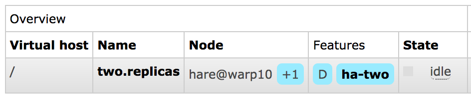

<!--
Copyright (c) 2005-2025 Broadcom. All Rights Reserved. The term "Broadcom" refers to Broadcom Inc. and/or its subsidiaries.

All rights reserved. This program and the accompanying materials
are made available under the terms of the under the Apache License,
Version 2.0 (the "License”); you may not use this file except in compliance
with the License. You may obtain a copy of the License at

https://www.apache.org/licenses/LICENSE-2.0

Unless required by applicable law or agreed to in writing, software
distributed under the License is distributed on an "AS IS" BASIS,
WITHOUT WARRANTIES OR CONDITIONS OF ANY KIND, either express or implied.
See the License for the specific language governing permissions and
limitations under the License.
-->

import Tabs from '@theme/Tabs';
import TabItem from '@theme/TabItem';

# Classic Queue Mirroring (Deprecated)

:::danger
This guide covers a feature that had been [**deprecated since 2021**](/blog/2021/08/21/4.0-deprecation-announcements) and [**was removed completely**](https://github.com/rabbitmq/rabbitmq-server/pull/9815) from RabbitMQ 4.0.x.
:::

:::important
[Quorum queues](./quorum-queues) and/or [streams](./streams) should be used instead of mirrored classic queues.
**Non-replicated** classic queues continue being supported and developed.
:::

## Wait, There's a Better Way: Modern Replicated Queue Type and Streams {#interstitial}

This guide covers a [**long time deprecated**](/blog/2021/08/21/4.0-deprecation-announcements) and [**in 4.x, removed**](https://github.com/rabbitmq/rabbitmq-server/pull/9815) legacy feature: mirroring (queue contents replication) of classic queues.
[Quorum queues](./quorum-queues) and/or [streams](./streams) should be used instead of mirrored classic queues.

Quorum queues are a more advanced queue type, which offers high availability using  replication and focuses on data safety. Quorum queues [support message TTL](/blog/2022/05/05/rabbitmq-3.10-release-overview) and provide [higher throughput and more stable latency](/blog/2022/05/16/rabbitmq-3.10-performance-improvements) compared to mirrored classic queues. Please [migrate from Mirrored Classic Queues to Quorum Queues](./migrate-mcq-to-qq) now.

[Streams](./streams) is an [alternative messaging data structure](/blog/2021/07/13/rabbitmq-streams-overview) supported by RabbitMQ.
Just like quorum queues, streams are replicated.

Quorum queues should be the **default choice** for a replicated queue type.
Classic queue mirroring will be **removed in a future version** of RabbitMQ:
classic queues will remain a supported non-replicated queue type.


## Overview {#overview}

Topics covered in this guide include,
for migrating away from classic mirrored queues:

 * [Next generation replicated queues and streams](#interstitial), and why they should be preferred over classic queue mirroring
 * How to [detect what policies enable classic queue mirroring](#detect-usage)

For historical reference:

 * What is [classic queue mirroring](#what-is-mirroring) and how it works
 * How to [enable it](#ways-to-configure)
 * What [mirroring settings are available](#mirroring-arguments)
 * Why [mixed CQv1 and CQv2 clusters are not recommended with mirroring](#cqv2)
 * What [replication factor](#replication-factor) is recommended
 * [Data locality](#leader-migration-data-locality)
 * [Leader election](#behaviour) (mirror promotion) and [unsynchronised mirrors](#unsynchronised-mirrors)
 * Mirrored vs. [non-mirrored queue behavior](#non-mirrored-queue-behavior-on-node-failure) in case of node failure
 * [Batch synchronisation](#batch-sync) of newly added and recovering mirrors

and more.

This guide assumes general familiarity with [RabbitMQ clustering](./clustering), [quorum queues](./quorum-queues), and [streams](./streams).


## What is Queue Mirroring {#what-is-mirroring}

:::danger
This guide covers a feature that had been [**deprecated since 2021**](/blog/2021/08/21/4.0-deprecation-announcements)
and [**was removed completely**](https://github.com/rabbitmq/rabbitmq-server/pull/9815) for the next major series, RabbitMQ 4.x.
:::

:::important
[Quorum queues](./quorum-queues) and/or [streams](./streams) should be used instead of mirrored classic queues.
**Non-replicated** classic queues continue being supported and developed.
:::

By default, contents of a queue within a RabbitMQ cluster are located on
a single node (the node on which the queue was
declared). This is in contrast to exchanges and bindings,
which can always be considered to be on all nodes. Queues
can optionally run mirrors (additional replicas) on other cluster nodes.

Each mirrored queue consists of one **leader replica** and
one or more **mirrors** (replicas). The leader is hosted on one
node commonly referred as the leader node for that queue. Each queue has
its own leader node. All operations for a given queue are first applied
on the queue's leader node and then propagated to mirrors. This
involves enqueueing publishes, delivering messages to consumers, tracking
[acknowledgements from consumers](./confirms) and so on.

Queue mirroring implies [a cluster of nodes](./clustering).
It is therefore not recommended for use
across a WAN (though of course, clients can still connect
from as near and as far as needed).

Messages published to the queue are replicated to all
mirrors. Consumers are connected to the leader regardless of
which node they connect to, with mirrors dropping messages
that have been acknowledged at the leader. Queue mirroring
therefore enhances availability, but does not distribute
load across nodes (all participating nodes each do all the
work).

If the node that hosts queue leader fails, the oldest mirror will be
promoted to the new leader as long as it's synchronised. [Unsynchronised mirrors](#unsynchronised-mirrors)
can be promoted, too, depending on queue mirroring parameters.

There are multiple terms commonly used to identify primary
and secondary replicas in a distributed system. This guide
typically uses "leader" to refer to the primary replica of a
queue and "mirror" for secondary replicas.

Queue object fields in the HTTP API and CLI tools originally used the unfortunate term
"slave" to refer to secondaries. That term still appears
in column names in CLI tools for backwards compatibility but will be
replaced or removed in a future version.


## How Mirroring is Configured {#ways-to-configure}

:::danger
This guide covers a feature that had been [**deprecated since 2021**](/blog/2021/08/21/4.0-deprecation-announcements)
and [**was removed completely**](https://github.com/rabbitmq/rabbitmq-server/pull/9815) for the next major series, RabbitMQ 4.x.
:::

:::important
[Quorum queues](./quorum-queues) and/or [streams](./streams) should be used instead of mirrored classic queues.
**Non-replicated** classic queues continue being supported and developed.
:::

Mirroring parameters are configured using [policies](./parameters#policies). A policy matches
one or more queues by name (using a regular expression pattern) and
contains a definition (a map of optional arguments) that are added to the total set of
properties of the matching queues.

Please see [Runtime Parameters and Policies](./parameters#policies) for more information on policies.


## Queue Arguments that Control Mirroring {#mirroring-arguments}

:::danger
This guide covers a feature that had been [**deprecated since 2021**](/blog/2021/08/21/4.0-deprecation-announcements)
and [**was removed completely**](https://github.com/rabbitmq/rabbitmq-server/pull/9815) for the next major series, RabbitMQ 4.x.
:::

:::important
[Quorum queues](./quorum-queues) and/or [streams](./streams) should be used instead of mirrored classic queues.
**Non-replicated** classic queues continue being supported and developed.
:::

As we've covered above, queues have mirroring enabled
via [policy](./parameters#policies). Policies
can change at any time; it is valid to create a non-mirrored
queue, and then make it mirrored at some later point (and
vice versa). There is a difference between a non-mirrored
queue and a mirrored queue which does not have any mirrors -
the former lacks the extra mirroring infrastructure and will
likely provide higher throughput.

Adding mirrors to a queue increases cluster load but
helps lower the probability of [losing all up-to-date replicas](#unsynchronised-mirrors).

To make the classic queues mirrored, create a
policy which matches them and sets policy keys `ha-mode` and (optionally) `ha-params`.
The following table explains the options for these keys:

<table>
  <tr>
    <th><code>ha-mode</code></th>
    <th><code>ha-params</code></th>
    <th>Result</th>
  </tr>
  <tr>
    <td><code>exactly</code></td>
    <td><i>count</i></td>
    <td>
      Number of queue replicas (leader plus mirrors) in the cluster.

      A <i>count</i> value of 1 means a single replica: just the queue leader.
      If the node running the queue leader becomes
      unavailable, <a href="#non-mirrored-queue-behavior-on-node-failure">the behaviour depends on queue durability</a>.

      A <i>count</i> value of 2 means 2 replicas: 1 queue leader and 1 queue
      mirror. In other words: `NumberOfQueueMirrors = NumberOfNodes - 1`.
      If the node running the queue leader becomes unavailable,
      the queue mirror will be automatically promoted to leader
      according to the <a href="#unsynchronised-mirrors">mirror promotion strategy</a> configured.

      If there are fewer than <i>count</i> nodes in the cluster, the
      queue is mirrored to all nodes. If there are more than
      <i>count</i> nodes in the cluster, and a node containing a mirror
      goes down, then a new mirror will be created on another node. Use
      of `exactly` mode with <a href="#cluster-shutdown">
      `"ha-promote-on-shutdown": "always"`</a> can be
      dangerous since queues can migrate across a cluster and become
      unsynced as it is brought down.
    </td>
  </tr>
  <tr>
    <td><code>all</code></td>
    <td>(none)</td>
    <td>
      Queue is mirrored across all nodes in the
      cluster. When a new node is added to the cluster, the
      queue will be mirrored to that node.

      This setting is very
      conservative. Mirroring to a quorum (N/2 + 1) of cluster nodes
      is <a href="#replication-factor">recommended instead</a>.
      Mirroring to all nodes will put additional
      strain on all cluster nodes, including network I/O, disk I/O and
      disk space usage.
    </td>
  </tr>
  <tr>
    <td><code>nodes</code></td>
    <td><i>node names</i></td>
    <td>
      Queue is mirrored to the nodes listed in <i>node names</i>.
      Node names are the Erlang node names as they
      appear in <code>rabbitmqctl cluster_status</code>; they
      usually have the form "<tt>rabbit@hostname</tt>".

      If any of those node names are not a part of the cluster,
      this does not constitute an error. If none of the nodes
      in the list are online at the time when the queue is
      declared then the queue will be created on the node that
      the declaring client is connected to.
    </td>
  </tr>
</table>

Whenever the HA policy for a queue changes it will endeavour
to keep its existing mirrors as far as this fits with the new
policy.

### Replication Factor: How Many Mirrors are Optimal? {#replication-factor}

Mirroring to all nodes is the most conservative option.
It will put additional strain on all cluster nodes, including network I/O, disk I/O and
disk space usage. Having a replica on every node is unnecessary in most cases.

For clusters of 3 and more nodes
it is recommended to replicate to a quorum (the majority) of nodes,
e.g. 2 nodes in a 3 node cluster or 3 nodes in a 5 node cluster.

Since some data can be inherently transient or very time sensitive,
it can be perfectly reasonable to use a lower number of mirrors
for some queues (or even not use any mirroring).


## How to Check if a Queue is Mirrored? {#how-to-check-i-a-queue-is-mirrored}

Mirrored queues will have a policy name and the number of additional replicas (mirrors)
next to it on the queue page in the [management UI](./management).

Below is an example of a queue named `two.replicas` which has a leader
and a mirror:

<figure>

</figure>

leader node for the queue and its online mirror(s), if any, will be listed on the queue page:

<figure>

</figure>

If the queue page does not list any mirrors, the queue is not mirrored (or has only one mirror which
is not online):

<figure>

</figure>

When a new queue mirror is added, the event is logged:

```
2018-03-01 07:26:33.121 [info] <0.1360.0> Mirrored queue 'two.replicas' in vhost '/': Adding mirror on node hare@warp10: <37324.1148.0>
```

It is possible to list queue leader and mirrors using `rabbitmqctl list_queues`. In this
example we also display queue policy since it's highly relevant:

<Tabs groupId="shell-specific">
<TabItem value="bash" label="bash" default>
```bash
# mirror_pids is a new field alias introduced in RabbitMQ 3.11.4
rabbitmqctl list_queues name policy pid mirror_pids

# => Timeout: 60.0 seconds ...
# => Listing queues for vhost / ...
# => two.replicas ha-two <hare@hostname-2.1.2223.0> [<rabbit@hostname-1.3.1360.0>]
```
</TabItem>
<TabItem value="PowerShell" label="PowerShell">
```PowerShell
rabbitmqctl.bat list_queues name policy pid mirror_pids

# => Timeout: 60.0 seconds ...
# => Listing queues for vhost / ...
# => two.replicas ha-two <hare@hostname-2.1.2223.0> [<rabbit@hostname-1.3.1360.0>]
```
</TabItem>
<TabItem value="cmd" label="cmd">
```batch
rem mirror_pids is a new field alias introduced in RabbitMQ 3.11.4
rabbitmqctl.bat list_queues name policy pid mirror_pids

rem => Timeout: 60.0 seconds ...
rem => Listing queues for vhost / ...
rem => two.replicas ha-two <hare@host-2.1.2223.0> [<rabbit@hostname-1.3.1360.0>]
```
</TabItem>
</Tabs>

If a queue that's expected to be mirroring is not, this usually means that its name
doesn't match that specified in the policy that controls mirroring or that another
policy takes priority (and does not enable mirroring).
See [Runtime Parameters and Policies](./parameters#policies) to learn more.


## How to Detect Policies that Enable Classic Queue Mirroring {#detect-usage}

In order to prepare for migration away from classic mirrored queues, it may be necessary to first
understand whether there are any policies in the cluster that enable use this deprecated feature.

There are two `rabbitmq-diagnostics` commands that help with this:

 * `rabbitmq-diagnostics check_if_cluster_has_classic_queue_mirroring_policy`, a [health check](./monitoring#health-checks)
 * `rabbitmq-diagnostics list_policies_with_classic_queue_mirroring` that lists the problematic policies

<Tabs groupId="shell-specific">
<TabItem value="bash" label="bash" default>
```bash
# exits with a non-zero code if any policies in the cluster
# enable classic queue mirroring
rabbitmq-diagnostics check_if_cluster_has_classic_queue_mirroring_policy

# lists policies that enable classic queue mirroring
rabbitmq-diagnostics list_policies_with_classic_queue_mirroring -s --formatter=pretty_table
```
</TabItem>
<TabItem value="PowerShell" label="PowerShell">
```PowerShell
# exits with a non-zero code if any policies in the cluster
# enabling classic queue mirroring
rabbitmq-diagnostics.bat check_if_cluster_has_classic_queue_mirroring_policy

# lists policies that enable classic queue mirroring
rabbitmq-diagnostics.bat list_policies_with_classic_queue_mirroring -s --formatter=pretty_table
```
</TabItem>
<TabItem value="cmd" label="cmd">
```batch
rem exits with a non-zero code if any policies in the cluster
rem enabling classic queue mirroring
rabbitmq-diagnostics.bat check_if_cluster_has_classic_queue_mirroring_policy

rem lists policies that enable classic queue mirroring
rabbitmq-diagnostics.bat list_policies_with_classic_queue_mirroring -s --formatter=pretty_table
```
</TabItem>
</Tabs>


## Mirroring and CQv2 {#cqv2}

:::warning
[Classic queues version 2](./persistence-conf#queue-version) can be used with mirroring.
However, combining v1 and v2 members is not recommended
:::

It may happen if some nodes default to version 1 while other
nodes default to version 2 (a new mirror will use the local node's default version if not explicitly set). Version 2
is significantly faster in many situations and can overload a v1 mirror. The easiest solution is to switch to version 2
using policies before changing the default version in the configuration.


## Queue Leader Replicas, Leader Migration, Data Locality {#leader-migration-data-locality}

### Queue Leader Location {#queue-leader-location}

This section has been moved to the [Clustering guide](./clustering#replica-placement).

### "nodes" Policy and Migrating Leaders {#fixed-leader-promotion}

Note that setting or modifying a "nodes" policy can cause
the existing leader to go away if it is not listed in the
new policy. In order to prevent message loss, RabbitMQ will
keep the existing leader around until at least one other
mirror has synchronised (even if this is a long
time). However, once synchronisation has occurred things will
proceed just as if the node had failed: consumers will be
disconnected from the leader and will need to reconnect.

For example, if a queue is on `[A B]`
(with `A` the leader), and you give it
a `nodes` policy telling it to be on
`[C D]`, it will initially end up on
`[A C D]`. As soon as the queue synchronises on its new
mirrors `[C D]`, the leader on `A`
will shut down.

### Mirroring of Exclusive Queues {#exclusive-queues-are-not-mirrored}

Exclusive queues will be deleted when the connection that declared them is
closed. For this reason, it is not useful for an exclusive queue to be mirrored
(or a non-durable queue, for that matter) since when the node hosting it goes
down, the connection will close and the queue will need to be deleted anyway.

For this reason, exclusive queues are never mirrored (even if they match a
policy stating that they should be). They are also never durable (even if
declared as such).

## Non-mirrored Queue Behavior in a Cluster {#non-mirrored-queue-behavior-on-node-failure}

This guide focuses on mirrored queues, however, it is important
to briefly explain how non-mirrored queues behave in a cluster in contrast
with mirrored ones.

If leader node of a queue (the node running queue leader) is available,
all queue operations (e.g. declaration, binding and consumer management, message routing
to the queue) can be performed on any node. Cluster nodes will route
operations to the leader node transparently to the clients.

If leader node of a queue
becomes unavailable, the behaviour of a non-mirrored queue
depends on its durability. A durable queue will become
unavailable until the node comes back.
All operations on a durable queue with unavailable leader node
will fail with a message in server logs that looks like this:

```ini
operation queue.declare caused a channel exception not_found: home node 'rabbit@hostname' of durable queue 'queue-name' in vhost '/' is down or inaccessible
```

A non-durable one will be deleted.

In case it is desired that the queue remains available at all times,
mirrors can be configured to be [promoted to leader even when not in sync](#unsynchronised-mirrors).


## Examples {#examples}

Below is a policy where queues whose names begin with
"`two.`" are mirrored to any two nodes in the
cluster, with [automatic synchronisation](#configuring-synchronisation):

<Tabs groupId="shell-specific">
<TabItem value="bash" label="bash" default>
```bash
rabbitmqctl set_policy ha-two "^two\." \
  '{"ha-mode":"exactly","ha-params":2,"ha-sync-mode":"automatic"}'
```
</TabItem>
<TabItem value="PowerShell" label="PowerShell">
```PowerShell
rabbitmqctl.bat set_policy ha-two "^two\." ^
   "{""ha-mode"":""exactly"",""ha-params"":2,""ha-sync-mode"":""automatic""}"
```
</TabItem>
<TabItem value="http-api" label="HTTP API">
```ini
PUT /api/policies/%2f/ha-two
{
  "pattern":"^two\.",
  "definition": {
    "ha-mode":"exactly",
    "ha-params":2,
    "ha-sync-mode":"automatic"
  }
}
```
</TabItem>
<TabItem value="ui" label="Management UI">
  <ul>
    <li>
      Navigate to `Admin` > `Policies` > `Add / update a
      policy`.
    </li>
    <li>
      Enter "ha-two" next to Name and "^two\." next to
      `Pattern`.
    </li>
    <li>
      Enter "ha-mode" = "exactly" in the first line
      next to Policy, then "ha-params" = 2 in the second
      line, then "ha-sync-mode" = "automatic" in the third,
      and set the type on the second line to "Number".
    </li>
    <li>
      Click `Add policy`.
    </li>
  </ul>
</TabItem>
</Tabs>

The following example uses the `"all"` mode, which is excessive
and usually unnecessary in clusters of five nodes or larger:

<Tabs groupId="shell-specific">
<TabItem value="bash" label="bash" default>
:::warning
Mirroring to all nodes is unnecessary and will result
in unnecessary resource waste.

Consider mirroring to the majority (N/2+1) nodes with "ha-mode":"exactly" instead.
See [Replication Factor](#replication-factor) above.
:::

```bash
rabbitmqctl set_policy ha-all "^ha\." '{"ha-mode":"all"}'
```
</TabItem>
<TabItem value="PowerShell" label="PowerShell">
:::warning
Mirroring to all nodes is unnecessary and will result
in unnecessary resource waste.

Consider mirroring to the majority (N/2+1) nodes with "ha-mode":"exactly" instead.
See [Replication Factor](#replication-factor) above.
:::

```PowerShell
rabbitmqctl.bat set_policy ha-all "^ha\." "{""ha-mode"":""all""}"
```
</TabItem>
<TabItem value="http-api" label="HTTP API">
```ini
PUT /api/policies/%2f/ha-two
{
  "pattern":"^two\.",
  "definition": {
    "ha-mode":"all",
    "ha-sync-mode":"automatic"
  }
}
```
</TabItem>
<TabItem value="ui" label="Management UI">
:::warning
Mirroring to all nodes is unnecessary and will result
in unnecessary resource waste.

Consider mirroring to the majority (N/2+1) nodes with "ha-mode":"exactly" instead.
See [Replication Factor](#replication-factor) above.
:::

  <ul>
    <li>
      Navigate to <code>Admin</code> > <code>Policies</code> > <code>Add / update a policy</code>.
    </li>
    <li>
      Enter "ha-all" next to Name, "^ha\." next to `Pattern`,
      and "ha-mode" = "all" into Definition properties (or press Queues[Classic] -> "HA mode" and enter word "all" into value)
    </li>
    <li>
      Click <code>Add policy</code>.
    </li>
  </ul>
</TabItem>
</Tabs>

A policy where queues whose names begin with
"`nodes.`" are mirrored to specific nodes in the
cluster:

<Tabs groupId="shell-specific">
<TabItem value="bash" label="bash" default>
```bash
rabbitmqctl set_policy ha-nodes "^nodes\." \
  '{"ha-mode":"nodes","ha-params":["rabbit@nodeA", "rabbit@nodeB"]}'
```
</TabItem>
<TabItem value="PowerShell" label="PowerShell">
```PowerShell
rabbitmqctl.bat set_policy ha-nodes "^nodes\." ^
  "{""ha-mode"":""nodes"",""ha-params"":[""rabbit@nodeA"", ""rabbit@nodeB""]}"
```
</TabItem>
<TabItem value="http-api" label="HTTP API">
```ini
PUT /api/policies/%2f/ha-nodes
  {
    "pattern":"^nodes\.",
    "definition":{
      "ha-mode":"nodes",
      "ha-params":["rabbit@nodeA", "rabbit@nodeB"]
    }
```
</TabItem>
<TabItem value="ui" label="Management UI">
  <ul>
    <li>
      Navigate to `Admin` > `Policies` > `Add / update a
      policy`.
    </li>
    <li>
      Enter "ha-nodes" next to Name and "^nodes\." next to
      `Pattern`.
    </li>
    <li>
      Enter "ha-mode" = "nodes" in the first line next to
      Policy, then "ha-params" in the second line, set the
      second line's type to "List", and then enter
      "rabbit@nodeA" and "rabbit@nodeB" in the sublist which
      appears.
    </li>
    <li>
      Click `Add policy`.
    </li>
  </ul>
</TabItem>
</Tabs>


## Mirrored Queue Implementation and Semantics {#behaviour}

As discussed, for each mirrored queue there is one
_leader_ replica and several _mirrors_, each on a
different node. The mirrors apply the operations that occur
to the leader in exactly the same order as the leader and
thus maintain the same state. All actions other than
publishes go only to the leader, and the leader then
broadcasts the effect of the actions to the mirrors. Thus
clients consuming from a mirrored queue are in fact
consuming from the leader.

Should a mirror fail, there is little to be done other than
some bookkeeping: the leader remains the leader and no
client need to take any action or be informed of the failure.
Note that mirror failures may not be detected immediately and
the interruption of the per-connection flow control mechanism
can delay message publication. The details are described
in the [Inter-node Communication Heartbeats](./nettick) guide.

If the leader fails, then one of the mirrors will be promoted to
leader as follows:

1. The longest running mirror is promoted to leader, the assumption
   being that it is most likely to be fully synchronised with the
   leader. If there is no mirror that is [synchronised](#unsynchronised-mirrors) with the
   leader, messages that only existed on leader will be lost.
2. The mirror considers all previous consumers to have been abruptly
   disconnected. It requeues all messages that have been delivered
   to clients but are pending acknowledgement. This can include
   messages for which a client has issued acknowledgements, say, if
   an acknowledgement was either lost on the wire before reaching the
   node hosting queue leader, or it was lost when broadcast from the leader to the
   mirrors. In either case, the new leader has no choice but to
   requeue all messages that it has not seen acknowledgements for.
3. Consumers that have requested to be notified when a queue fails
   over [will be notified of cancellation](#cancellation).
4. As a result of the requeuing, clients that re-consume from the
   queue <b>must</b> be aware that they are likely to subsequently
   receive messages that they have already received.
5. As the chosen mirror becomes the leader, no messages that are
   published to the mirrored queue during this time will be lost
   (barring subsequent failures on the promoted node).
   Messages published to a node that hosts queue mirror are routed
   to the queue leader and then replicated to all mirrors. Should the leader fail,
   the messages continue to be sent to the mirrors and will be added
   to the queue once the promotion of a mirror to the leader completes.
6. Messages published by clients using [publisher confirms](./confirms) will still be
   confirmed even if the leader (or any mirrors) fail
   between the message being published and a confirmation received
   by the publisher. From the point of view of the publisher,
   publishing to a mirrored queue is no different from publishing to a non-mirrored one.

If consumers use [automatic acknowledgement mode](./confirms), then messages can be lost. This is no different
from non-mirrored queues, of course: the broker considers a message
_acknowledged_ as soon as it has been sent to a consumer in automatic acknowledgement mode.

Should the client disconnect abruptly, the message may never be received. In the case of a
mirrored queue, should the leader die, messages that are in-flight on
their way to consumers in automatic acknowledgement mode may never be received
by those clients, and will not be requeued by the new leader. Because
of the possibility that the consuming client is connected to a node
that survives, the [consumer cancellation notification](#cancellation) is useful to identify when such events may have
occurred. Of course, in practise, if data safety is less important
than throughput, the automatic acknowledgement mode is the way to go.

### Publisher Confirms and Transactions {#confirms-transactions}

Mirrored queues support both [publisher confirms](./confirms) and
transactions. The semantics chosen are that in the case of both confirms and
transactions, the action spans all mirrors of the
queue. So in the case of a transaction, a
`tx.commit-ok` will only be returned to a
client when the transaction has been applied across all
mirrors of the queue. Equally, in the case of publisher
confirms, a message will only be confirmed to the
publisher when it has been accepted by all of the
mirrors. It is correct to think of the semantics as being
the same as a message being routed to multiple normal
queues, and of a transaction with publications within
that similarly are routed to multiple queues.

### Flow Control {#flow-control}

RabbitMQ uses a credit-based algorithm to <a
href="./memory#per-connection">limit the rate of
message publication</a>.  Publishers are permitted to
publish when they receive credit from all mirrors of a
queue.  Credit in this context means permission to
publish.  Mirrors that fail to issue credit can cause
publishers to stall. Publishers will remain blocked until
all mirrors issue credit or until the remaining nodes
consider the mirror to be disconnected from the cluster.
Erlang detects such disconnections by periodically sending
a tick to all nodes. The tick interval can be controlled
with the [net_ticktime](./nettick)
configuration setting.

### Leader Failures and Consumer Cancellation {#cancellation}

Clients that are consuming from a mirrored queue may wish
to know that the queue from which they have been consuming
has failed over. When a mirrored queue fails over,
knowledge of which messages have been sent to which
consumer is lost, and therefore all unacknowledged
messages are redelivered with the `redelivered`
flag set. Consumers may wish to know this is going to
happen.

If so, they can consume with the argument
`x-cancel-on-ha-failover` set to
`true`. Their consuming will then be cancelled
on failover and a [consumer
cancellation notification](./consumer-cancel) sent. It is then the
consumer's responsibility to reissue
`basic.consume` to start consuming again.

For example (in Java):

```java
Channel channel = ...;
Consumer consumer = ...;
Map<String, Object> args = new HashMap<String, Object>();
args.put("x-cancel-on-ha-failover", true);
channel.basicConsume("my-queue", false, args, consumer);
```

This creates a new consumer with the argument set.


## Unsynchronised Mirrors {#unsynchronised-mirrors}

A node may join a cluster at any time. Depending on the
configuration of a queue, when a node joins a cluster,
queues may add a mirror on the new node. At this point, the
new mirror will be empty: it will not contain any existing
contents of the queue. Such a mirror will receive new
messages published to the queue, and thus over time will
accurately represent the tail of the mirrored queue. As
messages are drained from the mirrored queue, the size of
the head of the queue for which the new mirror is missing
messages, will shrink until eventually the mirror's contents
precisely match the leader's contents. At this point, the
mirror can be considered fully synchronised, but it is
important to note that this has occurred because of actions
of clients in terms of draining the pre-existing head of the
queue.

A newly added mirror provides no additional form of
redundancy or availability of the queue's contents that
existed before the mirror was added, unless the queue has
been explicitly synchronised. Since the queue becomes
unresponsive while explicit synchronisation is occurring, it
is preferable to allow active queues from which messages are
being drained to synchronise naturally, and only explicitly
synchronise inactive queues.

When enabling automatic queue mirroring, consider the expected on disk
data set of the queues involved. Queues with a sizeable data set
(say, tens of gigabytes or more) will have to replicate it to
the newly added mirror(s), which can put a significant load on
cluster resources such as network bandwidth and disk I/O. This is
a common scenario with lazy queues, for example.

To see mirror status (whether they are synchronised), use:

<Tabs groupId="shell-specific">
<TabItem value="bash" label="bash" default>
```bash
rabbitmqctl list_queues name mirror_pids synchronised_mirror_pids
```
</TabItem>
<TabItem value="PowerShell" label="PowerShell">
```PowerShell
rabbitmqctl.bat list_queues name mirror_pids synchronised_mirror_pids
```
</TabItem>
<TabItem value="cmd" label="cmd">
```batch
rabbitmqctl.bat list_queues name mirror_pids synchronised_mirror_pids
```
</TabItem>
</Tabs>

It is possible to manually synchronise a queue:

<Tabs groupId="shell-specific">
<TabItem value="bash" label="bash" default>
```bash
rabbitmqctl sync_queue "{name}"
```
</TabItem>
<TabItem value="PowerShell" label="PowerShell">
```PowerShell
rabbitmqctl.bat sync_queue '{name}'
```
</TabItem>
<TabItem value="cmd" label="cmd">
```batch
rabbitmqctl.bat sync_queue "{name}"
```
</TabItem>
</Tabs>

Or cancel an in-progress synchronisation:

<Tabs groupId="shell-specific">
<TabItem value="bash" label="bash" default>
```bash
rabbitmqctl cancel_sync_queue "{name}"
```
</TabItem>
<TabItem value="PowerShell" label="PowerShell">
```PowerShell
rabbitmqctl.bat cancel_sync_queue '{name}'
```
</TabItem>
<TabItem value="cmd" label="cmd">
```batch
rabbitmqctl.bat cancel_sync_queue "{name}"
```
</TabItem>
</Tabs>

These features are also available through the management plugin.


### Promotion of Unsynchronised Mirrors on Failure {#promoting-unsynchronised-mirrors}

By default if a queue's leader node fails, loses
connection to its peers or is removed from the cluster,
the oldest mirror will be promoted to be the new
leader. In some circumstances this mirror can be
[unsynchronised](#unsynchronised-mirrors), which will cause data loss.

Starting with RabbitMQ 3.7.5, the `ha-promote-on-failure`
policy key controls whether unsynchronised mirror promotion is allowed. When set to
`when-synced`, it will make sure that unsynchronised mirrors
are not promoted.

Default value is `always`.
The `when-synced` value should be used with care. It trades off
safety from unsynchronised mirror promotion for increased reliance on queue leader's
availability. Sometimes queue availability can be more important than consistency.

The `when-synced` promotion strategy avoids data loss due to promotion of an unsynchronised mirror
but makes queue availability dependent on its leader's availability.
In the event of queue leader node failure the queue will become unavailable until queue leader
recovers. In case of a permanent loss of queue leader the queue won't be available
unless it is deleted and redeclared. Deleting a queue deletes all of its contents,
which means permanent loss of a leader with this promotion strategy equates to losing all
queue contents.

Systems that use the `when-synced` promotion strategy must use
[publisher confirms](./confirms) in order to detect queue unavailability
and broker's inability to enqueue messages.

### Stopping Nodes and Synchronisation {#start-stop}

If you stop a RabbitMQ node which contains the leader of a
mirrored queue, some mirror on some other node will be
promoted to the leader (assuming there is a synchronised mirror;
see [below](#cluster-shutdown)). If you
continue to stop nodes then you will reach a point where a
mirrored queue has no more mirrors: it exists only on one
node, which is now its leader.  If the mirrored queue was
declared <i>durable</i> then, if its last remaining node is
shutdown, durable messages in the queue will survive the
restart of that node. In general, as you restart other
nodes, if they were previously part of a mirrored queue then
they will rejoin the mirrored queue.

However, there is currently no way for a mirror to know
whether or not its queue contents have diverged from the
leader to which it is rejoining (this could happen during a
network partition, for example). As such, when a mirror
rejoins a mirrored queue, it throws away any durable local
contents it already has and starts empty. Its behaviour is
at this point the same as if it were a <a
href="#unsynchronised-mirrors">new node joining the cluster</a>.

### Stopping Nodes Hosting Queue Leader with Only Unsynchronised Mirrors {#cluster-shutdown}

It's possible that when you shut down a leader node that
all available mirrors are unsynchronised. A common
situation in which this can occur is rolling cluster
upgrades.

By default, RabbitMQ will refuse to promote
an unsynchronised mirror on controlled leader shutdown
(i.e. explicit stop of the RabbitMQ service or shutdown of
the OS) in order to avoid message loss; instead the entire
queue will shut down as if the unsynchronised mirrors were
not there.

An uncontrolled leader shutdown (i.e. server or
node crash, or network outage) will still trigger a
promotion of an unsynchronised mirror.

If you would prefer to have queue leader move to an
unsynchronised mirror in all circumstances (i.e. you would
choose availability of the queue over avoiding message
loss due to unsynchronised mirror promotion) then set the
`ha-promote-on-shutdown` policy key to
`always` rather than its default value of
`when-synced`.

If the `ha-promote-on-failure` policy key is set to
`when-synced`, unsynchronised mirrors will not be promoted
even if the `ha-promote-on-shutdown` key is set to
`always`. This means that in the event of queue leader node
failure the queue will become unavailable until leader recovers.
In case of a permanent loss of queue leader the queue won't be available
unless it is deleted (that will also delete all of its contents) and redeclared.

Note that `ha-promote-on-shutdown` and
`ha-promote-on-failure` have different default behaviours.
`ha-promote-on-shutdown` is set to `when-synced`
by default, while `ha-promote-on-failure` is set to
`always` by default.

### Loss of a Leader While All Mirrors are Stopped {#promotion-while-down}

It is possible to lose the leader for a queue while all
mirrors for the queue are shut down. In normal operation
the last node for a queue to shut down will become the
leader, and we want that node to still be the leader when
it starts again (since it may have received messages that
no other mirror saw).

However, when you invoke
`rabbitmqctl forget_cluster_node`, RabbitMQ will attempt to find
a currently stopped mirror for each queue which has its
leader on the node we are forgetting, and "promote" that
mirror to be the new leader when it starts up again. If
there is more than one candidate, the most recently
stopped mirror will be chosen.

It's important to understand that RabbitMQ can only
promote <b>stopped</b> mirrors during
`forget_cluster_node`, since any mirrors that
are started again will clear out their contents as
described at "[stopping nodes and
synchronisation](#start-stop)" above. Therefore when removing a lost
leader in a stopped cluster, you must invoke
`rabbitmqctl forget_cluster_node` <i>before</i>
starting mirrors again.

## Batch Synchronization {#batch-sync}

Classic queue leaders perform synchronisation in
batches. Batch can be configured via the
`ha-sync-batch-size` queue argument. If no value is set `mirroring_sync_batch_size`
is used as the default value. Earlier
versions (prior to 3.6.0) will synchronise `1` message at a
time by default. By synchronising messages in batches,
the synchronisation process can be sped up considerably.

To choose the right value for
`ha-sync-batch-size` you need to consider:

 * average message size
 * network throughput between RabbitMQ nodes
 * `net_ticktime` value

For example, if you set `ha-sync-batch-size` to
`50000` messages, and each message in the
queue is 1KB, then each synchronisation message between nodes
will be ~49MB. You need to make sure that your network
between queue mirrors can accommodate this kind of traffic. If the
network takes longer than [net_ticktime](./nettick)
to send one batch of messages, then nodes in the cluster could
think they are in the presence of a network partition.

The amount of data sent over the network can also be controlled by setting
the parameter `mirroring_sync_max_throughput`. The parameter specifies the
number of bytes per second that is being transferred. The default is `0`, which disables
this feature.

### Configuring Synchronisation {#configuring-synchronisation}

Let's start with the most important aspect of queue
synchronisation: <em>while a queue is being synchronised, all other
  queue operations will be blocked</em>. Depending on multiple
factors, a queue might be blocked by synchronisation for many
minutes or hours, and in extreme cases even days.

Queue synchronisation can be configured as follows:

 * `ha-sync-mode: manual`: this is the default mode.
   A new queue mirror will not receive existing messages, it will
   only receive new messages. The new queue mirror will become an
   exact replica of the leader over time, once consumers have
   drained messages that only exist on the leader. If the leader
   queue fails before all unsynchronised messages are drained,
   those messages will be lost. You can fully synchronise a queue
   manually, refer to [unsynchronised mirrors](#unsynchronised-mirrors)
   section for details.
 * `ha-sync-mode: automatic`: a queue will
    automatically synchronise when a new mirror joins. It is worth
    reiterating that queue synchronisation is a blocking operation.
    If queues are small, or you have a fast network between
    RabbitMQ nodes and the `ha-sync-batch-size` was
    optimised, this is a good choice.
