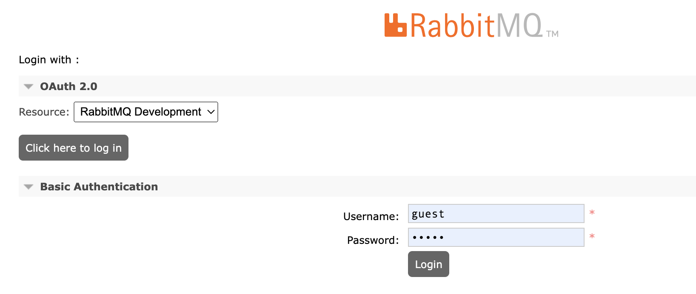

<!--
Copyright (c) 2005-2025 Broadcom. All Rights Reserved. The term "Broadcom" refers to Broadcom Inc. and/or its subsidiaries.

All rights reserved. This program and the accompanying materials
are made available under the terms of the under the Apache License,
Version 2.0 (the "License”); you may not use this file except in compliance
with the License. You may obtain a copy of the License at

https://www.apache.org/licenses/LICENSE-2.0

Unless required by applicable law or agreed to in writing, software
distributed under the License is distributed on an "AS IS" BASIS,
WITHOUT WARRANTIES OR CONDITIONS OF ANY KIND, either express or implied.
See the License for the specific language governing permissions and
limitations under the License.
-->

import {
  RabbitMQServerGitTag,
} from '@site/src/components/RabbitMQServer';

import Tabs from '@theme/Tabs';
import TabItem from '@theme/TabItem';

# Management Plugin

## Overview {#overview}

The RabbitMQ management plugin provides an HTTP-based API
for management and [monitoring](./monitoring) of RabbitMQ nodes and clusters, along
with a browser-based UI and a command line tool, [rabbitmqadmin](./management-cli).

It periodically collects and aggregates data about many aspects of the system. Those metrics
are exposed to human operators in the UI. The API it provides can be used by [monitoring systems](./monitoring),
however, [Prometheus](./prometheus) is the **recommended option** for long term storage,
alerting, visualisation, chart analysis and so on.

The plugin also provides tools for [analysing memory usage](#memory) of the node,
and other features related to monitoring, metrics, user, permission, and topology management.
Previously it also provided [definition export and import functionality](./definitions). Those are now
core RabbitMQ features and do not require or rely on this plugin.

This guide covers:

 * [Basic usage](#usage) of management UI
 * The [HTTP API](#http-api) provided by the management plugin
 * General plugin [configuration](#configuration)
 * [Reverse proxy (Nginx or Apache)](#http-api-proxy) in front of the HTTP API
 * How to [enable HTTPS for management UI](#single-listener-https) and its underlying API
 * How this plugin [operates in multi-node clusters](#clustering)
 * How to [disable metric collection](#disable-stats) to use [Prometheus](./prometheus) exclusively for monitoring
 * How to create [a user with limited permissions for monitoring purposes](#monitoring-permissions) only
 * [Authenticating with OAuth 2](#oauth2-authentication)
 * [Strict transport security](#hsts), [Content security policy](#csp), [cross-origin resource sharing](#cors), and [other security-related header](#other-security-headers) control
 * [Statistics collection interval](#statistics-interval)
 * [Message rate mode](#rates-mode) (rate fidelity) and [data retention intervals](#sample-retention)
 * [HTTP API request logging](#http-logging)
 * How to set a [management UI login session timeout](#login-session-timeout)
 * How to [reset statistics database](#reset-stats) used by this plugin

The plugin also provides extension points that other plugins, such as
[rabbitmq-top](https://github.com/rabbitmq/rabbitmq-server/tree/main/deps/rabbitmq_top) or
[rabbitmq-shovel-management](https://github.com/rabbitmq/rabbitmq-shovel-management),
use to extend the UI.


## Management UI and External Monitoring Systems {#external-monitoring}

:::important
Prefer external monitoring options where possible.
[Infrastructure and kernel-level monitoring](./monitoring) is also crucially important to have
in any production system.
:::

The management UI and its [HTTP API](#http-api) is a built-in [monitoring option](./monitoring) for RabbitMQ.
This is a convenient option for development and in environments where
external monitoring is difficult or impossible to introduce.

However, the management UI has a number of limitations:

 * The monitoring system is intertwined with the system being monitored
 * A certain amount of overhead
 * It only stores recent data (think hours, not days or months)
 * It has a basic user interface
 * Its design [emphasizes ease of use over best possible availability](./management#clustering).
 * Management UI access is controlled via the [RabbitMQ permission tags system](./access-control)
   (or a convention on JWT token scopes)

Long term metric storage and visualisation services such as [Prometheus and Grafana](./prometheus)
or the [ELK stack](https://www.elastic.co/elastic-stack/) are more suitable options for production systems. They offer:

 * Decoupling of the monitoring system from the system being monitored
 * Lower overhead
 * Long term metric storage
 * Access to additional related metrics such as those of the [Erlang runtime](./runtime) ones
 * More powerful and customizable user interface
 * Ease of metric data sharing: both metric state and dashboards
 * Metric access permissions are not specific to RabbitMQ
 * Collection and aggregation of node-specific metrics which is more resilient to individual node failures

RabbitMQ provides first class support for [Prometheus and Grafana](./prometheus) as of 3.8.
It is recommended for production environments.


## Getting Started {#getting-started}

The management plugin is included in the RabbitMQ
distribution. Like any other [plugin](./plugins), it must
be enabled before it can be used. That's done using [rabbitmq-plugins](./man/rabbitmq-plugins.8):

```bash
rabbitmq-plugins enable rabbitmq_management
```

Node restart is not required after plugin activation.

During automated deployments, the plugin can be enabled via
[enabled plugin file](./plugins#enabled-plugins-file).


## Usage {#usage}

### Management UI Access {#usage-ui}

The management UI can be accessed using a Web browser at <code>http://<i>node-hostname</i>:15672/</code>.

For example, for a node running on a machine with the hostname of `warp10.local`,
it can be accessed by users with [sufficient privileges](#permissions) at either `http://warp10.local:15672/`
or `http://localhost:15672/` (provided that `localhost` resolves correctly).

Note that the UI and HTTP API port — typically 15672 — does not support AMQP 0-9-1, AMQP 1.0, STOMP or MQTT connections.
[Separate ports](./networking#ports) should be used by those clients.

Users must be [granted permissions](#permissions) for management UI access.

### Notable Features {#usage-highlights}

The management UI is implemented as a single page application which relies on the [HTTP API](#http-api).
Some of the features include:

<ul>
  <li>
    Declare, list and delete exchanges, <a href="./queues">queues</a>, bindings,
    users, <a href="./vhosts">virtual hosts</a> and <a href="./access-control">user permissions</a>.
  </li>
  <li>
    Monitor queue length, message rates (globally and per queue, exchange or channel), resource usage of queue,
    node GC activity, data rates of client connections, and more.
  </li>
  <li>
    Monitor node resource use: <a href="./networking#open-file-handle-limit">sockets and file descriptors</a>,
    <a href="./memory-use">memory usage breakdown</a>, available disk space and bandwidth usage on inter-node communication
    links.
  </li>
  <li>
    Manage users (provided administrative permissions of the current user).
  </li>
  <li>
    Manage <a href="./parameters">policies and runtime parameters</a> (provided sufficient permissions of the current user).
  </li>
  <li>
    <a href="./backup">Export schema</a> (vhosts, users, permissions, queues, exchanges, bindings, parameters,
    policies) and <a href="./definitions">import it on node start</a>. This can be used for <a href="./backup">recovery purposes</a>
    or setup automation of new nodes and clusters.
  </li>
  <li>
    Force close client connections, purge queues.
  </li>
  <li>
    Send and receive messages (useful in development environments
    and for troubleshooting).
  </li>
</ul>

The UI application supports recent versions of Google Chrome, Safari, Firefox, and Microsoft Edge browsers.

### Management UI Access in Clusters {#usage-ui-clusters}

Any cluster node with `rabbitmq_management` plugin enabled can be
used for management UI access or data collection by monitoring tools.
It will reach out to other nodes and collect their stats, then aggregate and return a response
to the client.

To access management UI the user has to authenticate and have certain permissions (be authorised).
This is covered in the [following section](#permissions).


## Access and Permissions {#permissions}

The management UI requires [authentication and authorisation](./access-control), much like RabbitMQ requires
it from connecting clients. In addition to successful authentication, management UI access is controlled by user tags.
The tags are managed using [rabbitmqctl](./man/rabbitmqctl.8#set_user_tags).
Newly created users do not have any tags set on them by default.

See [Deployment Guidelines](./production-checklist) for general recommendations on user and credential
management.

<table>
  <tr>
    <th>Tag</th>
    <th>Capabilities</th>
  </tr>
  <tr>
    <td>(None)</td>
    <td>No access to the management plugin</td>
  </tr>
  <tr>
  <td>management</td>
  <td>
    Anything the user could do via messaging protocols plus:
    <ul>
      <li>List virtual hosts to which they can log in via AMQP</li>
      <li>
        View all queues, exchanges and bindings in "their"
        virtual hosts
      </li>
      <li>View and close their own channels and connections</li>
      <li>
        View "global" statistics covering all their
        virtual hosts, including activity by other users
        within them
      </li>
    </ul>
  </td>
  </tr>
  <tr>
  <td>policymaker</td>
  <td>
    Everything "management" can plus:
    <ul>
      <li>
        View, create and delete policies and parameters for virtual
        hosts to which they can log in via AMQP
      </li>
    </ul>
  </td>
  </tr>
  <tr>
  <td>monitoring</td>
  <td>
    Everything "management" can plus:
    <ul>
      <li>
        List all virtual hosts, including ones they could
        not access using messaging protocols
      </li>
      <li>View other users's connections and channels</li>
      <li>View node-level data such as memory use and clustering</li>
      <li>View truly global statistics for all virtual hosts</li>
    </ul>
  </td>
  </tr>
  <tr>
  <td>administrator</td>
  <td>
    Everything "policymaker" and "monitoring" can plus:
    <ul>
      <li>Create and delete virtual hosts</li>
      <li>View, create and delete users</li>
      <li>View, create and delete permissions</li>
      <li>Close other users's connections</li>
    </ul>
  </td>
  </tr>
</table>

Note that since "administrator" does everything "monitoring"
does, and "monitoring" does everything "management" does,
each user often needs a maximum of one tag.

Normal RabbitMQ [permissions to resources](./access-control) still apply to monitors and
administrators; just because a user is a monitor or
administrator does not grant them full access to exchanges,
queues and bindings through the management
plugin or other means.

All users can only list objects within the virtual
hosts they have any permissions for.

### Monitoring-Only (Read-Only) Access {#monitoring-permissions}

Some users are created exclusively for [observability purposes](./monitoring). More specifically,
such users need to list all objects and inspect their metrics but not have the [permissions](./access-control)
to add or delete entities ([queues](./queues), [streams](./streams), exchanges, bindings, and so on).
Such users also do not need to publish or consume messages.

This can be accomplished by

1. Creating a user tagged as `monitoring`
2. Granting it permissions (`configure`, `read`, `write`) that are empty (will match no objects)

Both steps can be accomplished using the management UI or the [HTTP API](#http-api), or, if
those options are not available or optimal, using [CLI tools](./cli):

 * [`rabbitmqctl add_user`](./man/rabbitmqctl.8#add_user) can be used to create the user
 * [`rabbitmqctl set_permissions`](./man/rabbitmqctl.8#set_permissions) to grant the
   user the desired permissions and finally,
 * [`rabbitmqctl set_user_tags`](./man/rabbitmqctl.8#set_user_tags)
   to tag it with `monitoring`, which will grant them management UI access

### Command Line Examples: Create a User with Monitoring-Only Access

The following example creates a user with complete access to the management UI/HTTP API (as in,
all virtual hosts and management features):

<Tabs>
<TabItem value="bash" label="bash" default>
```bash
# See the Access Control guide to learn about user management.
#
# Password is provided as a command line argument.
# Note that certain characters such as !, &, $, #, and so on must be escaped to avoid
# special interpretation by the shell.
rabbitmqctl add_user 'monitoring' '2a55f70a841f18b97c3a7db939b7adc9e34a0f1b'

# tag user 'monitoring' with a tag of the same name
rabbitmqctl set_user_tags 'monitoring' 'monitoring'

# grant the user empty permissions
rabbitmqctl set_permissions --vhost 'vhost-name' 'monitoring' '^$' '^$' '^$'
```
</TabItem>
<TabItem value="PowerShell" label="PowerShell">
```PowerShell
# See the Access Control guide to learn about user management.
#
# password is provided as a command line argument
rabbitmqctl.bat add_user 'monitoring' '9a55f70a841f18b97c3a7db939b7adc9e34a0f1d'

# passwords with special characters must be quoted correctly
rabbitmqctl.bat add_user 'monitoring' '"w63pnZ&LnYMO(t"'

# grant the user empty permissions
rabbitmqctl.bat set_permissions --vhost 'vhost-name' 'monitoring' '^$' '^$' '^$'
```
</TabItem>
<TabItem value="cmd" label="cmd">
```batch
rem See the Access Control guide to learn about user management.

rem password is provided as a command line argument
rabbitmqctl.bat add_user "monitoring" "9a55f70a841f18b97c3a7db939b7adc9e34a0f1d"

rem passwords with special characters must be quoted correctly
rabbitmqctl.bat add_user "monitoring" "w63pnZ&LnYMO(t"

rem grant the user empty permissions
rabbitmqctl set_permissions --vhost "vhost-name" "monitoring" "^$" "^$" "^$"
```
</TabItem>
</Tabs>


## Authenticating with OAuth 2 {#oauth2-authentication}

You can configure RabbitMQ to use [JWT-encoded OAuth 2.0 access tokens](https://github.com/rabbitmq/rabbitmq-server/tree/main/deps/rabbitmq_auth_backend_oauth2) to authenticate client applications, however, to use OAuth 2.0 authentication in the management UI, you have to configure it separately.

There are two ways to initiate OAuth 2.0 authentication in the management UI:
- *Service-Provided Initiated login*. The is the OAuth method and the default way to initiate authentication in the management UI. It uses the [OAuth 2.0 Authorization Code Flow with PKCE](https://datatracker.ietf.org/doc/html/rfc7636) to redirect users to the configured OAuth 2.0 provider to authenticate. When they are authenticated, users get an access token, and are then returned back to the management UI where they are automatically logged in. The management UI is tested against these OAuth 2.0 providers:

  * [UAA](https://github.com/cloudfoundry/uaa)
  * [Keycloak](https://www.keycloak.org/)
  * [Auth0](https://auth0.com/)
  * [Azure](https://docs.microsoft.com/en-us/azure/active-directory/fundamentals/auth-oauth2)
  * [OAuth2 Proxy](https://oauth2-proxy.github.io/oauth2-proxy/)
  * [Okta](https://www.okta.com)

- *Identity-Provider Initiated login*. For this type of login, users must come to RabbitMQ with an access token.This type of authentication is typical in portals which offers access to various applications/services to authenticated users. One of those services could be one or many RabbitMQ clusters. When a user requests access to a RabbitMQ cluster, the portal forwards the user to RabbitMQ's management UI with an access token issued for the user and RabbitMQ cluster. This type of authentication is covered in the sub-section [Identity-Provider initiated logon](#idp-initiated-logon).

To configure OAuth 2.0 in the management UI you need a [minimum configuration](#minimum-configuration). However, you may require additional configuration depending on your use case:

    * [Client secret](#configure-client-secret)
    * [Allow Basic and OAuth 2 authentication for management HTTP API](#allow-basic-auth-for-http-api)
    * [Allow Basic and OAuth 2 authentication for management UI](#allow-basic-auth-for-mgt-ui)
    * [Logging out of the management UI](#about-logout-workflow)
    * [Special attention to CSP header `connect-src`](#csp-header)
    * [Identity-Provider initiated logon](#idp-initiated-logon)
    * [Support multiple OAuth 2.0 resources](#support-multiple-resources)

### Minimum configuration {#minimum-configuration}

The first section is the minimum configuration required to use OAuth 2.0 authentication in the management UI. The following sections explain how to further configure OAuth 2.0 depending of the use cases.

Given the following configuration of the [OAuth 2.0 plugin](./oauth2):

```ini
auth_oauth2.resource_server_id = new_resource_server_id
auth_oauth2.issuer = https://my-oauth2-provider.com/realm/rabbitmq
```

To use OAuth 2.0 authentication, apply the following configuration in the management UI:

```ini
management.oauth_enabled = true
management.oauth_client_id = rabbit_user_client
management.oauth_scopes = <SPACE-SEPARATED LIST OF SCOPES. See below>
```

- `oauth_enabled` is a mandatory field
- `oauth_client_id` is a mandatory field. It is the OAuth Client Id associated with this RabbitMQ cluster in the OAuth Provider, and it is used to request a token on behalf of the user.
- `oauth_scopes` is a mandatory field which must be set at all times except in the case when OAuth providers automatically grant scopes associated to the `oauth_client_id`. `oauth_scopes` is a list of space-separated strings that indicate which permissions the application is requesting. Most OAuth providers only issue tokens with the scopes requested during the user authentication. RabbitMQ sends this field along with its `oauth_client_id` during the user authentication. If this field is not set, RabbitMQ defaults to `openid profile`.

Given above configuration, when a user visits the management UI, the following two events take place:
1. RabbitMQ uses the URL found in `auth_oauth2.issuer` followed by the path `/.well-known/openid-configuration` to download the OpenID Provider configuration. It contains information about other endpoints such as the `jwks_uri` (used to download the keys to validate the token's signature) or the `token_endpoint`.

    :::warning
    If RabbitMQ cannot download the OpenID provider configuration, it shows an error message and the OAuth 2.0 authentication option will be disabled in the management UI
    :::

2. RabbitMQ displays a button with the label "Click here to login". When the user clicks on the button, the management UI initiates the OAuth 2.0 Authorization Code Flow, which redirects the user to the identity provider to authenticate and get a token.

### Configure client secret {#configure-client-secret}

**Important**: From the OAuth 2.0 point of view, the management UI is a **public app** which
means it cannot securely store credentials such as the *client_secret*. This means that RabbitMQ should not need to present a client_secret when authenticating users.

However, there could be OAuth Providers which requires a *client_secret* either for the initial user authentication request or for the token refresh request. For instance, UAA server requires `client_secret` to refresh the token. For these cases, it is possible to configure `oauth_client_secret` like shown below:

```ini
management.oauth_enabled = true
management.oauth_client_id = rabbit_user_client
management.oauth_client_secret = rabbit_user_client
management.oauth_scopes = openid profile rabbitmq.*
```

### Allow Basic and OAuth 2 authentication for Management HTTP API {#allow-basic-auth-for-http-api}

When using `management.oauth_enabled = true`, it is still possible to authenticate
with [HTTP basic authentication](https://en.wikipedia.org/wiki/Basic_access_authentication)
against the HTTP API. This means both of the following examples will work:

```bash
# swap <token> for an actual token
curl -i -u ignored:<token> http://localhost:15672/api/vhosts
```

as well as

```bash
curl -i --header "authorization: Basic <encoded credentials>" http://localhost:15672/api/vhosts
```

To switch to authenticate using OAuth 2 exclusively for management HTTP access, set the
`management.disable_basic_auth` configuration key to `true`:

```ini
...
management.disable_basic_auth = true
...
```

When setting `management.disable_basic_auth` to `true`, only the `Bearer` (token-based) authorization method will
work, for example:

```bash
# swap <token> for an actual token
curl -i --header "authorization: Bearer <token>" http://localhost:15672/api/vhosts
```

This is true for all endpoints except `GET /definitions` and `POST /definitions`. Those
endpoints require the token to be passed in the `token` query string parameter.

### Allow Basic and OAuth 2 authentication for management UI {#allow-basic-auth-for-mgt-ui}

When using `management.oauth_enabled = true`, it is still possible to authenticate
with [HTTP basic authentication](https://en.wikipedia.org/wiki/Basic_access_authentication)
in the management UI.

By default, `management.oauth_disable_basic_auth` has the value `true`, meaning that when OAuth 2 is
enabled, the management UI only accepts OAuth 2 authentication. The management UI shows a button with the label **Click here to login** like shown in the screenshot below:


To support OAuth 2.0 and Basic Authentication, set the
 `management.oauth_disable_basic_auth` configuration key to `false`:

```ini
...
management.oauth_disable_basic_auth = false
...
```
The management UI shows now a username/password login form for Basic Authentication in addition to the **Click here to login** button for OAuth 2 authentication:


### Logging out of the management UI {#about-logout-workflow}

RabbitMQ implements the [OpenID Connect RP-Initiated Logout 1.0](https://openid.net/specs/openid-connect-rpinitiated-1_0.html)
specification to logout users from the management UI and from the OAuth Provider. It works as follows:

  1. The user clicks **Logout**.
  2. If the [OpenId Connect Discovery endpoint](https://openid.net/specs/openid-connect-discovery-1_0.html#ProviderConfigurationRequest) returns an `end_session_endpoint`, the management UI sends a logout request to that endpoint to close the user's session in the OAuth Provider. When the request completes, the user is also logged out from the management ui.
  3. If there is no `end_session_endpoint` returned, then the user is only logged out from the management UI.

:::info
If the [OpenId Connect Discovery endpoint](https://openid.net/specs/openid-connect-discovery-1_0.html#ProviderConfigurationRequest) does not return an `end_session_endpoint`, you can configure it in the [OAuth 2.0 authentication backend plugin](./oauth2#configure-end-session-endpoint).
:::

:::warning
RabbitMQ 3.13.1 and earlier versions require the [OpenId Connect Discovery endpoint](https://openid.net/specs/openid-connect-discovery-1_0.html#ProviderConfigurationRequest) `end_session_endpoint` returned for OAuth 2.0 authentication to work.
:::

There are other two additional scenarios which can trigger a logout. One scenario occurs when the OAuth Token expires. Although RabbitMQ renews the token in the background before it expires, if the token expires, the user is logged out.
The second scenario is when the management UI session exceeds the maximum allowed time configured on the [Login Session Timeout](#login-session-timeout).

### Special attention to CSP header `connect-src` {#csp-header}

To support the OAuth 2.0 protocol, RabbitMQ makes asynchronous REST calls to the [OpenId Connect Discovery endpoint](https://openid.net/specs/openid-connect-discovery-1_0.html#ProviderConfigurationRequest). If you override the default [CSP headers](#csp), you have to make sure that the `connect-src` CSP directive whitelists the [OpenId Connect Discovery endpoint](https://openid.net/specs/openid-connect-discovery-1_0.html#ProviderConfigurationRequest).

For instance, if you configured the CSP header with the value `default-src 'self'`, you are, by default, setting `connect-src 'self'` which means you are denying RabbitMQ access to any external endpoint; hence disabling OAuth 2.0.

In addition to the `connect-src` CSP header, RabbitMQ also needs the CSP directives `unsafe-eval` `unsafe-inline`, otherwise the OAuth 2.0 functionality may not work.

### Identity-Provider initiated logon {#idp-initiated-logon}

By default, the management UI uses the OAuth 2.0 **authorization code flow** to authenticate and authorize users.
However, there are scenarios where users prefer to be automatically redirected to RabbitMQ without getting involved in additional logon flows. By using OAuth 2.0 proxies and web portals, these additional logon flows can be avoided. With a single click, users navigate straight to the management UI with a token obtained under the covers. This is known as **Identity-Provider initiated logon**.

RabbitMQ exposes a setting called `management.oauth_initiated_logon_type` whose default value `sp_initiated`.
To use an **Identity-Provider initiated logon** you set it to `idp_initiated`.

```ini
management.oauth_enabled = true
management.oauth_initiated_logon_type = idp_initiated
management.oauth_provider_url = https://my-web-portal
```

With the previous settings, the management UI exposes the HTTP endpoint `/login` which accepts `content-type: application/x-www-form-urlencoded` and it expects the JWT token in the `access_token` form field. This is the endpoint where the Web portal will redirect users to the management UI.
Additionally, RabbitMQ also accepts a JWT token in the HTTP `Authorization` header when the user lands on the management UI.

With `sp_initiated` logon types, there is no need to configure the `oauth_provider_url` if `auth_oauth2.issuer` was set. However, for `idp_initiated` flows the `auth_oauth2.issuer` url may not necessarily be the url where to send users to authenticate. When this occurs, the `management.oauth_provider_url` overrides the `auth_oauth2.issuer` url.

### Support multiple OAuth 2.0 resources {#support-multiple-resources}

#### Prerequisite

To configure multiple OAuth 2.0 resources in the management UI, you first [configure them in the OAuth 2.0 plugin](./oauth2#multiple-resource-servers). Let's say you have the following OAuth 2.0 plugin configuration which consists of four OAuth 2.0 resources:

```ini
auth_oauth2.issuer = http://some_idp_url
auth_oauth2.scope_prefix = rabbitmq.
auth_oauth2.resource_servers.1.id = rabbit_prod
auth_oauth2.resource_servers.2.id = rabbit_dev
auth_oauth2.resource_servers.3.id = rabbit_qa
auth_oauth2.resource_servers.4.id = rabbit_internal
```

The next sections configure these resources in the management UI.

#### How OAuth 2.0 resources are presented to users

When there are more than one OAuth 2.0 resource configured in the management UI, RabbitMQ shows a drop-down list in addition to the button with the label *Click here to logon*. The drop-down list has one option per resource. The label of the option is by default the resource's id however you can ovrride it.

It is possible to have some resources configured with `sp_initiated` logon and others with `idp_initiated` logon. And it is also possible to disable a resource, in other words, the resource does not appear as an option in the drop-down.

#### Optionally set common settings for all resources

If the majority of resources have in common some configuration values, you set them like shown below:

```ini
management.oauth_enabled = true
management.oauth_initiated_logon_type = sp_initiated
management.oauth_scopes = openid rabbitmq.tag:management rabbitmq.read:*/*
```

Here we have configured that all resources, or the majority of them, requires `sp_initiated` logon type and the scopes claimed to the Authorization Server are `openid rabbitmq.tag:management rabbitmq.read:*/*`.

:::info
`sp_initiated` is the default value for `management.oauth_initiated_logon_type`, therefore you would not need to configure it.
:::

#### Override default oauth_initiated_logon_type for each resource

Let's say that the resource `rabbit_qa` requires `idp_initiated` logon however the logon type configured for all resources is `sp_initiated`. The configuration below overrides the logon type and also the URL of the OAuth Provider.

```ini
management.oauth_resource_servers.3.id = rabbit_qa
management.oauth_resource_servers.3.label = RabbitMQ QA
management.oauth_resource_servers.3.oauth_initiated_logon_type = idp_initiated
management.oauth_resource_servers.3.oauth_provider_url = http://qa_url
```

#### Set oauth_client_id setting, if required, and the label for each resource

Next, configure the `oauth_client_id` for each resource which uses `sp_initiated` logon type.

This is the minimum setting required for `sp_initiated` logon type. The following example that exposes the resource `rabbit_prod` with its `oauth_client_id` and its `label`. If you do not specify the `label`, the management UI uses the `id` instead.

```ini
management.oauth_resource_servers.1.id = rabbit_prod
management.oauth_resource_servers.1.oauth_client_id = rabbit_prod_mgt_ui
management.oauth_resource_servers.1.label = RabbitMQ Production
```

With this configuration, when the user chooses to option `RabbitMQ Production`, RabbitMQ initiates the *Authorization Code flow* which takes the user to the URL configured in `auth_oauth2.issuer` with
the following settings:
- `client_id` : `rabbit_prod_mgt_ui`
- `resource` : `rabbit_prod`
- `scopes` : `openid rabbitmq.tag:management rabbitmq.read:*/*`


#### Optionally do not expose some resources in the management UI

You may not want to expose all configured resources in the OAuth 2.0 plugin. For instance, in the following example, you are not exposing the resource `rabbit_internal` which is left for applications to authenticate via one of the messaging protocols.

```ini
management.oauth_resource_servers.4.id = rabbit_internal
management.oauth_resource_servers.4.disabled = true
```

#### Management UI screenshot without Basic Authentication

This is the management UI layout for the previous configuration with basic authentication deactivated in the management UI (`management.oauth_disable_basic_auth = true`).


#### Management UI screenshot with Basic Authentication

And this is the management UI with Basic Authentication activated (`management.oauth_disable_basic_auth = false`).



### Troubleshooting {#troubleshooting}

[Troubleshooting management UI access in OAuth 2-enabled clusters](./troubleshooting-oauth2#management-ui) is a companion guide
dedicated to common OAuth 2-specific issues.


## HTTP API {#http-api}

### API Endpoints {#http-api-endpoints}

When activated, the management plugin provides an HTTP API at
<code>http://<i>server-name</i>:15672/api/</code> by default. Browse to that
location for more information on the API. For convenience the same API reference is
<a href={`https://rawcdn.githack.com/rabbitmq/rabbitmq-server/${RabbitMQServerGitTag()}/deps/rabbitmq_management/priv/www/api/index.html`}>available on GitHub</a>.

### HTTP API and Monitoring {#http-api-monitoring}

The API is intended to be used for basic observability tasks. [Prometheus and Grafana](./prometheus)
are recommended for long term metric storage, alerting, anomaly detection, and so on.

Any cluster node with `rabbitmq-management` plugin activated can be
used for management UI access or HTTP API access.
It will reach out to other nodes and collect their stats, then aggregate and return a response
to the client.

When using the API in a cluster of nodes, there is no need to contact each node via HTTP API
individually. Instead, contact a random node or a load balancer that sits in front
of the cluster.

### HTTP API Clients and Tooling {#http-api-clients}

[rabbitmqadmin](./management-cli) is a Python command  line tool
that interacts with the HTTP API. It can be downloaded from any RabbitMQ node that
has the management plugin enabled at <code>http://<i>node-hostname</i>:15672/cli/</code>.

For HTTP API clients in several languages,
see [Developer Tools](/client-libraries/devtools).

Some API endpoints return a lot of information. The volume can be reduced
by filtering what columns are returned by `HTTP GET` requests. See
<a href={`https://rawcdn.githack.com/rabbitmq/rabbitmq-server/${RabbitMQServerGitTag()}/deps/rabbitmq_management/priv/www/api/index.html`}>latest HTTP API documentation</a> for details.

### Maximum HTTP Request Body Limit {#http-body-size-limit}

A few RabbitMQ HTTP API endpoints can potentially receive large payloads,
most notably the endpoint used for [definition import](./definitions/).

The default HTTP request body limit is 20 MiB. If such large definition
files are not used in a cluster, the limit can be reduced:

``` ini
# lowers the maximum HTTP request body size that will be accepted
# to 1 MiB
management.http.max_body_size = 1000000
```

When a client issues requests with a body that exceeds the limit, a `400 Bad Request` response will be returned.


### Using a Reverse Proxy in front of the HTTP API {#http-api-proxy}

It may be necessary to put a reverse proxy in front of a RabbitMQ cluster. Reverse proxy setup for RabbitMQ
may require careful handling of encoded slashes in paths if default virtual host (`/`) is used.

If default virtual host is not used, the additional settings to support encoded URIs
will not be necessary. In other words, both Nginx and Apache configuration will require
the standard minimum for any HTTP-based service.

#### Nginx

If RabbitMQ HTTP API access is configured for the root location (`/`),
the location must not have a slash at the end:

```nginxconf
# trailing slash in the location must be omitted only if default RabbitMQ virtual host is used
location / {
    proxy_pass http://rabbitmq-host:15672;
}
```

If a different location will be used to proxy requests to the HTTP API,
a [URI rewrite](https://nginx.org/en/docs/http/ngx_http_rewrite_module.html#rewrite) rule must be used:

```nginxconf
# these rewrites are only if default RabbitMQ virtual host is used
location ~* /rabbitmq/api/(.*?)/(.*) {
    proxy_pass http://rabbitmq-host:15672/api/$1/%2F/$2?$query_string;
}

location ~* /rabbitmq/(.*) {
    rewrite ^/rabbitmq/(.*)$ /$1 break;
    proxy_pass http://rabbitmq-host:15672;
}
```


#### Apache

To support encoded slashes in URIs, Apache requires users to explicitly enable
[`AllowEncodedSlashes`](https://httpd.apache.org/docs/2.4/mod/core.html).

```apacheconf
# required only if default RabbitMQ virtual host is used
AllowEncodedSlashes On
```

for the Apache virtual host. Apache needs both [mod_proxy](https://httpd.apache.org/docs/2.4/mod/mod_proxy.html) and [mod_proxy_http](https://httpd.apache.org/docs/2.4/mod/mod_proxy_http.html) enabled. The location also needs a [`nocanon` setting](https://httpd.apache.org/docs/2.4/mod/mod_proxy.html):

```apacheconf
ProxyPassReverse / http://rabbitmq-host:15672/
# "nocanon" is required only if default RabbitMQ virtual host is used
ProxyPass / http://rabbitmq-host:15672/ nocanon
```

## Configuration {#configuration}

There are several configuration options which affect the
management plugin. These are managed through the main
RabbitMQ [configuration file](./configure#configuration-files).

It is possible to configure HTTP API and management UI to
use a different port or network interface, enable HTTPS
and so on.

While rarely needed, it is possible to configure multiple listeners (ports), for example to both enable HTTPS and
retain support for clients that can only use HTTP (without TLS).

### Port {#single-listener-port}

The port is configured using the `management.tcp.port` key:

```ini
management.tcp.port = 15672
```

It is possible to configure what interface the API endpoint will use, similarly
to [messaging protocol listeners](./networking#interfaces), using
the `management.tcp.ip` key:

```ini
management.tcp.ip = 0.0.0.0
```

To check what interface and port is used by a running node, use
`rabbitmq-diagnostics`:

```bash
rabbitmq-diagnostics -s listeners
# => Interface: [::], port: 15672, protocol: http, purpose: HTTP API
# => Interface: [::], port: 15671, protocol: https, purpose: HTTP API over TLS (HTTPS)
```

or [tools such as `lsof`, `ss` or `netstat`](./troubleshooting-networking#ports).

### HTTPS {#single-listener-https}

The management plugin can be configured to use HTTPS. See the guide [on TLS](./ssl)
to learn more about certificate authorities, certificates and private key files.

```ini
management.ssl.port       = 15671
management.ssl.cacertfile = /path/to/ca_certificate.pem
management.ssl.certfile   = /path/to/server_certificate.pem
management.ssl.keyfile    = /path/to/server_key.pem
## This key must only be used if private key is password protected
# management.ssl.password   = bunnies
```

More [TLS options](./ssl) can be configured for the HTTPS listener.

```ini
management.ssl.port       = 15671
management.ssl.cacertfile = /path/to/ca_certificate.pem
management.ssl.certfile   = /path/to/server_certificate.pem
management.ssl.keyfile    = /path/to/server_key.pem
## This key must only be used if private key is password protected
# management.ssl.password   = bunnies

management.ssl.honor_cipher_order   = true
management.ssl.honor_ecc_order      = true
management.ssl.client_renegotiation = false
management.ssl.secure_renegotiate   = true

management.ssl.versions.1 = tlsv1.2
management.ssl.versions.2 = tlsv1.1

management.ssl.ciphers.1 = ECDHE-ECDSA-AES256-GCM-SHA384
management.ssl.ciphers.2 = ECDHE-RSA-AES256-GCM-SHA384
management.ssl.ciphers.3 = ECDHE-ECDSA-AES256-SHA384
management.ssl.ciphers.4 = ECDHE-RSA-AES256-SHA384
management.ssl.ciphers.5 = ECDH-ECDSA-AES256-GCM-SHA384
management.ssl.ciphers.6 = ECDH-RSA-AES256-GCM-SHA384
management.ssl.ciphers.7 = ECDH-ECDSA-AES256-SHA384
management.ssl.ciphers.8 = ECDH-RSA-AES256-SHA384
management.ssl.ciphers.9 = DHE-RSA-AES256-GCM-SHA384

## Usually RabbitMQ nodes do not perform peer verification of HTTP API clients
## but it can be enabled if needed. Clients then will have to be configured with
## a certificate and private key pair.
##
## See ./ssl#peer-verification for details.
# management.ssl.verify = verify_peer
# management.ssl.fail_if_no_peer_cert = true
```

Below is the same example in the [classic config format](./configure#erlang-term-config-file).

:::warning
The classic config format example is provided primarily for completeness sake,
using the modern `rabbitmq.conf` format for configuring this plugin is **highly recommended**.
:::

```erlang
%% The classic config format example is provided primarily for completeness sake,
%% using the modern `rabbitmq.conf` format for configuring this plugin is highly recommended.
[
  {rabbitmq_management,
   [
    {ssl_config, [{port,     15671},
                  {ssl,      true},
                  {cacertfile, "/path/to/ca_certificate.pem"},
                  {certfile,   "/path/to/server_certificate.pem"},
                  {keyfile,    "/path/to/server_key.pem"},

                  %% don't do peer verification to HTTPS clients
                  {verify,               verify_none},
                  {fail_if_no_peer_cert, false},

                  {client_renegotiation, false},
                  {secure_renegotiate,   true},
                  {honor_ecc_order,      true},
                  {honor_cipher_order,   true},

                  {versions,['tlsv1.2']},
                  {ciphers, ["ECDHE-ECDSA-AES256-GCM-SHA384",
                             "ECDHE-RSA-AES256-GCM-SHA384",
                             "ECDHE-ECDSA-AES256-SHA384",
                             "ECDHE-RSA-AES256-SHA384",
                             "ECDH-ECDSA-AES256-GCM-SHA384",
                             "ECDH-RSA-AES256-GCM-SHA384",
                             "ECDH-ECDSA-AES256-SHA384",
                             "ECDH-RSA-AES256-SHA384",
                             "DHE-RSA-AES256-GCM-SHA384"
                            ]}
                ]}
   ]}
 ].
```

### Using HTTP and HTTPS Together {#multiple-listeners}

It is possible to use both HTTP and HTTPS on different ports:

```ini
management.tcp.port       = 15672

management.ssl.port       = 15671
management.ssl.cacertfile = /path/to/ca_certificate.pem
management.ssl.certfile   = /path/to/server_certificate.pem
management.ssl.keyfile    = /path/to/server_key.pem
```

The same configuration keys can be used to configure a single listener (just HTTP or HTTPS)
and match those used by the [Web STOMP](./web-stomp) and [Web MQTT](./web-mqtt).

### Advanced HTTP Options {#advanced-options}

[Cowboy](https://github.com/ninenines/cowboy), the embedded Web server used by
the management plugin, provides a number of options that can be used to customize the behavior of the server.
Most of the options were introduced in RabbitMQ 3.7.9.

#### Response Compression

Response compression is enabled by default. To enable it explicitly, use `management.tcp.compress`:

```ini
management.tcp.compress = true
```

#### Client Inactivity Timeouts

Some HTTP API endpoints respond quickly, others may need to return or stream
a sizeable data set to the client (for example many thousands of connections) or perform
an operation that takes time proportionally to the input (for example [import a large definitions file](./definitions)).
In those cases the amount of time it takes to process the request can exceed certain
timeouts in the Web server as well as HTTP client.

It is possible to bump Cowboy timeouts using the `management.tcp.idle_timeout`,
`management.tcp.inactivity_timeout`, `management.tcp.request_timeout` options.

 * `management.tcp.inactivity_timeout` controls HTTP(S) client's TCP connection inactivity timeout.
   When it is reached, the connection will be closed by the HTTP server.
 * `management.tcp.request_timeout` controls the window of time in which the client has to send an HTTP
    request.
 * `management.tcp.idle_timeout` controls the window of time in which the client has to send more data (if any)
   within the context of an HTTP request.

If a load balancer or proxy is used between HTTP clients and the management HTTP server,
the `inactivity_timeout` and `idle_timeout` values should be at least as large, and often greater than,
the timeout and inactivity values used by the load balancer.

Here are some example configuration snippets that modify the timeouts:

```ini
# Configures HTTP (non-encrypted) listener timeouts
management.tcp.idle_timeout       = 120000
management.tcp.inactivity_timeout = 120000
management.tcp.request_timeout    = 10000
```

```ini
# Configures HTTPS (TLS-enabled) listener timeouts
management.ssl.idle_timeout       = 120000
management.ssl.inactivity_timeout = 120000
management.ssl.request_timeout    = 10000
```

All values are in milliseconds. Their defaults vary:

 * `management.tcp.inactivity_timeout` has the default of 300 seconds
 * `management.tcp.request_timeout` has the default of 60 seconds
 * `management.tcp.idle_timeout` has the default of 5 seconds

It is recommended that if the inactivity or idle timeout need changing,
`management.tcp.inactivity_timeout` value should match or be greater than that
of `management.tcp.idle_timeout`.

`management.tcp.request_timeout` typically does not need increasing as clients send a request
shortly after establishing a TCP connection.

### HTTP Request Logging {#http-logging}

RabbitMQ nodes do not [log](./logging/) any HTTP API requests by default.

To enable HTTP API access logging, use the `management.http_log_dir` key to
configure the path of a directory in which the access log log files can be created
by the node:

```ini
management.http_log_dir = /path/to/a/writeable/directory
```

For the change to have an effect, restart the plugin or the node.

### Statistics Interval {#statistics-interval}

By default the server will emit statistics events every
5 seconds (`5000` ms). The message rate values shown in the management
plugin are calculated over this period.

Increasing this value will reduce CPU resource consumption of
stats collection in environments with a large number of stats emitting
entities such as [connections](./connections), [channels](./channels), [queues](./queues).

In order to do so, set the value of the `collect_statistics_interval` configuration key
to the desired interval in milliseconds and restart the node:

```ini
# 15s
collect_statistics_interval = 15000
```


### Message Rates {#rates-mode}

The management plugin by default shows message rates
globally, and for each queue, channel, exchange, and
vhost. These are known as the *basic* message rates.

It can also show message rates for all the combinations of
channel to exchange, exchange to queue, and queue to
channel. These are known as *detailed* message rates.
Detailed message rates are disabled by default as they can
have a large memory footprint when there are a large
number of combinations of channels, queues and exchanges.

Alternatively, the message rates can be disabled
altogether. This can help get reduce CPU resource
consumption of the plugin.

The message rate mode is controlled by the
`management.rates_mode` configuration key:

```ini
# supported values: basic, detailed, none
management.rates_mode = basic
```

Supported values are `basic` (the default), `detailed`, and `none`.

### Sample (Data Point) Retention {#sample-retention}

The management plugin will retain samples of some data
such as message rates and queue lengths. Depending on how long the
data is retained, some time
range options on UI charts may be incomplete or unavailable.

There are three policies:

 * `global`: how long to retain data for the overview and virtual host pages
 * `basic`: how long to retain data for individual connections, channels, exchanges and queues
 * `detailed`: how long to retain data for message rates between pairs of connections, channels, exchanges and queues (as shown under "Message rates breakdown")

Below is a configuration example:

```ini
management.sample_retention_policies.global.minute  = 5
management.sample_retention_policies.global.hour    = 60
management.sample_retention_policies.global.day = 1200

management.sample_retention_policies.basic.minute = 5
management.sample_retention_policies.basic.hour   = 60

management.sample_retention_policies.detailed.10 = 5
```

The configuration in the example above retains global
data at a 5 second resolution (sampling happens every 5 seconds) for a minute,
then at a 1 minute (60 second) resolution for 1 hour, then at a 20 minute
resolution for one day. It retains basic data at a 5 second
resolution for 1 minute, at a 1 minute (60 second) resolution for
1 hour, and detailed data only for 10 seconds.

All three policies are mandatory, and must contain
at least one retention setting (period).

### Disable Statistics and Metric Collection {#disable-stats}

It is possible to disable the statistics in the UI and [HTTP API](#http-api) in order for these to be used only for operations. This can be a useful feature if external monitoring solutions such as [Prometheus and Grafana](./prometheus) are being used. If statistics are disabled in any of the following ways, all charts and detailed statistics will be hidden in the UI.

In order to completely disable the internal metrics collection, the `disable_metrics_collector` flag must be set in the `rabbitmq_management_agent` plugin.
The [Prometheus plugin](./prometheus) will still work even if collection is disabled.

```ini
management_agent.disable_metrics_collector = true
```

Disabling the metrics collection is the preferred option if it is being used with an external monitoring system, as this reduced the overhead that statistics collection and aggregation causes in the broker. If the statistics are only temporary disabled, or are not required in some [HTTP API](#http-api) queries, the aggregation of the stats can be disabled in the `rabbitmq_management` plugin. The disable flag can be also passed as part of the query string in the URI.

As at the moment the [Prometheus plugin](./prometheus) cannot report individual queue totals, there is a configuration option that allows to list `messages`, `messages_ready` and `messages_unacknowledged` in the `queues` endpoint.

Below is a configuration example that disables the statistics but returns individual queue totals in the `queues` page:

```ini
management.disable_stats = true
management.enable_queue_totals = true
```

### Content Security Policy (CSP) {#csp}

It is possible to configure what [CSP header](https://developer.mozilla.org/en-US/docs/Web/HTTP/CSP) value
is used by HTTP API responses. The default value is `script-src 'self' 'unsafe-eval' 'unsafe-inline'; object-src 'self'`:

```ini
management.csp.policy = script-src 'self' 'unsafe-eval' 'unsafe-inline'; object-src 'self'
```

The value can be any valid CSP header string:

```ini
management.csp.policy = default-src https://rabbitmq.eng.example.local
```

Wildcards are also allowed:

```ini
management.csp.policy = default-src 'self' *.eng.example.local
```

A CSP policy [`frame-ancestors` directive](https://developer.mozilla.org/en-US/docs/Web/HTTP/Headers/Content-Security-Policy/frame-ancestors) can be used
to prevent frame embedding of the management UI, mitigating
certain types of cross-frame scripting attacks:

```ini
# prohibits iframe embedding of the UI
management.csp.policy = frame-ancestors 'none'
```

### Strict Transport Security (HSTS) {#hsts}

It is possible to configure what [Strict Transport Security header](https://developer.mozilla.org/en-US/docs/Web/HTTP/Headers/Strict-Transport-Security) value
is used by HTTP API responses:

```ini
management.hsts.policy = max-age=31536000; includeSubDomains
```

### Cross-origin Resource Sharing (CORS) {#cors}

The management UI application will by default refuse access to
websites hosted on origins different from its own using the [Cross-Origin Resource Sharing](https://developer.mozilla.org/en-US/docs/Web/HTTP/CORS) mechanism,
also known as CORS. It is possible to white list origins:

```ini
management.cors.allow_origins.1 = https://origin1.org
management.cors.allow_origins.2 = https://origin2.org
```

It is possible to allow any origin to use the API using a wildcard.
This is <strong>highly discouraged</strong> for deployments where the UI
application may be exposed to the public.

```ini
management.cors.allow_origins.1 = *
```

The CORS pre-flight requests are cached by the browser.
The management plugin defines a timeout of 30 minutes
by default. The value can be changed. It is configured in seconds:

```ini
management.cors.allow_origins.1 = https://origin1.org
management.cors.allow_origins.2 = https://origin2.org
management.cors.max_age         = 3600
```

### Other Security-related Headers {#other-security-headers}

It is possible to set a few more security-related headers for management UI and HTTP API responses.
Note that some of them have been superseded by CORS and other newer development in the
browser security space.

The supported headers are:

 * [`X-Frame-Options`](https://developer.mozilla.org/en-US/docs/Web/HTTP/Headers/X-Frame-Options)
 * [`X-Xss-Protection`](https://developer.mozilla.org/en-US/docs/Web/HTTP/Headers/X-XSS-Protection)
 * [`X-Content-Type-Options`](https://developer.mozilla.org/en-US/docs/Web/HTTP/Headers/X-Content-Type-Options)

```ini
management.headers.content_type_options = nosniff
management.headers.xss_protection = 1; mode=block
management.headers.frame_options = DENY
```

They can be combined with the aforementioned CORS, HSTS, CSP headers:

```ini
management.hsts.policy = max-age=31536000; includeSubDomains
management.csp.policy = default-src 'self'; script-src 'self' 'unsafe-eval'

management.headers.content_type_options = nosniff
management.headers.xss_protection = 1; mode=block
management.headers.frame_options = DENY
```

### Login Session Timeout {#login-session-timeout}

After the user logs in, the user's web UI login session will expire after 8 hours by default.
It is possible to configure a different timeout using the
`login_session_timeout` setting.

The value should be an integer: it controls the length of login
session in minutes. When the time is up, the user will be signed out.

The following example sets the session timeout to 1 hour:

```ini
management.login_session_timeout = 60
```

### Path Prefix {#path-prefix}

Some environments require the use of a custom prefix for
all HTTP requests to the management plugin. The
`management.path_prefix` setting allows an arbitrary
prefix to be set for all HTTP request handlers in the
management plugin.

Setting `management.path_prefix` to `/my-prefix`
specifies all API requests to use the URI
`host:port/my-prefix/api/[...]`

The management UI login page will have the URI
`host:port/my-prefix/` - note that the
trailing slash is <em>required</em> in this case.

```ini
management.path_prefix = /my-prefix
```

### Example {#example-config}

An example configuration file for RabbitMQ that switches
on request logging, increases the statistics interval to
10 seconds and explicitly sets some other relevant parameters
to their default values, would look like this:

```ini
listeners.tcp.default = 5672

collect_statistics_interval = 10000

## Note: this uses the core `load_definitions` key over
## now deprecated `management.load_definitions`
# load_definitions = /path/to/exported/definitions.json

management.tcp.port = 15672
management.tcp.ip   = 0.0.0.0

management.ssl.port       = 15671
management.ssl.ip         = 0.0.0.0
management.ssl.cacertfile = /path/to/ca_certificate.pem
management.ssl.certfile   = /path/to/server_certificate.pem
management.ssl.keyfile    = /path/to/server_key.pem

management.http_log_dir = /path/to/rabbit/logs/http

management.rates_mode = basic

# Configure how long aggregated data (such as message rates and queue
# lengths) is retained.
# Your can use 'minute', 'hour' and 'day' keys or integer key (in seconds)
management.sample_retention_policies.global.minute    = 5
management.sample_retention_policies.global.hour  = 60
management.sample_retention_policies.global.day = 1200

management.sample_retention_policies.basic.minute   = 5
management.sample_retention_policies.basic.hour = 60

management.sample_retention_policies.detailed.10 = 5
```


## Loading Definitions (Schema) at Startup {#load-definitions}

Nodes and clusters store information that can be thought of schema, metadata or topology.
Users, vhosts, queues, exchanges, bindings, runtime parameters all fall into this category.

Definitions can be exported and imported via the [`rabbitmqctl`](./cli) or the HTTP API
provided by this plugin, including `rabbitmqadmin`.

Please refer to the [Definitions guide](./definitions).


## Metrics Collection and HTTP API in Clusters {#clustering}

### Client Requests {#clustering-client-requests}

The management plugin is aware of clusters. It can be enabled
on one or more nodes in a cluster, and see information
pertaining to the entire cluster no matter which node you
connect to.

### Running Management Plugin on a Subset of Nodes {#clustering-subset-of-nodes}

It is possible to deploy management plugin only on a subset of cluster nodes.
In that case only the nodes running the plugin would be able to serve client HTTP API requests.
For every cluster node to have its metrics collected, it is still required that the
`rabbitmq-management-agent` plugin is enabled on each node, otherwise
the metrics from the node won't be available.

### Aggregation Queries in Clusters {#clustering-inter-node-connectivity}

In cluster, HTTP API performs cluster-wide queries when handling client
requests, which means it can be affected by network partitions, network slowdowns,
and unresponsive nodes.

Timeouts for inter-node aggregation queries are controlled via the
[net tick mechanism](./nettick). Lowering the value may help reduce
the delay introduced by nodes that have recently become unresponsive.
Values lower than 10s **can produce false positives and must be avoided**.

In contrast to the HTTP API, the [Prometheus monitoring endpoint](./prometheus) only serves
node-local data and is generally not affected by failures or unavailability of other nodes
in the cluster.


## (Reverse HTTP) Proxy Setup {#proxy}

It is possible to make the web UI available via any proxy that
conforms with RFC 1738. The following sample Apache configuration
illustrates the minimum necessary directives to coax Apache into
conformance. It assumes a management web UI on the default port of 15672:

```ini
AllowEncodedSlashes      NoDecode
ProxyPass         "/api" http://localhost:15672/api nocanon
ProxyPass         "/"    http://localhost:15672/
ProxyPassReverse  "/"    http://localhost:15672/
```


## Restarting Statistics Database {#reset-stats}

Statistics database is stored entirely in memory. All of its contents
is transient and should be treated as such.

In modern versions, ach node has its own statistics database
containing a fraction of stats recorded on this node.

It is possible to restart the stats database on a given node using
`rabbitmqctl` or an HTTP API endpoint:

```
DELETE /api/reset/:node
```

```bash
rabbitmqctl eval 'rabbit_mgmt_storage:reset().'
```

To reset the entire statistics database on all nodes, use

```
DELETE /api/reset
```

```bash
rabbitmqctl eval 'rabbit_mgmt_storage:reset_all().'
```


## Memory Usage Analysis and Memory Management {#memory}

Management UI can be used to inspect node's memory use, including displaying
a per-category breakdown. See the [Memory Use Analysis](./memory-use) guide
for details.

Management database builds around periodically emitted stats,
regulated by the statistics interval described above, or when certain components are
created/declared (for example a new connection or channel is
opened, or a queue declared) or closed/deleted.  Message
rates do not directly affect management database memory
usage.

Total amount of memory consumed by the stats database
depends on the topology size (for example the number of queues), number of concurrent connections
and channels, event emission interval, effective rates mode and
retention policies.

Entities that emit stats (connections, channels, queues, nodes) do so periodically.
The interval can be configured using the `collect_statistics_interval` key:

```ini
# sets the interval to 30 seconds
collect_statistics_interval = 30000
```

Increasing the interval value to 30-60s will reduce CPU footprint and peak memory
consumption for systems with large amounts of connections, channels and queues.
This comes with a downside: metrics of said entities will refresh every 30-60 seconds.
This can be perfectly reasonable in an [externally monitored](./monitoring#monitoring-frequency) production system
but will make management UI less convenient to use for operators.

The memory usage of the channel and stats collector processes can be limited
by setting the maximum backlog queue size using the parameter
`stats_event_max_backlog`. If the backlog queue is full, new channel
and queue stats will be dropped until the previous ones have been processed.

The statistics interval can also be changed at runtime. Doing so will have no
effect on existing connections, channels or queues. Only new stats
emitting entities are affected.

```bash
rabbitmqctl eval 'application:set_env(rabbit, collect_statistics_interval, 60000).'
```

The statistics database can be restarted (see above) and thus forced to release all memory.
Management UI's Overview page contains buttons that reset stats database for individual nodes as well as
all nodes in the cluster.


## Publishing and Consuming over HTTP API {#publishing-consuming}

It is possible to publish and consume messages using the [HTTP API](#http-api).
This way of messaging is discouraged: prefer one of the binary messaging protocols supported
by RabbitMQ. Publishing and consuming that way will be significantly more efficient and will
provide access to various messaging protocol features such as [confirmations](./confirms).

Publishing over HTTP API can be useful in environments where
[long lived messaging protocol connections](./connections) is not an option.
