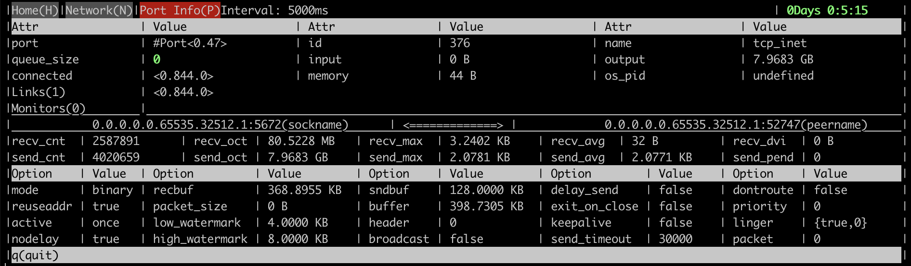

<!--
Copyright (c) 2005-2025 Broadcom. All Rights Reserved. The term "Broadcom" refers to Broadcom Inc. and/or its subsidiaries.

All rights reserved. This program and the accompanying materials
are made available under the terms of the under the Apache License,
Version 2.0 (the "License”); you may not use this file except in compliance
with the License. You may obtain a copy of the License at

https://www.apache.org/licenses/LICENSE-2.0

Unless required by applicable law or agreed to in writing, software
distributed under the License is distributed on an "AS IS" BASIS,
WITHOUT WARRANTIES OR CONDITIONS OF ANY KIND, either express or implied.
See the License for the specific language governing permissions and
limitations under the License.
-->

import {
  RabbitMQServerGitTag,
} from '@site/src/components/RabbitMQServer';

# Monitoring

## Overview {#overview}

This document provides an overview of topics related to RabbitMQ monitoring.
Monitoring RabbitMQ and applications that use it is critically important. Monitoring helps
detect issues before they affect the rest of the environment and, eventually, the end users.

The combination of [Prometheus and Grafana](./prometheus) is the highly recommended option
for RabbitMQ monitoring.

Monitoring is a broad topic. This guide covers several :

 * [What is monitoring](#fundamentals), why it is important, what common approaches to it exist
 * Available monitoring options:
     * [Prometheus-compatible](#with-prometheus) external scrapers for production clusters
     * [Kubernetes Operator monitoring](#on-kubernetes) features for Kubernetes users
     * [interactive command line tool](#with-cli-observer) for focused troubleshooting
     * [management plugin](#with-management)'s HTTP API for development environments
 * What [infrastructure and kernel metrics](#system-metrics) are important to monitor
 * What [RabbitMQ metrics](#rabbitmq-metrics) are available:
     * [Node metrics](#node-metrics)
     * [Queue metrics](#queue-metrics)
     * [Cluster-wide metrics](#cluster-wide-metrics)
 * How much [overhead does monitoring introduce](#overhead) and [how frequently](#monitoring-frequency) should monitoring checks be performed?
 * [Application-level metrics](#app-metrics)
 * How to approach [node health checking](#health-checks) and why it's more involved than a single
   CLI command
 * Health checks use as [node readiness probes](#readiness-probes) during deployment or upgrades
 * [Log aggregation](#log-aggregation) across all nodes and applications is closely related to monitoring

A number of [popular tools](#monitoring-tools), both open source and commercial,
can be used to monitor RabbitMQ. As mentioned above, the combination of [Prometheus and Grafana](./prometheus)
is what team RabbitMQ would recommend to most users. [On Kubernetes](/kubernetes/operator/operator-monitoring),
the Prometheus plugin is automatically enabled by the Kubernetes RabbitMQ Operator.


## What is Monitoring? {#fundamentals}

In this guide we define monitoring as a process of
capturing the behaviour of a system via health checks and metrics  over time.
This helps detect anomalies: when the system is unavailable, experiences an unusual load,
exhausted of certain resources or otherwise does not behave within its normal
(expected) parameters. Monitoring involves collecting and storing metrics for the long term,
which is important for more than anomaly detection
but also root cause analysis, trend detection and capacity planning.

Monitoring systems typically integrate with alerting systems.
When an anomaly is detected by a monitoring system an alarm of some sort is typically
passed to an alerting system, which notifies interested parties such as the technical operations team.

Having monitoring in place means that important deviations in system behavior,
from degraded service in some areas to complete unavailability, is easier
to detect and the root cause takes much less time to find.
Operating a distributed system without monitoring data is a bit like trying to get out of a forest
without a GPS navigator device or compass. It doesn't matter how brilliant or experienced
the person is, having relevant information is very important for
a good outcome.

### Health Checks' Role in Monitoring

[Health checks](#health-checks) are another important aspect of monitoring. A health check involves a command or
set of commands that collect a few essential metrics of the monitored system [over time](#monitoring-frequency)
and assert on the state (health) of the system based on that metric.

For example, whether RabbitMQ's Erlang VM is running is
one such check. The metric in this case is "is an OS process running?". The normal operating
parameters are "the process must be running". Finally, there is an evaluation step.

Of course, there are more varieties of health checks. Which ones are most appropriate depends on the
definition of a "healthy node" used. So, it is a system- and team-specific decision. [RabbitMQ CLI
tools](./cli) provide commands that can serve as useful health checks. They will be covered
[later in this guide](#health-checks).

While health checks are a useful tool, they only provide so much insight into the state of the
system because they are by design focused on one or a handful of metrics, usually check a single
node and can only reason about the state of that node at a particular moment in time. For a more
comprehensive assessment, collect more metrics [over time](#monitoring-frequency). This detects more
types of anomalies as some can only be identified over longer periods of time. This is usually done
by tools known as monitoring tools of which there are a grand variety. This guides covers some tools
used for RabbitMQ monitoring.

### System and RabbitMQ Metrics

Some metrics are RabbitMQ-specific: they are [collected and reported by RabbitMQ
nodes](#rabbitmq-metrics). In this guide we refer to them as "RabbitMQ metrics". Examples include
the number of socket descriptors used, total number of enqueued messages or inter-node communication
traffic rates. Others metrics are [collected and reported by the OS kernel](#system-metrics). Such
metrics are often called system metrics or infrastructure metrics. System metrics are not specific
to RabbitMQ. Examples include CPU utilisation rate, amount of memory used by processes, network
packet loss rate, et cetera. Both types are important to track. Individual metrics are not always
useful but when analysed together, they can provide a more complete insight into the state of the
system. Then operators can form a hypothesis about what's going on and needs addressing.

### Infrastructure and Kernel Metrics {#system-metrics}

First step towards a useful monitoring system starts with infrastructure and
kernel metrics. There are quite a few of them but some are more important than others.
Collect the following metrics on all hosts that run RabbitMQ nodes or applications:

 * CPU stats (user, system, iowait, idle percentages)
 * Memory usage (used, buffered, cached and free percentages)
 * [Kernel page cache](./memory-use#page-cache), in particular in clusters where [streams](./streams) are used
 * [Virtual Memory](https://www.kernel.org/doc/Documentation/sysctl/vm.txt) statistics (dirty page flushes, writeback volume)
 * Disk I/O (frequency of operations, amount of data transferred per unit time, statistical distribution of long I/O operation take to completes, I/O operation failure rates)
 * Free disk space on the mount used for the [node data directory](./relocate)
 * File descriptors used by `beam.smp` vs. [max system limit](./networking#open-file-handle-limit)
 * TCP connections by state (`ESTABLISHED`, `CLOSE_WAIT`, [`TIME_WAIT`](https://vincent.bernat.ch/en/blog/2014-tcp-time-wait-state-linux))
 * Network throughput (bytes received, bytes sent) & maximum network throughput
 * Network latency (between all RabbitMQ nodes in a cluster as well as to/from clients)

There is no shortage of existing tools (such as Prometheus or Datadog) that collect infrastructure
and kernel metrics, store and visualise them over periods of time.

## Monitoring with Prometheus-compatible Tools {#with-prometheus}

RabbitMQ comes with a built-in plugin that exposes metrics in the Prometheus format: [`rabbitmq_prometheus`](./prometheus).
The plugin expose a number of [RabbitMQ metrics](#rabbitmq-metrics) for nodes, connections, queues, message rates and so on.
This plugin has low overhead and is highly recommended for production environments.

[Prometheus in combination with Grafana](./prometheus) or the [ELK stack](https://www.elastic.co/what-is/elk-stack)
have a number of benefits compared to other monitoring options:

 * Decoupling of the monitoring system from the system being monitored
 * Lower overhead
 * Long term metric storage
 * Access to additional related metrics such as those of the [runtime](./runtime)
 * More powerful and customizable user interface
 * Ease of metric data sharing: both metric state and dashboards
 * Metric access permissions are not specific to RabbitMQ
 * Collection and aggregation of node-specific metrics which is more resilient to individual node failures

### How to Enable It

To enable the Prometheus plugin, use

```bash
rabbitmq-plugins enable rabbitmq_prometheus
```

or [pre-configure](./plugins#enabled-plugins-file) the plugin.

### HTTP API Endpoint

The plugin serves metrics to Prometheus-compatible scrapers on port `15692` by default:

```bash
curl {hostname}:15692/metrics
```

Please consult the [Prometheus plugin guide](./prometheus) to learn more.

## Monitoring using Management Plugin {#with-management}

The built-in [management plugin](./management) can also collect metrics and display them in the UI.
This is a convenient option for development environments.

The plugin can also serve metrics to monitoring tools.
It has, however, has a number of significant limitations compared to [monitoring with Prometheus](#with-prometheus):

 * The monitoring system is intertwined with the system being monitored
 * Monitoring using management plugin tends to have more overhead, in partiicular to node RAM footprint
 * It only stores recent data (think hours, not days or months)
 * It only has a basic user interface
 * Its design [emphasizes ease of use over best possible availability](./management#clustering).
 * Management UI access is controlled via the [RabbitMQ permission tags system](./access-control)
   (or a convention on JWT token scopes)

### How to Enable It

To enable the management plugin, use

```bash
rabbitmq-plugins enable rabbitmq_management
```

or [pre-configure](./plugins#enabled-plugins-file) the plugin.

### HTTP API Endpoint

The plugin serves metrics via the HTTP API on port `15672` by default and uses Basic HTTP Authentication:

```bash
curl -u {username}:{password} {hostname}:15672/api/overview
```

Please consult the [Management plugin guide](./management) to learn more.


## Monitoring of Kubernetes Operator-deployed Clusters {#on-kubernetes}

RabbitMQ clusters deployed to Kubernetes using the [RabbitMQ Kubernetes Operator](/kubernetes/operator/operator-overview)
can be monitored with Prometheus or compatible tools.

This is covered in a dedicated guide on [Monitoring RabbitMQ in Kubernetes](/kubernetes/operator/operator-monitoring).


## Interactive Command Line-Based Observer Tool {#with-cli-observer}

`rabbitmq-diagnostics observer` is a command-line tool similar to `top`, `htop`, `vmstat`. It is a command line
alternative to [Erlang's Observer application](http://erlang.org/doc/man/observer.html). It provides
access to many metrics, including detailed state of individual [runtime](./runtime) processes:

 * Runtime version information
 * CPU and schedule stats
 * Memory allocation and usage stats
 * Top processes by CPU (reductions) and memory usage
 * Network link stats
 * Detailed process information such as basic TCP socket stats

and more, in an interactive [ncurses](https://en.wikipedia.org/wiki/Ncurses)-like command line interface with periodic updates.

Here are some screenshots that demonstrate what kind of information the
tool provides.

An overview page with key runtime metrics:

<figure>

</figure>

Memory allocator stats:

<figure>

</figure>

A client connection process metrics:

<figure>

</figure>


## Resource Use and Overhead of Monitoring {#overhead}

Monitoring can be intrusive and increase load on the system being monitored. This depends
on how many entities (connections, queues, etc) there are in the monitored cluster but
also on other factors: monitoring frequency, how much data monitoring tools request,
and so on.

Many monitoring systems poll their monitored services periodically. How often that's
done varies from tool to tool but usually can be configured by the operator.

Very frequent polling can have negative consequences on the system under monitoring. For example,
excessive load balancer checks that open a test TCP connection to a node can lead to a [high connection churn](./networking#dealing-with-high-connection-churn).
Excessive checks of channels and queues in RabbitMQ will increase its CPU consumption. When there
are many (say, 10s of thousands) of them on a node, the difference can be significant.

Another common issue with monitoring tools is how much data they request from RabbitMQ nodes.
Some monitoring tools query a full page or all queues just to get a single metric value of one queue.
This can significantly increase CPU load footprint of monitoring.

Such conditions can be identified using the `rabbitmq_top` plugin or `rabbitmq-diagnostics observer`.
Top processes by the number of reductions (a unit of runtime scheduler time) will usually be one
of the following processes:

 * `rabbit_mgmt_db_cache_connections`
 * `rabbit_mgmt_external_stats`
 * `queue_metrics_metrics_collector`
 * and other processes whose names end with a `_metrics_collector`

 To reduce monitoring footprint, reduce frequency of monitoring and make sure that the monitoring
 tool only queries for the data it needs.

### Frequency of Monitoring {#monitoring-frequency}

The recommended metric collection interval for production is **30 seconds**, or another suitable
value in the 30 to 60 second range. [Prometheus](./prometheus) exporter API is designed to be
scraped every 15 to 30 seconds, including production systems.

In a development environment, to collect at an interval which is closer to real-time, use 5 seconds —- but not lower!

For rate metrics, use a time range that spans four or more metric collection intervals so that it
can tolerate race-conditions and is resilient to scrape failures.


## RabbitMQ Metrics {#rabbitmq-metrics}

This section will cover multiple RabbitMQ-specific aspects of monitoring. Most metrics mentioned
in this section are exposed by both the [Prometheus plugin](./prometheus) and management UI.

### Cluster-wide Metrics {#cluster-wide-metrics}

Cluster-wide metrics provide a high level view of cluster state. Some of them describe interaction
between nodes. Examples of such metrics are cluster link traffic and detected network partitions.
Others combine metrics across all cluster members. A complete list of connections to all nodes would
be one example. Both types are complimentary to infrastructure and node metrics.

`GET /api/overview` is the [HTTP API](./management#http-api) endpoint that returns cluster-wide metrics.

<table>
  <thead>
    <tr><td>Metric</td><td>JSON field name</td></tr>
  </thead>
  <tbody>
    <tr>
      <td>Cluster name</td>
      <td><code>cluster_name</code></td>
    </tr>
    <tr>
      <td>Cluster-wide message rates</td>
      <td><code>message_stats</code></td>
    </tr>
    <tr>
      <td>Total number of connections</td>
      <td><code>object_totals.connections</code></td>
    </tr>
    <tr>
      <td>Total number of channels</td>
      <td><code>object_totals.channels</code></td>
    </tr>
    <tr>
      <td>Total number of queues</td>
      <td><code>object_totals.queues</code></td>
    </tr>
    <tr>
      <td>Total number of consumers</td>
      <td><code>object_totals.consumers</code></td>
    </tr>
    <tr>
      <td>Total number of messages (ready plus unacknowledged)</td>
      <td><code>queue_totals.messages</code></td>
    </tr>
    <tr>
      <td>Number of messages ready for delivery</td>
      <td><code>queue_totals.messages_ready</code></td>
    </tr>
    <tr>
      <td>Number of <a href="./confirms">unacknowledged</a> messages</td>
      <td><code>queue_totals.messages_unacknowledged</code></td>
    </tr>
    <tr>
      <td>Messages published recently</td>
      <td><code>message_stats.publish</code></td>
    </tr>
    <tr>
      <td>Message publish rate</td>
      <td><code>message_stats.publish_details.rate</code></td>
    </tr>
    <tr>
      <td>Messages delivered to consumers recently</td>
      <td><code>message_stats.deliver_get</code></td>
    </tr>
    <tr>
      <td>Message delivery rate</td>
      <td><code>message_stats.deliver_get_details.rate</code></td>
    </tr>
    <tr>
      <td>Other message stats</td>
      <td>
        <code>message_stats.*</code> (see <a href={`https://rawcdn.githack.com/rabbitmq/rabbitmq-server/${RabbitMQServerGitTag()}/deps/rabbitmq_management/priv/www/api/index.html`}>HTTP API reference</a>)
      </td>
    </tr>
  </tbody>
</table>

### Node Metrics {#node-metrics}

There are two  [HTTP API](./management#http-api) endpoints that provide access to node-specific metrics:

 * `GET /api/nodes/{node}` returns stats for a single node
 * `GET /api/nodes` returns stats for all cluster members

The latter endpoint returns an array of objects. Monitoring tools that support (or can support) that
as an input should prefer that endpoint since it reduces the number of requests. When that's not
the case, use the former endpoint to retrieve stats for every cluster member in turn. That implies
that the monitoring system is aware of the list of cluster members.

Most of the metrics represent point-in-time absolute values. Some, represent activity over a recent
period of time (for example, GC runs and bytes reclaimed). The latter metrics are most useful when
compared to their previous values and historical mean/percentile values.

<table>
  <thead>
    <tr><td>Metric</td><td>JSON field name</td></tr>
  </thead>
  <tbody>
    <tr>
      <td>Total amount of <a href="./memory-use">memory used</a></td>
      <td><code>mem_used</code></td>
    </tr>
    <tr>
      <td>Memory usage high watermark</td>
      <td><code>mem_limit</code></td>
    </tr>
    <tr>
      <td>Is a <a href="./memory">memory alarm</a> in effect?</td>
      <td><code>mem_alarm</code></td>
    </tr>
    <tr>
      <td>Free disk space low watermark</td>
      <td><code>disk_free_limit</code></td>
    </tr>
    <tr>
      <td>Is a <a href="./disk-alarms">disk alarm</a> in effect?</td>
      <td><code>disk_free_alarm</code></td>
    </tr>
    <tr>
      <td><a href="./networking#open-file-handle-limit">File descriptors available</a></td>
      <td><code>fd_total</code></td>
    </tr>
    <tr>
      <td>File descriptors used</td>
      <td><code>fd_used</code></td>
    </tr>
    <tr>
      <td>File descriptor open attempts</td>
      <td><code>io_file_handle_open_attempt_count</code></td>
    </tr>
    <tr>
      <td>Sockets available</td>
      <td><code>sockets_total</code></td>
    </tr>
    <tr>
      <td>Sockets used</td>
      <td><code>sockets_used</code></td>
    </tr>
    <tr>
      <td>Inter-node communication links</td>
      <td>cluster_links</td>
    </tr>
    <tr>
      <td>GC runs</td>
      <td><code>gc_num</code></td>
    </tr>
    <tr>
      <td>Bytes reclaimed by GC</td>
      <td><code>gc_bytes_reclaimed</code></td>
    </tr>
    <tr>
      <td>Erlang process limit</td>
      <td><code>proc_total</code></td>
    </tr>
    <tr>
      <td>Erlang processes used</td>
      <td><code>proc_used</code></td>
    </tr>
    <tr>
      <td>Runtime run queue</td>
      <td><code>run_queue</code></td>
    </tr>
  </tbody>
</table>

### Individual Queue Metrics {#queue-metrics}

Individual queue metrics are made available through the [HTTP API](./management#http-api)
via the `GET /api/queues/{vhost}/{qname}` endpoint.

The table below lists some key metrics that can be useful for monitoring queue state.
Some other metrics (such as queue state and "idle period") should be considered **internal metrics**
used by RabbitMQ contributors.

<table>
  <thead>
    <tr><td>Metric</td><td>JSON field name</td></tr>
  </thead>
  <tbody>
    <tr>
      <td>Memory</td>
      <td><code>memory</code></td>
    </tr>
    <tr>
      <td>Total number of messages (ready plus unacknowledged)</td>
      <td><code>messages</code></td>
    </tr>
    <tr>
      <td>Number of messages ready for delivery</td>
      <td><code>messages_ready</code></td>
    </tr>
    <tr>
      <td>Number of <a href="./confirms">unacknowledged</a> messages</td>
      <td><code>messages_unacknowledged</code></td>
    </tr>
    <tr>
      <td>Messages published recently</td>
      <td><code>message_stats.publish</code></td>
    </tr>
    <tr>
      <td>Message publishing rate</td>
      <td><code>message_stats.publish_details.rate</code></td>
    </tr>
    <tr>
      <td>Messages delivered recently</td>
      <td><code>message_stats.deliver_get</code></td>
    </tr>
    <tr>
      <td>Message delivery rate</td>
      <td><code>message_stats.deliver_get_details.rate</code></td>
    </tr>
    <tr>
      <td>Other message stats</td>
      <td>
        <code>message_stats.*</code> (see <a href={`https://rawcdn.githack.com/rabbitmq/rabbitmq-server/${RabbitMQServerGitTag()}/deps/rabbitmq_management/priv/www/api/index.html`}>HTTP API reference</a>)
      </td>
    </tr>
  </tbody>
</table>

## Application-level Metrics {#app-metrics}

A system that uses messaging is almost always distributed. In such systems it is often not
immediately obvious which component is misbehaving. Every single part of the system, including
applications, should be monitored and investigated.

Some infrastructure-level and RabbitMQ metrics can show
presence of an unusual system behaviour or issue but can't
pinpoint the root cause. For example, it is easy to tell that a
node is running out of disk space but not always easy to tell why.
This is where application metrics come in: they can help identify
a run-away publisher, a repeatedly failing consumer, a consumer that cannot
keep up with the rate, or even a downstream service that's experiencing a slowdown
(e.g. a missing index in a database used by the consumers).

Some client libraries and frameworks
provide means of registering metrics collectors or collect metrics out of the box.
[RabbitMQ Java client](/client-libraries/java-api-guide), [Spring AMQP](http://spring.io/projects/spring-amqp), and [NServiceBus](https://docs.particular.net/transports/rabbitmq/) are some examples.
With others developers have to track metrics in their application code.

What metrics applications track can be system-specific but some are relevant
to most systems:

 * Connection opening rate
 * Channel opening rate
 * Connection failure (recovery) rate
 * Publishing rate
 * Delivery rate
 * Positive delivery acknowledgement rate
 * Negative delivery acknowledgement rate
 * Mean/95th percentile delivery processing latency


## Health Checks {#health-checks}

A health check is a command that
tests whether an aspect of the RabbitMQ service is operating as expected.
Health checks are [executed periodically by machines](#monitoring-frequency) or interactively by operators.

Health checks can be used to both assess the state and liveness of a node but also as [readiness probes](#readiness-probes)
by deployment automation and orchestration tools, including during upgrades.

There are a series of health checks that can be performed, starting
with the most basic and very rarely producing [false positives](https://en.wikipedia.org/wiki/False_positives_and_false_negatives),
to increasingly more comprehensive, intrusive, and opinionated that have a
higher probability of false positives. In other words, the more comprehensive a
health check is, the less conclusive the result will be.

Health checks can verify the state of an individual node (node health checks), or the entire cluster
(cluster health checks).

### Individual Node Checks {#individual-checks}

This section covers several examples of node health check. They are organised in stages.
Higher stages perform more comprehensive and opinionated checks. Such checks will have a higher probability of
false positives. Some stages have dedicated RabbitMQ CLI tool commands, others can involve extra tools.

While the health checks are ordered, a higher number does not mean a check is "better".

The health checks can be used selectively and combined.
Unless noted otherwise, the checks should follow the same [monitoring frequency](#monitoring-frequency) recommendation
as metric collection.

Earlier versions of RabbitMQ used an [intrusive health check](#deprecations) that has since been deprecated
and should be avoided. Use one of the checks covered in this section (or their combination).

#### Stage 1

The most basic check ensures that the [runtime](./runtime) is running
and (indirectly) that CLI tools can [authenticate](./cli#erlang-cookie) with it.

Except for the CLI tool authentication
part, the probability of false positives can be considered approaching `0`
except for upgrades and maintenance windows.

[`rabbitmq-diagnostics ping`](./man/rabbitmq-diagnostics.8) performs this check:

```bash
rabbitmq-diagnostics -q ping
# => Ping succeeded if exit code is 0
```

#### Stage 2

A slightly more comprehensive check is executing [`rabbitmq-diagnostics status`](./man/rabbitmq-diagnostics.8) status:

This includes the stage 1 check plus retrieves some essential
system information which is useful for other checks and should always be
available if RabbitMQ is running on the node (see below).

```bash
rabbitmq-diagnostics -q status
# => [output elided for brevity]
```

This is a common way of confidence checking a node.
The probability of false positives can be considered approaching `0`
except for upgrades and maintenance windows.

#### Stage 3

Includes previous checks and also verifies that the RabbitMQ application is running
(not stopped with [`rabbitmqctl stop_app`](./man/rabbitmqctl.8#stop_app)
or the [Pause Minority partition handling strategy](./partitions))
and there are no resource alarms.

```bash
# lists alarms in effect across the cluster, if any
rabbitmq-diagnostics -q alarms
```

[`rabbitmq-diagnostics check_running`](./man/rabbitmq-diagnostics.8) is a check that makes sure that the runtime is running
and the RabbitMQ application on it is not stopped or paused.

[`rabbitmq-diagnostics check_local_alarms`](./man/rabbitmq-diagnostics.8) checks that there are no local alarms in effect
on the node. If there are any, it will exit with a non-zero status.

The two commands in combination deliver the stage 3 check:

```bash
rabbitmq-diagnostics -q check_running && rabbitmq-diagnostics -q check_local_alarms
# if both checks succeed, the exit code will be 0
```

The probability of false positives is low. Systems hovering around their
[high runtime memory watermark](./alarms) will have a high probability of false positives.
During upgrades and maintenance windows can raise significantly.

Specifically for memory alarms, the `GET /api/nodes/{node}/memory` HTTP API endpoint can be used for additional checks.
In the following example its output is piped to [jq](https://stedolan.github.io/jq/manual/):

```bash
curl --silent -u guest:guest -X GET http://127.0.0.1:15672/api/nodes/rabbit@hostname/memory | jq
# => {
# =>     "memory": {
# =>         "connection_readers": 24100480,
# =>         "connection_writers": 1452000,
# =>         "connection_channels": 3924000,
# =>         "connection_other": 79830276,
# =>         "queue_procs": 17642024,
# =>         "queue_slave_procs": 0,
# =>         "plugins": 63119396,
# =>         "other_proc": 18043684,
# =>         "metrics": 7272108,
# =>         "mgmt_db": 21422904,
# =>         "mnesia": 1650072,
# =>         "other_ets": 5368160,
# =>         "binary": 4933624,
# =>         "msg_index": 31632,
# =>         "code": 24006696,
# =>         "atom": 1172689,
# =>         "other_system": 26788975,
# =>         "allocated_unused": 82315584,
# =>         "reserved_unallocated": 0,
# =>         "strategy": "rss",
# =>         "total": {
# =>             "erlang": 300758720,
# =>             "rss": 342409216,
# =>             "allocated": 383074304
# =>         }
# =>     }
# => }
```

The [breakdown information](./memory-use) it produces can be reduced down to a single value using [jq](https://stedolan.github.io/jq/manual/)
or similar tools:

```bash
curl --silent -u guest:guest -X GET http://127.0.0.1:15672/api/nodes/rabbit@hostname/memory | jq ".memory.total.allocated"
# => 397365248
```

[`rabbitmq-diagnostics -q memory_breakdown`](./man/rabbitmq-diagnostics.8) provides access to the same per category data
and supports various units:

```bash
rabbitmq-diagnostics -q memory_breakdown --unit "MB"
# => connection_other: 50.18 mb (22.1%)
# => allocated_unused: 43.7058 mb (19.25%)
# => other_proc: 26.1082 mb (11.5%)
# => other_system: 26.0714 mb (11.48%)
# => connection_readers: 22.34 mb (9.84%)
# => code: 20.4311 mb (9.0%)
# => queue_procs: 17.687 mb (7.79%)
# => other_ets: 4.3429 mb (1.91%)
# => connection_writers: 4.068 mb (1.79%)
# => connection_channels: 4.012 mb (1.77%)
# => metrics: 3.3802 mb (1.49%)
# => binary: 1.992 mb (0.88%)
# => mnesia: 1.6292 mb (0.72%)
# => atom: 1.0826 mb (0.48%)
# => msg_index: 0.0317 mb (0.01%)
# => plugins: 0.0119 mb (0.01%)
# => queue_slave_procs: 0.0 mb (0.0%)
# => mgmt_db: 0.0 mb (0.0%)
# => reserved_unallocated: 0.0 mb (0.0%)
```

#### Stage 4

Includes all checks in stage 3 plus a check on all enabled listeners
(using a temporary TCP connection).

To inspect all listeners enabled on a node, use [`rabbitmq-diagnostics listeners`](./man/rabbitmq-diagnostics.8):

```bash
rabbitmq-diagnostics -q listeners --node rabbit@target-hostname
# => Interface: [::], port: 25672, protocol: clustering, purpose: inter-node and CLI tool communication
# => Interface: [::], port: 5672, protocol: amqp, purpose: AMQP 0-9-1 and AMQP 1.0
# => Interface: [::], port: 5671, protocol: amqp/ssl, purpose: AMQP 0-9-1 and AMQP 1.0 over TLS
# => Interface: [::], port: 15672, protocol: http, purpose: HTTP API
# => Interface: [::], port: 15671, protocol: https, purpose: HTTP API over TLS (HTTPS)
```

[`rabbitmq-diagnostics check_port_connectivity [--address <address>]`](./man/rabbitmq-diagnostics.8) is a command that
performs the basic TCP connectivity check mentioned above:

```bash
# This check will try to open a TCP connection to the discovered listener ports.
# Since nodes can be configured to listen to specific interfaces, an --address should
# be provided, or CLI tools will have to rely on the configured hostname resolver to know where to connect.
rabbitmq-diagnostics -q check_port_connectivity --node rabbit@target-hostname --address <ip-address-to-connect-to>
# If the check succeeds, the exit code will be 0
```

The probability of false positives is generally low but during upgrades and
maintenance windows can raise significantly.

#### Stage 5

Includes all checks in stage 4 plus checks that there are no failed [virtual hosts](./vhosts).

[`rabbitmq-diagnostics check_virtual_hosts`](./man/rabbitmq-diagnostics.8) is a command
checks whether any virtual host dependencies may have failed. This is done for all
virtual hosts.

```bash
rabbitmq-diagnostics -q check_virtual_hosts --node rabbit@target-hostname
# if the check succeeded, exit code will be 0
```

The probability of false positives is generally low except for systems that are under
high CPU load.


### Health Checks as Readiness Probes {#readiness-probes}

In some environments, node restarts are controlled with a designated [health check](./monitoring#health-checks).
The checks verify that one node has started and the deployment process can proceed to the next one.
If the check does not pass, the deployment of the node is considered to be incomplete and the deployment process
will typically wait and retry for a period of time. One popular example of such environment is Kubernetes
where an operator-defined [readiness probe](https://kubernetes.io/docs/concepts/workloads/pods/pod-lifecycle/#pod-readiness-gate)
can prevent a deployment from proceeding when the [`OrderedReady` pod management policy](https://kubernetes.io/docs/concepts/workloads/controllers/statefulset/#deployment-and-scaling-guarantees)
is used (which is not recommended to use with RabbitMQ!) or when a rolling restart is performed.

Given the [peer syncing behavior during node restarts](./clustering#restarting-schema-sync), such a health check can prevent a cluster-wide restart
from completing in time. Checks that explicitly or implicitly assume a fully booted node that's rejoined
its cluster peers will fail and block further node deployments.

Moreover, most CLI commands (such as `rabbitmq-diagnostics`) has a performance impact because the CLI joins the [Erlang
distribution](https://www.erlang.org/doc/reference_manual/./distributed) (the same mechanism used for clustering RabbitMQ nodes).
Joining and leaving this cluster on every probe execution has unnecessary overhead.

[RabbitMQ Kubernetes Operator](/kubernetes/operator/operator-overview) configures a TCP port check on the AMQP port
as the `readinessProbe` and defines no `livenessProbe` at all. This should be considered the best practice.

## Monitoring of Clusters {#clusters}

Monitoring a single node is easy and straightforward.

When monitoring clusters it is important to understand the guarantees provided by API endpoints used.
In a clustered environment every node can serve metric endpoint requests. In addition, some metrics
are node-specific while others are cluster-wide.

Every node provides access to [node-specific metrics](#node-metrics)
for itself. Like with [infrastructure and OS metrics](#system-metrics),
node-specific metrics must be collected for each cluster node.

Prometheus and management plugin API endpoints have important differences when it comes to
what metrics they serve and how cluster-wide metrics are aggregated.
### Prometheus

With the Prometheus pluginm every node provides access to [node-specific metrics](#node-metrics).
Prometheus queries the metric endpoint, `{hostname}:15692/metrics`, and stores the results.
Cluster-wide metrics are then computed from this node-specific data.

### Management Plugin

With management plugin, every node provides access to [node-specific metrics](#node-metrics)
for itself as well as other cluster nodes.

Cluster-wide metrics can be fetched from any node that [can contact its peers](./management#clustering).
That node will collect and combine data from its peers as needed before producing a response.

With management plugin, inter-node connectivity issues will [affect HTTP API behaviour](./management#clustering).
Choose a random online node for monitoring requests.
For example, using a load balancer or [round-robin DNS](https://en.wikipedia.org/wiki/Round-robin_DNS).

## Deprecated Health Checks and Monitoring Features {#deprecations}
### Legacy Intrusive Health Check

Earlier versions of RabbitMQ provided a single opinionated and intrusive health check command (and its respective HTTP API endpoint):

```bash
# DO NOT USE: this health check is very intrusive, resource-intensive, prone to false positives
#             and as such, deprecated
rabbitmq-diagnostics node_health_check
```

The above command is **deprecated** will be **removed in a future version** of RabbitMQ and is to be avoided.
Systems that use it should adopt one of the [fine grained modern health checks](#health-checks) instead.

The above check forced every connection, queue leader replica, and channel in the system to emit certain metrics.
With a large number of concurrent connections and queues, this can be very resource-intensive and too likely
to produce false positives.

The above check is also not suitable to be used as a [readiness probe](#readiness-probes) as it implicitly
assumes a fully booted node.

## Monitoring Tools {#monitoring-tools}

The following is an alphabetised list of third-party tools commonly used to collect RabbitMQ metrics. These
tools vary in capabilities but usually can collect both [infrastructure-level](#system-metrics) and
[RabbitMQ metrics](#rabbitmq-metrics).

Note that this list is by no means complete.

<table>
  <thead>
    <tr><td>Monitoring Tool</td><td>Online Resource(s)</td></tr>
  </thead>
  <tbody>
    <tr>
      <td>AppDynamics</td>
      <td>
        <a href="https://www.appdynamics.com/community/exchange/extension/rabbitmq-monitoring-extension/">AppDynamics</a>,
        <a href="https://github.com/Appdynamics/rabbitmq-monitoring-extension">GitHub</a>
      </td>
    </tr>
    <tr>
      <td>AWS CloudWatch</td>
      <td>
        <a href="https://github.com/noxdafox/rabbitmq-cloudwatch-exporter">GitHub</a>
      </td>
    </tr>
    <tr>
      <td>collectd</td>
      <td><a href="https://github.com/signalfx/collectd-rabbitmq">GitHub</a></td>
    </tr>
    <tr>
      <td>DataDog</td>
      <td>
        <a href="https://docs.datadoghq.com/integrations/rabbitmq/">DataDog RabbitMQ integration</a>,
        <a href="https://github.com/DataDog/integrations-core/tree/master/rabbitmq">GitHub</a>
      </td>
    </tr>
    <tr>
      <td>Dynatrace</td>
      <td>
        <a href="https://www.dynatrace.com/technologies/rabbitmq-monitoring/">Dynatrace RabbitMQ monitoring</a>
      </td>
    </tr>
    <tr>
      <td>Ganglia</td>
      <td><a href="https://github.com/ganglia/gmond_python_modules/tree/master/rabbit">GitHub</a></td>
    </tr>
    <tr>
      <td>Graphite</td>
      <td><a href="http://graphite.readthedocs.io/en/latest/tools.html">Tools that work with Graphite</a></td>
    </tr>
    <tr>
      <td>Munin</td>
      <td>
        <a href="http://munin-monitoring.org/">Munin docs</a>,
        <a href="https://github.com/ask/rabbitmq-munin">GitHub</a>
      </td>
    </tr>
    <tr>
      <td>Nagios</td>
      <td><a href="https://github.com/nagios-plugins-rabbitmq/nagios-plugins-rabbitmq">GitHub</a></td>
    </tr>
    <tr>
      <td>Nastel AutoPilot</td>
      <td><a href="https://www.nastel.com/rabbitmq/">Nastel RabbitMQ Solutions</a></td>
    </tr>
    <tr>
      <td>New Relic</td>
      <td>
       <a href="https://newrelic.com/instant-observability/rabbitmq">New Relic RabbitMQ monitoring</a>
        </td>
    </tr>
    <tr>
      <td>Prometheus</td>
      <td>
        <a href="./prometheus">Prometheus guide</a>,
        <a href="https://github.com/rabbitmq/rabbitmq-prometheus">GitHub</a>
      </td>
    </tr>
    <tr>
      <td>Sematext</td>
      <td>
        <a href="https://sematext.com/docs/integration/rabbitmq/">Sematext RabbitMQ monitoring integration</a>,
        <a href="https://sematext.com/docs/integration/rabbitmq-logs/">Sematext RabbitMQ logs integration</a>
      </td>
    </tr>
    <tr>
      <td>Zabbix</td>
      <td><a href="https://git.zabbix.com/projects/ZBX/repos/zabbix/browse/templates/app/rabbitmq_http">Zabbix by HTTP</a>,
      <a href="https://git.zabbix.com/projects/ZBX/repos/zabbix/browse/templates/app/rabbitmq_agent">Zabbix by Agent</a>,
      <a href="http://blog.thomasvandoren.com/monitoring-rabbitmq-queues-with-zabbix.html">Blog article</a></td>
    </tr>
    <tr>
      <td>Zenoss</td>
      <td>
        <a href="https://www.zenoss.com/product/zenpacks/rabbitmq">RabbitMQ ZenPack</a>,
        <a href="http://www.youtube.com/watch?v=CAak2ayFcV0">Instructional Video</a>
        </td>
    </tr>
  </tbody>
</table>


## Log Aggregation {#log-aggregation}

[Logs](./logging) are also very important in troubleshooting a distributed system. Like metrics, logs can provide
important clues that will help identify the root cause. Collect logs from all RabbitMQ nodes as well
as all applications (if possible).
