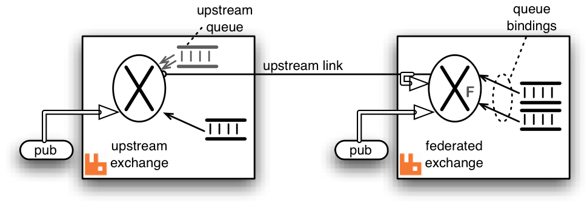
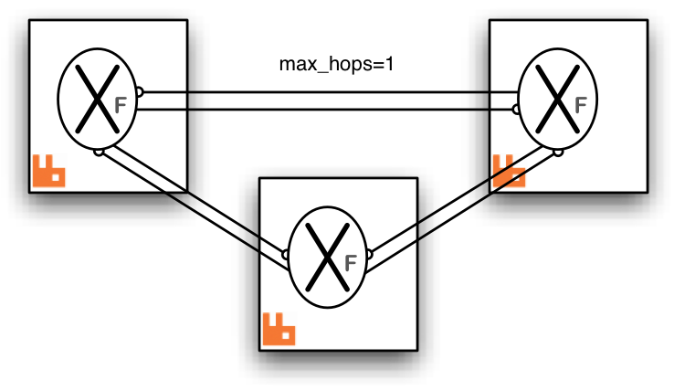
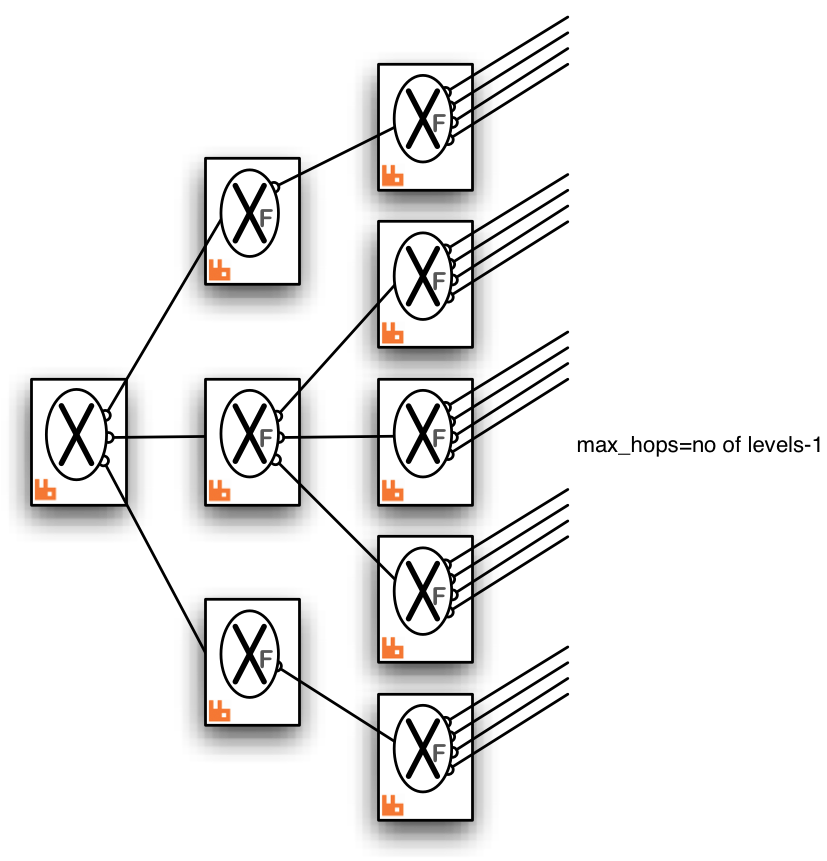

<!--
Copyright (c) 2005-2025 Broadcom. All Rights Reserved. The term "Broadcom" refers to Broadcom Inc. and/or its subsidiaries.

All rights reserved. This program and the accompanying materials
are made available under the terms of the under the Apache License,
Version 2.0 (the "License”); you may not use this file except in compliance
with the License. You may obtain a copy of the License at

https://www.apache.org/licenses/LICENSE-2.0

Unless required by applicable law or agreed to in writing, software
distributed under the License is distributed on an "AS IS" BASIS,
WITHOUT WARRANTIES OR CONDITIONS OF ANY KIND, either express or implied.
See the License for the specific language governing permissions and
limitations under the License.
-->

import Tabs from '@theme/Tabs';
import TabItem from '@theme/TabItem';

# Federated Exchanges

## Overview {#overview}

This guide covers federated exchanges, a subset of functionality offered by the [Federation plugin](./federation).

Some covered topics include:

* An overview of exchange federation
* Common [use cases](#use-cases)
* [Usage and configuration](#usage)
* [Limitations](#limitations) of exchange federation
* [Example topologies](#topology-diagrams)
* [Implementation details](#details)

A separate [Federation plugin reference](./federation-reference) guide is available.

Exchange federation is a mechanism that allows a flow of messages through an exchange
in one location (called the _upstream_ or the source) be replicated to exchanges in other
locations (_downstreams_). The downstreams are independent nodes or clusters that can span
wide area networks (geo regions). The replication process is asynchronous and tolerates
connectivity failures.

A federated exchange links to other exchanges. Conceptually, messages
published to the upstream exchanges are copied to the federated
exchange, as though they were published directly to the federated exchange.
The upstream exchanges do not need to be reconfigured. They are assumed
to be located on a separate node or in a separate cluster.

An upstream definition is a URI with certain recognised query parameters that
control link connection parameters. Upstreams can be managed using [CLI tools](./cli)
or the HTTP API with [an additional plugin](https://github.com/rabbitmq/rabbitmq-federation-management).

Here is a diagram showing a single upstream exchange (the source exchange) in one
node linking to a single downstream exchange (the federated exchange) in another node:

<figure className={"without-borders"}>

</figure>

When exchange federation is used, usually only a subset of exchanges in a cluster is federated.
Some exchanges can be inherently local to the "site" (cluster) and its uses.

Exchange federation will propagate [bindings](/tutorials/amqp-concepts)
from the downstream to the upstreams when possible. It will also apply optimizations and propagate messages selectively if needed.
This is covered in [future sections](#details).


## Use Cases {#use-cases}

Federated exchanges can be used to replicate a flow of certain message types to remote locations.
Combined with continuous [schema synchronisation](./backup#definitions-backup) and
[queue and message TTL](./ttl), this can be used to maintain a warm standby
with reasonably up-to-date data within a controlled time window.

Another use would be to implement massive fanout with a single "source"
exchange in one cluster (which acts as the source and need not be federated) can be declared
as upstream by many other federated exchanges in other brokers. In
turn, each of these can be upstream for many more exchanges, and so
on.

See the [example diagrams below](#topology-diagrams) for some possible arrangements.


## Limitations {#limitations}

Exchange federation supports all built-in exchange types.
3rd party exchange types might work depending on their semantics.

The default exchange (with the blank name) cannot be federated as it is not a typical
exchange and relies on node-local optimizations other exchange types do not use.

Exchanges with the internal property set to `true` are declared and internally used
by RabbitMQ and cannot be federated.


## Usage and Configuration {#usage}

Federation configuration uses [runtime parameters and policies](./parameters), which means it can be configured
and reconfigured on the fly as system topology changes. There are two key pieces of configuration involved:

* Upstreams: these are remote endpoints in a federated system
* Federation policies: these control what exchanges are federated and what upstreams (sources) they will connect to

Both of those are configured on the downstream nodes or clusters.

To add an upstream, use the `rabbitmqctl set_parameter` command. It accepts three parameters:

* Parameter type, `federation-upstream`
* An upstream name that federation policies will refer to
* An upstream definition JSON document with at least one mandatory key, `uri`

The following example configures an upstream named "origin" which can be contacted at <code>remote-host.local:5672</code>:

<Tabs groupId="shell-specific">
<TabItem value="bash" label="bash" default>
```bash
# Adds a federation upstream named "origin"
rabbitmqctl set_parameter federation-upstream origin '{"uri":"amqp://remote-host.local:5672"}'
```
</TabItem>
<TabItem value="PowerShell" label="PowerShell">
```PowerShell
# Adds a federation upstream named "origin"
rabbitmqctl.bat set_parameter federation-upstream origin '"{""uri"":""amqp://remote-host.local:5672""}"'
```
</TabItem>
</Tabs>

More upstream definition parameters are covered in the [Federation Reference guide](./federation-reference).

Once an upstream has been specified, a policy that controls federation can be added. It is added just like
any other [policy](./parameters#policies), using:

<Tabs groupId="shell-specific">
<TabItem value="bash" label="bash" default>
```bash
# Adds a policy named "exchange-federation"
rabbitmqctl set_policy exchange-federation \
    "^federated\." \
    '{"federation-upstream-set":"all"}' \
    --priority 10 \
    --apply-to exchanges
```
</TabItem>
<TabItem value="PowerShell" label="PowerShell">
```PowerShell
# Adds a policy named "exchange-federation"
rabbitmqctl.bat set_policy exchange-federation `
    "^federated\." `
    '"{""federation-upstream-set"":""all""}"' `
    --priority 10 `
    --apply-to exchanges
```
</TabItem>
</Tabs>

In the example above, the policy will match exchanges whose name begins with a `federated.` prefix
in the default virtual host. Those exchanges will set up federation links for all declared upstreams.
The name of the policy is `exchange-federation`. As with any policy, if multiple policies match an exchange,
the one with the highest priority will be used. Multiple policy definitions will not be combined, even if their
priorities are equal.

Once configured, a federation link (connection) will be opened for every matching exchange and upstream pair.
By "matching exchange" here we mean an exchange that is matched by the [federation policy pattern](./parameters#policies).
If no exchanges matched, no links will be started.

To deactivate federation for the matching exchanges, delete the policy using its name:

```bash
rabbitmqctl clear_policy exchange-federation
```


## Complex Topologies and Loop Handling {#loops}

A federated exchange can be "upstream" from another federated exchange. One can even form "loops", for
example, exchange A declares exchange B to be upstream from it, and exchange B declares exchange A
to be upstream from it. More complex multiply-connected arrangements are allowed.

Such complex topologies will be increasingly difficult to reason about and troubleshoot, however.

To prevent messages being continually copied and re-routed (in a never-ending cycle) there is a limit placed
on the number of times a message can be copied over a link ([`max-hops`](./federation-reference#upstream-sets) below).

It is recommended that all the exchanges linked by federation are of the
same type. Mixing types can and likely will lead to confusing routing behaviours.


## Implementation {#details}

Inter-broker communication is implemented using AMQP 0-9-1 (optionally
[secured with TLS](./ssl)). Bindings are grouped together and binding operations such as
`queue.bind` and `queue.unbind` commands are sent to the upstream side of
the link when bindings change in the downstream.

Therefore the  exchange only receives messages for which it has bindings. The
bindings are replicated with the upstream asynchronously so the effect of adding
or removing a binding is only guaranteed to be seen eventually.

The messages are buffered in an internally declared queue created in the upstream
exchange's cluster. This is called the _upstream queue_.
It is the upstream queue which is bound to the upstream
exchange with the grouped bindings. It is possible to tailor
some of the properties of this queue in the [upstream configuration](./federation-reference#upstreams).


Here is a detailed diagram showing a single federated
exchange linking to a single upstream exchange including the
upstream queue and bindings created by the federation plugin
shown in grey. The fat arrow on the upstream link indicates
messages republished by the federated exchange. Some
potential publisher clients are shown publishing to both
exchanges.

<figure className={"without-borders"}>

</figure>

Publications to either exchange may be received by queues bound to
the federated exchange, but publications directly to the federated
exchange cannot be received by queues bound to the upstream
exchange.


## Example Topologies {#topology-diagrams}

We illustrate some example federation topologies. Where RabbitMQ brokers are
shown in these diagrams indicated by a  it can be a cluster of nodes or a standalone node.

<table>
  <thead>
    <tr>
      <td><strong>Topology</strong></td>
      <td><strong>Description</strong></td>
    </tr>
  </thead>

  <tbody>
    <tr>
      <td>Pair of federated exchanges</td>
      <td>
        <p>
          Each exchange links to the other in this symmetric arrangement. A
          publisher and consumer connected to each broker are illustrated.
          Both consumers can receive messages published by either publisher.
        </p>

        <figure className={"without-borders"}>
        
        </figure>

        <p>
          Both links are declared with `max-hops=1` so that
          messages are copied only once, otherwise the consumers will see
          multiple copies of the same message (up to the `max-hops` limit).
        </p>
      </td>
    </tr>

    <tr>
      <td>Complete Graph</td>
      <td>
        <p>
          This arrangement is the analogue of the pair of federated exchanges
          but for three exchanges. Each exchange links to both the others.
        </p>

        <figure className={"without-borders"}>
        
        </figure>

        <p>
          Again `max-hops=1` because the "hop distance" to any
          other exchange is exactly one. This will be the case in any complete
          graph of federated exchanges.
        </p>
      </td>
    </tr>

    <tr>
      <td>Fan-out</td>
      <td>
        <p>
          One source exchange (which it is not necessary to federate)
          is linked to by a tree of exchanges, which can extend to any depth.
          In this case messages published to the source exchange can be
          received by any consumer connected to any broker in the tree.
        </p>

        <figure className={"without-borders"}>
        
        </figure>

        <p>
          Because there are no loops it is not as crucial to get the
          `max-hops` value right, but it must be at least
          as large as the longest connecting path. For a tree this is
          the number of levels minus one.
        </p>
      </td>
    </tr>

    <tr>
      <td>Ring</td>
      <td>
        <p>
          In this ring of six brokers each federated exchange links to just
          one other in the ring. The `"max-hops"` property is set
          to 5 so that every exchange in the ring sees the message exactly
          once.
        </p>

        <figure className={"without-borders"}>
        
        </figure>

        <p>
          This topology, though relatively cheap in queues and connections, is
          rather fragile compared to a completely connected graph. One broker
          (or connection) failure breaks the ring.
        </p>
      </td>
    </tr>
  </tbody>
</table>
